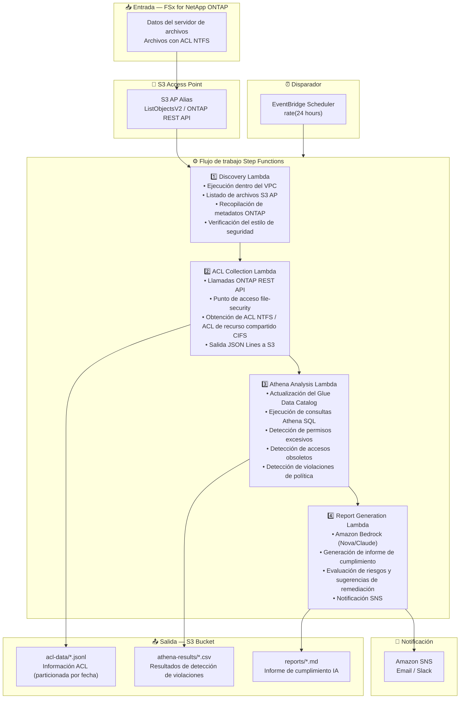

# UC1: Legal / Cumplimiento — Auditoría de servidor de archivos y gobernanza de datos

🌐 **Language / 言語**: [日本語](architecture.md) | [English](architecture.en.md) | [한국어](architecture.ko.md) | [简体中文](architecture.zh-CN.md) | [繁體中文](architecture.zh-TW.md) | [Français](architecture.fr.md) | [Deutsch](architecture.de.md) | Español

## Arquitectura de extremo a extremo (Entrada → Salida)

---

## Flujo de alto nivel

```
┌─────────────────────────────────────────────────────────────────────────────┐
│                         FSx for NetApp ONTAP                                 │
│                                                                              │
│  /vol/shared_data/                                                           │
│  ├── 経理部/決算資料/2024Q4.xlsx     (NTFS ACL: 経理部のみ)                  │
│  ├── 人事部/給与/salary_2024.csv     (NTFS ACL: 人事部のみ)                  │
│  ├── 全社共有/規程/就業規則.pdf      (NTFS ACL: Everyone Read)               │
│  └── プロジェクト/機密/design.dwg    (NTFS ACL: 設計チーム)                  │
│                                                                              │
└──────────────────────────────────┬───────────────────────────────────────────┘
                                   │
                                   ▼
┌──────────────────────────────────────────────────────────────────────────────┐
│                      S3 Access Point (Data Path)                              │
│                                                                              │
│  Alias: fsxn-compliance-vol-ext-s3alias                                      │
│  • ListObjectsV2 (file listing)                                              │
│  • ONTAP REST API (ACL / security info retrieval)                            │
│  • No NFS/SMB mount required from Lambda                                     │
│                                                                              │
└──────────────────────────────────┬───────────────────────────────────────────┘
                                   │
                                   ▼
┌──────────────────────────────────────────────────────────────────────────────┐
│                    EventBridge Scheduler (Trigger)                            │
│                                                                              │
│  Schedule: rate(24 hours) — configurable                                     │
│  Target: Step Functions State Machine                                        │
│                                                                              │
└──────────────────────────────────┬───────────────────────────────────────────┘
                                   │
                                   ▼
┌──────────────────────────────────────────────────────────────────────────────┐
│                    AWS Step Functions (Orchestration)                         │
│                                                                              │
│  ┌─────────────┐    ┌──────────────────────┐    ┌────────────────┐          │
│  │  Discovery   │───▶│  ACL Collection      │───▶│Athena Analysis │          │
│  │  Lambda      │    │  Lambda              │    │ Lambda         │          │
│  │             │    │                      │    │               │          │
│  │  • VPC内     │    │  • ONTAP REST API    │    │  • Athena SQL  │          │
│  │  • S3 AP List│    │  • file-security GET │    │  • Glue Catalog│          │
│  │  • ONTAP API │    │  • JSON Lines output │    │  • Excessive   │          │
│  └─────────────┘    └──────────────────────┘    │    permission  │          │
│                                                  │    detection   │          │
│                                                  └───────┬────────┘          │
│                                                          │                   │
│                                                          ▼                   │
│                                                 ┌────────────────┐          │
│                                                 │Report Generation│          │
│                                                 │ Lambda         │          │
│                                                 │               │          │
│                                                 │ • Bedrock      │          │
│                                                 │ • SNS notify   │          │
│                                                 └────────────────┘          │
│                                                                              │
└──────────────────────────────────────────────────────────────────────────────┘
                                   │
                                   ▼
┌──────────────────────────────────────────────────────────────────────────────┐
│                         Output (S3 Bucket)                                    │
│                                                                              │
│  s3://{stack}-output-{account}/                                              │
│  ├── acl-data/YYYY/MM/DD/                                                    │
│  │   ├── shared_data_acl.jsonl      ← ACL information (JSON Lines)           │
│  │   └── metadata.json              ← Volume/share metadata                  │
│  ├── athena-results/                                                         │
│  │   └── {query-execution-id}.csv   ← Violation detection results            │
│  └── reports/YYYY/MM/DD/                                                     │
│      └── compliance-report-{id}.md  ← Bedrock compliance report              │
│                                                                              │
└──────────────────────────────────────────────────────────────────────────────┘
```

---

## Diagrama Mermaid



---

## Detalle del flujo de datos

### Entrada
| Elemento | Descripción |
|----------|-------------|
| **Origen** | Volumen FSx for NetApp ONTAP |
| **Tipos de archivo** | Todos los archivos (con ACL NTFS) |
| **Método de acceso** | S3 Access Point (listado de archivos) + ONTAP REST API (información ACL) |
| **Estrategia de lectura** | Solo metadatos (no se lee el contenido de los archivos) |

### Procesamiento
| Paso | Servicio | Función |
|------|----------|---------|
| Discovery | Lambda (VPC) | Listar archivos vía S3 AP, recopilar metadatos ONTAP |
| ACL Collection | Lambda (VPC) | Obtener ACL NTFS / ACL de recurso compartido CIFS vía ONTAP REST API |
| Athena Analysis | Lambda + Glue + Athena | Detección basada en SQL de permisos excesivos, accesos obsoletos, violaciones de política |
| Report Generation | Lambda + Bedrock | Generación de informe de cumplimiento en lenguaje natural |

### Salida
| Artefacto | Formato | Descripción |
|-----------|---------|-------------|
| Datos ACL | `acl-data/YYYY/MM/DD/*.jsonl` | Información ACL por archivo (JSON Lines) |
| Resultados Athena | `athena-results/{id}.csv` | Resultados de detección de violaciones (permisos excesivos, archivos huérfanos, etc.) |
| Informe de cumplimiento | `reports/YYYY/MM/DD/compliance-report-{id}.md` | Informe generado por Bedrock |
| Notificación SNS | Email | Resumen de resultados de auditoría y ubicación del informe |

---

## Decisiones de diseño clave

1. **Combinación S3 AP + ONTAP REST API** — S3 AP para listado de archivos, ONTAP REST API para obtención detallada de ACL (enfoque de dos etapas)
2. **Sin lectura de contenido de archivos** — Para fines de auditoría, solo se recopilan metadatos/información de permisos, minimizando costos de transferencia de datos
3. **JSON Lines + particionamiento por fecha** — Equilibrio entre eficiencia de consultas Athena y seguimiento histórico
4. **Athena SQL para detección de violaciones** — Análisis flexible basado en reglas (permisos Everyone, 90 días sin acceso, etc.)
5. **Bedrock para informes en lenguaje natural** — Garantiza la legibilidad para personal no técnico (equipos legales/de cumplimiento)
6. **Sondeo periódico (no basado en eventos)** — S3 AP no admite notificaciones de eventos, por lo que se utiliza ejecución programada periódica

---

## Servicios AWS utilizados

| Servicio | Rol |
|----------|-----|
| FSx for NetApp ONTAP | Almacenamiento de archivos empresarial (con ACL NTFS) |
| S3 Access Points | Acceso serverless a volúmenes ONTAP |
| EventBridge Scheduler | Disparador periódico (auditoría diaria) |
| Step Functions | Orquestación de flujo de trabajo |
| Lambda | Cómputo (Discovery, ACL Collection, Analysis, Report) |
| Glue Data Catalog | Gestión de esquemas para Athena |
| Amazon Athena | Análisis de permisos y detección de violaciones basados en SQL |
| Amazon Bedrock | Generación de informe de cumplimiento IA (Nova / Claude) |
| SNS | Notificación de resultados de auditoría |
| Secrets Manager | Gestión de credenciales ONTAP REST API |
| CloudWatch + X-Ray | Observabilidad |
