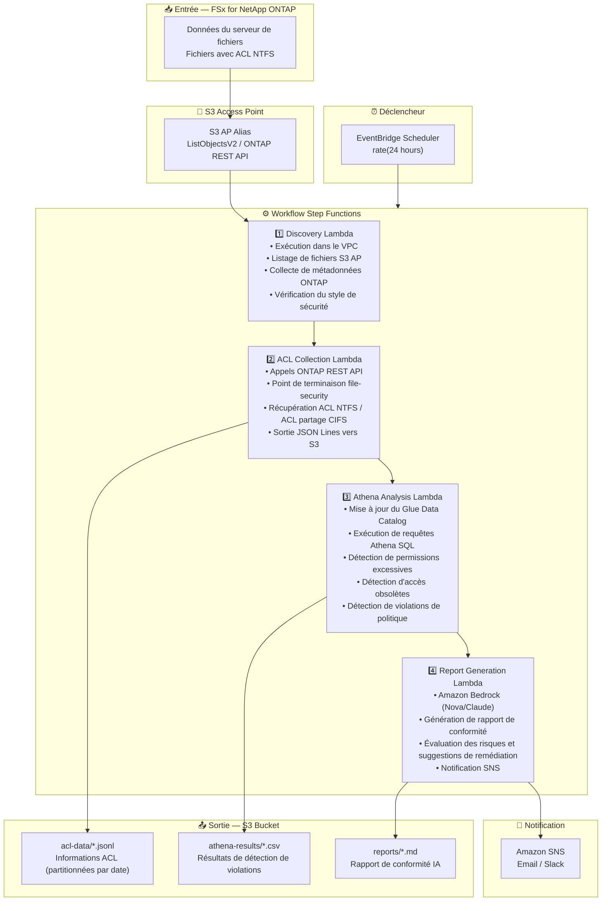

# UC1: Juridique / Conformité — Audit de serveur de fichiers et gouvernance des données

🌐 **Language / 言語**: [日本語](architecture.md) | [English](architecture.en.md) | [한국어](architecture.ko.md) | [简体中文](architecture.zh-CN.md) | [繁體中文](architecture.zh-TW.md) | Français | [Deutsch](architecture.de.md) | [Español](architecture.es.md)

## Architecture de bout en bout (Entrée → Sortie)

---

## Diagramme d'architecture

---

## Détail du flux de données

### Entrée
| Élément | Description |
|---------|-------------|
| **Source** | Volume FSx for NetApp ONTAP |
| **Types de fichiers** | Tous les fichiers (avec ACL NTFS) |
| **Méthode d'accès** | S3 Access Point (listage de fichiers) + ONTAP REST API (informations ACL) |
| **Stratégie de lecture** | Métadonnées uniquement (le contenu des fichiers n'est pas lu) |

### Traitement
| Étape | Service | Fonction |
|-------|---------|----------|
| Discovery | Lambda (VPC) | Lister les fichiers via S3 AP, collecter les métadonnées ONTAP |
| ACL Collection | Lambda (VPC) | Récupérer les ACL NTFS / ACL partage CIFS via ONTAP REST API |
| Athena Analysis | Lambda + Glue + Athena | Détection basée sur SQL des permissions excessives, accès obsolètes, violations de politique |
| Report Generation | Lambda + Bedrock | Génération de rapport de conformité en langage naturel |

### Sortie
| Artefact | Format | Description |
|----------|--------|-------------|
| Données ACL | `acl-data/YYYY/MM/DD/*.jsonl` | Informations ACL par fichier (JSON Lines) |
| Résultats Athena | `athena-results/{id}.csv` | Résultats de détection de violations (permissions excessives, fichiers orphelins, etc.) |
| Rapport de conformité | `reports/YYYY/MM/DD/compliance-report-{id}.md` | Rapport généré par Bedrock |
| Notification SNS | Email | Résumé des résultats d'audit et emplacement du rapport |

---

## Décisions de conception clés

1. **Combinaison S3 AP + ONTAP REST API** — S3 AP pour le listage de fichiers, ONTAP REST API pour la récupération détaillée des ACL (approche en deux étapes)
2. **Pas de lecture du contenu des fichiers** — À des fins d'audit, seules les métadonnées/informations de permissions sont collectées, minimisant les coûts de transfert de données
3. **JSON Lines + partitionnement par date** — Équilibre entre l'efficacité des requêtes Athena et le suivi historique
4. **Athena SQL pour la détection de violations** — Analyse flexible basée sur des règles (permissions Everyone, 90 jours sans accès, etc.)
5. **Bedrock pour les rapports en langage naturel** — Assure la lisibilité pour le personnel non technique (équipes juridiques/conformité)
6. **Interrogation périodique (non événementielle)** — S3 AP ne prend pas en charge les notifications d'événements, donc une exécution planifiée périodique est utilisée

---

## Services AWS utilisés

| Service | Rôle |
|---------|------|
| FSx for NetApp ONTAP | Stockage de fichiers d'entreprise (avec ACL NTFS) |
| S3 Access Points | Accès serverless aux volumes ONTAP |
| EventBridge Scheduler | Déclencheur périodique (audit quotidien) |
| Step Functions | Orchestration de workflow |
| Lambda | Calcul (Discovery, ACL Collection, Analysis, Report) |
| Glue Data Catalog | Gestion de schéma pour Athena |
| Amazon Athena | Analyse de permissions et détection de violations basées sur SQL |
| Amazon Bedrock | Génération de rapport de conformité IA (Nova / Claude) |
| SNS | Notification des résultats d'audit |
| Secrets Manager | Gestion des identifiants ONTAP REST API |
| CloudWatch + X-Ray | Observabilité |
