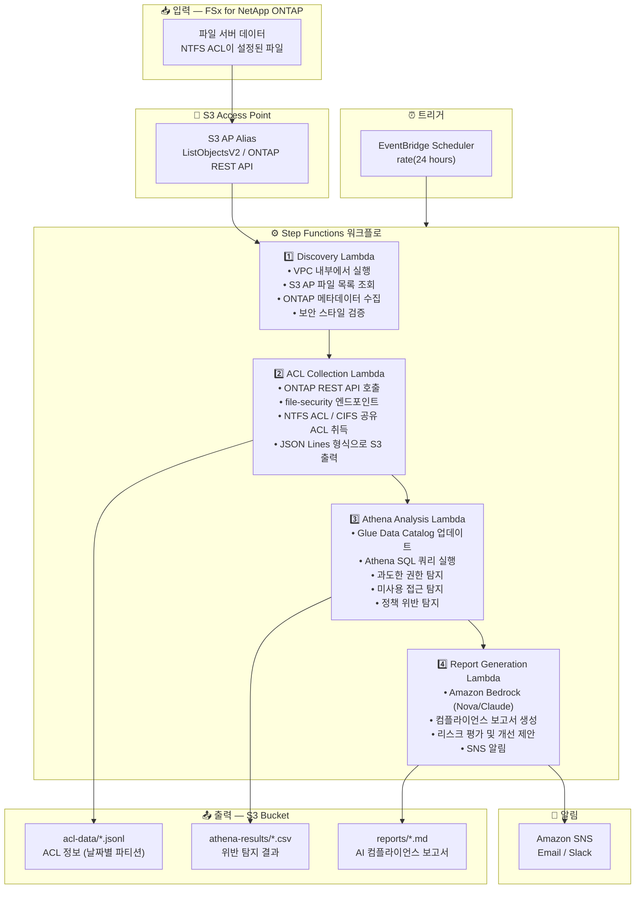

# UC1: 법무 / 컴플라이언스 — 파일 서버 감사 및 데이터 거버넌스

🌐 **Language / 言語**: [日本語](architecture.md) | [English](architecture.en.md) | 한국어 | [简体中文](architecture.zh-CN.md) | [繁體中文](architecture.zh-TW.md) | [Français](architecture.fr.md) | [Deutsch](architecture.de.md) | [Español](architecture.es.md)

## 엔드투엔드 아키텍처 (입력 → 출력)

---

## 상위 레벨 흐름

```
┌─────────────────────────────────────────────────────────────────────────────┐
│                         FSx for NetApp ONTAP                                 │
│                                                                              │
│  /vol/shared_data/                                                           │
│  ├── 経理部/決算資料/2024Q4.xlsx     (NTFS ACL: 経理部のみ)                  │
│  ├── 人事部/給与/salary_2024.csv     (NTFS ACL: 人事部のみ)                  │
│  ├── 全社共有/規程/就業規則.pdf      (NTFS ACL: Everyone Read)               │
│  └── プロジェクト/機密/design.dwg    (NTFS ACL: 設計チーム)                  │
│                                                                              │
└──────────────────────────────────┬───────────────────────────────────────────┘
                                   │
                                   ▼
┌──────────────────────────────────────────────────────────────────────────────┐
│                      S3 Access Point (Data Path)                              │
│                                                                              │
│  Alias: fsxn-compliance-vol-ext-s3alias                                      │
│  • ListObjectsV2 (file listing)                                              │
│  • ONTAP REST API (ACL / security info retrieval)                            │
│  • No NFS/SMB mount required from Lambda                                     │
│                                                                              │
└──────────────────────────────────┬───────────────────────────────────────────┘
                                   │
                                   ▼
┌──────────────────────────────────────────────────────────────────────────────┐
│                    EventBridge Scheduler (Trigger)                            │
│                                                                              │
│  Schedule: rate(24 hours) — configurable                                     │
│  Target: Step Functions State Machine                                        │
│                                                                              │
└──────────────────────────────────┬───────────────────────────────────────────┘
                                   │
                                   ▼
┌──────────────────────────────────────────────────────────────────────────────┐
│                    AWS Step Functions (Orchestration)                         │
│                                                                              │
│  ┌─────────────┐    ┌──────────────────────┐    ┌────────────────┐          │
│  │  Discovery   │───▶│  ACL Collection      │───▶│Athena Analysis │          │
│  │  Lambda      │    │  Lambda              │    │ Lambda         │          │
│  │             │    │                      │    │               │          │
│  │  • VPC内     │    │  • ONTAP REST API    │    │  • Athena SQL  │          │
│  │  • S3 AP List│    │  • file-security GET │    │  • Glue Catalog│          │
│  │  • ONTAP API │    │  • JSON Lines output │    │  • Excessive   │          │
│  └─────────────┘    └──────────────────────┘    │    permission  │          │
│                                                  │    detection   │          │
│                                                  └───────┬────────┘          │
│                                                          │                   │
│                                                          ▼                   │
│                                                 ┌────────────────┐          │
│                                                 │Report Generation│          │
│                                                 │ Lambda         │          │
│                                                 │               │          │
│                                                 │ • Bedrock      │          │
│                                                 │ • SNS notify   │          │
│                                                 └────────────────┘          │
│                                                                              │
└──────────────────────────────────────────────────────────────────────────────┘
                                   │
                                   ▼
┌──────────────────────────────────────────────────────────────────────────────┐
│                         Output (S3 Bucket)                                    │
│                                                                              │
│  s3://{stack}-output-{account}/                                              │
│  ├── acl-data/YYYY/MM/DD/                                                    │
│  │   ├── shared_data_acl.jsonl      ← ACL information (JSON Lines)           │
│  │   └── metadata.json              ← Volume/share metadata                  │
│  ├── athena-results/                                                         │
│  │   └── {query-execution-id}.csv   ← Violation detection results            │
│  └── reports/YYYY/MM/DD/                                                     │
│      └── compliance-report-{id}.md  ← Bedrock compliance report              │
│                                                                              │
└──────────────────────────────────────────────────────────────────────────────┘
```

---

## Mermaid 다이어그램



---

## 데이터 흐름 상세

### 입력
| 항목 | 설명 |
|------|------|
| **소스** | FSx for NetApp ONTAP 볼륨 |
| **파일 유형** | 모든 파일 (NTFS ACL 포함) |
| **접근 방식** | S3 Access Point (파일 목록) + ONTAP REST API (ACL 정보) |
| **읽기 전략** | 메타데이터만 (파일 내용은 읽지 않음) |

### 처리
| 단계 | 서비스 | 기능 |
|------|--------|------|
| Discovery | Lambda (VPC) | S3 AP를 통한 파일 목록 조회, ONTAP 메타데이터 수집 |
| ACL Collection | Lambda (VPC) | ONTAP REST API를 통한 NTFS ACL / CIFS 공유 ACL 취득 |
| Athena Analysis | Lambda + Glue + Athena | SQL 기반 과도한 권한, 미사용 접근, 정책 위반 탐지 |
| Report Generation | Lambda + Bedrock | 자연어 컴플라이언스 보고서 생성 |

### 출력
| 산출물 | 형식 | 설명 |
|--------|------|------|
| ACL 데이터 | `acl-data/YYYY/MM/DD/*.jsonl` | 파일별 ACL 정보 (JSON Lines) |
| Athena 결과 | `athena-results/{id}.csv` | 위반 탐지 결과 (과도한 권한, 고아 파일 등) |
| 컴플라이언스 보고서 | `reports/YYYY/MM/DD/compliance-report-{id}.md` | Bedrock 생성 보고서 |
| SNS 알림 | Email | 감사 결과 요약 및 보고서 위치 |

---

## 주요 설계 결정

1. **S3 AP + ONTAP REST API 조합** — S3 AP로 파일 목록 조회, ONTAP REST API로 상세 ACL 취득 (2단계 접근)
2. **파일 내용 미읽기** — 감사 목적으로 메타데이터/권한 정보만 수집하여 데이터 전송 비용 최소화
3. **JSON Lines + 날짜 파티셔닝** — Athena 쿼리 효율성과 이력 추적의 균형
4. **Athena SQL 위반 탐지** — 유연한 규칙 기반 분석 (Everyone 권한, 90일 미접근 등)
5. **Bedrock 자연어 보고서** — 비기술 인력 (법무/컴플라이언스 팀)의 가독성 확보
6. **폴링 (이벤트 드리븐 아님)** — S3 AP는 이벤트 알림을 지원하지 않으므로 정기 스케줄 실행 사용

---

## 사용 AWS 서비스

| 서비스 | 역할 |
|--------|------|
| FSx for NetApp ONTAP | 엔터프라이즈 파일 스토리지 (NTFS ACL 포함) |
| S3 Access Points | ONTAP 볼륨에 대한 서버리스 접근 |
| EventBridge Scheduler | 정기 트리거 (일일 감사) |
| Step Functions | 워크플로 오케스트레이션 |
| Lambda | 컴퓨팅 (Discovery, ACL Collection, Analysis, Report) |
| Glue Data Catalog | Athena용 스키마 관리 |
| Amazon Athena | SQL 기반 권한 분석 및 위반 탐지 |
| Amazon Bedrock | AI 컴플라이언스 보고서 생성 (Nova / Claude) |
| SNS | 감사 결과 알림 |
| Secrets Manager | ONTAP REST API 자격 증명 관리 |
| CloudWatch + X-Ray | 관측성 |
