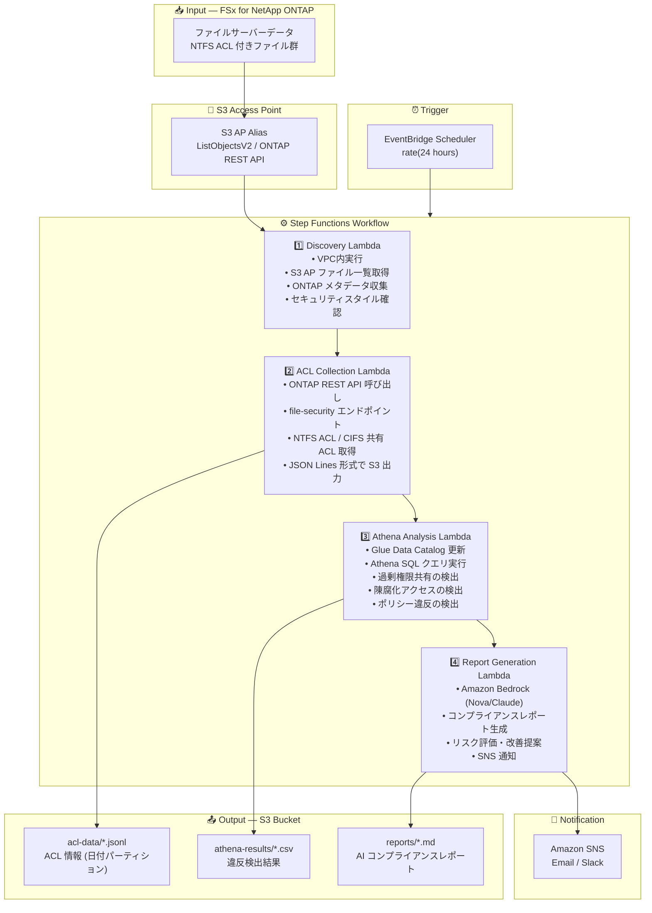

# UC1: 法務・コンプライアンス — ファイルサーバー監査・データガバナンス

🌐 **Language / 言語**: 日本語 | [English](architecture.en.md) | [한국어](architecture.ko.md) | [简体中文](architecture.zh-CN.md) | [繁體中文](architecture.zh-TW.md) | [Français](architecture.fr.md) | [Deutsch](architecture.de.md) | [Español](architecture.es.md)

## End-to-End Architecture (Input → Output)

---

## Architecture Diagram

---

## Data Flow Detail

### Input
| Item | Description |
|------|-------------|
| **Source** | FSx for NetApp ONTAP volume |
| **File Types** | 全ファイル（NTFS ACL 付き） |
| **Access Method** | S3 Access Point (ファイル一覧) + ONTAP REST API (ACL 情報) |
| **Read Strategy** | メタデータのみ取得（ファイル本体は読まない） |

### Processing
| Step | Service | Function |
|------|---------|----------|
| Discovery | Lambda (VPC) | S3 AP でファイル一覧取得、ONTAP メタデータ収集 |
| ACL Collection | Lambda (VPC) | ONTAP REST API で NTFS ACL / CIFS 共有 ACL 取得 |
| Athena Analysis | Lambda + Glue + Athena | SQL で過剰権限・陳腐化アクセス・ポリシー違反検出 |
| Report Generation | Lambda + Bedrock | 自然言語コンプライアンスレポート生成 |

### Output
| Artifact | Format | Description |
|----------|--------|-------------|
| ACL Data | `acl-data/YYYY/MM/DD/*.jsonl` | ファイル別 ACL 情報 (JSON Lines) |
| Athena Results | `athena-results/{id}.csv` | 違反検出結果（過剰権限、孤立ファイル等） |
| Compliance Report | `reports/YYYY/MM/DD/compliance-report-{id}.md` | Bedrock 生成レポート |
| SNS Notification | Email | 監査結果サマリーとレポート格納先 |

---

## Key Design Decisions

1. **S3 AP + ONTAP REST API の併用** — S3 AP でファイル一覧を取得し、ONTAP REST API で ACL 詳細を取得する二段構成
2. **ファイル本体を読まない** — 監査目的のためメタデータ・権限情報のみ収集し、データ転送コストを最小化
3. **JSON Lines + 日付パーティション** — Athena でのクエリ効率化と履歴追跡を両立
4. **Athena SQL による違反検出** — 柔軟なルールベース分析（Everyone 権限、90日未アクセス等）
5. **Bedrock による自然言語レポート** — 非技術者（法務・コンプライアンス担当）向けの可読性確保
6. **ポーリングベース** — S3 AP はイベント通知非対応のため、定期スケジュール実行

---

## AWS Services Used

| Service | Role |
|---------|------|
| FSx for NetApp ONTAP | エンタープライズファイルストレージ（NTFS ACL 付き） |
| S3 Access Points | ONTAP ボリュームへのサーバーレスアクセス |
| EventBridge Scheduler | 定期トリガー（日次監査） |
| Step Functions | ワークフローオーケストレーション |
| Lambda | コンピュート（Discovery, ACL Collection, Analysis, Report） |
| Glue Data Catalog | Athena 用スキーマ管理 |
| Amazon Athena | SQL ベースの権限分析・違反検出 |
| Amazon Bedrock | AI コンプライアンスレポート生成 (Nova / Claude) |
| SNS | 監査結果通知 |
| Secrets Manager | ONTAP REST API 認証情報管理 |
| CloudWatch + X-Ray | オブザーバビリティ |
