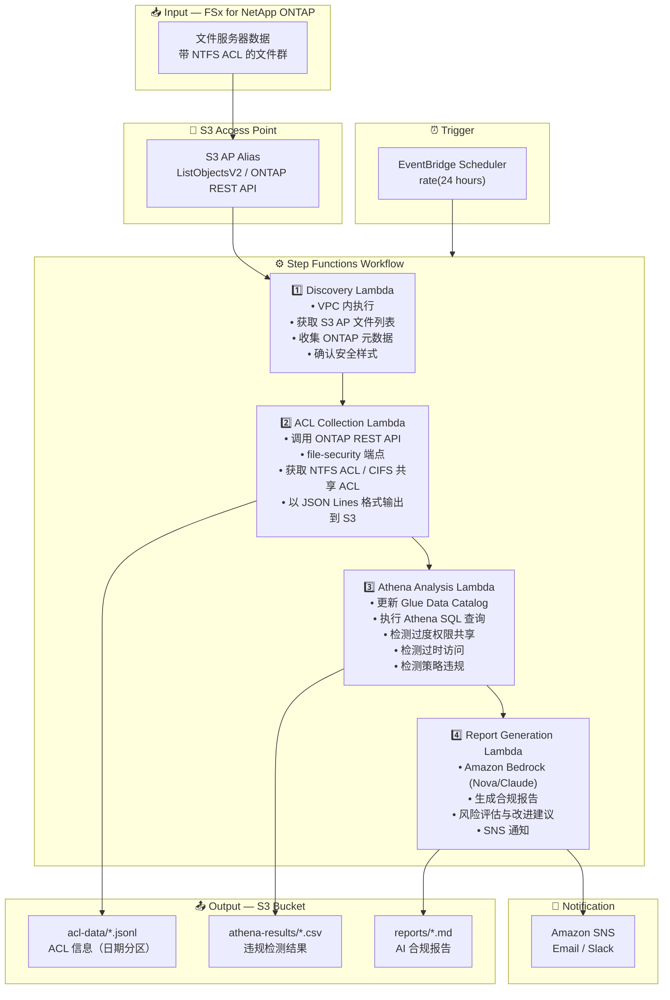

# UC1: 法务与合规 — 文件服务器审计与数据治理

🌐 **Language / 언어 / 语言 / 語言 / Langue / Sprache / Idioma**: [日本語](architecture.md) | [English](architecture.en.md) | [한국어](architecture.ko.md) | 简体中文 | [繁體中文](architecture.zh-TW.md) | [Français](architecture.fr.md) | [Deutsch](architecture.de.md) | [Español](architecture.es.md)

> 注意：此翻译由 Amazon Bedrock Claude 生成。欢迎对翻译质量提出改进建议。

## End-to-End Architecture (Input → Output)

---

## 架构图

---

## 数据流详情

### Input
| 项目 | 说明 |
|------|-------------|
| **Source** | FSx for NetApp ONTAP volume |
| **File Types** | 所有文件（带 NTFS ACL） |
| **Access Method** | S3 Access Point（文件列表）+ ONTAP REST API（ACL 信息） |
| **Read Strategy** | 仅获取元数据（不读取文件本体） |

### Processing
| 步骤 | 服务 | 功能 |
|------|---------|----------|
| Discovery | Lambda (VPC) | 通过 S3 AP 获取文件列表，收集 ONTAP 元数据 |
| ACL Collection | Lambda (VPC) | 通过 ONTAP REST API 获取 NTFS ACL / CIFS 共享 ACL |
| Athena Analysis | Lambda + Glue + Athena | 使用 SQL 检测过度权限、过时访问、策略违规 |
| Report Generation | Lambda + Bedrock | 生成自然语言合规报告 |

### Output
| 产出物 | 格式 | 说明 |
|----------|--------|-------------|
| ACL Data | `acl-data/YYYY/MM/DD/*.jsonl` | 按文件的 ACL 信息（JSON Lines） |
| Athena Results | `athena-results/{id}.csv` | 违规检测结果（过度权限、孤立文件等） |
| Compliance Report | `reports/YYYY/MM/DD/compliance-report-{id}.md` | Bedrock 生成的报告 |
| SNS Notification | Email | 审计结果摘要和报告存储位置 |

---

## 关键设计决策

1. **S3 AP + ONTAP REST API 的组合使用** — 通过 S3 AP 获取文件列表，通过 ONTAP REST API 获取 ACL 详细信息的两阶段架构
2. **不读取文件本体** — 为了审计目的仅收集元数据和权限信息，最小化数据传输成本
3. **JSON Lines + 日期分区** — 兼顾 Athena 查询效率和历史追踪
4. **通过 Athena SQL 进行违规检测** — 灵活的基于规则的分析（Everyone 权限、90天未访问等）
5. **通过 Bedrock 生成自然语言报告** — 确保非技术人员（法务合规负责人）的可读性
6. **基于轮询** — 由于 S3 AP 不支持事件通知，采用定期计划执行

---

## 使用的 AWS 服务

| 服务 | 角色 |
|---------|------|
| FSx for NetApp ONTAP | 企业文件存储（带 NTFS ACL） |
| S3 Access Points | 对 ONTAP 卷的无服务器访问 |
| EventBridge Scheduler | 定期触发器（每日审计） |
| Step Functions | 工作流编排 |
| Lambda | 计算（Discovery、ACL Collection、Analysis、Report） |
| Glue Data Catalog | Athena 用架构管理 |
| Amazon Athena | 基于 SQL 的权限分析与违规检测 |
| Amazon Bedrock | AI 合规报告生成（Nova / Claude） |
| SNS | 审计结果通知 |
| Secrets Manager | ONTAP REST API 认证信息管理 |
| CloudWatch + X-Ray | 可观测性 |
