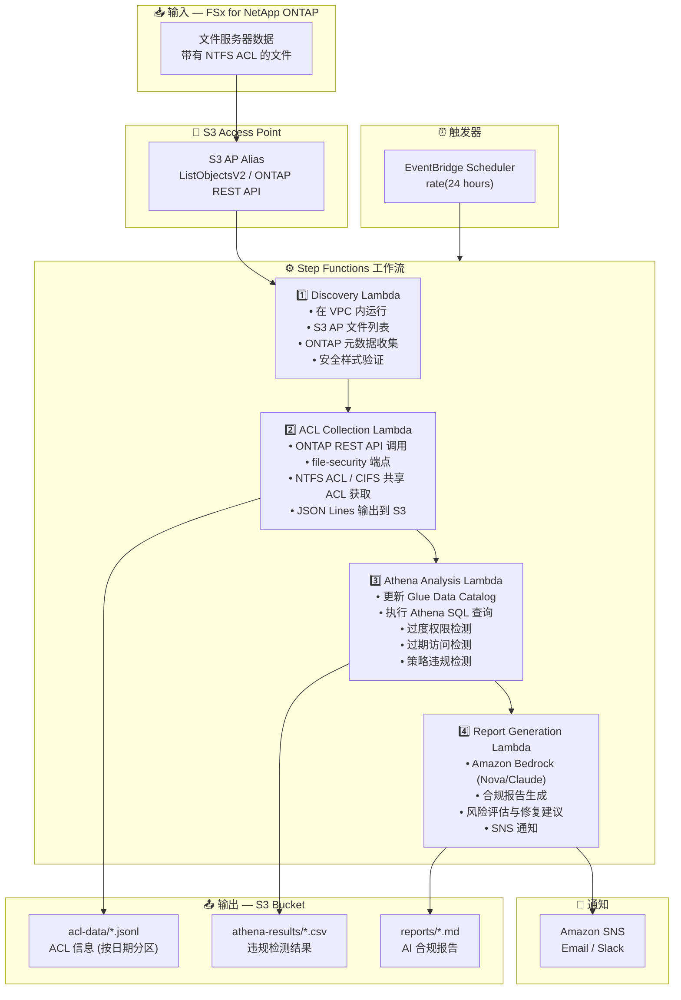

# UC1: 法务 / 合规 — 文件服务器审计与数据治理

🌐 **Language / 言語**: [日本語](architecture.md) | [English](architecture.en.md) | [한국어](architecture.ko.md) | 简体中文 | [繁體中文](architecture.zh-TW.md) | [Français](architecture.fr.md) | [Deutsch](architecture.de.md) | [Español](architecture.es.md)

## 端到端架构 (输入 → 输出)

---

## 架构图

---

## 数据流详情

### 输入
| 项目 | 说明 |
|------|------|
| **来源** | FSx for NetApp ONTAP 卷 |
| **文件类型** | 所有文件 (带有 NTFS ACL) |
| **访问方式** | S3 Access Point (文件列表) + ONTAP REST API (ACL 信息) |
| **读取策略** | 仅元数据 (不读取文件内容) |

### 处理
| 步骤 | 服务 | 功能 |
|------|------|------|
| Discovery | Lambda (VPC) | 通过 S3 AP 列出文件，收集 ONTAP 元数据 |
| ACL Collection | Lambda (VPC) | 通过 ONTAP REST API 获取 NTFS ACL / CIFS 共享 ACL |
| Athena Analysis | Lambda + Glue + Athena | 基于 SQL 检测过度权限、过期访问、策略违规 |
| Report Generation | Lambda + Bedrock | 自然语言合规报告生成 |

### 输出
| 产出物 | 格式 | 说明 |
|--------|------|------|
| ACL 数据 | `acl-data/YYYY/MM/DD/*.jsonl` | 每文件 ACL 信息 (JSON Lines) |
| Athena 结果 | `athena-results/{id}.csv` | 违规检测结果 (过度权限、孤立文件等) |
| 合规报告 | `reports/YYYY/MM/DD/compliance-report-{id}.md` | Bedrock 生成的报告 |
| SNS 通知 | Email | 审计结果摘要及报告位置 |

---

## 关键设计决策

1. **S3 AP + ONTAP REST API 组合** — S3 AP 用于文件列表，ONTAP REST API 用于详细 ACL 获取 (两阶段方法)
2. **不读取文件内容** — 审计目的仅收集元数据/权限信息，最小化数据传输成本
3. **JSON Lines + 日期分区** — 兼顾 Athena 查询效率与历史追踪
4. **Athena SQL 违规检测** — 灵活的基于规则的分析 (Everyone 权限、90天未访问等)
5. **Bedrock 自然语言报告** — 确保非技术人员 (法务/合规团队) 的可读性
6. **轮询 (非事件驱动)** — S3 AP 不支持事件通知，因此使用定期调度执行

---

## 使用的 AWS 服务

| 服务 | 角色 |
|------|------|
| FSx for NetApp ONTAP | 企业文件存储 (带有 NTFS ACL) |
| S3 Access Points | 对 ONTAP 卷的无服务器访问 |
| EventBridge Scheduler | 定期触发 (每日审计) |
| Step Functions | 工作流编排 |
| Lambda | 计算 (Discovery, ACL Collection, Analysis, Report) |
| Glue Data Catalog | Athena 的 Schema 管理 |
| Amazon Athena | 基于 SQL 的权限分析与违规检测 |
| Amazon Bedrock | AI 合规报告生成 (Nova / Claude) |
| SNS | 审计结果通知 |
| Secrets Manager | ONTAP REST API 凭证管理 |
| CloudWatch + X-Ray | 可观测性 |
