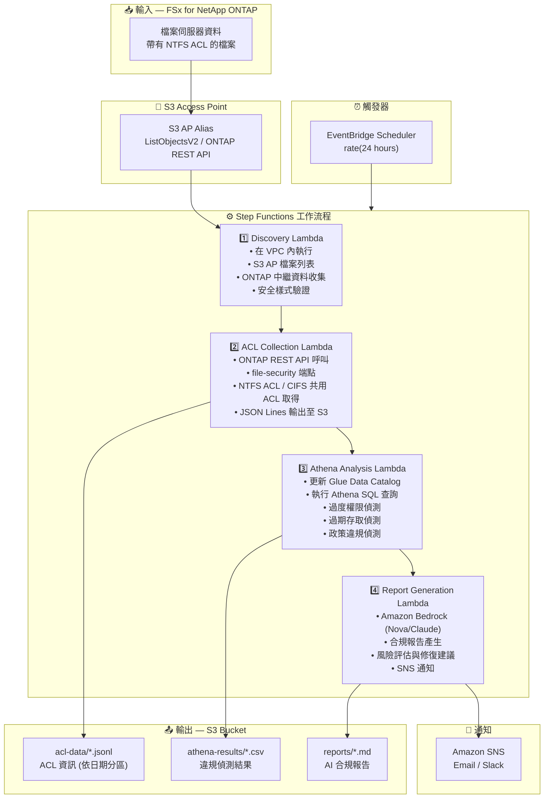

# UC1: 法務 / 合規 — 檔案伺服器稽核與資料治理

🌐 **Language / 言語**: [日本語](architecture.md) | [English](architecture.en.md) | [한국어](architecture.ko.md) | [简体中文](architecture.zh-CN.md) | 繁體中文 | [Français](architecture.fr.md) | [Deutsch](architecture.de.md) | [Español](architecture.es.md)

## 端對端架構 (輸入 → 輸出)

---

## 架構圖

---

## 資料流詳情

### 輸入
| 項目 | 說明 |
|------|------|
| **來源** | FSx for NetApp ONTAP 磁碟區 |
| **檔案類型** | 所有檔案 (帶有 NTFS ACL) |
| **存取方式** | S3 Access Point (檔案列表) + ONTAP REST API (ACL 資訊) |
| **讀取策略** | 僅中繼資料 (不讀取檔案內容) |

### 處理
| 步驟 | 服務 | 功能 |
|------|------|------|
| Discovery | Lambda (VPC) | 透過 S3 AP 列出檔案，收集 ONTAP 中繼資料 |
| ACL Collection | Lambda (VPC) | 透過 ONTAP REST API 取得 NTFS ACL / CIFS 共用 ACL |
| Athena Analysis | Lambda + Glue + Athena | 基於 SQL 偵測過度權限、過期存取、政策違規 |
| Report Generation | Lambda + Bedrock | 自然語言合規報告產生 |

### 輸出
| 產出物 | 格式 | 說明 |
|--------|------|------|
| ACL 資料 | `acl-data/YYYY/MM/DD/*.jsonl` | 每檔案 ACL 資訊 (JSON Lines) |
| Athena 結果 | `athena-results/{id}.csv` | 違規偵測結果 (過度權限、孤立檔案等) |
| 合規報告 | `reports/YYYY/MM/DD/compliance-report-{id}.md` | Bedrock 產生的報告 |
| SNS 通知 | Email | 稽核結果摘要及報告位置 |

---

## 關鍵設計決策

1. **S3 AP + ONTAP REST API 組合** — S3 AP 用於檔案列表，ONTAP REST API 用於詳細 ACL 取得 (兩階段方法)
2. **不讀取檔案內容** — 稽核目的僅收集中繼資料/權限資訊，最小化資料傳輸成本
3. **JSON Lines + 日期分區** — 兼顧 Athena 查詢效率與歷史追蹤
4. **Athena SQL 違規偵測** — 彈性的規則式分析 (Everyone 權限、90天未存取等)
5. **Bedrock 自然語言報告** — 確保非技術人員 (法務/合規團隊) 的可讀性
6. **輪詢 (非事件驅動)** — S3 AP 不支援事件通知，因此使用定期排程執行

---

## 使用的 AWS 服務

| 服務 | 角色 |
|------|------|
| FSx for NetApp ONTAP | 企業檔案儲存 (帶有 NTFS ACL) |
| S3 Access Points | 對 ONTAP 磁碟區的無伺服器存取 |
| EventBridge Scheduler | 定期觸發 (每日稽核) |
| Step Functions | 工作流程編排 |
| Lambda | 運算 (Discovery, ACL Collection, Analysis, Report) |
| Glue Data Catalog | Athena 的 Schema 管理 |
| Amazon Athena | 基於 SQL 的權限分析與違規偵測 |
| Amazon Bedrock | AI 合規報告產生 (Nova / Claude) |
| SNS | 稽核結果通知 |
| Secrets Manager | ONTAP REST API 憑證管理 |
| CloudWatch + X-Ray | 可觀測性 |
