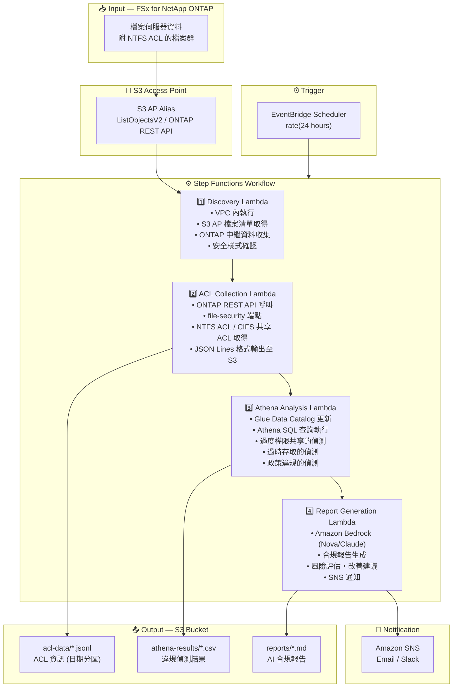

# UC1: 法務・合規 — 檔案伺服器稽核・資料治理

🌐 **Language / 언어 / 语言 / 語言 / Langue / Sprache / Idioma**: [日本語](architecture.md) | [English](architecture.en.md) | [한국어](architecture.ko.md) | [简体中文](architecture.zh-CN.md) | 繁體中文 | [Français](architecture.fr.md) | [Deutsch](architecture.de.md) | [Español](architecture.es.md)

> 注意：此翻譯由 Amazon Bedrock Claude 產生。歡迎對翻譯品質提出改進建議。

## End-to-End Architecture (Input → Output)

---

## Architecture Diagram

---

## Data Flow Detail

### Input
| Item | Description |
|------|-------------|
| **Source** | FSx for NetApp ONTAP volume |
| **File Types** | 所有檔案（附 NTFS ACL） |
| **Access Method** | S3 Access Point (檔案清單) + ONTAP REST API (ACL 資訊) |
| **Read Strategy** | 僅取得中繼資料（不讀取檔案本體） |

### Processing
| Step | Service | Function |
|------|---------|----------|
| Discovery | Lambda (VPC) | 透過 S3 AP 取得檔案清單、收集 ONTAP 中繼資料 |
| ACL Collection | Lambda (VPC) | 透過 ONTAP REST API 取得 NTFS ACL / CIFS 共享 ACL |
| Athena Analysis | Lambda + Glue + Athena | 使用 SQL 偵測過度權限・過時存取・政策違規 |
| Report Generation | Lambda + Bedrock | 生成自然語言合規報告 |

### Output
| Artifact | Format | Description |
|----------|--------|-------------|
| ACL Data | `acl-data/YYYY/MM/DD/*.jsonl` | 各檔案 ACL 資訊 (JSON Lines) |
| Athena Results | `athena-results/{id}.csv` | 違規偵測結果（過度權限、孤立檔案等） |
| Compliance Report | `reports/YYYY/MM/DD/compliance-report-{id}.md` | Bedrock 生成報告 |
| SNS Notification | Email | 稽核結果摘要與報告儲存位置 |

---

## Key Design Decisions

1. **S3 AP + ONTAP REST API 的併用** — 透過 S3 AP 取得檔案清單，透過 ONTAP REST API 取得 ACL 詳細資訊的兩階段架構
2. **不讀取檔案本體** — 為稽核目的僅收集中繼資料・權限資訊，將資料傳輸成本最小化
3. **JSON Lines + 日期分區** — 兼顧 Athena 查詢效率化與歷史追蹤
4. **透過 Athena SQL 進行違規偵測** — 彈性的規則基礎分析（Everyone 權限、90 天未存取等）
5. **透過 Bedrock 生成自然語言報告** — 確保非技術人員（法務合規負責人）的可讀性
6. **輪詢基礎** — 因 S3 AP 不支援事件通知，採用定期排程執行

---

## AWS Services Used

| Service | Role |
|---------|------|
| FSx for NetApp ONTAP | 企業檔案儲存（附 NTFS ACL） |
| S3 Access Points | 對 ONTAP 磁碟區的無伺服器存取 |
| EventBridge Scheduler | 定期觸發器（每日稽核） |
| Step Functions | 工作流程編排 |
| Lambda | 運算（Discovery, ACL Collection, Analysis, Report） |
| Glue Data Catalog | Athena 用結構描述管理 |
| Amazon Athena | 基於 SQL 的權限分析・違規偵測 |
| Amazon Bedrock | AI 合規報告生成 (Nova / Claude) |
| SNS | 稽核結果通知 |
| Secrets Manager | ONTAP REST API 認證資訊管理 |
| CloudWatch + X-Ray | 可觀測性 |
