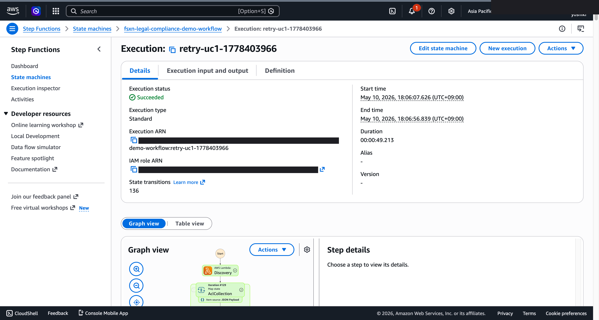
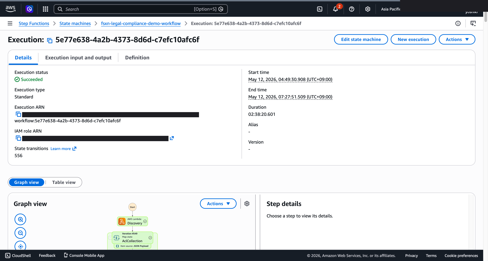
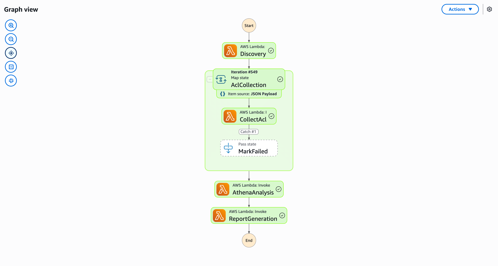
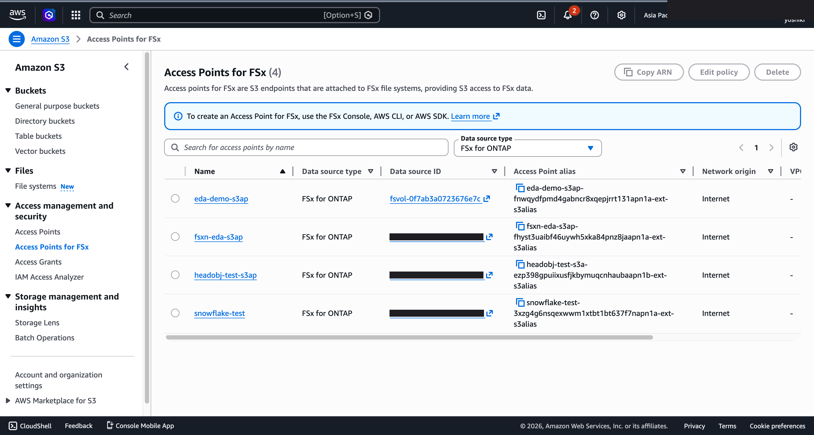
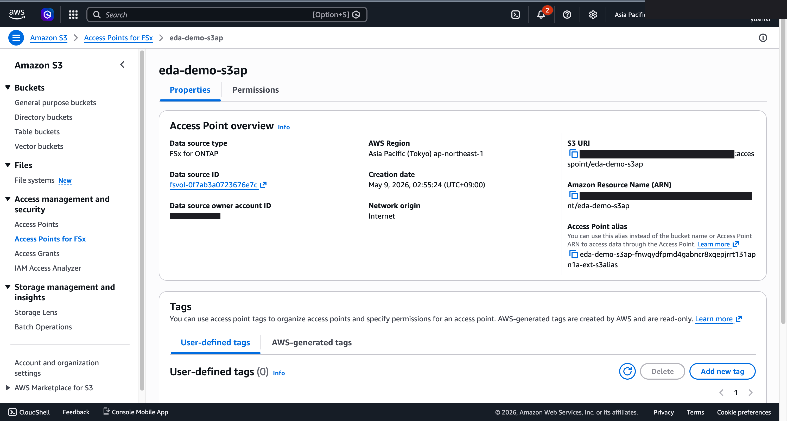
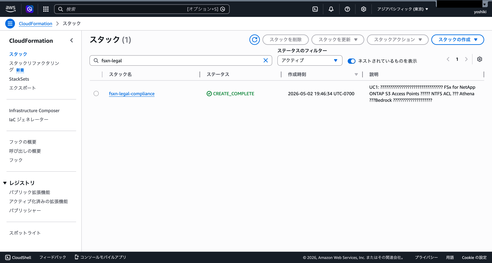

# ファイルサーバー権限監査 — Demo Guide

🌐 **Language / 言語**: 日本語 | [English](demo-guide.en.md) | [한국어](demo-guide.ko.md) | [简体中文](demo-guide.zh-CN.md) | [繁體中文](demo-guide.zh-TW.md) | [Français](demo-guide.fr.md) | [Deutsch](demo-guide.de.md) | [Español](demo-guide.es.md)

## Executive Summary

本デモでは、ファイルサーバー上の過剰なアクセス権限を自動検出する監査ワークフローを実演する。NTFS ACL を解析し、最小権限の原則に違反するエントリを特定、コンプライアンスレポートを自動生成する。

**デモの核心メッセージ**: 手動で数週間かかるファイルサーバー権限監査を自動化し、過剰権限のリスクを即座に可視化する。

**想定時間**: 3〜5 分

---

## Target Audience & Persona

| 項目 | 詳細 |
|------|------|
| **役職** | 情報セキュリティ担当 / IT コンプライアンス管理者 |
| **日常業務** | アクセス権限レビュー、監査対応、セキュリティポリシー管理 |
| **課題** | 数千フォルダの権限を手動で確認するのは非現実的 |
| **期待する成果** | 過剰権限の早期発見とコンプライアンス証跡の自動化 |

### Persona: 佐藤さん（情報セキュリティ管理者）

- 年次監査で全共有フォルダの権限レビューが必要
- 「Everyone フルコントロール」等の危険な設定を即座に検出したい
- 監査法人への提出レポートを効率的に作成したい

---

## Demo Scenario: 年次権限監査の自動化

### ワークフロー全体像

```
ファイルサーバー     ACL 収集        権限分析          レポート生成
(NTFS 共有)   →   メタデータ   →   違反検出    →    監査レポート
                   抽出            (ルール照合)      (AI 要約)
```

---

## Storyboard（5 セクション / 3〜5 分）

### Section 1: Problem Statement（0:00–0:45）

**ナレーション要旨**:
> 年次監査の時期。数千の共有フォルダに対して権限レビューが必要だが、手動確認では数週間かかる。過剰権限が放置されれば情報漏洩リスクが高まる。

**Key Visual**: 大量のフォルダ構造と「手動監査: 推定 3〜4 週間」のオーバーレイ

### Section 2: Workflow Trigger（0:45–1:30）

**ナレーション要旨**:
> 監査対象のボリュームを指定し、権限監査ワークフローを起動する。

**Key Visual**: Step Functions 実行画面、対象パス指定

### Section 3: ACL Analysis（1:30–2:30）

**ナレーション要旨**:
> 各フォルダの NTFS ACL を自動収集し、以下のルールで違反を検出:
> - Everyone / Authenticated Users への過剰権限
> - 不要な継承の蓄積
> - 退職者アカウントの残存

**Key Visual**: 並列処理による ACL スキャン進捗

### Section 4: Results Review（2:30–3:45）

**ナレーション要旨**:
> 検出結果を SQL でクエリ。違反件数、リスクレベル別の分布を確認。

**Key Visual**: Athena クエリ結果 — 違反一覧テーブル

### Section 5: Compliance Report（3:45–5:00）

**ナレーション要旨**:
> AI が監査レポートを自動生成。リスク評価、推奨対応、優先度付きアクションを提示。

**Key Visual**: 生成された監査レポート（リスクサマリー + 対応推奨）

---

## Screen Capture Plan

| # | 画面 | セクション |
|---|------|-----------|
| 1 | ファイルサーバーのフォルダ構造 | Section 1 |
| 2 | ワークフロー実行開始 | Section 2 |
| 3 | ACL スキャン並列処理中 | Section 3 |
| 4 | Athena 違反検出クエリ結果 | Section 4 |
| 5 | AI 生成監査レポート | Section 5 |

---

## Narration Outline

| セクション | 時間 | キーメッセージ |
|-----------|------|--------------|
| Problem | 0:00–0:45 | 「数千フォルダの権限監査を手動で行うのは非現実的」 |
| Trigger | 0:45–1:30 | 「対象ボリュームを指定して監査を開始」 |
| Analysis | 1:30–2:30 | 「ACL を自動収集し、ポリシー違反を検出」 |
| Results | 2:30–3:45 | 「違反件数とリスクレベルを即座に把握」 |
| Report | 3:45–5:00 | 「監査レポートを自動生成、対応優先度を提示」 |

---

## Sample Data Requirements

| # | データ | 用途 |
|---|--------|------|
| 1 | 正常権限フォルダ（50+） | ベースライン |
| 2 | Everyone フルコントロール設定（5 件） | 高リスク違反 |
| 3 | 退職者アカウント残存（3 件） | 中リスク違反 |
| 4 | 過剰継承フォルダ（10 件） | 低リスク違反 |

---

## Timeline

### 1 週間以内に達成可能

| タスク | 所要時間 |
|--------|---------|
| サンプル ACL データ生成 | 2 時間 |
| ワークフロー実行確認 | 2 時間 |
| 画面キャプチャ取得 | 2 時間 |
| ナレーション原稿作成 | 2 時間 |
| 動画編集 | 4 時間 |

### Future Enhancements

- Active Directory 連携による退職者自動検出
- リアルタイム権限変更監視
- 是正アクションの自動実行

---

## Technical Notes

| コンポーネント | 役割 |
|--------------|------|
| Step Functions | ワークフローオーケストレーション |
| Lambda (ACL Collector) | NTFS ACL メタデータ収集 |
| Lambda (Policy Checker) | ポリシー違反ルール照合 |
| Lambda (Report Generator) | Bedrock による監査レポート生成 |
| Amazon Athena | 違反データの SQL 分析 |

### フォールバック

| シナリオ | 対応 |
|---------|------|
| ACL 収集失敗 | 事前取得済みデータを使用 |
| Bedrock 遅延 | 事前生成レポートを表示 |

---

*本ドキュメントは技術プレゼンテーション用デモ動画の制作ガイドです。*

---

## 出力先について: FSxN S3 Access Point (Pattern A)

UC1 legal-compliance は **Pattern A: Native S3AP Output** に分類されます
（`docs/output-destination-patterns.md` 参照）。

**設計**: 契約メタデータ、監査ログ、サマリーレポートは全て FSxN S3 Access Point 経由で
オリジナル契約データと**同一の FSx ONTAP ボリューム**に書き戻されます。標準 S3 バケットは
作成されません（"no data movement" パターン）。

**CloudFormation パラメータ**:
- `S3AccessPointAlias`: 入力契約データ読み取り用 S3 AP Alias
- `S3AccessPointOutputAlias`: 出力書き込み用 S3 AP Alias（入力と同じでも可）

**デプロイ例**:
```bash
aws cloudformation deploy \
  --template-file legal-compliance/template-deploy.yaml \
  --stack-name fsxn-legal-compliance-demo \
  --parameter-overrides \
    S3AccessPointAlias=eda-demo-s3ap-XYZ-ext-s3alias \
    S3AccessPointOutputAlias=eda-demo-s3ap-XYZ-ext-s3alias \
    ... (他の必須パラメータ)
```

**SMB/NFS ユーザーからの見え方**:
```
/vol/contracts/
  ├── 2026/Q2/contract_ABC.pdf         # オリジナル契約書
  └── summaries/2026/05/                # AI 生成サマリー（同じボリューム内）
      └── contract_ABC.json
```

AWS 仕様上の制約については
[プロジェクト README の "AWS 仕様上の制約と回避策" セクション](../../README.md#aws-仕様上の制約と回避策)
および [`docs/output-destination-patterns.md`](../../docs/output-destination-patterns.md) を参照。

---

## 検証済みの UI/UX スクリーンショット

Phase 7 UC15/16/17 と UC6/11/14 のデモと同じ方針で、**エンドユーザーが日常業務で実際に
見る UI/UX 画面**を対象とする。技術者向けビュー（Step Functions グラフ、CloudFormation
スタックイベント等）は `docs/verification-results-*.md` に集約。

### このユースケースの検証ステータス

- ✅ **E2E 実行**: Phase 1-6 で確認済み（根 README 参照）
- 📸 **UI/UX 再撮影**: ✅ 2026-05-10 再デプロイ検証で撮影済み （UC1 Step Functions グラフ、Lambda 実行成功を確認）
- 🔄 **再現方法**: 本ドキュメント末尾の「撮影ガイド」を参照

### 2026-05-10 再デプロイ検証で撮影（UI/UX 中心）

#### UC1 Step Functions Graph view（SUCCEEDED）



Step Functions Graph view は各 Lambda / Parallel / Map ステートの実行状況を
色で可視化するエンドユーザー最重要画面。

#### UC1 Step Functions Graph（SUCCEEDED — Phase 8 Theme D/E/N 検証、2:38:20）



Phase 8 Theme E (event-driven) + Theme N (observability) 有効状態で実行。
549 ACL iterations、3871 events、2:38:20 で全ステップ SUCCEEDED。

#### UC1 Step Functions Graph（ズーム表示 — 各ステップ詳細）



#### UC1 S3 Access Points for FSx ONTAP（コンソール表示）



#### UC1 S3 Access Point 詳細（概要ビュー）



### 既存スクリーンショット（Phase 1-6 から該当分）

#### UC1 CloudFormation スタックデプロイ完了（2026-05-02 検証時）



#### UC1 Step Functions SUCCEEDED（E2E 実行成功）


### 再検証時の UI/UX 対象画面（推奨撮影リスト）

- S3 出力バケット（audit-reports/、acl-audits/、athena-results/ プレフィックス）
- Athena クエリ結果（ACL 違反検出 SQL）
- Bedrock 生成の監査レポート（コンプライアンス違反サマリー）
- SNS 通知メール（監査アラート）

### 撮影ガイド

1. **事前準備**:
   - `bash scripts/verify_phase7_prerequisites.sh` で前提確認（共通 VPC/S3 AP 有無）
   - `UC=legal-compliance bash scripts/package_generic_uc.sh` で Lambda パッケージ
   - `bash scripts/deploy_generic_ucs.sh UC1` でデプロイ

2. **サンプルデータ配置**:
   - S3 AP Alias 経由で `contracts/` プレフィックスにサンプルファイルをアップロード
   - Step Functions `fsxn-legal-compliance-demo-workflow` を起動（入力 `{}`）

3. **撮影**（CloudShell・ターミナルは閉じる、ブラウザ右上のユーザー名は黒塗り）:
   - S3 出力バケット `fsxn-legal-compliance-demo-output-<account>` の俯瞰
   - AI/ML 出力 JSON のプレビュー（`build/preview_*.html` の形式を参考に）
   - SNS メール通知（該当する場合）

4. **マスク処理**:
   - `python3 scripts/mask_uc_demos.py legal-compliance-demo` で自動マスク
   - `docs/screenshots/MASK_GUIDE.md` に従って追加マスク（必要に応じて）

5. **クリーンアップ**:
   - `bash scripts/cleanup_generic_ucs.sh UC1` で削除
   - VPC Lambda ENI 解放に 15-30 分（AWS の仕様）
