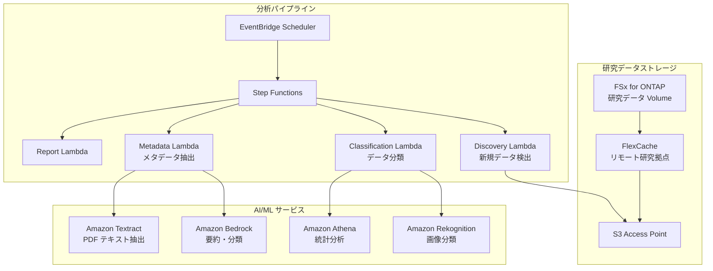

# Life Sciences Research — 研究データ分析パターン

🌐 **Language / 言語**: [日本語](README.md)

## 概要

ライフサイエンス研究機関のファイルサーバー（FSx for ONTAP）上の研究データ（画像、シーケンス結果、論文 PDF）を S3 Access Points 経由でサーバーレスに分析するパターン。FlexCache で研究拠点間のデータアクセスを高速化する。

## 解決する課題

| 課題 | 本パターンによる解決 |
|------|-------------------|
| 研究拠点間のデータ共有遅延 | FlexCache で拠点間キャッシュ |
| 大量の研究画像の手動分類 | S3 AP + Rekognition で自動分類 |
| 論文 PDF のメタデータ管理 | S3 AP + Textract + Bedrock で自動抽出 |
| シーケンスデータの品質チェック | Lambda + Athena で自動 QC |
| コンプライアンス（データ保持） | 監査ログ + 自動レポート |

## アーキテクチャ



## 対象データ

| データ種別 | 拡張子 | 処理内容 | FlexCache 適用 |
|-----------|--------|---------|:---:|
| 顕微鏡画像 | .tiff, .nd2, .czi | 画像分類、品質チェック | ✅ |
| シーケンス結果 | .fastq, .bam, .vcf | QC、バリアントコール集計 | ✅ |
| 論文 PDF | .pdf | テキスト抽出、要約、引用分析 | ✅ |
| 実験ログ | .csv, .xlsx | 統計分析、異常検知 | ⚠️ 更新頻度高 |
| プロトコル | .docx, .md | メタデータ抽出 | ✅ |

## 既存ユースケースとの関連

| 関連 UC | 関連ポイント |
|---------|------------|
| [healthcare-dicom/](../healthcare-dicom/) | 医療画像処理パターン共有 |
| [genomics-pipeline/](../genomics-pipeline/) | シーケンスデータ処理パターン共有 |
| [education-research/](../education-research/) | 論文 PDF 分類パターン共有 |
| [genai-rag-enterprise-files/](../genai-rag-enterprise-files/) | RAG パイプライン共有 |

## FlexCache の役割

- 本部の研究データを各拠点の FlexCache にキャッシュ
- 大容量画像データの WAN 転送を削減
- AI 処理環境近傍にデータを配置
- S3 AP 経由でサーバーレス分析に提供

## ディレクトリ構成

```
life-sciences-research/
├── README.md
├── template.yaml
├── functions/
│   ├── discovery/handler.py
│   ├── classification/handler.py
│   ├── metadata_extraction/handler.py
│   └── report/handler.py
├── tests/
├── events/
│   └── sample-input.json
└── docs/
    ├── architecture.md
    ├── demo-guide.md
    └── poc-checklist.md
```

## 関連リンク

- [FlexCache AnyCast / DR](../flexcache-anycast-dr/README.md)
- [業界・ワークロード マッピング](../docs/industry-workload-mapping.md)
- [サポートマトリックス](../docs/support-matrix-fsx-ontap-flexcache-s3ap.md)


## Success Metrics

### Outcome
研究データ（画像・シーケンス・論文）の自動分類・メタデータ抽出により、研究データ利活用を促進する。

### Metrics
| メトリクス | 目標値（例） |
|-----------|------------|
| 分類処理ファイル数 / 実行 | > 100 files |
| 分類精度 | > 85% |
| メタデータ抽出成功率 | > 90% |
| 処理時間 / ファイル | < 30 秒 |
| Human Review 対象率 | < 20%（分類不確実なデータ） |

### Measurement Method
Step Functions 実行履歴、分類結果メタデータ、CloudWatch Metrics。


---

## 出力サンプル (Output Sample)

ライフサイエンス研究データ分類パイプラインの出力例:

```json
{
  "discovery": {
    "status": "completed",
    "object_count": 20,
    "categories": {"microscopy": 8, "sequence": 7, "research_pdf": 5}
  },
  "classification": [
    {
      "key": "research/experiment-001/image-confocal.tiff",
      "data_type": "confocal_microscopy",
      "resolution": "2048x2048",
      "channels": 4,
      "metadata_extracted": true
    },
    {
      "key": "research/experiment-001/reads.fastq.gz",
      "data_type": "rna_seq",
      "read_count": 15000000,
      "quality_score_avg": 35.2
    }
  ],
  "report": {
    "total_classified": 20,
    "categories_found": 3,
    "storage_recommendation": "archive microscopy raw data after 90 days"
  }
}
```

> **注記**: 上記はサンプル出力であり、実際の値は環境・入力データにより異なります。ベンチマーク数値は sizing reference であり、service limit ではありません。

---

## Performance Considerations

- FSx for ONTAP のスループットキャパシティは NFS/SMB/S3AP で共有されます
- S3 Access Point 経由のレイテンシは数十ミリ秒のオーバーヘッドが発生します
- 大量ファイル処理時は Step Functions Map state の MaxConcurrency で並列度を制御してください
- Lambda メモリサイズの増加はネットワーク帯域幅の向上にも寄与します

> **注記**: 本パターンのパフォーマンス数値は sizing reference であり、service limit ではありません。実環境での性能は FSx ONTAP スループットキャパシティ、ネットワーク構成、同時実行ワークロードにより異なります。

---

## Governance Note

> 本パターンは技術アーキテクチャガイダンスを提供します。法的・コンプライアンス・規制上の助言ではありません。組織は適格な専門家に相談してください。
