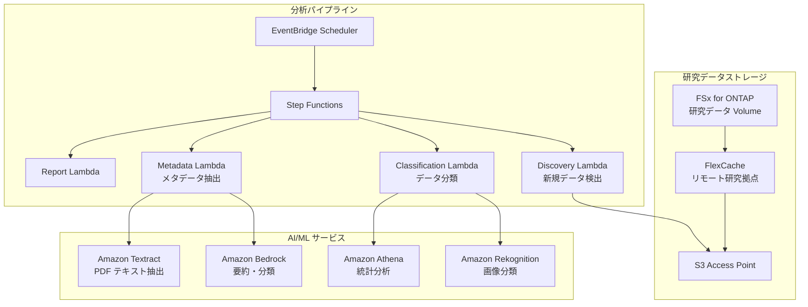

# Life Sciences Research — 研究データ分析パターン

🌐 **Language / 言語**: [日本語](README.md) | [English](README.en.md) | [한국어](README.ko.md) | [简体中文](README.zh-CN.md)

## 概要

ライフサイエンス研究機関のファイルサーバー（FSx for ONTAP）上の研究データ（画像、シーケンス結果、論文 PDF）を S3 Access Points 経由でサーバーレスに分析するパターン。FlexCache で研究拠点間のデータアクセスを高速化する。

## 解決する課題

| 課題 | 本パターンによる解決 |
|------|-------------------|
| 研究拠点間のデータ共有遅延 | FlexCache で拠点間キャッシュ |
| 大量の研究画像の手動分類 | S3 AP + Rekognition で自動分類 |
| 論文 PDF のメタデータ管理 | S3 AP + Textract + Bedrock で自動抽出 |
| シーケンスデータの品質チェック | Lambda + Athena で自動 QC |
| コンプライアンス（データ保持） | 監査ログ + 自動レポート |

## アーキテクチャ



## 対象データ

| データ種別 | 拡張子 | 処理内容 | FlexCache 適用 |
|-----------|--------|---------|:---:|
| 顕微鏡画像 | .tiff, .nd2, .czi | 画像分類、品質チェック | ✅ |
| シーケンス結果 | .fastq, .bam, .vcf | QC、バリアントコール集計 | ✅ |
| 論文 PDF | .pdf | テキスト抽出、要約、引用分析 | ✅ |
| 実験ログ | .csv, .xlsx | 統計分析、異常検知 | ⚠️ 更新頻度高 |
| プロトコル | .docx, .md | メタデータ抽出 | ✅ |

## 既存ユースケースとの関連

| 関連 UC | 関連ポイント |
|---------|------------|
| [healthcare-dicom/](../healthcare-dicom/) | 医療画像処理パターン共有 |
| [genomics-pipeline/](../genomics-pipeline/) | シーケンスデータ処理パターン共有 |
| [education-research/](../education-research/) | 論文 PDF 分類パターン共有 |
| [genai-rag-enterprise-files/](../genai-rag-enterprise-files/) | RAG パイプライン共有 |

## FlexCache の役割

- 本部の研究データを各拠点の FlexCache にキャッシュ
- 大容量画像データの WAN 転送を削減
- AI 処理環境近傍にデータを配置
- S3 AP 経由でサーバーレス分析に提供

## ディレクトリ構成

```
life-sciences-research/
├── README.md
├── template.yaml
├── functions/
│   ├── discovery/handler.py
│   ├── classification/handler.py
│   ├── metadata_extraction/handler.py
│   └── report/handler.py
├── tests/
├── events/
│   └── sample-input.json
└── docs/
    ├── architecture.md
    ├── demo-guide.md
    └── poc-checklist.md
```

## 関連リンク

- [FlexCache AnyCast / DR](../flexcache-anycast-dr/README.md)
- [業界・ワークロード マッピング](../docs/industry-workload-mapping.md)
- [サポートマトリックス](../docs/support-matrix-fsx-ontap-flexcache-s3ap.md)


## Success Metrics

### Outcome
研究データ（画像・シーケンス・論文）の自動分類・メタデータ抽出により、研究データ利活用を促進する。

### Metrics
| メトリクス | 目標値（例） |
|-----------|------------|
| 分類処理ファイル数 / 実行 | > 100 files |
| 分類精度 | > 85% |
| メタデータ抽出成功率 | > 90% |
| 処理時間 / ファイル | < 30 秒 |
| Human Review 対象率 | < 20%（分類不確実なデータ） |

### Measurement Method
Step Functions 実行履歴、分類結果メタデータ、CloudWatch Metrics。


---

## AWS ドキュメントリンク

| サービス | ドキュメント |
|---------|------------|
| FSx for ONTAP | [ユーザーガイド](https://docs.aws.amazon.com/fsx/latest/ONTAPGuide/what-is-fsx-ontap.html) |
| S3 Access Points for FSx ONTAP | [S3 AP ガイド](https://docs.aws.amazon.com/fsx/latest/ONTAPGuide/s3-access-points.html) |
| AWS HealthOmics | [ユーザーガイド](https://docs.aws.amazon.com/omics/latest/dev/what-is-service.html) |
| Amazon Rekognition | [開発者ガイド](https://docs.aws.amazon.com/rekognition/latest/dg/what-is.html) |
| Amazon Comprehend | [開発者ガイド](https://docs.aws.amazon.com/comprehend/latest/dg/what-is.html) |
| Amazon Bedrock | [ユーザーガイド](https://docs.aws.amazon.com/bedrock/latest/userguide/what-is-bedrock.html) |
| Step Functions | [開発者ガイド](https://docs.aws.amazon.com/step-functions/latest/dg/welcome.html) |

### Well-Architected Framework 対応

| 柱 | 対応 |
|----|------|
| 運用上の優秀性 | 構造化ログ、CloudWatch Metrics、分類結果追跡 |
| セキュリティ | IAM 最小権限、KMS 暗号化、研究データ保護 |
| 信頼性 | Step Functions Retry/Catch、Map state 並列処理 |
| パフォーマンス効率 | Lambda ARM64、ファイルタイプ別処理最適化 |
| コスト最適化 | サーバーレス、オンデマンド実行 |
| 持続可能性 | 不要データのアーカイブ推奨、ライフサイクル管理 |

### 関連 AWS ソリューション

- [AWS for Health & Life Sciences](https://aws.amazon.com/health/)
- [AWS HealthOmics](https://aws.amazon.com/omics/)
- [Genomics Workflows on AWS](https://aws.amazon.com/solutions/implementations/genomics-secondary-analysis-using-aws-step-functions-and-aws-batch/)


---

## コスト見積もり（月額概算）

> **注記**: 以下は ap-northeast-1 リージョンの概算であり、実際のコストは使用量により異なります。最新の料金は [AWS Pricing Calculator](https://calculator.aws/) で確認してください。

### サーバーレスコンポーネント（従量課金）

| サービス | 単価 | 想定使用量 | 月額概算 |
|---------|------|-----------|---------|
| Lambda | $0.0000166667/GB-sec | 4 関数 × 30 files/日 | ~$1-5 |
| S3 API (GetObject/ListObjects) | $0.0047/10K requests | ~10K requests/日 | ~$1.5 |
| Step Functions | $0.025/1K state transitions | ~1K transitions/日 | ~$0.75 |
| Bedrock (Nova Lite) | $0.00006/1K input tokens | ~20K tokens/実行 | ~$3-10 |
| Athena | $5/TB scanned | N/A | ~$0.5-2 |
| SNS | $0.50/100K notifications | ~100 notifications/日 | ~$0.15 |
| CloudWatch Logs | $0.76/GB ingested | ~1 GB/月 | ~$0.76 |

### 固定コスト（FSx for ONTAP — 既存環境前提）

| コンポーネント | 月額 |
|--------------|------|
| FSx ONTAP (128 MBps, 1 TB) | ~$230 (既存環境を共有) |
| S3 Access Point | 追加料金なし（S3 API 料金のみ） |

### 合計概算

| 構成 | 月額概算 |
|------|---------|
| 最小構成（日次 1 回実行） | ~$5-15 |
| 標準構成（時次実行） | ~$15-50 |
| 大規模構成（高頻度 + アラーム） | ~$50-150 |

> **Governance Caveat**: コスト見積もりは概算であり、保証値ではありません。実際の請求額は使用パターン、データ量、リージョンにより異なります。

---

## ローカルテスト

### Prerequisites チェック

```bash
# 前提条件の確認
aws --version          # AWS CLI v2
sam --version          # SAM CLI
python3 --version      # Python 3.9+
docker --version       # Docker (sam local 用)
aws sts get-caller-identity  # AWS 認証情報
```

### sam local invoke

```bash
# ビルド
sam build

# Discovery Lambda のローカル実行
sam local invoke DiscoveryFunction --event events/discovery-event.json

# 環境変数オーバーライド付き
sam local invoke DiscoveryFunction \
  --event events/discovery-event.json \
  --env-vars env.json
```

### ユニットテスト

```bash
python3 -m pytest tests/ -v
```

詳細は [ローカルテスト クイックスタート](../docs/local-testing-quick-start.md) を参照してください。

---

## 出力サンプル (Output Sample)

ライフサイエンス研究データ分類パイプラインの出力例:

```json
{
  "discovery": {
    "status": "completed",
    "object_count": 20,
    "categories": {"microscopy": 8, "sequence": 7, "research_pdf": 5}
  },
  "classification": [
    {
      "key": "research/experiment-001/image-confocal.tiff",
      "data_type": "confocal_microscopy",
      "resolution": "2048x2048",
      "channels": 4,
      "metadata_extracted": true
    },
    {
      "key": "research/experiment-001/reads.fastq.gz",
      "data_type": "rna_seq",
      "read_count": 15000000,
      "quality_score_avg": 35.2
    }
  ],
  "report": {
    "total_classified": 20,
    "categories_found": 3,
    "storage_recommendation": "archive microscopy raw data after 90 days"
  }
}
```

> **注記**: 上記はサンプル出力であり、実際の値は環境・入力データにより異なります。ベンチマーク数値は sizing reference であり、service limit ではありません。

---

## Performance Considerations

- FSx for ONTAP のスループットキャパシティは NFS/SMB/S3AP で共有されます
- S3 Access Point 経由のレイテンシは数十ミリ秒のオーバーヘッドが発生します
- 大量ファイル処理時は Step Functions Map state の MaxConcurrency で並列度を制御してください
- Lambda メモリサイズの増加はネットワーク帯域幅の向上にも寄与します

> **注記**: 本パターンのパフォーマンス数値は sizing reference であり、service limit ではありません。実環境での性能は FSx ONTAP スループットキャパシティ、ネットワーク構成、同時実行ワークロードにより異なります。

---

## Governance Note

> 本パターンは技術アーキテクチャガイダンスを提供します。法的・コンプライアンス・規制上の助言ではありません。組織は適格な専門家に相談してください。
