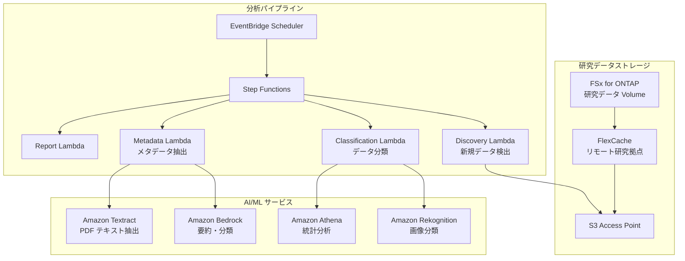

# Life Sciences Research — 研究データ分析パターン

🌐 **Language / 言語**: [日本語](README.md)

## 概要

ライフサイエンス研究機関のファイルサーバー（FSx for ONTAP）上の研究データ（画像、シーケンス結果、論文 PDF）を S3 Access Points 経由でサーバーレスに分析するパターン。FlexCache で研究拠点間のデータアクセスを高速化する。

## 解決する課題

| 課題 | 本パターンによる解決 |
|------|-------------------|
| 研究拠点間のデータ共有遅延 | FlexCache で拠点間キャッシュ |
| 大量の研究画像の手動分類 | S3 AP + Rekognition で自動分類 |
| 論文 PDF のメタデータ管理 | S3 AP + Textract + Bedrock で自動抽出 |
| シーケンスデータの品質チェック | Lambda + Athena で自動 QC |
| コンプライアンス（データ保持） | 監査ログ + 自動レポート |

## アーキテクチャ



## 対象データ

| データ種別 | 拡張子 | 処理内容 | FlexCache 適用 |
|-----------|--------|---------|:---:|
| 顕微鏡画像 | .tiff, .nd2, .czi | 画像分類、品質チェック | ✅ |
| シーケンス結果 | .fastq, .bam, .vcf | QC、バリアントコール集計 | ✅ |
| 論文 PDF | .pdf | テキスト抽出、要約、引用分析 | ✅ |
| 実験ログ | .csv, .xlsx | 統計分析、異常検知 | ⚠️ 更新頻度高 |
| プロトコル | .docx, .md | メタデータ抽出 | ✅ |

## 既存ユースケースとの関連

| 関連 UC | 関連ポイント |
|---------|------------|
| [healthcare-dicom/](../healthcare-dicom/) | 医療画像処理パターン共有 |
| [genomics-pipeline/](../genomics-pipeline/) | シーケンスデータ処理パターン共有 |
| [education-research/](../education-research/) | 論文 PDF 分類パターン共有 |
| [genai-rag-enterprise-files/](../genai-rag-enterprise-files/) | RAG パイプライン共有 |

## FlexCache の役割

- 本部の研究データを各拠点の FlexCache にキャッシュ
- 大容量画像データの WAN 転送を削減
- AI 処理環境近傍にデータを配置
- S3 AP 経由でサーバーレス分析に提供

## ディレクトリ構成

```
life-sciences-research/
├── README.md
├── template.yaml
├── functions/
│   ├── discovery/handler.py
│   ├── classification/handler.py
│   ├── metadata_extraction/handler.py
│   └── report/handler.py
├── tests/
├── events/
│   └── sample-input.json
└── docs/
    ├── architecture.md
    ├── demo-guide.md
    └── poc-checklist.md
```

## 関連リンク

- [FlexCache AnyCast / DR](../flexcache-anycast-dr/README.md)
- [業界・ワークロード マッピング](../docs/industry-workload-mapping.md)
- [サポートマトリックス](../docs/support-matrix-fsx-ontap-flexcache-s3ap.md)
