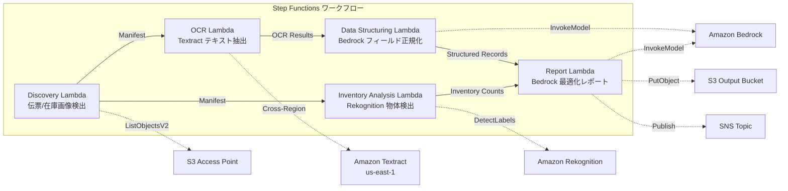

# UC12: Logística / Cadena de Suministro — Análisis de imágenes de albarán de entrega OCR y de inventario de almacén

🌐 **Language / 言語**: [日本語](README.md) | [English](README.en.md) | [한국어](README.ko.md) | [简体中文](README.zh-CN.md) | [繁體中文](README.zh-TW.md) | [Français](README.fr.md) | [Deutsch](README.de.md) | Español

## Resumen
Es un flujo de trabajo sin servidor que aprovecha los Puntos de Acceso S3 de FSx for NetApp ONTAP para automatizar la extracción de texto OCR de las etiquetas de envío, la detección y conteo de objetos en imágenes de inventario de almacén y la generación de informes de optimización de rutas de entrega.
### Casos en los que este patrón es adecuado
- Las imágenes de los albaranes de envío y las imágenes del inventario del almacén se están acumulando en FSx ONTAP
- Queremos automatizar el OCR ( remitente, destinatario, número de seguimiento, artículos ) de los albaranes de envío con Textract
- Se requiere la normalización de los campos extraídos y la generación de registros de envío estructurados con Bedrock
- Queremos realizar la detección y conteo de objetos ( paletas, cajas, tasa de ocupación de estantes ) en las imágenes del inventario del almacén con Rekognition
- Queremos generar automáticamente informes de optimización de rutas de entrega
### Casos en los que este patrón no es adecuado
- Necesitamos un sistema de seguimiento de envíos en tiempo real
- Necesitamos una integración directa con un WMS (Sistema de Gestión de Almacén) a gran escala
- Un motor completo de optimización de rutas de entrega (el software dedicado es apropiado)
- Ambientes donde no se puede garantizar el acceso de red a la API REST de ONTAP
### Características principales
- Detección automática de imágenes de albarán de entrega (.jpg,.jpeg,.png,.tiff, .pdf) y de inventario de almacén a través de S3 AP
- OCR de albaranes (cross-region) con Textract (extracción de texto y formulario)
- Establecimiento de una bandera de verificación manual para resultados de baja confianza
- Normalización de campos extraídos y generación de registros de entrega estructurados con Bedrock
- Detección y conteo de objetos en imágenes de inventario de almacén con Rekognition
- Generación de informes de optimización de rutas de entrega con Bedrock
## Arquitectura



### Paso de flujo de trabajo
1. **Descubrimiento**: Detectar imágenes de albarán de entrega y de inventario de almacén desde S3 AP
2. **OCR**: Extraer texto y formas de albaranes de entrega con Textract (cross-region)
3. **Estructuración de datos**: Normalizar campos extraídos y generar registros de entrega estructurados con Bedrock
4. **Análisis de inventario**: Detectar y contar objetos en imágenes de inventario de almacén con Rekognition
5. **Informe**: Generar informe de optimización de rutas de entrega con Bedrock, salida a S3 + notificación SNS
## Requisitos previos
- Cuenta de AWS y los permisos de IAM apropiados
- Sistema de archivos FSx for NetApp ONTAP (ONTAP 9.17.1P4D3 o superior)
- Punto de Acceso S3 habilitado para volúmenes (almacenar boleta de envío e imágenes de inventario)
- VPC, subredes privadas
- Acceso a modelos de Amazon Bedrock habilitado (Claude / Nova)
- **Cross-region**: Textract no es compatible con ap-northeast-1, por lo que se necesita una llamada cross-region a us-east-1
## Pasos de implementación

### 1. Verificación de parámetros entre regiones
Textract no es compatible con la región de Tokio, por lo que se configura una llamada entre regiones con el parámetro `CrossRegionTarget`.
### 2. Despliegue de CloudFormation

```bash
aws cloudformation deploy \
  --template-file logistics-ocr/template.yaml \
  --stack-name fsxn-logistics-ocr \
  --parameter-overrides \
    S3AccessPointAlias=<your-volume-ext-s3alias> \
    S3AccessPointName=<your-s3ap-name> \
    VpcId=<your-vpc-id> \
    PrivateSubnetIds=<subnet-1>,<subnet-2> \
    ScheduleExpression="rate(1 hour)" \
    NotificationEmail=<your-email@example.com> \
    CrossRegionTarget=us-east-1 \
    EnableVpcEndpoints=false \
    EnableCloudWatchAlarms=false \
  --capabilities CAPABILITY_IAM CAPABILITY_AUTO_EXPAND \
  --region ap-northeast-1
```

## Lista de parámetros de configuración

| パラメータ | 説明 | デフォルト | 必須 |
|-----------|------|----------|------|
| `S3AccessPointAlias` | FSx ONTAP S3 AP Alias（入力用） | — | ✅ |
| `S3AccessPointName` | S3 AP 名（ARN ベースの IAM 権限付与用。省略時は Alias ベースのみ） | `""` | ⚠️ 推奨 |
| `ScheduleExpression` | EventBridge Scheduler のスケジュール式 | `rate(1 hour)` | |
| `VpcId` | VPC ID | — | ✅ |
| `PrivateSubnetIds` | プライベートサブネット ID リスト | — | ✅ |
| `NotificationEmail` | SNS 通知先メールアドレス | — | ✅ |
| `CrossRegionTarget` | Textract のターゲットリージョン | `us-east-1` | |
| `MapConcurrency` | Map ステートの並列実行数 | `10` | |
| `LambdaMemorySize` | Lambda メモリサイズ (MB) | `512` | |
| `LambdaTimeout` | Lambda タイムアウト (秒) | `300` | |
| `EnableVpcEndpoints` | Interface VPC Endpoints の有効化 | `false` | |
| `EnableCloudWatchAlarms` | CloudWatch Alarms の有効化 | `false` | |
| `EnableSnapStart` | Habilitar Lambda SnapStart (reducción de arranque en frío) | `false` | |

## Limpieza

```bash
aws s3 rm s3://fsxn-logistics-ocr-output-${AWS_ACCOUNT_ID} --recursive

aws cloudformation delete-stack \
  --stack-name fsxn-logistics-ocr \
  --region ap-northeast-1

aws cloudformation wait stack-delete-complete \
  --stack-name fsxn-logistics-ocr \
  --region ap-northeast-1
```

## Regiones compatibles
UC12 utiliza los siguientes servicios:
| サービス | リージョン制約 |
|---------|-------------|
| Amazon Textract | ap-northeast-1 非対応。`TEXTRACT_REGION` パラメータで対応リージョン（us-east-1 等）を指定 |
| Amazon Rekognition | ほぼ全リージョンで利用可能 |
| Amazon Bedrock | 対応リージョンを確認（[Bedrock 対応リージョン](https://docs.aws.amazon.com/general/latest/gr/bedrock.html)） |
| AWS X-Ray | ほぼ全リージョンで利用可能 |
| CloudWatch EMF | ほぼ全リージョンで利用可能 |
> Llame a la API de Textract a través del Cliente de Región Cruzada. Verifique los requisitos de residencia de datos. Para obtener más detalles, consulte la [Matriz de compatibilidad regional](../docs/region-compatibility.md).
## Enlaces de referencia
- [Puntos de acceso a S3 de FSx ONTAP 概要](https://docs.aws.amazon.com/fsx/latest/ONTAPGuide/accessing-data-via-s3-access-points.html)
- [Documentación de Amazon Textract](https://docs.aws.amazon.com/textract/latest/dg/what-is.html)
- [Amazon Rekognition detección de etiquetas](https://docs.aws.amazon.com/rekognition/latest/dg/labels.html)
- [Referencia de la API de Amazon Bedrock](https://docs.aws.amazon.com/bedrock/latest/APIReference/API_runtime_InvokeModel.html)