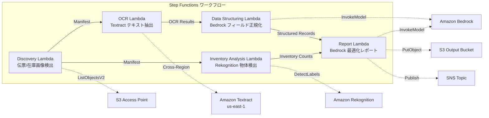

# UC12 : Logistique / Chaîne d'approvisionnement — OCR des bons de livraison et analyse d'images de stock de l'entrepôt

🌐 **Language / 言語**: [日本語](README.md) | [English](README.en.md) | [한국어](README.ko.md) | [简体中文](README.zh-CN.md) | [繁體中文](README.zh-TW.md) | Français | [Deutsch](README.de.md) | [Español](README.es.md)

## Aperçu
FSx for NetApp ONTAP utilise les points d'accès S3 pour automatiser les workflows sans serveur, notamment l'extraction de texte OCR des bons de livraison, la détection et le comptage d'objets sur les images de stock de l'entrepôt, et la génération de rapports d'optimisation des itinéraires de livraison.
### Cas où ce modèle est approprié
- Les images des bons de livraison et des inventaires de l'entrepôt sont stockées sur FSx ONTAP
- Nous souhaitons automatiser la reconnaissance optique de caractères (OCR) des bons de livraison avec Textract (expéditeur, destinataire, numéro de suivi, articles)
- Il est nécessaire de normaliser les champs extraits et de générer des enregistrements de livraison structurés avec Bedrock
- Nous souhaitons effectuer la détection et le comptage d'objets sur les images d'inventaire de l'entrepôt avec Rekognition (palettes, boîtes, taux d'occupation des étagères)
- Nous souhaitons générer automatiquement des rapports d'optimisation des itinéraires de livraison
### Cas où ce schéma ne convient pas
- Un système de suivi des livraisons en temps réel est nécessaire
- Une intégration directe avec un WMS (Warehouse Management System) à grande échelle est nécessaire
- Un moteur complet d'optimisation des itinéraires de livraison (un logiciel spécialisé est approprié)
- Un environnement où la connectivité réseau à l'API REST ONTAP ne peut être assurée
### Principales fonctionnalités
- Détection automatique des images de bons de livraison (.jpg,.jpeg,.png, .tiff, .pdf) et des images de stock de l'entrepôt via S3 AP
- OCR des bons de livraison (extraction de texte et de formulaires) via Textract (inter-régions)
- Marquage pour vérification manuelle des résultats de faible fiabilité
- Normalisation des champs extraits et génération d'enregistrements de livraison structurés par Bedrock
- Détection et décompte d'objets sur les images de stock de l'entrepôt par Rekognition
- Génération de rapports d'optimisation d'itinéraire de livraison par Bedrock
## Architecture



### Étapes du workflow
1. **Découverte** : Détection d'images de bon de livraison et d'images de stock d'entrepôt à partir de S3 AP
2. **OCR** : Extraction de texte et de formulaires des bons de livraison avec Textract (cross-région)
3. **Structuration des données** : Normalisation des champs extraits avec Bedrock et génération d'enregistrements de livraison structurés
4. **Analyse des stocks** : Détection et décompte d'objets sur les images de stock d'entrepôt avec Rekognition
5. **Rapport** : Génération d'un rapport d'optimisation d'itinéraire de livraison avec Bedrock, sortie S3 + notification SNS
## Prérequis
- Compte AWS et permissions IAM appropriées
- Système de fichiers FSx for NetApp ONTAP (ONTAP 9.17.1P4D3 et versions ultérieures)
- Point d'accès S3 activé pour les volumes (pour stocker les bons de livraison et les images de stock)
- VPC, sous-réseaux privés
- Accès aux modèles Amazon Bedrock activé (Claude / Nova)
- **Inter-régions** : Textract n'est pas pris en charge dans la région ap-northeast-1, donc un appel inter-régions vers us-east-1 est nécessaire
## Étapes de déploiement

### 1. Vérification des paramètres de région croisée
Textract n'est pas disponible dans la région Tokyo, alors configurez un appel inter-régions avec le paramètre `CrossRegionTarget`.
### 2. Déploiement CloudFormation

```bash
aws cloudformation deploy \
  --template-file logistics-ocr/template.yaml \
  --stack-name fsxn-logistics-ocr \
  --parameter-overrides \
    S3AccessPointAlias=<your-volume-ext-s3alias> \
    S3AccessPointName=<your-s3ap-name> \
    VpcId=<your-vpc-id> \
    PrivateSubnetIds=<subnet-1>,<subnet-2> \
    ScheduleExpression="rate(1 hour)" \
    NotificationEmail=<your-email@example.com> \
    CrossRegionTarget=us-east-1 \
    EnableVpcEndpoints=false \
    EnableCloudWatchAlarms=false \
  --capabilities CAPABILITY_IAM CAPABILITY_AUTO_EXPAND \
  --region ap-northeast-1
```

## Liste des paramètres de configuration

| パラメータ | 説明 | デフォルト | 必須 |
|-----------|------|----------|------|
| `S3AccessPointAlias` | FSx ONTAP S3 AP Alias（入力用） | — | ✅ |
| `S3AccessPointName` | S3 AP 名（ARN ベースの IAM 権限付与用。省略時は Alias ベースのみ） | `""` | ⚠️ 推奨 |
| `ScheduleExpression` | EventBridge Scheduler のスケジュール式 | `rate(1 hour)` | |
| `VpcId` | VPC ID | — | ✅ |
| `PrivateSubnetIds` | プライベートサブネット ID リスト | — | ✅ |
| `NotificationEmail` | SNS 通知先メールアドレス | — | ✅ |
| `CrossRegionTarget` | Textract のターゲットリージョン | `us-east-1` | |
| `MapConcurrency` | Map ステートの並列実行数 | `10` | |
| `LambdaMemorySize` | Lambda メモリサイズ (MB) | `512` | |
| `LambdaTimeout` | Lambda タイムアウト (秒) | `300` | |
| `EnableVpcEndpoints` | Interface VPC Endpoints の有効化 | `false` | |
| `EnableCloudWatchAlarms` | CloudWatch Alarms の有効化 | `false` | |
| `EnableSnapStart` | Activer Lambda SnapStart (réduction du démarrage à froid) | `false` | |

## Nettoyage

```bash
aws s3 rm s3://fsxn-logistics-ocr-output-${AWS_ACCOUNT_ID} --recursive

aws cloudformation delete-stack \
  --stack-name fsxn-logistics-ocr \
  --region ap-northeast-1

aws cloudformation wait stack-delete-complete \
  --stack-name fsxn-logistics-ocr \
  --region ap-northeast-1
```

## Régions prises en charge
UC12 utilise les services suivants :
| サービス | リージョン制約 |
|---------|-------------|
| Amazon Textract | ap-northeast-1 非対応。`TEXTRACT_REGION` パラメータで対応リージョン（us-east-1 等）を指定 |
| Amazon Rekognition | ほぼ全リージョンで利用可能 |
| Amazon Bedrock | 対応リージョンを確認（[Bedrock 対応リージョン](https://docs.aws.amazon.com/general/latest/gr/bedrock.html)） |
| AWS X-Ray | ほぼ全リージョンで利用可能 |
| CloudWatch EMF | ほぼ全リージョンで利用可能 |
> Appelez l'API Textract via le client Cross-Region. Vérifiez les exigences de résidence des données. Pour plus de détails, consultez la [Matrice de compatibilité des régions](../docs/region-compatibility.md).
## Liens utiles
- [FSx ONTAP S3 Access Points 概要](https://docs.aws.amazon.com/fsx/latest/ONTAPGuide/accessing-data-via-s3-access-points.html)
- [Documentation Amazon Textract](https://docs.aws.amazon.com/textract/latest/dg/what-is.html)
- [Détection de labels Amazon Rekognition](https://docs.aws.amazon.com/rekognition/latest/dg/labels.html)
- [Référence API Amazon Bedrock](https://docs.aws.amazon.com/bedrock/latest/APIReference/API_runtime_InvokeModel.html)