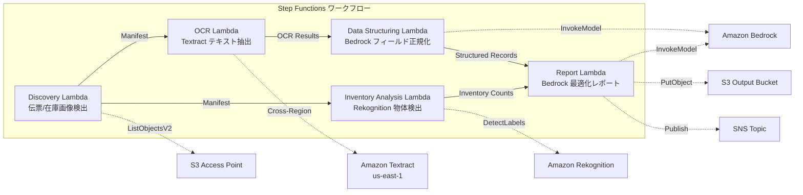

# UC12: 물류 / 공급망 — 배송 전표 OCR 및 창고 재고 이미지 분석

🌐 **Language / 言語**: [日本語](README.md) | [English](README.en.md) | 한국어 | [简体中文](README.zh-CN.md) | [繁體中文](README.zh-TW.md) | [Français](README.fr.md) | [Deutsch](README.de.md) | [Español](README.es.md)

## 개요
FSx for NetApp ONTAP의 S3 액세스 포인트를 활용하여 배송 전표의 OCR 텍스트 추출, 창고 재고 이미지의 물체 감지 및 카운트, 배송 경로 최적화 보고서 생성을 자동화하는 서버리스 워크플로우입니다.
### 이 패턴이 적합한 경우
- 배송 전표 이미지와 창고 재고 이미지가 FSx ONTAP에 축적되어 있습니다.
- Textract를 사용하여 배송 전표의 OCR(발송인, 수령인, 추적 번호, 품목)를 자동화하고 싶습니다.
- Bedrock을 사용하여 추출 필드의 정규화와 구조화된 배송 레코드 생성이 필요합니다.
- Rekognition을 사용하여 창고 재고 이미지의 물체 감지 및 카운트(팔레트, 상자, 선반 점유율)를 수행하고 싶습니다.
- 배송 경로 최적화 보고서를 자동으로 생성하고 싶습니다.
### 이 패턴이 적합하지 않은 경우
- 실시간 배송 추적 시스템이 필요합니다
- 대규모 WMS(Warehouse Management System)와의 직접 통합이 필요합니다
- 전체 배송 경로 최적화 엔진(전용 소프트웨어가 적합)
- ONTAP REST API에 대한 네트워크 연결이 불가능한 환경
### 주요 기능
- S3 AP 경로를 통한 배송 전표 이미지(.jpg,.jpeg,.png,.tiff,.pdf) 및 창고 재고 이미지 자동 검출
- Textract(크로스 리전)을 통한 배송 전표 OCR(텍스트 및 양식 추출)
- 낮은 신뢰도 결과의 수동 검증 플래그 설정
- Bedrock을 통한 추출 필드 정규화 및 구조화된 배송 레코드 생성
- Rekognition을 통한 창고 재고 이미지의 물체 감지 및 카운트
- Bedrock을 통한 배송 경로 최적화 보고서 생성
## 아키텍처



### 워크플로우 단계
1. **검색**: S3 AP에서 배송 전표 이미지와 창고 재고 이미지 검색
2. **OCR**: Textract(크로스 리전)으로 배송 전표에서 텍스트 및 양식 추출
3. **데이터 구조화**: Bedrock으로 추출 필드를 정규화하고 구조화된 배송 레코드 생성
4. **재고 분석**: Rekognition으로 창고 재고 이미지의 물체 검출 및 카운트
5. **보고서**: Bedrock으로 배송 경로 최적화 보고서 생성 및 S3 출력 + SNS 알림
## 전제 조건
- AWS 계정과 적절한 IAM 권한
- NetApp ONTAP용 FSx 파일 시스템(ONTAP 9.17.1P4D3 이상)
- S3 Access Point가 활성화된 볼륨(배송 전단 및 재고 이미지 저장)
- VPC, 프라이빗 서브넷
- Amazon Bedrock 모델 액세스 활성화(Claude / Nova)
- **크로스 리전**: Textract가 ap-northeast-1을 지원하지 않으므로, us-east-1로의 크로스 리전 호출이 필요함
## 배포 절차

### 1. 크로스 리전 파라미터 확인
Textract는 도쿄 리전을 지원하지 않으므로, `CrossRegionTarget` 파라미터를 사용하여 크로스 리전 호출을 설정합니다.
### 2. CloudFormation 배포

```bash
aws cloudformation deploy \
  --template-file logistics-ocr/template.yaml \
  --stack-name fsxn-logistics-ocr \
  --parameter-overrides \
    S3AccessPointAlias=<your-volume-ext-s3alias> \
    S3AccessPointName=<your-s3ap-name> \
    VpcId=<your-vpc-id> \
    PrivateSubnetIds=<subnet-1>,<subnet-2> \
    ScheduleExpression="rate(1 hour)" \
    NotificationEmail=<your-email@example.com> \
    CrossRegionTarget=us-east-1 \
    EnableVpcEndpoints=false \
    EnableCloudWatchAlarms=false \
  --capabilities CAPABILITY_IAM CAPABILITY_AUTO_EXPAND \
  --region ap-northeast-1
```

## 설정 파라미터 목록

| パラメータ | 説明 | デフォルト | 必須 |
|-----------|------|----------|------|
| `S3AccessPointAlias` | FSx ONTAP S3 AP Alias（入力用） | — | ✅ |
| `S3AccessPointName` | S3 AP 名（ARN ベースの IAM 権限付与用。省略時は Alias ベースのみ） | `""` | ⚠️ 推奨 |
| `ScheduleExpression` | EventBridge Scheduler のスケジュール式 | `rate(1 hour)` | |
| `VpcId` | VPC ID | — | ✅ |
| `PrivateSubnetIds` | プライベートサブネット ID リスト | — | ✅ |
| `NotificationEmail` | SNS 通知先メールアドレス | — | ✅ |
| `CrossRegionTarget` | Textract のターゲットリージョン | `us-east-1` | |
| `MapConcurrency` | Map ステートの並列実行数 | `10` | |
| `LambdaMemorySize` | Lambda メモリサイズ (MB) | `512` | |
| `LambdaTimeout` | Lambda タイムアウト (秒) | `300` | |
| `EnableVpcEndpoints` | Interface VPC Endpoints の有効化 | `false` | |
| `EnableCloudWatchAlarms` | CloudWatch Alarms の有効化 | `false` | |
| `EnableSnapStart` | Lambda SnapStart 활성화 (콜드 스타트 단축) | `false` | |

## 정리

```bash
aws s3 rm s3://fsxn-logistics-ocr-output-${AWS_ACCOUNT_ID} --recursive

aws cloudformation delete-stack \
  --stack-name fsxn-logistics-ocr \
  --region ap-northeast-1

aws cloudformation wait stack-delete-complete \
  --stack-name fsxn-logistics-ocr \
  --region ap-northeast-1
```

## 지원되는 리전
UC12는 다음 서비스를 사용합니다:
| サービス | リージョン制約 |
|---------|-------------|
| Amazon Textract | ap-northeast-1 非対応。`TEXTRACT_REGION` パラメータで対応リージョン（us-east-1 等）を指定 |
| Amazon Rekognition | ほぼ全リージョンで利用可能 |
| Amazon Bedrock | 対応リージョンを確認（[Bedrock 対応リージョン](https://docs.aws.amazon.com/general/latest/gr/bedrock.html)） |
| AWS X-Ray | ほぼ全リージョンで利用可能 |
| CloudWatch EMF | ほぼ全リージョンで利用可能 |
> Cross-Region Client을 통해 Textract API를 호출합니다. 데이터 거주지 요건을 확인하세요. 자세한 내용은 [리전 호환성 매트릭스](../docs/region-compatibility.md)를 참조하세요.
## 참조 링크
- [FSx ONTAP S3 액세스 포인트 개요](https://docs.aws.amazon.com/fsx/latest/ONTAPGuide/accessing-data-via-s3-access-points.html)
- [Amazon Textract 문서](https://docs.aws.amazon.com/textract/latest/dg/what-is.html)
- [Amazon Rekognition 레이블 감지](https://docs.aws.amazon.com/rekognition/latest/dg/labels.html)
- [Amazon Bedrock API 참조](https://docs.aws.amazon.com/bedrock/latest/APIReference/API_runtime_InvokeModel.html)