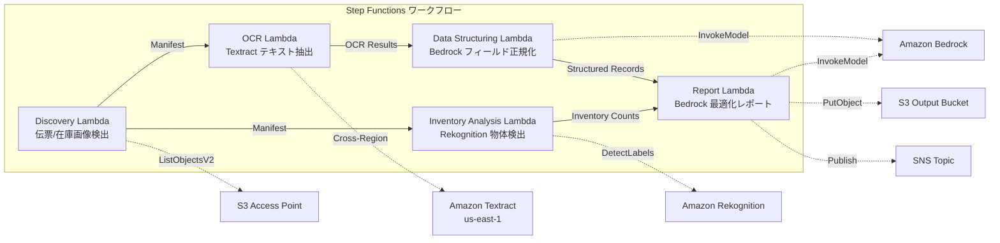

# UC12: 物流 / サプライチェーン — 配送伝票 OCR・倉庫在庫画像分析

## 概要

FSx for NetApp ONTAP の S3 Access Points を活用し、配送伝票の OCR テキスト抽出、倉庫在庫画像の物体検出・カウント、配送ルート最適化レポート生成を自動化するサーバーレスワークフローです。

### このパターンが適しているケース

- 配送伝票画像や倉庫在庫画像が FSx ONTAP 上に蓄積されている
- Textract による配送伝票の OCR（送り主、受取人、追跡番号、品目）を自動化したい
- Bedrock による抽出フィールドの正規化と構造化配送レコード生成が必要
- Rekognition による倉庫在庫画像の物体検出・カウント（パレット、箱、棚占有率）を実施したい
- 配送ルート最適化レポートを自動生成したい

### このパターンが適さないケース

- リアルタイムの配送追跡システムが必要
- 大規模な WMS（Warehouse Management System）との直接統合が必要
- 完全な配送ルート最適化エンジン（専用ソフトウェアが適切）
- ONTAP REST API へのネットワーク到達性が確保できない環境

### 主な機能

- S3 AP 経由で配送伝票画像（.jpg, .jpeg, .png, .tiff, .pdf）と倉庫在庫画像を自動検出
- Textract（クロスリージョン）による配送伝票 OCR（テキスト・フォーム抽出）
- 低信頼度結果の手動検証フラグ設定
- Bedrock による抽出フィールド正規化と構造化配送レコード生成
- Rekognition による倉庫在庫画像の物体検出・カウント
- Bedrock による配送ルート最適化レポート生成

## アーキテクチャ



### ワークフローステップ

1. **Discovery**: S3 AP から配送伝票画像と倉庫在庫画像を検出
2. **OCR**: Textract（クロスリージョン）で配送伝票からテキスト・フォーム抽出
3. **Data Structuring**: Bedrock で抽出フィールドを正規化し、構造化配送レコードを生成
4. **Inventory Analysis**: Rekognition で倉庫在庫画像の物体検出・カウント
5. **Report**: Bedrock で配送ルート最適化レポートを生成し、S3 出力 + SNS 通知

## 前提条件

- AWS アカウントと適切な IAM 権限
- FSx for NetApp ONTAP ファイルシステム（ONTAP 9.17.1P4D3 以上）
- S3 Access Point が有効化されたボリューム（配送伝票・在庫画像を格納）
- VPC、プライベートサブネット
- Amazon Bedrock モデルアクセスが有効（Claude / Nova）
- **クロスリージョン**: Textract は ap-northeast-1 非対応のため、us-east-1 へのクロスリージョン呼び出しが必要

## デプロイ手順

### 1. クロスリージョンパラメータの確認

Textract は東京リージョン非対応のため、`CrossRegionTarget` パラメータでクロスリージョン呼び出しを設定します。

### 2. CloudFormation デプロイ

```bash
aws cloudformation deploy \
  --template-file logistics-ocr/template.yaml \
  --stack-name fsxn-logistics-ocr \
  --parameter-overrides \
    S3AccessPointAlias=<your-volume-ext-s3alias> \
    VpcId=<your-vpc-id> \
    PrivateSubnetIds=<subnet-1>,<subnet-2> \
    ScheduleExpression="rate(1 hour)" \
    NotificationEmail=<your-email@example.com> \
    CrossRegionTarget=us-east-1 \
    EnableVpcEndpoints=false \
    EnableCloudWatchAlarms=false \
  --capabilities CAPABILITY_IAM CAPABILITY_AUTO_EXPAND \
  --region ap-northeast-1
```

## 設定パラメータ一覧

| パラメータ | 説明 | デフォルト | 必須 |
|-----------|------|----------|------|
| `S3AccessPointAlias` | FSx ONTAP S3 AP Alias（入力用） | — | ✅ |
| `ScheduleExpression` | EventBridge Scheduler のスケジュール式 | `rate(1 hour)` | |
| `VpcId` | VPC ID | — | ✅ |
| `PrivateSubnetIds` | プライベートサブネット ID リスト | — | ✅ |
| `NotificationEmail` | SNS 通知先メールアドレス | — | ✅ |
| `CrossRegionTarget` | Textract のターゲットリージョン | `us-east-1` | |
| `MapConcurrency` | Map ステートの並列実行数 | `10` | |
| `LambdaMemorySize` | Lambda メモリサイズ (MB) | `512` | |
| `LambdaTimeout` | Lambda タイムアウト (秒) | `300` | |
| `EnableVpcEndpoints` | Interface VPC Endpoints の有効化 | `false` | |
| `EnableCloudWatchAlarms` | CloudWatch Alarms の有効化 | `false` | |

## クリーンアップ

```bash
aws s3 rm s3://fsxn-logistics-ocr-output-${AWS_ACCOUNT_ID} --recursive

aws cloudformation delete-stack \
  --stack-name fsxn-logistics-ocr \
  --region ap-northeast-1

aws cloudformation wait stack-delete-complete \
  --stack-name fsxn-logistics-ocr \
  --region ap-northeast-1
```

## 参考リンク

- [FSx ONTAP S3 Access Points 概要](https://docs.aws.amazon.com/fsx/latest/ONTAPGuide/accessing-data-via-s3-access-points.html)
- [Amazon Textract ドキュメント](https://docs.aws.amazon.com/textract/latest/dg/what-is.html)
- [Amazon Rekognition ラベル検出](https://docs.aws.amazon.com/rekognition/latest/dg/labels.html)
- [Amazon Bedrock API リファレンス](https://docs.aws.amazon.com/bedrock/latest/APIReference/API_runtime_InvokeModel.html)
