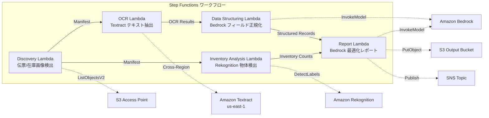

# UC12: 物流 / 供应链 — 配送单OCR和仓库库存图像分析

🌐 **Language / 言語**: [日本語](README.md) | [English](README.en.md) | [한국어](README.ko.md) | 简体中文 | [繁體中文](README.zh-TW.md) | [Français](README.fr.md) | [Deutsch](README.de.md) | [Español](README.es.md)

## 概述
利用 FSx for NetApp ONTAP 的 S3 Access Points，自动化无服务器工作流，实现运输单 OCR 文本提取、仓库库存图像的物体检测与计数、以及生成配送路线优化报告。
### 此模式适用的情况
- 配送传票图像和仓库库存图像被积累在 FSx ONTAP 上
- 希望通过 Textract 自动化配送传票的 OCR（发件人、收件人、追踪号、物品）
- 需要通过 Bedrock 实现提取字段的规范化和生成结构化的配送记录
- 希望通过 Rekognition 实现仓库库存图像的物体检测和计数（托盘、箱子、货架占用率）
- 希望自动生成配送路线优化报告
### 不适用的情况

在某些情况下，这种模式可能不适用。例如，如果您正在使用 Amazon Bedrock 或 AWS Step Functions，您可能需要采用不同的方法。此外，如果您在 Amazon Athena 或 Amazon S3 中处理大量数据，AWS Lambda 函数可能无法处理所有请求。在这些情况下，您可能需要使用其他 AWS 服务，例如 Amazon FSx for NetApp ONTAP 或 Amazon CloudWatch，以确保系统的可靠性和性能。同时，在使用 AWS CloudFormation 时，您可能需要考虑特定的技术术语，例如 GDSII、DRC、OASIS、GDS、Lambda 和 tapeout。在处理文件路径和 URL 时，请确保保持其不变。
- 需要实时配送跟踪系统
- 需要与大型 WMS（仓库管理系统）直接集成
- 完整的配送路线优化引擎（专用软件最合适）
- 环境中无法确保对 ONTAP REST API 的网络访问
### 主要功能
- 通过 S3 AP 自动检测配送单图像（.jpg,.jpeg,.png,.tiff,.pdf）和仓库库存图像
- 使用 Textract（跨区域）进行配送单 OCR（文本和表单提取）
- 设置低可信度结果的手动验证标志
- 使用 Bedrock 对提取字段进行规范化和生成结构化配送记录
- 使用 Rekognition 对仓库库存图像进行物体检测和计数
- 使用 Bedrock 生成配送路由优化报告
## 架构



### 工作流程步骤

在此工作流程步骤中，我们将使用Amazon Bedrock来创建和管理设计。确保在使用前已经配置好AWS Step Functions和Amazon Athena。您可以通过Amazon S3存储和检索设计文件。AWS Lambda将用于自动化特定任务，如验证和优化。Amazon FSx for NetApp ONTAP提供了高性能的文件存储，适合存储大型设计文件。使用Amazon CloudWatch监控工作流程的性能和状态，并使用AWS CloudFormation来管理基础设施即代码（IaC）。确保所有设计文件符合GDSII和DRC标准，并且已经完成tapeout过程。在使用OASIS和GDS时，请注意相关的Lambda函数和其他技术术语。
1. **发现**：从 S3 AP 检测出货单图像和仓库库存图像
2. **OCR**：使用 Textract（跨区域）从出货单中提取文本和表单
3. **数据结构化**：使用 Bedrock 规范化提取字段，生成结构化的配送记录
4. **库存分析**：使用 Rekognition 检测和计数仓库库存图像中的物体
5. **报告**：使用 Bedrock 生成配送路径优化报告，S3 输出 + SNS 通知
## 前提条件
- AWS 账户和适当的 IAM 权限
- FSx for NetApp ONTAP 文件系统（ONTAP 9.17.1P4D3 及以上版本）
- 已启用 S3 Access Point 的卷（用于存储运输单和库存图片）
- VPC、私有子网
- Amazon Bedrock 模型访问已启用（Claude / Nova）
- **跨地区**：由于 Textract 不支持 ap-northeast-1，因此需要跨地区调用 us-east-1
## 部署步骤

### 1. 跨区域参数的确认
Textract 不支持东京区域，因此请使用 `CrossRegionTarget` 参数设置跨区域调用。
### 2. CloudFormation 部署

```bash
aws cloudformation deploy \
  --template-file logistics-ocr/template.yaml \
  --stack-name fsxn-logistics-ocr \
  --parameter-overrides \
    S3AccessPointAlias=<your-volume-ext-s3alias> \
    S3AccessPointName=<your-s3ap-name> \
    VpcId=<your-vpc-id> \
    PrivateSubnetIds=<subnet-1>,<subnet-2> \
    ScheduleExpression="rate(1 hour)" \
    NotificationEmail=<your-email@example.com> \
    CrossRegionTarget=us-east-1 \
    EnableVpcEndpoints=false \
    EnableCloudWatchAlarms=false \
  --capabilities CAPABILITY_IAM CAPABILITY_AUTO_EXPAND \
  --region ap-northeast-1
```

## 设置参数列表

| パラメータ | 説明 | デフォルト | 必須 |
|-----------|------|----------|------|
| `S3AccessPointAlias` | FSx ONTAP S3 AP Alias（入力用） | — | ✅ |
| `S3AccessPointName` | S3 AP 名（ARN ベースの IAM 権限付与用。省略時は Alias ベースのみ） | `""` | ⚠️ 推奨 |
| `ScheduleExpression` | EventBridge Scheduler のスケジュール式 | `rate(1 hour)` | |
| `VpcId` | VPC ID | — | ✅ |
| `PrivateSubnetIds` | プライベートサブネット ID リスト | — | ✅ |
| `NotificationEmail` | SNS 通知先メールアドレス | — | ✅ |
| `CrossRegionTarget` | Textract のターゲットリージョン | `us-east-1` | |
| `MapConcurrency` | Map ステートの並列実行数 | `10` | |
| `LambdaMemorySize` | Lambda メモリサイズ (MB) | `512` | |
| `LambdaTimeout` | Lambda タイムアウト (秒) | `300` | |
| `EnableVpcEndpoints` | Interface VPC Endpoints の有効化 | `false` | |
| `EnableCloudWatchAlarms` | CloudWatch Alarms の有効化 | `false` | |
| `EnableSnapStart` | 启用 Lambda SnapStart（冷启动缩短） | `false` | |

## 清理

```bash
aws s3 rm s3://fsxn-logistics-ocr-output-${AWS_ACCOUNT_ID} --recursive

aws cloudformation delete-stack \
  --stack-name fsxn-logistics-ocr \
  --region ap-northeast-1

aws cloudformation wait stack-delete-complete \
  --stack-name fsxn-logistics-ocr \
  --region ap-northeast-1
```

## 支持的地区
UC12 使用以下服务：
| サービス | リージョン制約 |
|---------|-------------|
| Amazon Textract | ap-northeast-1 非対応。`TEXTRACT_REGION` パラメータで対応リージョン（us-east-1 等）を指定 |
| Amazon Rekognition | ほぼ全リージョンで利用可能 |
| Amazon Bedrock | 対応リージョンを確認（[Bedrock 対応リージョン](https://docs.aws.amazon.com/general/latest/gr/bedrock.html)） |
| AWS X-Ray | ほぼ全リージョンで利用可能 |
| CloudWatch EMF | ほぼ全リージョンで利用可能 |
> 通过跨区域客户端调用 Textract API。请确认数据居留要求。详情请参见 [区域兼容性矩阵](../docs/region-compatibility.md)。
## 参考链接
- [FSx ONTAP S3 访问点概述](https://docs.aws.amazon.com/fsx/latest/ONTAPGuide/accessing-data-via-s3-access-points.html)
- [Amazon Textract 文档](https://docs.aws.amazon.com/textract/latest/dg/what-is.html)
- [Amazon Rekognition 标签检测](https://docs.aws.amazon.com/rekognition/latest/dg/labels.html)
- [Amazon Bedrock API 参考](https://docs.aws.amazon.com/bedrock/latest/APIReference/API_runtime_InvokeModel.html)