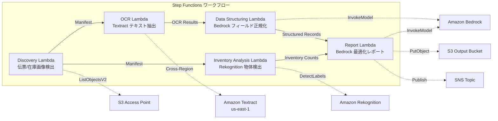

# UC12：物流 / 供應鏈 — 配送單據 OCR 與倉庫庫存影像分析

🌐 **Language / 言語**: [日本語](README.md) | [English](README.en.md) | [한국어](README.ko.md) | [简体中文](README.zh-CN.md) | 繁體中文 | [Français](README.fr.md) | [Deutsch](README.de.md) | [Español](README.es.md)

## 概覽
利用 FSx for NetApp ONTAP 的 S3 Access Points，自動化無伺服器工作流程，用於運輸票據的 OCR 文字提取、倉庫庫存圖像的物體檢測與計數、以及運輸路線優化報告生成。
### 此模式適用的情況
- 配送傳票影像和倉庫庫存影像已在 FSx ONTAP 上累積
- 希望自動化 Textract 對配送傳票的 OCR（寄件人、收件人、跟踪號碼、物品）
- 需要 Bedrock 進行提取欄位的標準化和結構化配送記錄生成
- 希望使用 Rekognition 對倉庫庫存影像進行物體檢測和計數（托盤、箱子、貨架佔用率）
- 希望自動生成配送路線優化報告
### 此模式不適用的情況
- 需要實時配送追蹤系統
- 需要與大型 WMS（倉庫管理系統）直接整合
- 需要完整的配送路由最佳化引擎（專用軟體適合）
- 環境無法確保對 ONTAP REST API 的網路存取
### 主要功能
- 透過 S3 AP 自動檢測送貨單影像（.jpg,.jpeg,.png,.tiff,.pdf）及倉庫庫存影像
- 透過 Textract（跨區域）進行送貨單 OCR（文字與表單抽取）
- 設定低信任度結果的手動檢查旗標
- 透過 Bedrock 進行擷取欄位規範化及生成結構化送貨記錄
- 透過 Rekognition 進行倉庫庫存影像的物件檢測與計數
- 透過 Bedrock 生成送貨路線最佳化報告
## 架構



### 工作流程步驟
1. **發現**：從 S3 AP 檢測發貨單影像和倉庫庫存影像
2. **OCR**：使用 Textract（跨區域）從發貨單中提取文本和表單
3. **資料結構化**：使用 Bedrock 規範化提取的欄位，生成結構化的發貨記錄
4. **庫存分析**：使用 Rekognition 檢測和計數倉庫庫存影像中的物件
5. **報告**：使用 Bedrock 生成發貨路由最佳化報告，S3 輸出 + SNS 通知
## 前提條件
- AWS 帳戶和適當的 IAM 權限
- FSx for NetApp ONTAP 文件系統（ONTAP 9.17.1P4D3 或更高版本）
- 已啟用 S3 訪問點的卷（用於存儲運單和庫存圖像）
- VPC、私有子網
- Amazon Bedrock 模型訪問已啟用（Claude / Nova）
- **跨區域**：由於 Textract 不支援 ap-northeast-1，因此需要跨區域呼叫 us-east-1
## 部署步驟

### 1. 確認跨區域參數
Textract 不支援東京區域，因此請使用 `CrossRegionTarget` 參數設定跨區域呼叫。
### 2. CloudFormation 部署

```bash
aws cloudformation deploy \
  --template-file logistics-ocr/template.yaml \
  --stack-name fsxn-logistics-ocr \
  --parameter-overrides \
    S3AccessPointAlias=<your-volume-ext-s3alias> \
    S3AccessPointName=<your-s3ap-name> \
    VpcId=<your-vpc-id> \
    PrivateSubnetIds=<subnet-1>,<subnet-2> \
    ScheduleExpression="rate(1 hour)" \
    NotificationEmail=<your-email@example.com> \
    CrossRegionTarget=us-east-1 \
    EnableVpcEndpoints=false \
    EnableCloudWatchAlarms=false \
  --capabilities CAPABILITY_IAM CAPABILITY_AUTO_EXPAND \
  --region ap-northeast-1
```

## 設定參數列表

| パラメータ | 説明 | デフォルト | 必須 |
|-----------|------|----------|------|
| `S3AccessPointAlias` | FSx ONTAP S3 AP Alias（入力用） | — | ✅ |
| `S3AccessPointName` | S3 AP 名（ARN ベースの IAM 権限付与用。省略時は Alias ベースのみ） | `""` | ⚠️ 推奨 |
| `ScheduleExpression` | EventBridge Scheduler のスケジュール式 | `rate(1 hour)` | |
| `VpcId` | VPC ID | — | ✅ |
| `PrivateSubnetIds` | プライベートサブネット ID リスト | — | ✅ |
| `NotificationEmail` | SNS 通知先メールアドレス | — | ✅ |
| `CrossRegionTarget` | Textract のターゲットリージョン | `us-east-1` | |
| `MapConcurrency` | Map ステートの並列実行数 | `10` | |
| `LambdaMemorySize` | Lambda メモリサイズ (MB) | `512` | |
| `LambdaTimeout` | Lambda タイムアウト (秒) | `300` | |
| `EnableVpcEndpoints` | Interface VPC Endpoints の有効化 | `false` | |
| `EnableCloudWatchAlarms` | CloudWatch Alarms の有効化 | `false` | |
| `EnableSnapStart` | 啟用 Lambda SnapStart（冷啟動縮短） | `false` | |

## 清理

```bash
aws s3 rm s3://fsxn-logistics-ocr-output-${AWS_ACCOUNT_ID} --recursive

aws cloudformation delete-stack \
  --stack-name fsxn-logistics-ocr \
  --region ap-northeast-1

aws cloudformation wait stack-delete-complete \
  --stack-name fsxn-logistics-ocr \
  --region ap-northeast-1
```

## 支援的地區
UC12 使用以下服務：
| サービス | リージョン制約 |
|---------|-------------|
| Amazon Textract | ap-northeast-1 非対応。`TEXTRACT_REGION` パラメータで対応リージョン（us-east-1 等）を指定 |
| Amazon Rekognition | ほぼ全リージョンで利用可能 |
| Amazon Bedrock | 対応リージョンを確認（[Bedrock 対応リージョン](https://docs.aws.amazon.com/general/latest/gr/bedrock.html)） |
| AWS X-Ray | ほぼ全リージョンで利用可能 |
| CloudWatch EMF | ほぼ全リージョンで利用可能 |
> 透過跨區域用戶端呼叫 Textract API。請確認資料常駐要求。詳細資訊請參閱 [區域相容性矩陣](../docs/region-compatibility.md)。
## 參考連結
- [FSx for NetApp ONTAP S3 存取點概觀](https://docs.aws.amazon.com/fsx/latest/ONTAPGuide/accessing-data-via-s3-access-points.html)
- [Amazon Textract 文件](https://docs.aws.amazon.com/textract/latest/dg/what-is.html)
- [Amazon Rekognition 標籤檢測](https://docs.aws.amazon.com/rekognition/latest/dg/labels.html)
- [Amazon Bedrock API 參考](https://docs.aws.amazon.com/bedrock/latest/APIReference/API_runtime_InvokeModel.html)