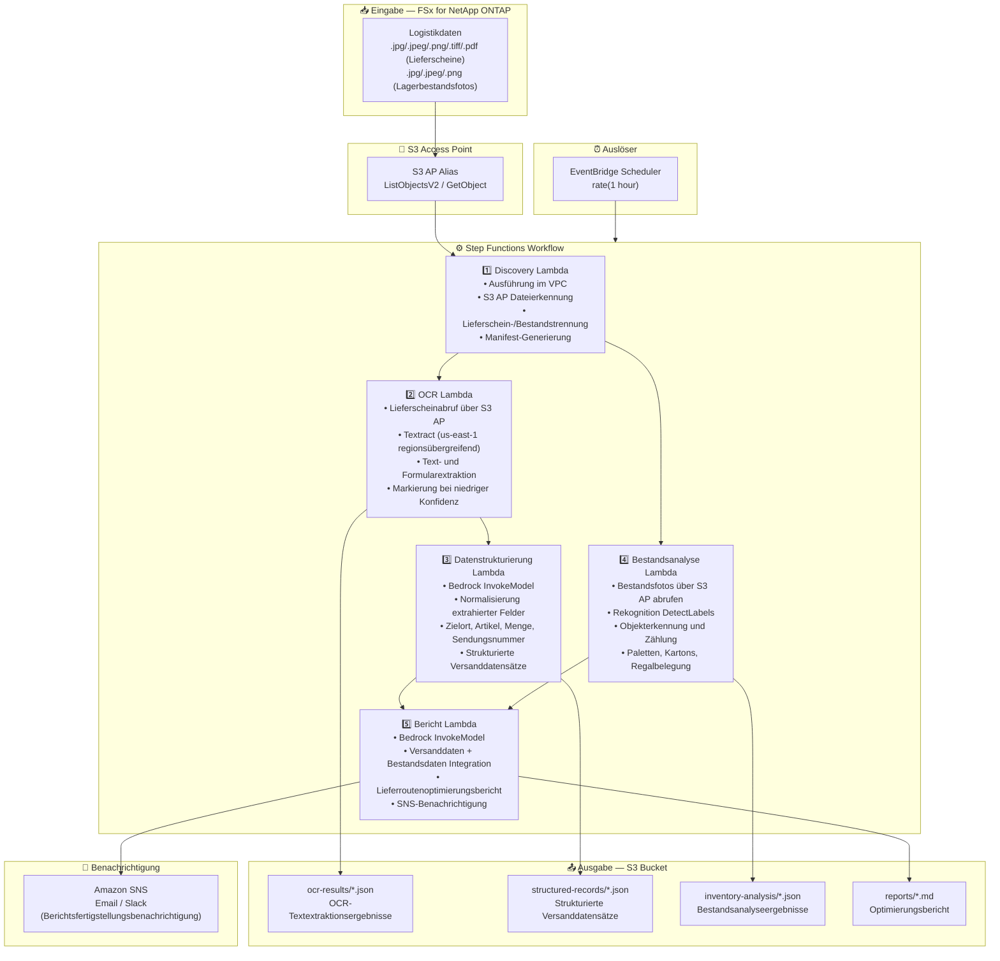

# UC12: Logistik/Lieferkette — Lieferschein-OCR und Lagerbestandsanalyse

🌐 **Language / 言語**: [日本語](architecture.md) | [English](architecture.en.md) | [한국어](architecture.ko.md) | [简体中文](architecture.zh-CN.md) | [繁體中文](architecture.zh-TW.md) | [Français](architecture.fr.md) | Deutsch | [Español](architecture.es.md)

## End-to-End-Architektur (Eingabe → Ausgabe)

---

## Übergeordneter Ablauf

```
┌─────────────────────────────────────────────────────────────────────────────┐
│                         FSx for NetApp ONTAP                                 │
│                                                                              │
│  /vol/logistics_data/                                                        │
│  ├── slips/2024-03/slip_001.jpg            (Shipping slip image)             │
│  ├── slips/2024-03/slip_002.png            (Shipping slip image)             │
│  ├── slips/2024-03/slip_003.pdf            (Shipping slip PDF)               │
│  ├── inventory/warehouse_A/shelf_01.jpeg   (Warehouse inventory photo)       │
│  └── inventory/warehouse_B/shelf_02.png    (Warehouse inventory photo)       │
│                                                                              │
└──────────────────────────────────┬───────────────────────────────────────────┘
                                   │
                                   ▼
┌──────────────────────────────────────────────────────────────────────────────┐
│                      S3 Access Point (Data Path)                              │
│                                                                              │
│  Alias: fsxn-logistics-vol-ext-s3alias                                       │
│  • ListObjectsV2 (slip image & inventory photo discovery)                    │
│  • GetObject (image & PDF retrieval)                                         │
│  • No NFS/SMB mount required from Lambda                                     │
│                                                                              │
└──────────────────────────────────┬───────────────────────────────────────────┘
                                   │
                                   ▼
┌──────────────────────────────────────────────────────────────────────────────┐
│                    EventBridge Scheduler (Trigger)                            │
│                                                                              │
│  Schedule: rate(1 hour) — configurable                                       │
│  Target: Step Functions State Machine                                        │
│                                                                              │
└──────────────────────────────────┬───────────────────────────────────────────┘
                                   │
                                   ▼
┌──────────────────────────────────────────────────────────────────────────────┐
│                    AWS Step Functions (Orchestration)                         │
│                                                                              │
│  ┌─────────────┐    ┌──────────────────────┐    ┌────────────────────┐      │
│  │  Discovery   │───▶│  OCR                 │───▶│  Data Structuring  │      │
│  │  Lambda      │    │  Lambda              │    │  Lambda            │      │
│  │             │    │                      │    │                   │      │
│  │  • VPC内     │    │  • Textract          │    │  • Bedrock         │      │
│  │  • S3 AP List│    │  • Text extraction   │    │  • Field normaliz  │      │
│  │  • Slips/Inv │    │  • Form analysis     │    │  • Structured rec  │      │
│  └──────┬──────┘    └──────────────────────┘    └────────────────────┘      │
│         │                                                    │               │
│         │            ┌──────────────────────┐                │               │
│         └───────────▶│  Inventory Analysis  │                │               │
│                      │  Lambda              │                ▼               │
│                      │                      │    ┌────────────────────┐      │
│                      │  • Rekognition       │───▶│  Report            │      │
│                      │  • Object detection  │    │  Lambda            │      │
│                      │  • Inventory count   │    │                   │      │
│                      └──────────────────────┘    │  • Bedrock         │      │
│                                                  │  • Optimization    │      │
│                                                  │    report          │      │
│                                                  │  • SNS notification│      │
│                                                  └────────────────────┘      │
│                                                                              │
└──────────────────────────────────────────────────────────────────────────────┘
                                   │
                                   ▼
┌──────────────────────────────────────────────────────────────────────────────┐
│                         Output (S3 Bucket)                                    │
│                                                                              │
│  s3://{stack}-output-{account}/                                              │
│  ├── ocr-results/YYYY/MM/DD/                                                 │
│  │   ├── slip_001_ocr.json                 ← OCR text extraction results    │
│  │   └── slip_002_ocr.json                                                   │
│  ├── structured-records/YYYY/MM/DD/                                          │
│  │   ├── slip_001_record.json              ← Structured shipping records    │
│  │   └── slip_002_record.json                                                │
│  ├── inventory-analysis/YYYY/MM/DD/                                          │
│  │   ├── warehouse_A_shelf_01.json         ← Inventory analysis results     │
│  │   └── warehouse_B_shelf_02.json                                           │
│  └── reports/YYYY/MM/DD/                                                     │
│      └── logistics_report.md               ← Delivery route optimization    │
│                                                                              │
└──────────────────────────────────────────────────────────────────────────────┘
```

---

## Mermaid-Diagramm



---

## Datenfluss im Detail

### Eingabe
| Element | Beschreibung |
|---------|--------------|
| **Quelle** | FSx for NetApp ONTAP Volume |
| **Dateitypen** | .jpg/.jpeg/.png/.tiff/.pdf (Lieferscheine), .jpg/.jpeg/.png (Lagerbestandsfotos) |
| **Zugriffsmethode** | S3 Access Point (ListObjectsV2 + GetObject) |
| **Lesestrategie** | Vollständiger Bild-/PDF-Abruf (erforderlich für Textract / Rekognition) |

### Verarbeitung
| Schritt | Service | Funktion |
|---------|---------|----------|
| Erkennung | Lambda (VPC) | Erkennung von Lieferscheinbildern und Bestandsfotos über S3 AP, Manifest-Generierung nach Typ |
| OCR | Lambda + Textract | Lieferschein-Text- und Formularextraktion (Absender, Empfänger, Sendungsnummer, Artikel) |
| Datenstrukturierung | Lambda + Bedrock | Normalisierung extrahierter Felder, Generierung strukturierter Versanddatensätze (Zielort, Artikel, Menge usw.) |
| Bestandsanalyse | Lambda + Rekognition | Objekterkennung und Zählung auf Lagerbestandsbildern (Paletten, Kartons, Regalbelegung) |
| Bericht | Lambda + Bedrock | Integration von Versand- und Bestandsdaten für Lieferroutenoptimierungsbericht |

### Ausgabe
| Artefakt | Format | Beschreibung |
|----------|--------|--------------|
| OCR-Ergebnisse | `ocr-results/YYYY/MM/DD/{slip}_ocr.json` | Textract-Textextraktionsergebnisse (mit Konfidenzwerten) |
| Strukturierte Datensätze | `structured-records/YYYY/MM/DD/{slip}_record.json` | Strukturierte Versanddatensätze (Zielort, Artikel, Menge, Sendungsnummer) |
| Bestandsanalyse | `inventory-analysis/YYYY/MM/DD/{warehouse}_{shelf}.json` | Bestandsanalyseergebnisse (Objektanzahl, Regalbelegung) |
| Logistikbericht | `reports/YYYY/MM/DD/logistics_report.md` | Von Bedrock generierter Lieferroutenoptimierungsbericht |
| SNS-Benachrichtigung | Email | Berichtsfertigstellungsbenachrichtigung |

---

## Wichtige Designentscheidungen

1. **Parallelverarbeitung (OCR + Bestandsanalyse)** — Lieferschein-OCR und Lagerbestandsanalyse sind unabhängig; Parallelisierung über Step Functions Parallel State
2. **Textract regionsübergreifend** — Textract nur in us-east-1 verfügbar; regionsübergreifender Aufruf wird verwendet
3. **Feldnormalisierung durch Bedrock** — Normalisiert unstrukturierten OCR-Text über Bedrock zur Generierung strukturierter Versanddatensätze
4. **Bestandszählung durch Rekognition** — DetectLabels zur Objekterkennung, automatische Berechnung der Paletten-/Karton-/Regalbelegungsraten
5. **Verwaltung von Markierungen bei niedriger Konfidenz** — Manuelle Überprüfungsmarkierung wird gesetzt, wenn Textract-Konfidenzwerte unter dem Schwellenwert liegen
6. **Polling (nicht ereignisgesteuert)** — S3 AP unterstützt keine Ereignisbenachrichtigungen, daher wird eine periodische geplante Ausführung verwendet

---

## Verwendete AWS-Services

| Service | Rolle |
|---------|-------|
| FSx for NetApp ONTAP | Speicherung von Lieferscheinen und Lagerbestandsbildern |
| S3 Access Points | Serverloser Zugriff auf ONTAP-Volumes |
| EventBridge Scheduler | Periodischer Auslöser |
| Step Functions | Workflow-Orchestrierung (Unterstützung paralleler Pfade) |
| Lambda | Compute (Discovery, OCR, Datenstrukturierung, Bestandsanalyse, Bericht) |
| Amazon Textract | Lieferschein-OCR-Text- und Formularextraktion (us-east-1 regionsübergreifend) |
| Amazon Rekognition | Objekterkennung und Zählung auf Lagerbestandsbildern (DetectLabels) |
| Amazon Bedrock | Feldnormalisierung und Optimierungsberichtgenerierung (Claude / Nova) |
| SNS | Berichtsfertigstellungsbenachrichtigung |
| Secrets Manager | Verwaltung der ONTAP REST API-Anmeldeinformationen |
| CloudWatch + X-Ray | Observability |
