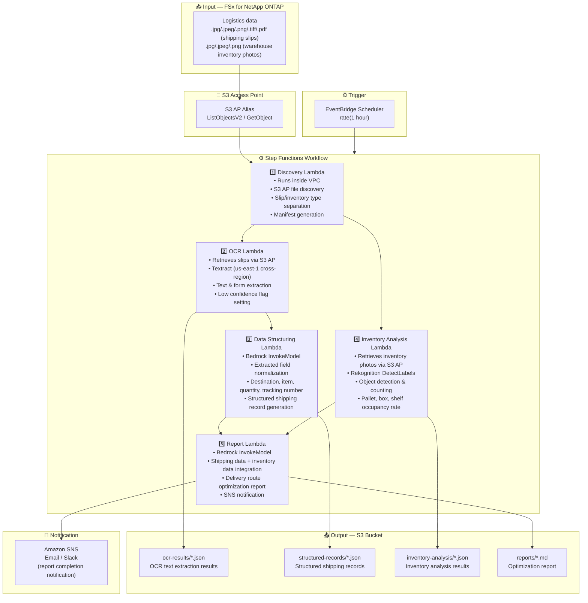

# UC12: Logistics / Supply Chain — Shipping Slip OCR & Warehouse Inventory Image Analysis

🌐 **Language / 言語**: [日本語](architecture.md) | English | [한국어](architecture.ko.md) | [简体中文](architecture.zh-CN.md) | [繁體中文](architecture.zh-TW.md) | [Français](architecture.fr.md) | [Deutsch](architecture.de.md) | [Español](architecture.es.md)

## End-to-End Architecture (Input → Output)

---

## High-Level Flow

```
┌─────────────────────────────────────────────────────────────────────────────┐
│                         FSx for NetApp ONTAP                                 │
│                                                                              │
│  /vol/logistics_data/                                                        │
│  ├── slips/2024-03/slip_001.jpg            (Shipping slip image)             │
│  ├── slips/2024-03/slip_002.png            (Shipping slip image)             │
│  ├── slips/2024-03/slip_003.pdf            (Shipping slip PDF)               │
│  ├── inventory/warehouse_A/shelf_01.jpeg   (Warehouse inventory photo)       │
│  └── inventory/warehouse_B/shelf_02.png    (Warehouse inventory photo)       │
│                                                                              │
└──────────────────────────────────┬───────────────────────────────────────────┘
                                   │
                                   ▼
┌──────────────────────────────────────────────────────────────────────────────┐
│                      S3 Access Point (Data Path)                              │
│                                                                              │
│  Alias: fsxn-logistics-vol-ext-s3alias                                       │
│  • ListObjectsV2 (slip image & inventory photo discovery)                    │
│  • GetObject (image & PDF retrieval)                                         │
│  • No NFS/SMB mount required from Lambda                                     │
│                                                                              │
└──────────────────────────────────┬───────────────────────────────────────────┘
                                   │
                                   ▼
┌──────────────────────────────────────────────────────────────────────────────┐
│                    EventBridge Scheduler (Trigger)                            │
│                                                                              │
│  Schedule: rate(1 hour) — configurable                                       │
│  Target: Step Functions State Machine                                        │
│                                                                              │
└──────────────────────────────────┬───────────────────────────────────────────┘
                                   │
                                   ▼
┌──────────────────────────────────────────────────────────────────────────────┐
│                    AWS Step Functions (Orchestration)                         │
│                                                                              │
│  ┌─────────────┐    ┌──────────────────────┐    ┌────────────────────┐      │
│  │  Discovery   │───▶│  OCR                 │───▶│  Data Structuring  │      │
│  │  Lambda      │    │  Lambda              │    │  Lambda            │      │
│  │             │    │                      │    │                   │      │
│  │  • VPC内     │    │  • Textract          │    │  • Bedrock         │      │
│  │  • S3 AP List│    │  • Text extraction   │    │  • Field normaliz  │      │
│  │  • Slips/Inv │    │  • Form analysis     │    │  • Structured rec  │      │
│  └──────┬──────┘    └──────────────────────┘    └────────────────────┘      │
│         │                                                    │               │
│         │            ┌──────────────────────┐                │               │
│         └───────────▶│  Inventory Analysis  │                │               │
│                      │  Lambda              │                ▼               │
│                      │                      │    ┌────────────────────┐      │
│                      │  • Rekognition       │───▶│  Report            │      │
│                      │  • Object detection  │    │  Lambda            │      │
│                      │  • Inventory count   │    │                   │      │
│                      └──────────────────────┘    │  • Bedrock         │      │
│                                                  │  • Optimization    │      │
│                                                  │    report          │      │
│                                                  │  • SNS notification│      │
│                                                  └────────────────────┘      │
│                                                                              │
└──────────────────────────────────────────────────────────────────────────────┘
                                   │
                                   ▼
┌──────────────────────────────────────────────────────────────────────────────┐
│                         Output (S3 Bucket)                                    │
│                                                                              │
│  s3://{stack}-output-{account}/                                              │
│  ├── ocr-results/YYYY/MM/DD/                                                 │
│  │   ├── slip_001_ocr.json                 ← OCR text extraction results    │
│  │   └── slip_002_ocr.json                                                   │
│  ├── structured-records/YYYY/MM/DD/                                          │
│  │   ├── slip_001_record.json              ← Structured shipping records    │
│  │   └── slip_002_record.json                                                │
│  ├── inventory-analysis/YYYY/MM/DD/                                          │
│  │   ├── warehouse_A_shelf_01.json         ← Inventory analysis results     │
│  │   └── warehouse_B_shelf_02.json                                           │
│  └── reports/YYYY/MM/DD/                                                     │
│      └── logistics_report.md               ← Delivery route optimization    │
│                                                                              │
└──────────────────────────────────────────────────────────────────────────────┘
```

---

## Mermaid Diagram



---

## Data Flow Detail

### Input
| Item | Description |
|------|-------------|
| **Source** | FSx for NetApp ONTAP volume |
| **File Types** | .jpg/.jpeg/.png/.tiff/.pdf (shipping slips), .jpg/.jpeg/.png (warehouse inventory photos) |
| **Access Method** | S3 Access Point (ListObjectsV2 + GetObject) |
| **Read Strategy** | Full image/PDF retrieval (required for Textract / Rekognition) |

### Processing
| Step | Service | Function |
|------|---------|----------|
| Discovery | Lambda (VPC) | Discover slip images & inventory photos via S3 AP, generate manifest by type |
| OCR | Lambda + Textract | Shipping slip text & form extraction (sender, recipient, tracking number, items) |
| Data Structuring | Lambda + Bedrock | Normalize extracted fields, generate structured shipping records (destination, item, quantity, etc.) |
| Inventory Analysis | Lambda + Rekognition | Warehouse inventory image object detection & counting (pallets, boxes, shelf occupancy) |
| Report | Lambda + Bedrock | Integrate shipping + inventory data for delivery route optimization report |

### Output
| Artifact | Format | Description |
|----------|--------|-------------|
| OCR Results | `ocr-results/YYYY/MM/DD/{slip}_ocr.json` | Textract text extraction results (with confidence scores) |
| Structured Records | `structured-records/YYYY/MM/DD/{slip}_record.json` | Structured shipping records (destination, item, quantity, tracking number) |
| Inventory Analysis | `inventory-analysis/YYYY/MM/DD/{warehouse}_{shelf}.json` | Inventory analysis results (object count, shelf occupancy) |
| Logistics Report | `reports/YYYY/MM/DD/logistics_report.md` | Bedrock-generated delivery route optimization report |
| SNS Notification | Email | Report completion notification |

---

## Key Design Decisions

1. **Parallel processing (OCR + Inventory Analysis)** — Shipping slip OCR and warehouse inventory analysis are independent; parallelized via Step Functions Parallel State
2. **Textract cross-region** — Textract available only in us-east-1; cross-region invocation used
3. **Bedrock for field normalization** — Normalizes unstructured OCR text via Bedrock to generate structured shipping records
4. **Rekognition for inventory counting** — DetectLabels for object detection, automatically calculating pallet/box/shelf occupancy rates
5. **Low confidence flag management** — Manual verification flag set when Textract confidence scores fall below threshold
6. **Polling (not event-driven)** — S3 AP does not support event notifications, so periodic scheduled execution is used

---

## AWS Services Used

| Service | Role |
|---------|------|
| FSx for NetApp ONTAP | Shipping slip & warehouse inventory image storage |
| S3 Access Points | Serverless access to ONTAP volumes |
| EventBridge Scheduler | Periodic trigger |
| Step Functions | Workflow orchestration (parallel path support) |
| Lambda | Compute (Discovery, OCR, Data Structuring, Inventory Analysis, Report) |
| Amazon Textract | Shipping slip OCR text & form extraction (us-east-1 cross-region) |
| Amazon Rekognition | Warehouse inventory image object detection & counting (DetectLabels) |
| Amazon Bedrock | Field normalization & optimization report generation (Claude / Nova) |
| SNS | Report completion notification |
| Secrets Manager | ONTAP REST API credential management |
| CloudWatch + X-Ray | Observability |
