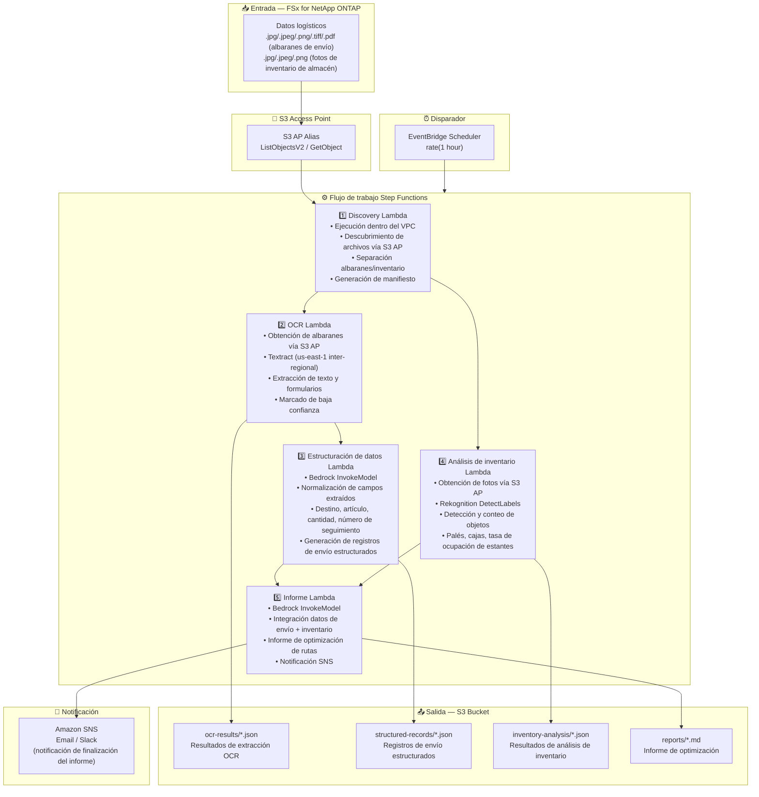

# UC12: Logística/Cadena de suministro — OCR de albaranes y análisis de inventario

🌐 **Language / 言語**: [日本語](architecture.md) | [English](architecture.en.md) | [한국어](architecture.ko.md) | [简体中文](architecture.zh-CN.md) | [繁體中文](architecture.zh-TW.md) | [Français](architecture.fr.md) | [Deutsch](architecture.de.md) | Español

## Arquitectura de extremo a extremo (Entrada → Salida)

---

## Flujo de alto nivel

```
┌─────────────────────────────────────────────────────────────────────────────┐
│                         FSx for NetApp ONTAP                                 │
│                                                                              │
│  /vol/logistics_data/                                                        │
│  ├── slips/2024-03/slip_001.jpg            (Shipping slip image)             │
│  ├── slips/2024-03/slip_002.png            (Shipping slip image)             │
│  ├── slips/2024-03/slip_003.pdf            (Shipping slip PDF)               │
│  ├── inventory/warehouse_A/shelf_01.jpeg   (Warehouse inventory photo)       │
│  └── inventory/warehouse_B/shelf_02.png    (Warehouse inventory photo)       │
│                                                                              │
└──────────────────────────────────┬───────────────────────────────────────────┘
                                   │
                                   ▼
┌──────────────────────────────────────────────────────────────────────────────┐
│                      S3 Access Point (Data Path)                              │
│                                                                              │
│  Alias: fsxn-logistics-vol-ext-s3alias                                       │
│  • ListObjectsV2 (slip image & inventory photo discovery)                    │
│  • GetObject (image & PDF retrieval)                                         │
│  • No NFS/SMB mount required from Lambda                                     │
│                                                                              │
└──────────────────────────────────┬───────────────────────────────────────────┘
                                   │
                                   ▼
┌──────────────────────────────────────────────────────────────────────────────┐
│                    EventBridge Scheduler (Trigger)                            │
│                                                                              │
│  Schedule: rate(1 hour) — configurable                                       │
│  Target: Step Functions State Machine                                        │
│                                                                              │
└──────────────────────────────────┬───────────────────────────────────────────┘
                                   │
                                   ▼
┌──────────────────────────────────────────────────────────────────────────────┐
│                    AWS Step Functions (Orchestration)                         │
│                                                                              │
│  ┌─────────────┐    ┌──────────────────────┐    ┌────────────────────┐      │
│  │  Discovery   │───▶│  OCR                 │───▶│  Data Structuring  │      │
│  │  Lambda      │    │  Lambda              │    │  Lambda            │      │
│  │             │    │                      │    │                   │      │
│  │  • VPC内     │    │  • Textract          │    │  • Bedrock         │      │
│  │  • S3 AP List│    │  • Text extraction   │    │  • Field normaliz  │      │
│  │  • Slips/Inv │    │  • Form analysis     │    │  • Structured rec  │      │
│  └──────┬──────┘    └──────────────────────┘    └────────────────────┘      │
│         │                                                    │               │
│         │            ┌──────────────────────┐                │               │
│         └───────────▶│  Inventory Analysis  │                │               │
│                      │  Lambda              │                ▼               │
│                      │                      │    ┌────────────────────┐      │
│                      │  • Rekognition       │───▶│  Report            │      │
│                      │  • Object detection  │    │  Lambda            │      │
│                      │  • Inventory count   │    │                   │      │
│                      └──────────────────────┘    │  • Bedrock         │      │
│                                                  │  • Optimization    │      │
│                                                  │    report          │      │
│                                                  │  • SNS notification│      │
│                                                  └────────────────────┘      │
│                                                                              │
└──────────────────────────────────────────────────────────────────────────────┘
                                   │
                                   ▼
┌──────────────────────────────────────────────────────────────────────────────┐
│                         Output (S3 Bucket)                                    │
│                                                                              │
│  s3://{stack}-output-{account}/                                              │
│  ├── ocr-results/YYYY/MM/DD/                                                 │
│  │   ├── slip_001_ocr.json                 ← OCR text extraction results    │
│  │   └── slip_002_ocr.json                                                   │
│  ├── structured-records/YYYY/MM/DD/                                          │
│  │   ├── slip_001_record.json              ← Structured shipping records    │
│  │   └── slip_002_record.json                                                │
│  ├── inventory-analysis/YYYY/MM/DD/                                          │
│  │   ├── warehouse_A_shelf_01.json         ← Inventory analysis results     │
│  │   └── warehouse_B_shelf_02.json                                           │
│  └── reports/YYYY/MM/DD/                                                     │
│      └── logistics_report.md               ← Delivery route optimization    │
│                                                                              │
└──────────────────────────────────────────────────────────────────────────────┘
```

---

## Diagrama Mermaid



---

## Detalle del flujo de datos

### Entrada
| Elemento | Descripción |
|----------|-------------|
| **Origen** | Volumen FSx for NetApp ONTAP |
| **Tipos de archivo** | .jpg/.jpeg/.png/.tiff/.pdf (albaranes de envío), .jpg/.jpeg/.png (fotos de inventario de almacén) |
| **Método de acceso** | S3 Access Point (ListObjectsV2 + GetObject) |
| **Estrategia de lectura** | Obtención completa de imágenes/PDF (requerido para Textract / Rekognition) |

### Procesamiento
| Paso | Servicio | Función |
|------|----------|---------|
| Descubrimiento | Lambda (VPC) | Descubrimiento de imágenes de albaranes y fotos de inventario vía S3 AP, generación de manifiesto por tipo |
| OCR | Lambda + Textract | Extracción de texto y formularios de albaranes (remitente, destinatario, número de seguimiento, artículos) |
| Estructuración de datos | Lambda + Bedrock | Normalización de campos extraídos, generación de registros de envío estructurados (destino, artículo, cantidad, etc.) |
| Análisis de inventario | Lambda + Rekognition | Detección y conteo de objetos en imágenes de inventario (palés, cajas, ocupación de estantes) |
| Informe | Lambda + Bedrock | Integración de datos de envío + inventario para informe de optimización de rutas de entrega |

### Salida
| Artefacto | Formato | Descripción |
|-----------|---------|-------------|
| Resultados OCR | `ocr-results/YYYY/MM/DD/{slip}_ocr.json` | Resultados de extracción de texto Textract (con puntuaciones de confianza) |
| Registros estructurados | `structured-records/YYYY/MM/DD/{slip}_record.json` | Registros de envío estructurados (destino, artículo, cantidad, número de seguimiento) |
| Análisis de inventario | `inventory-analysis/YYYY/MM/DD/{warehouse}_{shelf}.json` | Resultados de análisis de inventario (conteo de objetos, ocupación de estantes) |
| Informe logístico | `reports/YYYY/MM/DD/logistics_report.md` | Informe de optimización de rutas de entrega generado por Bedrock |
| Notificación SNS | Email | Notificación de finalización del informe |

---

## Decisiones de diseño clave

1. **Procesamiento paralelo (OCR + Análisis de inventario)** — El OCR de albaranes y el análisis de inventario son independientes; paralelizados mediante Step Functions Parallel State
2. **Textract inter-regional** — Textract disponible solo en us-east-1; se utiliza invocación inter-regional
3. **Normalización de campos por Bedrock** — Normaliza el texto OCR no estructurado mediante Bedrock para generar registros de envío estructurados
4. **Conteo de inventario por Rekognition** — DetectLabels para detección de objetos, cálculo automático de tasas de ocupación de palés/cajas/estantes
5. **Gestión de marcadores de baja confianza** — Se establece un marcador de verificación manual cuando las puntuaciones de confianza de Textract caen por debajo del umbral
6. **Sondeo periódico (no basado en eventos)** — S3 AP no admite notificaciones de eventos, por lo que se utiliza ejecución programada periódica

---

## Servicios AWS utilizados

| Servicio | Rol |
|----------|-----|
| FSx for NetApp ONTAP | Almacenamiento de albaranes e imágenes de inventario |
| S3 Access Points | Acceso serverless a volúmenes ONTAP |
| EventBridge Scheduler | Disparador periódico |
| Step Functions | Orquestación del flujo de trabajo (soporte de rutas paralelas) |
| Lambda | Cómputo (Discovery, OCR, Estructuración de datos, Análisis de inventario, Informe) |
| Amazon Textract | Extracción OCR de texto y formularios de albaranes (us-east-1 inter-regional) |
| Amazon Rekognition | Detección y conteo de objetos en imágenes de inventario (DetectLabels) |
| Amazon Bedrock | Normalización de campos y generación de informes de optimización (Claude / Nova) |
| SNS | Notificación de finalización del informe |
| Secrets Manager | Gestión de credenciales de la API REST de ONTAP |
| CloudWatch + X-Ray | Observabilidad |
