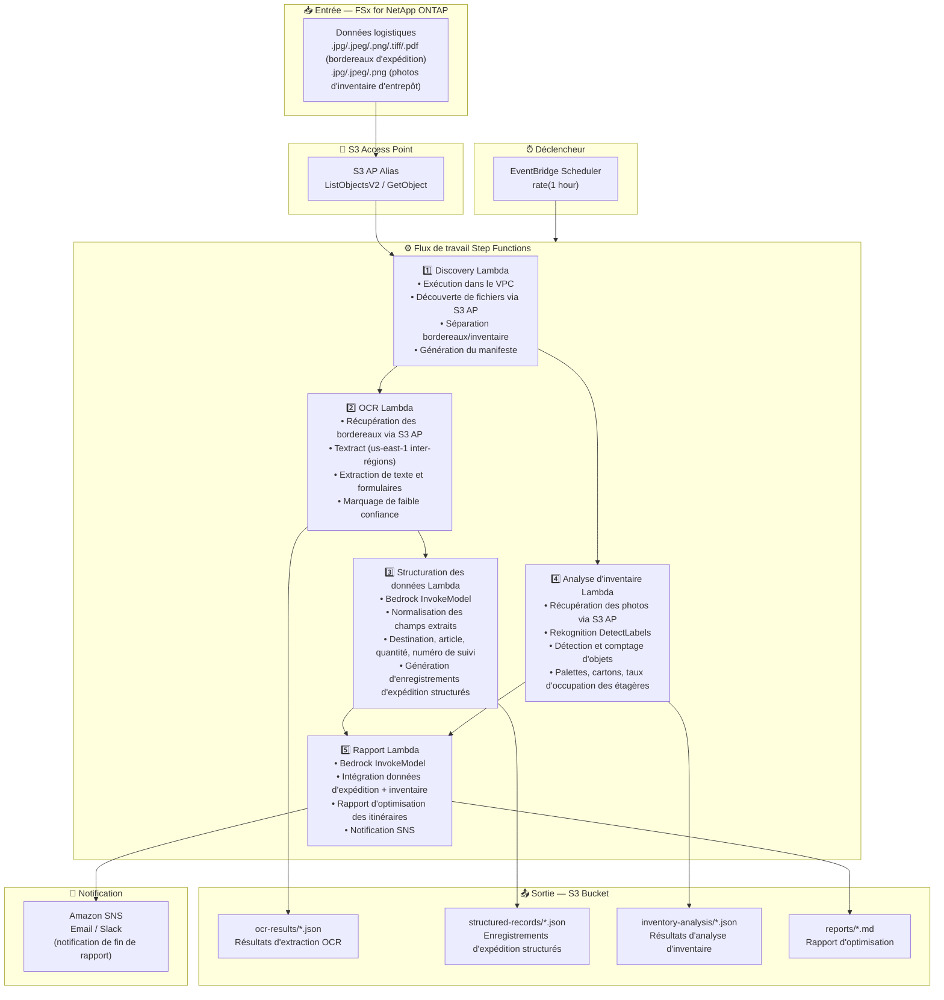

# UC12: Logistique/Chaîne d'approvisionnement — OCR de bordereaux et analyse d'inventaire

🌐 **Language / 言語**: [日本語](architecture.md) | [English](architecture.en.md) | [한국어](architecture.ko.md) | [简体中文](architecture.zh-CN.md) | [繁體中文](architecture.zh-TW.md) | Français | [Deutsch](architecture.de.md) | [Español](architecture.es.md)

## Architecture de bout en bout (Entrée → Sortie)

---

## Diagramme d'architecture

---

## Détail du flux de données

### Entrée
| Élément | Description |
|---------|-------------|
| **Source** | Volume FSx for NetApp ONTAP |
| **Types de fichiers** | .jpg/.jpeg/.png/.tiff/.pdf (bordereaux d'expédition), .jpg/.jpeg/.png (photos d'inventaire d'entrepôt) |
| **Méthode d'accès** | S3 Access Point (ListObjectsV2 + GetObject) |
| **Stratégie de lecture** | Récupération complète d'images/PDF (requis pour Textract / Rekognition) |

### Traitement
| Étape | Service | Fonction |
|-------|---------|----------|
| Découverte | Lambda (VPC) | Découverte des images de bordereaux et photos d'inventaire via S3 AP, génération du manifeste par type |
| OCR | Lambda + Textract | Extraction de texte et formulaires des bordereaux (expéditeur, destinataire, numéro de suivi, articles) |
| Structuration des données | Lambda + Bedrock | Normalisation des champs extraits, génération d'enregistrements d'expédition structurés (destination, article, quantité, etc.) |
| Analyse d'inventaire | Lambda + Rekognition | Détection et comptage d'objets sur les images d'inventaire (palettes, cartons, occupation des étagères) |
| Rapport | Lambda + Bedrock | Intégration des données d'expédition + inventaire pour le rapport d'optimisation des itinéraires de livraison |

### Sortie
| Artefact | Format | Description |
|----------|--------|-------------|
| Résultats OCR | `ocr-results/YYYY/MM/DD/{slip}_ocr.json` | Résultats d'extraction de texte Textract (avec scores de confiance) |
| Enregistrements structurés | `structured-records/YYYY/MM/DD/{slip}_record.json` | Enregistrements d'expédition structurés (destination, article, quantité, numéro de suivi) |
| Analyse d'inventaire | `inventory-analysis/YYYY/MM/DD/{warehouse}_{shelf}.json` | Résultats d'analyse d'inventaire (nombre d'objets, occupation des étagères) |
| Rapport logistique | `reports/YYYY/MM/DD/logistics_report.md` | Rapport d'optimisation des itinéraires de livraison généré par Bedrock |
| Notification SNS | Email | Notification de fin de rapport |

---

## Décisions de conception clés

1. **Traitement parallèle (OCR + Analyse d'inventaire)** — L'OCR des bordereaux et l'analyse d'inventaire sont indépendants ; parallélisés via Step Functions Parallel State
2. **Textract inter-régions** — Textract disponible uniquement dans us-east-1 ; invocation inter-régions utilisée
3. **Normalisation des champs par Bedrock** — Normalise le texte OCR non structuré via Bedrock pour générer des enregistrements d'expédition structurés
4. **Comptage d'inventaire par Rekognition** — DetectLabels pour la détection d'objets, calcul automatique des taux d'occupation palettes/cartons/étagères
5. **Gestion des marqueurs de faible confiance** — Marqueur de vérification manuelle défini lorsque les scores de confiance Textract sont inférieurs au seuil
6. **Interrogation périodique (non événementiel)** — S3 AP ne prend pas en charge les notifications d'événements, donc une exécution planifiée périodique est utilisée

---

## Services AWS utilisés

| Service | Rôle |
|---------|------|
| FSx for NetApp ONTAP | Stockage des bordereaux d'expédition et images d'inventaire |
| S3 Access Points | Accès serverless aux volumes ONTAP |
| EventBridge Scheduler | Déclencheur périodique |
| Step Functions | Orchestration du flux de travail (prise en charge des chemins parallèles) |
| Lambda | Calcul (Discovery, OCR, Structuration des données, Analyse d'inventaire, Rapport) |
| Amazon Textract | Extraction OCR de texte et formulaires des bordereaux (us-east-1 inter-régions) |
| Amazon Rekognition | Détection et comptage d'objets sur les images d'inventaire (DetectLabels) |
| Amazon Bedrock | Normalisation des champs et génération de rapports d'optimisation (Claude / Nova) |
| SNS | Notification de fin de rapport |
| Secrets Manager | Gestion des identifiants de l'API REST ONTAP |
| CloudWatch + X-Ray | Observabilité |
