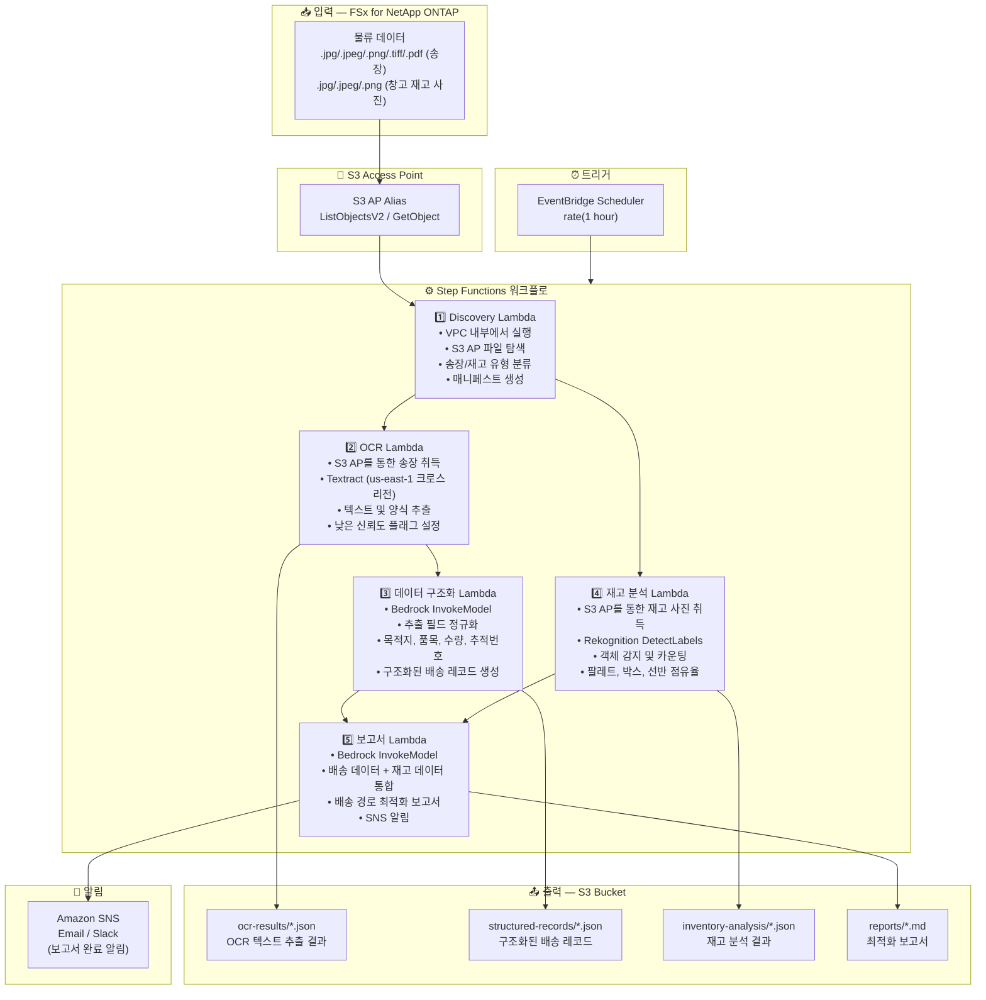

# UC12: 물류/공급망 — 송장 OCR 및 창고 재고 이미지 분석

🌐 **Language / 言語**: [日本語](architecture.md) | [English](architecture.en.md) | 한국어 | [简体中文](architecture.zh-CN.md) | [繁體中文](architecture.zh-TW.md) | [Français](architecture.fr.md) | [Deutsch](architecture.de.md) | [Español](architecture.es.md)

## 엔드투엔드 아키텍처 (입력 → 출력)

---

## 상위 수준 흐름

```
┌─────────────────────────────────────────────────────────────────────────────┐
│                         FSx for NetApp ONTAP                                 │
│                                                                              │
│  /vol/logistics_data/                                                        │
│  ├── slips/2024-03/slip_001.jpg            (Shipping slip image)             │
│  ├── slips/2024-03/slip_002.png            (Shipping slip image)             │
│  ├── slips/2024-03/slip_003.pdf            (Shipping slip PDF)               │
│  ├── inventory/warehouse_A/shelf_01.jpeg   (Warehouse inventory photo)       │
│  └── inventory/warehouse_B/shelf_02.png    (Warehouse inventory photo)       │
│                                                                              │
└──────────────────────────────────┬───────────────────────────────────────────┘
                                   │
                                   ▼
┌──────────────────────────────────────────────────────────────────────────────┐
│                      S3 Access Point (Data Path)                              │
│                                                                              │
│  Alias: fsxn-logistics-vol-ext-s3alias                                       │
│  • ListObjectsV2 (slip image & inventory photo discovery)                    │
│  • GetObject (image & PDF retrieval)                                         │
│  • No NFS/SMB mount required from Lambda                                     │
│                                                                              │
└──────────────────────────────────┬───────────────────────────────────────────┘
                                   │
                                   ▼
┌──────────────────────────────────────────────────────────────────────────────┐
│                    EventBridge Scheduler (Trigger)                            │
│                                                                              │
│  Schedule: rate(1 hour) — configurable                                       │
│  Target: Step Functions State Machine                                        │
│                                                                              │
└──────────────────────────────────┬───────────────────────────────────────────┘
                                   │
                                   ▼
┌──────────────────────────────────────────────────────────────────────────────┐
│                    AWS Step Functions (Orchestration)                         │
│                                                                              │
│  ┌─────────────┐    ┌──────────────────────┐    ┌────────────────────┐      │
│  │  Discovery   │───▶│  OCR                 │───▶│  Data Structuring  │      │
│  │  Lambda      │    │  Lambda              │    │  Lambda            │      │
│  │             │    │                      │    │                   │      │
│  │  • VPC内     │    │  • Textract          │    │  • Bedrock         │      │
│  │  • S3 AP List│    │  • Text extraction   │    │  • Field normaliz  │      │
│  │  • Slips/Inv │    │  • Form analysis     │    │  • Structured rec  │      │
│  └──────┬──────┘    └──────────────────────┘    └────────────────────┘      │
│         │                                                    │               │
│         │            ┌──────────────────────┐                │               │
│         └───────────▶│  Inventory Analysis  │                │               │
│                      │  Lambda              │                ▼               │
│                      │                      │    ┌────────────────────┐      │
│                      │  • Rekognition       │───▶│  Report            │      │
│                      │  • Object detection  │    │  Lambda            │      │
│                      │  • Inventory count   │    │                   │      │
│                      └──────────────────────┘    │  • Bedrock         │      │
│                                                  │  • Optimization    │      │
│                                                  │    report          │      │
│                                                  │  • SNS notification│      │
│                                                  └────────────────────┘      │
│                                                                              │
└──────────────────────────────────────────────────────────────────────────────┘
                                   │
                                   ▼
┌──────────────────────────────────────────────────────────────────────────────┐
│                         Output (S3 Bucket)                                    │
│                                                                              │
│  s3://{stack}-output-{account}/                                              │
│  ├── ocr-results/YYYY/MM/DD/                                                 │
│  │   ├── slip_001_ocr.json                 ← OCR text extraction results    │
│  │   └── slip_002_ocr.json                                                   │
│  ├── structured-records/YYYY/MM/DD/                                          │
│  │   ├── slip_001_record.json              ← Structured shipping records    │
│  │   └── slip_002_record.json                                                │
│  ├── inventory-analysis/YYYY/MM/DD/                                          │
│  │   ├── warehouse_A_shelf_01.json         ← Inventory analysis results     │
│  │   └── warehouse_B_shelf_02.json                                           │
│  └── reports/YYYY/MM/DD/                                                     │
│      └── logistics_report.md               ← Delivery route optimization    │
│                                                                              │
└──────────────────────────────────────────────────────────────────────────────┘
```

---

## Mermaid 다이어그램



---

## 데이터 흐름 상세

### 입력
| 항목 | 설명 |
|------|------|
| **소스** | FSx for NetApp ONTAP 볼륨 |
| **파일 유형** | .jpg/.jpeg/.png/.tiff/.pdf (송장), .jpg/.jpeg/.png (창고 재고 사진) |
| **접근 방식** | S3 Access Point (ListObjectsV2 + GetObject) |
| **읽기 전략** | 전체 이미지/PDF 취득 (Textract / Rekognition에 필요) |

### 처리
| 단계 | 서비스 | 기능 |
|------|--------|------|
| 탐색 | Lambda (VPC) | S3 AP를 통한 송장 이미지 및 재고 사진 탐색, 유형별 매니페스트 생성 |
| OCR | Lambda + Textract | 송장 텍스트 및 양식 추출 (발송인, 수취인, 추적번호, 품목) |
| 데이터 구조화 | Lambda + Bedrock | 추출 필드 정규화, 구조화된 배송 레코드 생성 (목적지, 품목, 수량 등) |
| 재고 분석 | Lambda + Rekognition | 창고 재고 이미지 객체 감지 및 카운팅 (팔레트, 박스, 선반 점유율) |
| 보고서 | Lambda + Bedrock | 배송 + 재고 데이터 통합을 통한 배송 경로 최적화 보고서 |

### 출력
| 산출물 | 형식 | 설명 |
|--------|------|------|
| OCR 결과 | `ocr-results/YYYY/MM/DD/{slip}_ocr.json` | Textract 텍스트 추출 결과 (신뢰도 점수 포함) |
| 구조화된 레코드 | `structured-records/YYYY/MM/DD/{slip}_record.json` | 구조화된 배송 레코드 (목적지, 품목, 수량, 추적번호) |
| 재고 분석 | `inventory-analysis/YYYY/MM/DD/{warehouse}_{shelf}.json` | 재고 분석 결과 (객체 수, 선반 점유율) |
| 물류 보고서 | `reports/YYYY/MM/DD/logistics_report.md` | Bedrock 생성 배송 경로 최적화 보고서 |
| SNS 알림 | Email | 보고서 완료 알림 |

---

## 주요 설계 결정

1. **병렬 처리 (OCR + 재고 분석)** — 송장 OCR과 창고 재고 분석은 독립적이므로 Step Functions Parallel State를 통해 병렬화
2. **Textract 크로스 리전** — Textract는 us-east-1에서만 사용 가능하므로 크로스 리전 호출 사용
3. **Bedrock을 통한 필드 정규화** — 비정형 OCR 텍스트를 Bedrock으로 정규화하여 구조화된 배송 레코드 생성
4. **Rekognition을 통한 재고 카운팅** — DetectLabels로 객체 감지, 팔레트/박스/선반 점유율 자동 계산
5. **낮은 신뢰도 플래그 관리** — Textract 신뢰도 점수가 임계값 미만일 때 수동 검증 플래그 설정
6. **폴링 (이벤트 기반 아님)** — S3 AP는 이벤트 알림을 지원하지 않으므로 주기적 스케줄 실행 사용

---

## 사용 AWS 서비스

| 서비스 | 역할 |
|--------|------|
| FSx for NetApp ONTAP | 송장 및 창고 재고 이미지 저장소 |
| S3 Access Points | ONTAP 볼륨에 대한 서버리스 접근 |
| EventBridge Scheduler | 주기적 트리거 |
| Step Functions | 워크플로 오케스트레이션 (병렬 경로 지원) |
| Lambda | 컴퓨팅 (Discovery, OCR, 데이터 구조화, 재고 분석, 보고서) |
| Amazon Textract | 송장 OCR 텍스트 및 양식 추출 (us-east-1 크로스 리전) |
| Amazon Rekognition | 창고 재고 이미지 객체 감지 및 카운팅 (DetectLabels) |
| Amazon Bedrock | 필드 정규화 및 최적화 보고서 생성 (Claude / Nova) |
| SNS | 보고서 완료 알림 |
| Secrets Manager | ONTAP REST API 자격 증명 관리 |
| CloudWatch + X-Ray | 관측성 |
