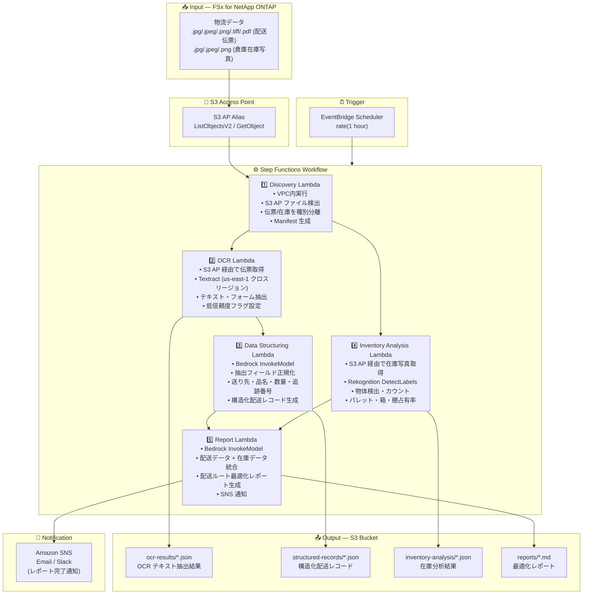

# UC12: 物流 / サプライチェーン — 配送伝票 OCR・倉庫在庫画像分析

🌐 **Language / 言語**: 日本語 | [English](architecture.en.md) | [한국어](architecture.ko.md) | [简体中文](architecture.zh-CN.md) | [繁體中文](architecture.zh-TW.md) | [Français](architecture.fr.md) | [Deutsch](architecture.de.md) | [Español](architecture.es.md)

## End-to-End Architecture (Input → Output)

---

## High-Level Flow

```
┌─────────────────────────────────────────────────────────────────────────────┐
│                         FSx for NetApp ONTAP                                 │
│                                                                              │
│  /vol/logistics_data/                                                        │
│  ├── slips/2024-03/slip_001.jpg            (配送伝票画像)                    │
│  ├── slips/2024-03/slip_002.png            (配送伝票画像)                    │
│  ├── slips/2024-03/slip_003.pdf            (配送伝票 PDF)                    │
│  ├── inventory/warehouse_A/shelf_01.jpeg   (倉庫在庫写真)                   │
│  └── inventory/warehouse_B/shelf_02.png    (倉庫在庫写真)                   │
│                                                                              │
└──────────────────────────────────┬───────────────────────────────────────────┘
                                   │
                                   ▼
┌──────────────────────────────────────────────────────────────────────────────┐
│                      S3 Access Point (Data Path)                              │
│                                                                              │
│  Alias: fsxn-logistics-vol-ext-s3alias                                       │
│  • ListObjectsV2 (伝票画像・在庫写真検出)                                   │
│  • GetObject (画像・PDF 取得)                                                │
│  • No NFS/SMB mount required from Lambda                                     │
│                                                                              │
└──────────────────────────────────┬───────────────────────────────────────────┘
                                   │
                                   ▼
┌──────────────────────────────────────────────────────────────────────────────┐
│                    EventBridge Scheduler (Trigger)                            │
│                                                                              │
│  Schedule: rate(1 hour) — configurable                                       │
│  Target: Step Functions State Machine                                        │
│                                                                              │
└──────────────────────────────────┬───────────────────────────────────────────┘
                                   │
                                   ▼
┌──────────────────────────────────────────────────────────────────────────────┐
│                    AWS Step Functions (Orchestration)                         │
│                                                                              │
│  ┌─────────────┐    ┌──────────────────────┐    ┌────────────────────┐      │
│  │  Discovery   │───▶│  OCR                 │───▶│  Data Structuring  │      │
│  │  Lambda      │    │  Lambda              │    │  Lambda            │      │
│  │             │    │                      │    │                   │      │
│  │  • VPC内     │    │  • Textract          │    │  • Bedrock         │      │
│  │  • S3 AP List│    │  • テキスト抽出      │    │  • フィールド正規化│      │
│  │  • 伝票/在庫 │    │  • フォーム解析      │    │  • 構造化レコード  │      │
│  └──────┬──────┘    └──────────────────────┘    └────────────────────┘      │
│         │                                                    │               │
│         │            ┌──────────────────────┐                │               │
│         └───────────▶│  Inventory Analysis  │                │               │
│                      │  Lambda              │                ▼               │
│                      │                      │    ┌────────────────────┐      │
│                      │  • Rekognition       │───▶│  Report            │      │
│                      │  • 物体検出          │    │  Lambda            │      │
│                      │  • 在庫カウント      │    │                   │      │
│                      └──────────────────────┘    │  • Bedrock         │      │
│                                                  │  • 最適化レポート  │      │
│                                                  │  • SNS 通知        │      │
│                                                  └────────────────────┘      │
│                                                                              │
└──────────────────────────────────────────────────────────────────────────────┘
                                   │
                                   ▼
┌──────────────────────────────────────────────────────────────────────────────┐
│                         Output (S3 Bucket)                                    │
│                                                                              │
│  s3://{stack}-output-{account}/                                              │
│  ├── ocr-results/YYYY/MM/DD/                                                 │
│  │   ├── slip_001_ocr.json                 ← OCR テキスト抽出結果           │
│  │   └── slip_002_ocr.json                                                   │
│  ├── structured-records/YYYY/MM/DD/                                          │
│  │   ├── slip_001_record.json              ← 構造化配送レコード             │
│  │   └── slip_002_record.json                                                │
│  ├── inventory-analysis/YYYY/MM/DD/                                          │
│  │   ├── warehouse_A_shelf_01.json         ← 在庫分析結果                   │
│  │   └── warehouse_B_shelf_02.json                                           │
│  └── reports/YYYY/MM/DD/                                                     │
│      └── logistics_report.md               ← 配送ルート最適化レポート       │
│                                                                              │
└──────────────────────────────────────────────────────────────────────────────┘
```

---

## Mermaid Diagram



---

## Data Flow Detail

### Input
| Item | Description |
|------|-------------|
| **Source** | FSx for NetApp ONTAP volume |
| **File Types** | .jpg/.jpeg/.png/.tiff/.pdf (配送伝票), .jpg/.jpeg/.png (倉庫在庫写真) |
| **Access Method** | S3 Access Point (ListObjectsV2 + GetObject) |
| **Read Strategy** | 画像・PDF 全体を取得 (Textract / Rekognition に必要) |

### Processing
| Step | Service | Function |
|------|---------|----------|
| Discovery | Lambda (VPC) | S3 AP で伝票画像・在庫写真検出、種別ごとに Manifest 生成 |
| OCR | Lambda + Textract | 配送伝票のテキスト・フォーム抽出 (送り主、受取人、追跡番号、品目) |
| Data Structuring | Lambda + Bedrock | 抽出フィールドの正規化、構造化配送レコード生成 (送り先、品名、数量等) |
| Inventory Analysis | Lambda + Rekognition | 倉庫在庫画像の物体検出・カウント (パレット、箱、棚占有率) |
| Report | Lambda + Bedrock | 配送データ + 在庫データを統合した最適化レポート生成 |

### Output
| Artifact | Format | Description |
|----------|--------|-------------|
| OCR Results | `ocr-results/YYYY/MM/DD/{slip}_ocr.json` | Textract テキスト抽出結果 (信頼度スコア付き) |
| Structured Records | `structured-records/YYYY/MM/DD/{slip}_record.json` | 構造化配送レコード (送り先、品名、数量、追跡番号) |
| Inventory Analysis | `inventory-analysis/YYYY/MM/DD/{warehouse}_{shelf}.json` | 在庫分析結果 (物体カウント、棚占有率) |
| Logistics Report | `reports/YYYY/MM/DD/logistics_report.md` | Bedrock 生成配送ルート最適化レポート |
| SNS Notification | Email | レポート完了通知 |

---

## Key Design Decisions

1. **並列処理 (OCR + Inventory Analysis)** — 配送伝票 OCR と倉庫在庫分析は独立して実行可能。Step Functions の Parallel State で並列化
2. **Textract クロスリージョン** — Textract は us-east-1 でのみ利用可能なため、クロスリージョン呼び出しで対応
3. **Bedrock によるフィールド正規化** — OCR 結果の非構造化テキストを Bedrock で正規化し、構造化配送レコードを生成
4. **Rekognition による在庫カウント** — DetectLabels で物体検出し、パレット・箱・棚占有率を自動算出
5. **低信頼度フラグ管理** — Textract の信頼度スコアが閾値未満の場合、手動検証フラグを設定
6. **ポーリングベース** — S3 AP はイベント通知非対応のため、定期スケジュール実行

---

## AWS Services Used

| Service | Role |
|---------|------|
| FSx for NetApp ONTAP | 配送伝票・倉庫在庫画像ストレージ |
| S3 Access Points | ONTAP ボリュームへのサーバーレスアクセス |
| EventBridge Scheduler | 定期トリガー |
| Step Functions | ワークフローオーケストレーション (並列パス対応) |
| Lambda | コンピュート (Discovery, OCR, Data Structuring, Inventory Analysis, Report) |
| Amazon Textract | 配送伝票 OCR テキスト・フォーム抽出 (us-east-1 クロスリージョン) |
| Amazon Rekognition | 倉庫在庫画像の物体検出・カウント (DetectLabels) |
| Amazon Bedrock | フィールド正規化・最適化レポート生成 (Claude / Nova) |
| SNS | レポート完了通知 |
| Secrets Manager | ONTAP REST API 認証情報管理 |
| CloudWatch + X-Ray | オブザーバビリティ |
