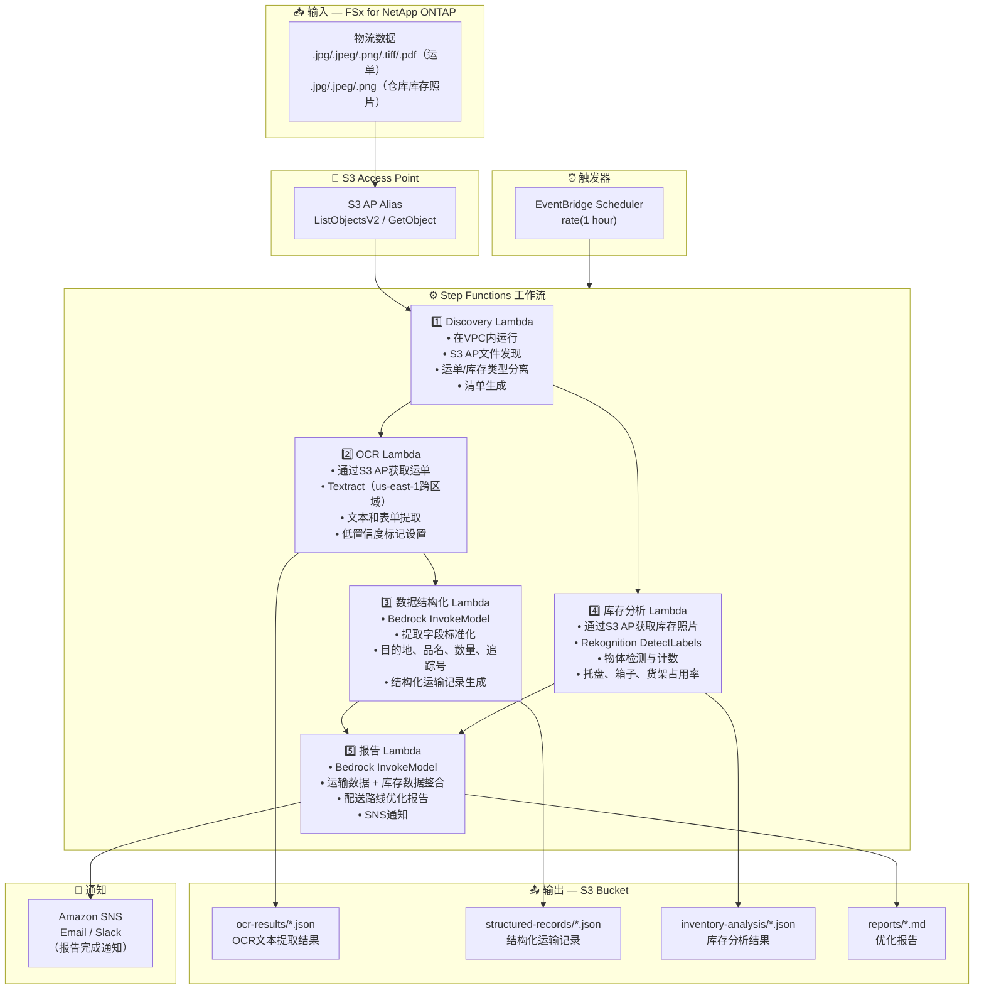

# UC12: 物流/供应链 — 运单OCR与仓库库存图像分析

🌐 **Language / 言語**: [日本語](architecture.md) | [English](architecture.en.md) | [한국어](architecture.ko.md) | 简体中文 | [繁體中文](architecture.zh-TW.md) | [Français](architecture.fr.md) | [Deutsch](architecture.de.md) | [Español](architecture.es.md)

## 端到端架构（输入 → 输出）

---

## 高层级流程

```
┌─────────────────────────────────────────────────────────────────────────────┐
│                         FSx for NetApp ONTAP                                 │
│                                                                              │
│  /vol/logistics_data/                                                        │
│  ├── slips/2024-03/slip_001.jpg            (Shipping slip image)             │
│  ├── slips/2024-03/slip_002.png            (Shipping slip image)             │
│  ├── slips/2024-03/slip_003.pdf            (Shipping slip PDF)               │
│  ├── inventory/warehouse_A/shelf_01.jpeg   (Warehouse inventory photo)       │
│  └── inventory/warehouse_B/shelf_02.png    (Warehouse inventory photo)       │
│                                                                              │
└──────────────────────────────────┬───────────────────────────────────────────┘
                                   │
                                   ▼
┌──────────────────────────────────────────────────────────────────────────────┐
│                      S3 Access Point (Data Path)                              │
│                                                                              │
│  Alias: fsxn-logistics-vol-ext-s3alias                                       │
│  • ListObjectsV2 (slip image & inventory photo discovery)                    │
│  • GetObject (image & PDF retrieval)                                         │
│  • No NFS/SMB mount required from Lambda                                     │
│                                                                              │
└──────────────────────────────────┬───────────────────────────────────────────┘
                                   │
                                   ▼
┌──────────────────────────────────────────────────────────────────────────────┐
│                    EventBridge Scheduler (Trigger)                            │
│                                                                              │
│  Schedule: rate(1 hour) — configurable                                       │
│  Target: Step Functions State Machine                                        │
│                                                                              │
└──────────────────────────────────┬───────────────────────────────────────────┘
                                   │
                                   ▼
┌──────────────────────────────────────────────────────────────────────────────┐
│                    AWS Step Functions (Orchestration)                         │
│                                                                              │
│  ┌─────────────┐    ┌──────────────────────┐    ┌────────────────────┐      │
│  │  Discovery   │───▶│  OCR                 │───▶│  Data Structuring  │      │
│  │  Lambda      │    │  Lambda              │    │  Lambda            │      │
│  │             │    │                      │    │                   │      │
│  │  • VPC内     │    │  • Textract          │    │  • Bedrock         │      │
│  │  • S3 AP List│    │  • Text extraction   │    │  • Field normaliz  │      │
│  │  • Slips/Inv │    │  • Form analysis     │    │  • Structured rec  │      │
│  └──────┬──────┘    └──────────────────────┘    └────────────────────┘      │
│         │                                                    │               │
│         │            ┌──────────────────────┐                │               │
│         └───────────▶│  Inventory Analysis  │                │               │
│                      │  Lambda              │                ▼               │
│                      │                      │    ┌────────────────────┐      │
│                      │  • Rekognition       │───▶│  Report            │      │
│                      │  • Object detection  │    │  Lambda            │      │
│                      │  • Inventory count   │    │                   │      │
│                      └──────────────────────┘    │  • Bedrock         │      │
│                                                  │  • Optimization    │      │
│                                                  │    report          │      │
│                                                  │  • SNS notification│      │
│                                                  └────────────────────┘      │
│                                                                              │
└──────────────────────────────────────────────────────────────────────────────┘
                                   │
                                   ▼
┌──────────────────────────────────────────────────────────────────────────────┐
│                         Output (S3 Bucket)                                    │
│                                                                              │
│  s3://{stack}-output-{account}/                                              │
│  ├── ocr-results/YYYY/MM/DD/                                                 │
│  │   ├── slip_001_ocr.json                 ← OCR text extraction results    │
│  │   └── slip_002_ocr.json                                                   │
│  ├── structured-records/YYYY/MM/DD/                                          │
│  │   ├── slip_001_record.json              ← Structured shipping records    │
│  │   └── slip_002_record.json                                                │
│  ├── inventory-analysis/YYYY/MM/DD/                                          │
│  │   ├── warehouse_A_shelf_01.json         ← Inventory analysis results     │
│  │   └── warehouse_B_shelf_02.json                                           │
│  └── reports/YYYY/MM/DD/                                                     │
│      └── logistics_report.md               ← Delivery route optimization    │
│                                                                              │
└──────────────────────────────────────────────────────────────────────────────┘
```

---

## Mermaid 图表



---

## 数据流详情

### 输入
| 项目 | 说明 |
|------|------|
| **来源** | FSx for NetApp ONTAP 卷 |
| **文件类型** | .jpg/.jpeg/.png/.tiff/.pdf（运单）、.jpg/.jpeg/.png（仓库库存照片） |
| **访问方式** | S3 Access Point（ListObjectsV2 + GetObject） |
| **读取策略** | 完整图像/PDF获取（Textract / Rekognition所需） |

### 处理
| 步骤 | 服务 | 功能 |
|------|------|------|
| 发现 | Lambda (VPC) | 通过S3 AP发现运单图像和库存照片，按类型生成清单 |
| OCR | Lambda + Textract | 运单文本和表单提取（发件人、收件人、追踪号、品名） |
| 数据结构化 | Lambda + Bedrock | 提取字段标准化，生成结构化运输记录（目的地、品名、数量等） |
| 库存分析 | Lambda + Rekognition | 仓库库存图像物体检测与计数（托盘、箱子、货架占用率） |
| 报告 | Lambda + Bedrock | 整合运输+库存数据生成配送路线优化报告 |

### 输出
| 产出物 | 格式 | 说明 |
|--------|------|------|
| OCR结果 | `ocr-results/YYYY/MM/DD/{slip}_ocr.json` | Textract文本提取结果（含置信度分数） |
| 结构化记录 | `structured-records/YYYY/MM/DD/{slip}_record.json` | 结构化运输记录（目的地、品名、数量、追踪号） |
| 库存分析 | `inventory-analysis/YYYY/MM/DD/{warehouse}_{shelf}.json` | 库存分析结果（物体数量、货架占用率） |
| 物流报告 | `reports/YYYY/MM/DD/logistics_report.md` | Bedrock生成的配送路线优化报告 |
| SNS通知 | Email | 报告完成通知 |

---

## 关键设计决策

1. **并行处理（OCR + 库存分析）** — 运单OCR和仓库库存分析相互独立，通过Step Functions Parallel State实现并行化
2. **Textract跨区域** — Textract仅在us-east-1可用，使用跨区域调用
3. **Bedrock字段标准化** — 通过Bedrock将非结构化OCR文本标准化，生成结构化运输记录
4. **Rekognition库存计数** — 使用DetectLabels进行物体检测，自动计算托盘/箱子/货架占用率
5. **低置信度标记管理** — 当Textract置信度分数低于阈值时设置人工验证标记
6. **轮询（非事件驱动）** — S3 AP不支持事件通知，因此使用定期计划执行

---

## 使用的AWS服务

| 服务 | 角色 |
|------|------|
| FSx for NetApp ONTAP | 运单及仓库库存图像存储 |
| S3 Access Points | 对ONTAP卷的无服务器访问 |
| EventBridge Scheduler | 定期触发 |
| Step Functions | 工作流编排（支持并行路径） |
| Lambda | 计算（Discovery、OCR、数据结构化、库存分析、报告） |
| Amazon Textract | 运单OCR文本和表单提取（us-east-1跨区域） |
| Amazon Rekognition | 仓库库存图像物体检测与计数（DetectLabels） |
| Amazon Bedrock | 字段标准化及优化报告生成（Claude / Nova） |
| SNS | 报告完成通知 |
| Secrets Manager | ONTAP REST API凭证管理 |
| CloudWatch + X-Ray | 可观测性 |
