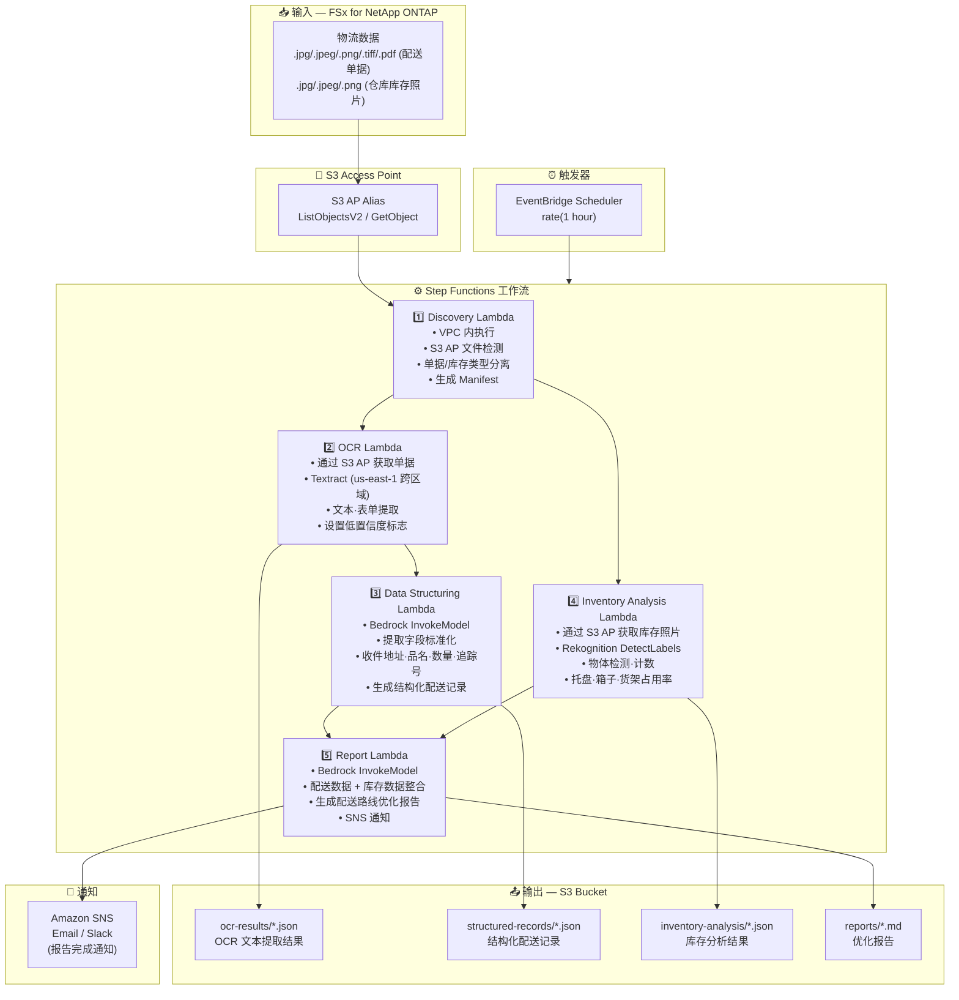

# UC12: 物流 / 供应链 — 配送单据 OCR・仓库库存图像分析

🌐 **Language / 언어 / 语言 / 語言 / Langue / Sprache / Idioma**: [日本語](architecture.md) | [English](architecture.en.md) | [한국어](architecture.ko.md) | 简体中文 | [繁體中文](architecture.zh-TW.md) | [Français](architecture.fr.md) | [Deutsch](architecture.de.md) | [Español](architecture.es.md)

> 注意：此翻译由 Amazon Bedrock Claude 生成。欢迎对翻译质量提出改进建议。

## 端到端架构（输入 → 输出）

---

## 架构图

---

## 数据流详情

### 输入
| 项目 | 说明 |
|------|-------------|
| **来源** | FSx for NetApp ONTAP 卷 |
| **文件类型** | .jpg/.jpeg/.png/.tiff/.pdf (配送单据), .jpg/.jpeg/.png (仓库库存照片) |
| **访问方法** | S3 Access Point (ListObjectsV2 + GetObject) |
| **读取策略** | 获取完整图像·PDF（Textract / Rekognition 所需） |

### 处理
| 步骤 | 服务 | 功能 |
|------|---------|----------|
| Discovery | Lambda (VPC) | 通过 S3 AP 检测单据图像·库存照片，按类型生成 Manifest |
| OCR | Lambda + Textract | 配送单据的文本·表单提取（发件人、收件人、追踪号、品目） |
| Data Structuring | Lambda + Bedrock | 提取字段的标准化，生成结构化配送记录（收件地址、品名、数量等） |
| Inventory Analysis | Lambda + Rekognition | 仓库库存图像的物体检测·计数（托盘、箱子、货架占用率） |
| Report | Lambda + Bedrock | 整合配送数据 + 库存数据生成优化报告 |

### 输出
| 产物 | 格式 | 说明 |
|----------|--------|-------------|
| OCR Results | `ocr-results/YYYY/MM/DD/{slip}_ocr.json` | Textract 文本提取结果（附置信度分数） |
| Structured Records | `structured-records/YYYY/MM/DD/{slip}_record.json` | 结构化配送记录（收件地址、品名、数量、追踪号） |
| Inventory Analysis | `inventory-analysis/YYYY/MM/DD/{warehouse}_{shelf}.json` | 库存分析结果（物体计数、货架占用率） |
| Logistics Report | `reports/YYYY/MM/DD/logistics_report.md` | Bedrock 生成的配送路线优化报告 |
| SNS Notification | Email | 报告完成通知 |

---

## 关键设计决策

1. **并行处理（OCR + Inventory Analysis）** — 配送单据 OCR 与仓库库存分析可独立执行。通过 Step Functions 的 Parallel State 实现并行化
2. **Textract 跨区域** — Textract 仅在 us-east-1 可用，因此通过跨区域调用实现
3. **通过 Bedrock 进行字段标准化** — 使用 Bedrock 标准化 OCR 结果的非结构化文本，生成结构化配送记录
4. **通过 Rekognition 进行库存计数** — 使用 DetectLabels 进行物体检测，自动计算托盘·箱子·货架占用率
5. **低置信度标志管理** — 当 Textract 的置信度分数低于阈值时，设置手动验证标志
6. **基于轮询** — 由于 S3 AP 不支持事件通知，采用定期计划执行

---

## 使用的 AWS 服务

| 服务 | 角色 |
|---------|------|
| FSx for NetApp ONTAP | 配送单据·仓库库存图像存储 |
| S3 Access Points | 对 ONTAP 卷的无服务器访问 |
| EventBridge Scheduler | 定期触发器 |
| Step Functions | 工作流编排（支持并行路径） |
| Lambda | 计算（Discovery、OCR、Data Structuring、Inventory Analysis、Report） |
| Amazon Textract | 配送单据 OCR 文本·表单提取（us-east-1 跨区域） |
| Amazon Rekognition | 仓库库存图像的物体检测·计数（DetectLabels） |
| Amazon Bedrock | 字段标准化·优化报告生成（Claude / Nova） |
| SNS | 报告完成通知 |
| Secrets Manager | ONTAP REST API 凭证管理 |
| CloudWatch + X-Ray | 可观测性 |
