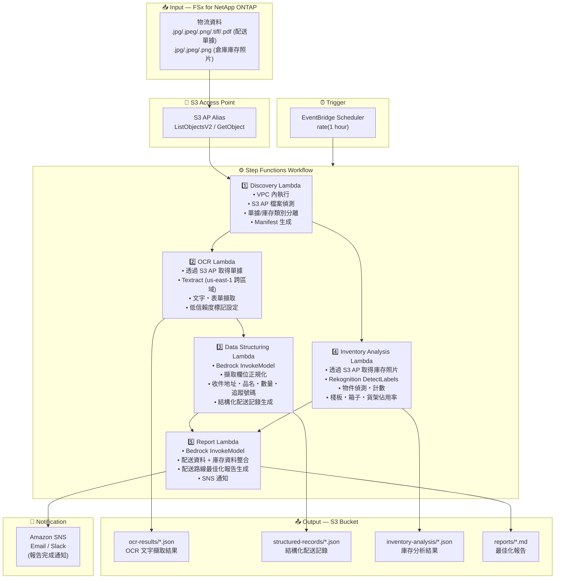

# UC12: 物流 / 供應鏈 — 配送傳票 OCR・倉庫庫存影像分析

🌐 **Language / 언어 / 语言 / 語言 / Langue / Sprache / Idioma**: [日本語](architecture.md) | [English](architecture.en.md) | [한국어](architecture.ko.md) | [简体中文](architecture.zh-CN.md) | 繁體中文 | [Français](architecture.fr.md) | [Deutsch](architecture.de.md) | [Español](architecture.es.md)

> 注意：此翻譯由 Amazon Bedrock Claude 產生。歡迎對翻譯品質提出改進建議。

## End-to-End Architecture (Input → Output)

---

## Architecture Diagram

---

## Data Flow Detail

### Input
| Item | Description |
|------|-------------|
| **Source** | FSx for NetApp ONTAP volume |
| **File Types** | .jpg/.jpeg/.png/.tiff/.pdf (配送單據), .jpg/.jpeg/.png (倉庫庫存照片) |
| **Access Method** | S3 Access Point (ListObjectsV2 + GetObject) |
| **Read Strategy** | 取得完整影像・PDF (Textract / Rekognition 所需) |

### Processing
| Step | Service | Function |
|------|---------|----------|
| Discovery | Lambda (VPC) | 透過 S3 AP 偵測單據影像・庫存照片，依類別生成 Manifest |
| OCR | Lambda + Textract | 配送單據的文字・表單擷取 (寄件人、收件人、追蹤號碼、品項) |
| Data Structuring | Lambda + Bedrock | 擷取欄位的正規化，結構化配送記錄生成 (收件地址、品名、數量等) |
| Inventory Analysis | Lambda + Rekognition | 倉庫庫存影像的物件偵測・計數 (棧板、箱子、貨架佔用率) |
| Report | Lambda + Bedrock | 整合配送資料 + 庫存資料的最佳化報告生成 |

### Output
| Artifact | Format | Description |
|----------|--------|-------------|
| OCR Results | `ocr-results/YYYY/MM/DD/{slip}_ocr.json` | Textract 文字擷取結果 (附信賴度分數) |
| Structured Records | `structured-records/YYYY/MM/DD/{slip}_record.json` | 結構化配送記錄 (收件地址、品名、數量、追蹤號碼) |
| Inventory Analysis | `inventory-analysis/YYYY/MM/DD/{warehouse}_{shelf}.json` | 庫存分析結果 (物件計數、貨架佔用率) |
| Logistics Report | `reports/YYYY/MM/DD/logistics_report.md` | Bedrock 生成配送路線最佳化報告 |
| SNS Notification | Email | 報告完成通知 |

---

## Key Design Decisions

1. **並行處理 (OCR + Inventory Analysis)** — 配送單據 OCR 與倉庫庫存分析可獨立執行。透過 Step Functions 的 Parallel State 實現並行化
2. **Textract 跨區域** — Textract 僅在 us-east-1 可用，因此透過跨區域呼叫對應
3. **Bedrock 欄位正規化** — 透過 Bedrock 將 OCR 結果的非結構化文字正規化，生成結構化配送記錄
4. **Rekognition 庫存計數** — 透過 DetectLabels 進行物件偵測，自動計算棧板・箱子・貨架佔用率
5. **低信賴度標記管理** — 當 Textract 的信賴度分數低於閾值時，設定手動驗證標記
6. **輪詢基礎** — 由於 S3 AP 不支援事件通知，採用定期排程執行

---

## AWS Services Used

| Service | Role |
|---------|------|
| FSx for NetApp ONTAP | 配送單據・倉庫庫存影像儲存 |
| S3 Access Points | ONTAP 磁碟區的無伺服器存取 |
| EventBridge Scheduler | 定期觸發器 |
| Step Functions | 工作流程編排 (支援並行路徑) |
| Lambda | 運算 (Discovery, OCR, Data Structuring, Inventory Analysis, Report) |
| Amazon Textract | 配送單據 OCR 文字・表單擷取 (us-east-1 跨區域) |
| Amazon Rekognition | 倉庫庫存影像的物件偵測・計數 (DetectLabels) |
| Amazon Bedrock | 欄位正規化・最佳化報告生成 (Claude / Nova) |
| SNS | 報告完成通知 |
| Secrets Manager | ONTAP REST API 認證資訊管理 |
| CloudWatch + X-Ray | 可觀測性 |
