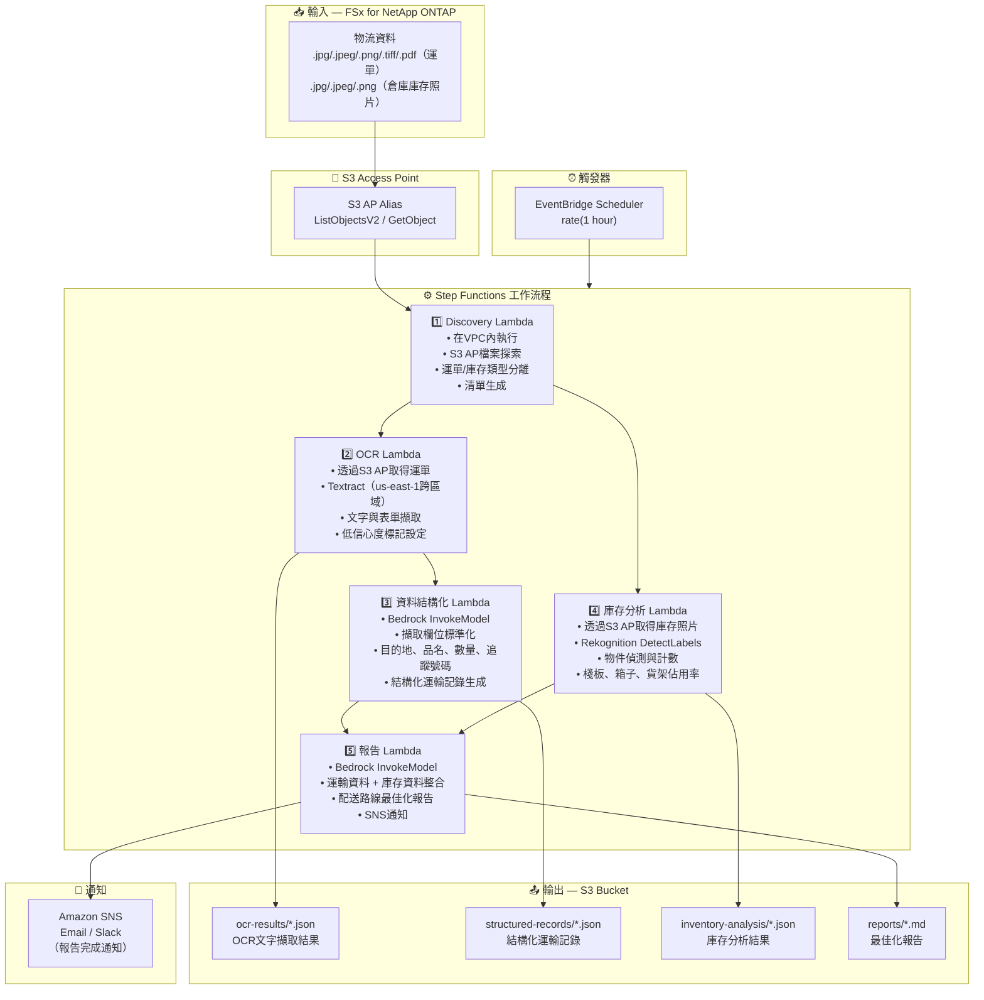

# UC12: 物流/供應鏈 — 運單OCR與倉庫庫存影像分析

🌐 **Language / 言語**: [日本語](architecture.md) | [English](architecture.en.md) | [한국어](architecture.ko.md) | [简体中文](architecture.zh-CN.md) | 繁體中文 | [Français](architecture.fr.md) | [Deutsch](architecture.de.md) | [Español](architecture.es.md)

## 端對端架構（輸入 → 輸出）

---

## 架構圖

---

## 資料流程詳情

### 輸入
| 項目 | 說明 |
|------|------|
| **來源** | FSx for NetApp ONTAP 磁碟區 |
| **檔案類型** | .jpg/.jpeg/.png/.tiff/.pdf（運單）、.jpg/.jpeg/.png（倉庫庫存照片） |
| **存取方式** | S3 Access Point（ListObjectsV2 + GetObject） |
| **讀取策略** | 完整影像/PDF取得（Textract / Rekognition所需） |

### 處理
| 步驟 | 服務 | 功能 |
|------|------|------|
| 探索 | Lambda (VPC) | 透過S3 AP探索運單影像和庫存照片，依類型生成清單 |
| OCR | Lambda + Textract | 運單文字和表單擷取（寄件人、收件人、追蹤號碼、品名） |
| 資料結構化 | Lambda + Bedrock | 擷取欄位標準化，生成結構化運輸記錄（目的地、品名、數量等） |
| 庫存分析 | Lambda + Rekognition | 倉庫庫存影像物件偵測與計數（棧板、箱子、貨架佔用率） |
| 報告 | Lambda + Bedrock | 整合運輸+庫存資料生成配送路線最佳化報告 |

### 輸出
| 產出物 | 格式 | 說明 |
|--------|------|------|
| OCR結果 | `ocr-results/YYYY/MM/DD/{slip}_ocr.json` | Textract文字擷取結果（含信心度分數） |
| 結構化記錄 | `structured-records/YYYY/MM/DD/{slip}_record.json` | 結構化運輸記錄（目的地、品名、數量、追蹤號碼） |
| 庫存分析 | `inventory-analysis/YYYY/MM/DD/{warehouse}_{shelf}.json` | 庫存分析結果（物件數量、貨架佔用率） |
| 物流報告 | `reports/YYYY/MM/DD/logistics_report.md` | Bedrock生成的配送路線最佳化報告 |
| SNS通知 | Email | 報告完成通知 |

---

## 關鍵設計決策

1. **平行處理（OCR + 庫存分析）** — 運單OCR和倉庫庫存分析相互獨立，透過Step Functions Parallel State實現平行化
2. **Textract跨區域** — Textract僅在us-east-1可用，使用跨區域呼叫
3. **Bedrock欄位標準化** — 透過Bedrock將非結構化OCR文字標準化，生成結構化運輸記錄
4. **Rekognition庫存計數** — 使用DetectLabels進行物件偵測，自動計算棧板/箱子/貨架佔用率
5. **低信心度標記管理** — 當Textract信心度分數低於閾值時設定人工驗證標記
6. **輪詢（非事件驅動）** — S3 AP不支援事件通知，因此使用定期排程執行

---

## 使用的AWS服務

| 服務 | 角色 |
|------|------|
| FSx for NetApp ONTAP | 運單及倉庫庫存影像儲存 |
| S3 Access Points | 對ONTAP磁碟區的無伺服器存取 |
| EventBridge Scheduler | 定期觸發 |
| Step Functions | 工作流程編排（支援平行路徑） |
| Lambda | 運算（Discovery、OCR、資料結構化、庫存分析、報告） |
| Amazon Textract | 運單OCR文字和表單擷取（us-east-1跨區域） |
| Amazon Rekognition | 倉庫庫存影像物件偵測與計數（DetectLabels） |
| Amazon Bedrock | 欄位標準化及最佳化報告生成（Claude / Nova） |
| SNS | 報告完成通知 |
| Secrets Manager | ONTAP REST API憑證管理 |
| CloudWatch + X-Ray | 可觀測性 |
