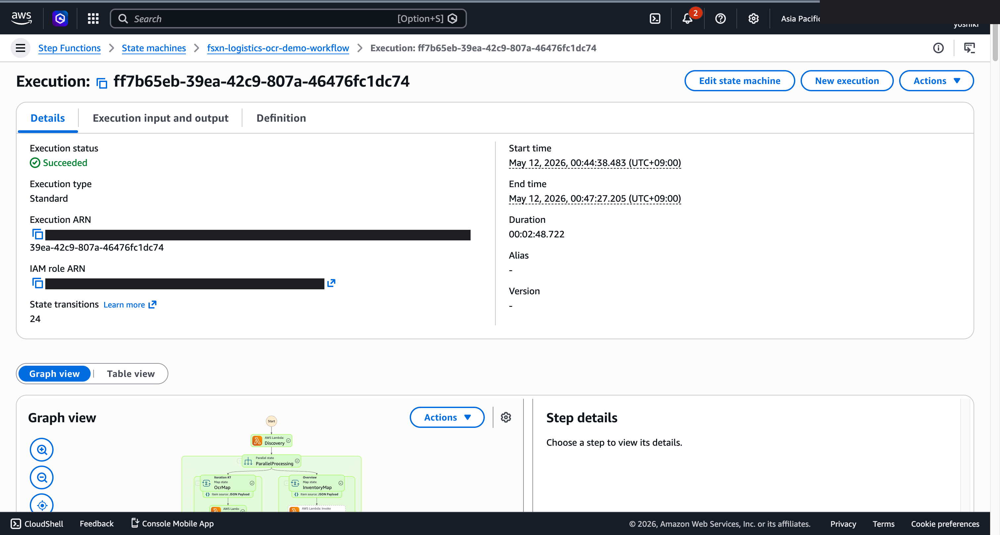
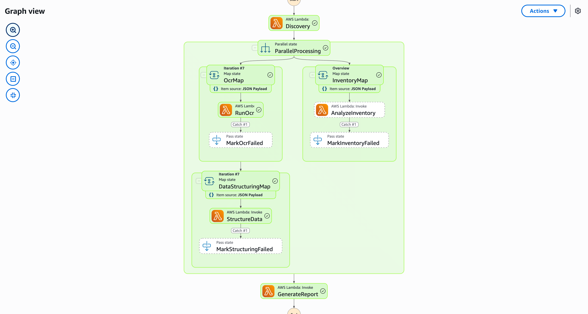

# 배송 전표 OCR 및 재고 분석 -- Demo Guide

🌐 **Language / 言語**: [日本語](demo-guide.md) | [English](demo-guide.en.md) | 한국어 | [简体中文](demo-guide.zh-CN.md) | [繁體中文](demo-guide.zh-TW.md) | [Français](demo-guide.fr.md) | [Deutsch](demo-guide.de.md) | [Español](demo-guide.es.md)

## Executive Summary

본 데모는 배송 전표의 OCR 처리 및 재고 분석 파이프라인을 시연합니다. 종이 전표를 자동 디지털화하여 재고 현황을 실시간으로 파악합니다.

**핵심 메시지**: 배송 전표를 자동 OCR 처리하여 재고 데이터를 실시간으로 업데이트하고 물류 효율을 향상시킵니다.

**예상 시간**: 3–5 min

---

## 출력 대상: OutputDestination으로 선택 가능 (Pattern B)

이 UC는 `OutputDestination` 파라미터를 지원합니다 (2026-05-10 업데이트,
`docs/output-destination-patterns.md` 참조).

**두 가지 모드**:

- **STANDARD_S3** (기본값): AI 아티팩트가 새 S3 버킷으로 이동
- **FSXN_S3AP** ("no data movement"): AI 아티팩트가 S3 Access Point를 통해
  동일한 FSx ONTAP 볼륨으로 돌아가며, SMB/NFS 사용자가 기존 디렉토리 구조 내에서
  볼 수 있음

```bash
# FSXN_S3AP 모드
--parameter-overrides OutputDestination=FSXN_S3AP OutputS3APPrefix=ai-outputs/
```

AWS 사양 제약과 해결 방법은
[README.ko.md — AWS 사양상의 제약](../../README.ko.md#aws-사양상의-제약-및-해결-방법) 참조.

---
## Workflow

```
전표 스캔 업로드 → OCR 텍스트 추출 → 필드 파싱 → 재고 업데이트 → 분석 리포트
```

---

## Storyboard (5 Sections / 3–5 min)

### Section 1 (0:00–0:45)
> 문제 제기: 종이 전표의 수동 입력은 오류가 많고 시간 소모적

### Section 2 (0:45–1:30)
> 전표 업로드: 스캔된 전표 이미지 배치로 처리 시작

### Section 3 (1:30–2:30)
> OCR 및 파싱: 텍스트 추출과 구조화 데이터 변환

### Section 4 (2:30–3:45)
> 재고 업데이트: 추출 데이터 기반 실시간 재고 반영

### Section 5 (3:45–5:00)
> 분석 리포트: 물류 현황 대시보드 및 이상 감지 알림

---

## Technical Notes

| Component | Role |
|-----------|------|
| Step Functions | 워크플로우 오케스트레이션 |
| Lambda (OCR Engine) | 전표 텍스트 추출 |
| Lambda (Field Parser) | 구조화 데이터 파싱 |
| Lambda (Inventory Updater) | 재고 데이터 업데이트 |
| Amazon Athena | 물류 통계 분석 |

---

*본 문서는 기술 프레젠테이션용 데모 영상 제작 가이드입니다.*

---

## 검증된 UI/UX 스크린샷

Phase 7 UC15/16/17 및 UC6/11/14 데모와 동일한 방침으로, **최종 사용자가 일상 업무에서
실제로 보는 UI/UX 화면**을 대상으로 합니다.
기술자용 뷰(Step Functions 그래프, CloudFormation 스택 이벤트 등)는
`docs/verification-results-*.md`에 통합되어 있습니다.

### 이 유스케이스의 검증 상태

- ⚠️ **E2E**: Partial (additional verification recommended)
- 📸 **UI/UX 촬영**: ✅ SFN Graph 완료 (Phase 8 Theme D, commit 3c90042)

### 기존 스크린샷 (Phase 1-6에서 해당분)





### 재검증 시 UI/UX 대상 화면 (권장 촬영 목록)

- S3 출력 버킷 (waybills-ocr/, inventory/, reports/)
- Textract 운송장 OCR 결과 (Cross-Region)
- Rekognition 창고 이미지 라벨
- 배송 집계 보고서

### 촬영 가이드

1. **사전 준비**: `bash scripts/verify_phase7_prerequisites.sh`로 전제 조건 확인
2. **샘플 데이터**: S3 AP Alias를 통해 샘플 파일 업로드 후 Step Functions 워크플로우 시작
3. **촬영** (CloudShell/터미널 닫기, 브라우저 우측 상단 사용자 이름 마스킹)
4. **마스크**: `python3 scripts/mask_uc_demos.py <uc-dir>`로 자동 OCR 마스킹
5. **정리**: `bash scripts/cleanup_generic_ucs.sh <UC>`로 스택 삭제
