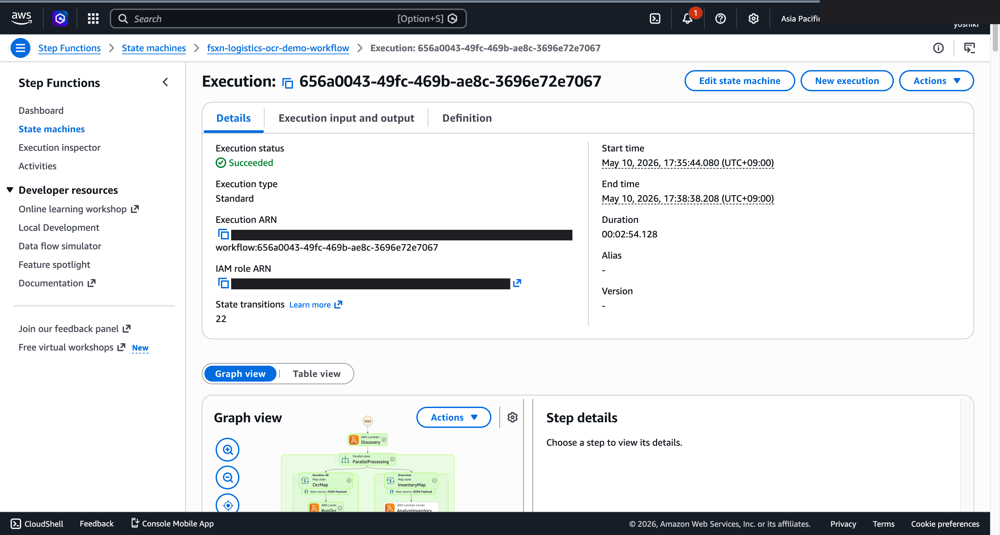

# 配送单据 OCR·库存分析 — Demo Guide

🌐 **Language / 언어 / 语言 / 語言 / Langue / Sprache / Idioma**: [日本語](demo-guide.md) | [English](demo-guide.en.md) | [한국어](demo-guide.ko.md) | 简体中文 | [繁體中文](demo-guide.zh-TW.md) | [Français](demo-guide.fr.md) | [Deutsch](demo-guide.de.md) | [Español](demo-guide.es.md)

> 注意：此翻译由 Amazon Bedrock Claude 生成。欢迎对翻译质量提出改进建议。

## Executive Summary

本演示展示了配送单据的 OCR 处理和库存分析流水线。将纸质单据数字化，自动汇总和分析入库出库数据。

**演示核心信息**：自动将配送单据数字化，支持实时掌握库存状况和需求预测。

**预计时间**：3～5 分钟

---

## Target Audience & Persona

| 项目 | 详细 |
|------|------|
| **职位** | 物流经理 / 仓库管理者 |
| **日常业务** | 入库出库管理、库存确认、配送安排 |
| **课题** | 纸质单据手动输入导致的延迟和错误 |
| **期待成果** | 单据处理自动化和库存可视化 |

### Persona: 斎藤先生（物流经理）

- 每天处理 500+ 张配送单据
- 手动输入的时间差导致库存信息总是滞后
- "希望只需扫描单据就能反映到库存中"

---

## Demo Scenario: 配送单据批处理

### 工作流程全貌

```
配送单据          OCR 处理       数据结构化       库存分析
(扫描图像) →  文本提取 →  字段       →   汇总报告
                               映射          需求预测
```

---

## Storyboard（5 个部分 / 3～5 分钟）

### Section 1: Problem Statement（0:00–0:45）

**解说要点**:
> 每天 500 张以上的配送单据。手动输入导致库存信息更新延迟，缺货和过剩库存的风险增加。

**Key Visual**: 大量单据扫描图像、手动输入延迟画面

### Section 2: Scan & Upload（0:45–1:30）

**解说要点**:
> 只需将扫描的单据图像放置到文件夹中，OCR 流水线就会自动启动。

**Key Visual**: 单据图像上传 → 工作流程启动

### Section 3: OCR Processing（1:30–2:30）

**解说要点**:
> OCR 提取单据文本，AI 自动映射品名、数量、收件地址、日期等字段。

**Key Visual**: OCR 处理中、字段提取结果

### Section 4: Inventory Analysis（2:30–3:45）

**解说要点**:
> 将提取的数据与库存数据库对照。自动汇总入库出库，更新库存状况。

**Key Visual**: 库存汇总结果、按品目的入库出库趋势

### Section 5: Demand Report（3:45–5:00）

**解说要点**:
> AI 生成库存分析报告。展示库存周转率、缺货风险品目、订货推荐。

**Key Visual**: AI 生成库存报告（库存摘要 + 订货推荐）

---

## Screen Capture Plan

| # | 画面 | 部分 |
|---|------|-----------|
| 1 | 单据扫描图像列表 | Section 1 |
| 2 | 上传·流水线启动 | Section 2 |
| 3 | OCR 提取结果 | Section 3 |
| 4 | 库存汇总仪表板 | Section 4 |
| 5 | AI 库存分析报告 | Section 5 |

---

## Narration Outline

| 部分 | 时间 | 关键信息 |
|-----------|------|--------------|
| Problem | 0:00–0:45 | "手动输入延迟导致库存信息总是过时" |
| Upload | 0:45–1:30 | "只需放置扫描文件即可开始自动处理" |
| OCR | 1:30–2:30 | "AI 自动识别单据字段并结构化" |
| Analysis | 2:30–3:45 | "自动汇总入库出库并即时更新库存" |
| Report | 3:45–5:00 | "AI 展示缺货风险和订货推荐" |

---

## Sample Data Requirements

| # | 数据 | 用途 |
|---|--------|------|
| 1 | 入库单据图像（10 张） | OCR 处理演示 |
| 2 | 出库单据图像（10 张） | 库存减算演示 |
| 3 | 手写单据（3 张） | OCR 精度演示 |
| 4 | 库存主数据 | 对照演示 |

---

## Timeline

### 1 周内可达成

| 任务 | 所需时间 |
|--------|---------|
| 准备样本单据图像 | 2 小时 |
| 确认流水线执行 | 2 小时 |
| 获取屏幕截图 | 2 小时 |
| 创建解说稿 | 2 小时 |
| 视频编辑 | 4 小时 |

### Future Enhancements

- 实时单据处理（相机联动）
- WMS 系统集成
- 需求预测模型集成

---

## Technical Notes

| 组件 | 作用 |
|--------------|------|
| Step Functions | 工作流程编排 |
| Lambda (OCR Processor) | 通过 Textract 提取单据文本 |
| Lambda (Field Mapper) | 通过 Bedrock 进行字段映射 |
| Lambda (Inventory Updater) | 库存数据更新·汇总 |
| Lambda (Report Generator) | 库存分析报告生成 |

### 回退方案

| 场景 | 对应 |
|---------|------|
| OCR 精度下降 | 使用预处理数据 |
| Bedrock 延迟 | 显示预生成报告 |

---

*本文档是技术演示视频的制作指南。*

---

## 关于输出目标：可通过 OutputDestination 选择 (Pattern B)

UC12 logistics-ocr 在 2026-05-10 的更新中支持了 `OutputDestination` 参数
（参考 `docs/output-destination-patterns.md`）。

**目标工作负载**：配送单据 OCR / 库存分析 / 物流报告

**2 种模式**：

### STANDARD_S3（默认，与以往相同）
创建新的 S3 存储桶（`${AWS::StackName}-output-${AWS::AccountId}`），
将 AI 成果物写入其中。

```bash
aws cloudformation deploy \
  --template-file logistics-ocr/template-deploy.yaml \
  --stack-name fsxn-logistics-ocr-demo \
  --parameter-overrides \
    OutputDestination=STANDARD_S3 \
    ... (其他必需参数)
```

### FSXN_S3AP（"no data movement" 模式）
通过 FSxN S3 Access Point 将 AI 成果物写回到与原始数据**相同的 FSx ONTAP 卷**。
SMB/NFS 用户可以在业务使用的目录结构内直接查看 AI 成果物。
不会创建标准 S3 存储桶。

```bash
aws cloudformation deploy \
  --template-file logistics-ocr/template-deploy.yaml \
  --stack-name fsxn-logistics-ocr-demo \
  --parameter-overrides \
    OutputDestination=FSXN_S3AP \
    OutputS3APPrefix=ai-outputs/ \
    S3AccessPointName=eda-demo-s3ap \
    ... (其他必需参数)
```

**注意事项**：

- 强烈推荐指定 `S3AccessPointName`（同时对 Alias 格式和 ARN 格式进行 IAM 授权）
- 超过 5GB 的对象在 FSxN S3AP 中不可用（AWS 规范），必须使用分段上传
- AWS 规范上的限制请参考
  [项目 README 的 "AWS 规范上的限制与规避方法" 部分](../../README.md#aws-仕様上の制約と回避策)
  以及 [`docs/output-destination-patterns.md`](../../docs/output-destination-patterns.md)

---

## 已验证的 UI/UX 截图

与 Phase 7 UC15/16/17 和 UC6/11/14 的演示相同方针，以**最终用户在日常业务中实际
看到的 UI/UX 画面**为对象。技术人员视图（Step Functions 图、CloudFormation
堆栈事件等）汇总到 `docs/verification-results-*.md`。

### 本用例的验证状态

- ✅ **E2E 执行**：Phase 1-6 已确认（参考根 README）
- 📸 **UI/UX 重新拍摄**：✅ 2026-05-10 重新部署验证时已拍摄（确认 UC12 Step Functions 图、Lambda 执行成功）
- 🔄 **重现方法**：参考本文档末尾的"拍摄指南"

### 2026-05-10 重新部署验证时拍摄（以 UI/UX 为中心）

#### UC12 Step Functions Graph view（SUCCEEDED）



Step Functions Graph view 是用颜色可视化各 Lambda / Parallel / Map 状态执行状况的
最终用户最重要画面。

### 现有截图（来自 Phase 1-6 的相关部分）

*(无相关内容。重新验证时请新拍摄)*

### 重新验证时的 UI/UX 目标画面（推荐拍摄列表）

- S3 输出存储桶（waybills-ocr/、inventory/、reports/）
- Textract 单据 OCR 结果（跨区域）
- Rekognition 仓库图像标签
- 配送汇总报告

### 拍摄指南

1. **事前准备**：
   - 用 `bash scripts/verify_phase7_prerequisites.sh` 确认前提（共同 VPC/S3 AP 有无）
   - 用 `UC=logistics-ocr bash scripts/package_generic_uc.sh` 打包 Lambda
   - 用 `bash scripts/deploy_generic_ucs.sh UC12` 部署

2. **放置样本数据**：
   - 通过 S3 AP Alias 向 `waybills/` 前缀上传样本文件
   - 启动 Step Functions `fsxn-logistics-ocr-demo-workflow`（输入 `{}`）

3. **拍摄**（关闭 CloudShell·终端，黑涂浏览器右上角的用户名）：
   - S3 输出存储桶 `fsxn-logistics-ocr-demo-output-<account>` 的俯瞰
   - AI/ML 输出 JSON 的预览（参考 `build/preview_*.html` 的格式）
   - SNS 邮件通知（如适用）

4. **遮罩处理**：
   - 用 `python3 scripts/mask_uc_demos.py logistics-ocr-demo` 自动遮罩
   - 根据 `docs/screenshots/MASK_GUIDE.md` 进行追加遮罩（如需要）

5. **清理**：
   - 用 `bash scripts/cleanup_generic_ucs.sh UC12` 删除
   - VPC Lambda ENI 释放需要 15-30 分钟（AWS 规范）
