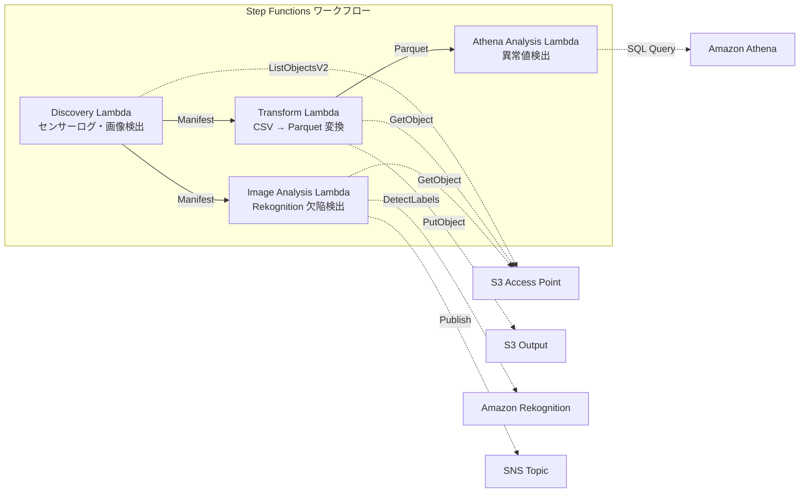

# UC3: Fertigungsindustrie — Analyse von IoT-Sensorprotokollen und Qualitätsinspektionsbildern

🌐 **Language / 言語**: [日本語](README.md) | [English](README.en.md) | [한국어](README.ko.md) | [简体中文](README.zh-CN.md) | [繁體中文](README.zh-TW.md) | [Français](README.fr.md) | Deutsch | [Español](README.es.md)

## Übersicht
Dies ist ein serverloser Workflow, der S3 Access Points von FSx for NetApp ONTAP nutzt, um Anomalien in IoT-Sensorprotokollen und Defekte in Qualitätsinspektionsbildern automatisch zu erkennen.
### Fälle, in denen dieses Muster geeignet ist
- Die CSV-Sensorprotokolle, die auf dem Dateiserver der Fabrik gespeichert werden, regelmäßig analysieren zu wollen
- Die visuelle Überprüfung von Qualitätskontrollbildern durch KI automatisieren und effizienter gestalten zu wollen
- Den bestehenden NAS-basierten Datenerfassungsfluss (PLC → Dateiserver) unverändert zu belassen und dennoch Analysen hinzufügen zu wollen
- Flexible Schwellenwert-basierte Anomalieerkennung mit Athena SQL realisieren zu wollen
- Eine stufenweise Entscheidung (automatische Annahme / manuelle Überprüfung / automatische Ablehnung) basierend auf dem Vertrauenswert von Rekognition benötigen zu wollen
### Fälle, für die dieses Muster nicht geeignet ist
- Echtzeit-Anomalieerkennung in Millisekunden (IoT Core + Kinesis wird empfohlen)
- Verarbeitung von Sensorlogs im TB-Maßstab (EMR Serverless Spark wird empfohlen)
- Eigenes trainiertes Modell für die Erkennung von Bildfehlern erforderlich (SageMaker-Endpunkt wird empfohlen)
- Sensordaten sind bereits in einer Zeitreihen-Datenbank (wie Timestream) gespeichert
### Hauptfunktionen
- Automatische Erkennung von CSV-Sensorlogs und JPEG/PNG-Inspektionsbildern über S3 AP
- Effizienzsteigerung der Analyse durch CSV → Parquet Konvertierung
- Erkennung von abnormalen Sensorwerten basierend auf Schwellenwerten mittels Amazon Athena SQL
- Defekterkennung und Setzen von manuellen Überprüfungsflags mittels Amazon Rekognition
## Architektur



### Workflow-Schritte
1. **Discovery**: CSV-Sensorlogs und JPEG/PNG-Inspektionsbilder von S3 AP entdecken und Manifest generieren
2. **Transform**: CSV-Dateien in Parquet-Format umwandeln und S3-Ausgabe (zur Effizienzsteigerung der Analyse)
3. **Athena Analysis**: Anormale Sensorwerte mithilfe von Athena SQL basierend auf Schwellenwerten erkennen
4. **Image Analysis**: Defekterkennung mit Rekognition; bei einer Zuverlässigkeit unter dem Schwellenwert manuelle Überprüfungsflag setzen
## Voraussetzungen
- AWS-Konto und geeignete IAM-Berechtigungen
- FSx for NetApp ONTAP-Dateisystem (ONTAP 9.17.1P4D3 oder höher)
- S3 Access Point aktivierter Volume
- ONTAP REST API-Anmeldeinformationen in Secrets Manager registriert
- VPC, private Subnetz
- Amazon Rekognition in verfügbaren Regionen
## Bereitstellungsschritte

### 1. Vorbereitung der Parameter
Vor dem Bereitstellen überprüfen Sie die folgenden Werte:

- FSx ONTAP S3 Access Point Alias
- ONTAP Verwaltungs-IP-Adresse
- Secrets Manager Geheimnisname
- VPC-ID, private Subnetz-ID
- Anomalieerkennungsschwelle, Defekterkennungszuverlässigkeitsschwelle
### 2. CloudFormation-Bereitstellung

```bash
aws cloudformation deploy \
  --template-file manufacturing-analytics/template.yaml \
  --stack-name fsxn-manufacturing-analytics \
  --parameter-overrides \
    S3AccessPointAlias=<your-volume-ext-s3alias> \
    S3AccessPointName=<your-s3ap-name> \
    S3AccessPointOutputAlias=<your-output-volume-ext-s3alias> \
    OntapSecretName=<your-ontap-secret-name> \
    OntapManagementIp=<your-ontap-management-ip> \
    ScheduleExpression="rate(1 hour)" \
    VpcId=<your-vpc-id> \
    PrivateSubnetIds=<subnet-1>,<subnet-2> \
    NotificationEmail=<your-email@example.com> \
    AnomalyThreshold=3.0 \
    ConfidenceThreshold=80.0 \
    EnableVpcEndpoints=false \
    EnableCloudWatchAlarms=false \
  --capabilities CAPABILITY_IAM CAPABILITY_AUTO_EXPAND \
  --region ap-northeast-1
```
> **Hinweis**: Ersetzen Sie die Platzhalter `<...>` durch die tatsächlichen Umgebungswerte.
### 3. Überprüfung der SNS-Abonnements
Nach der Bereitstellung erhalten Sie eine E-Mail zur Bestätigung der SNS-Abonnements an die angegebene E-Mail-Adresse.

> **Hinweis**: Wenn `S3AccessPointName` weggelassen wird, kann es zu einer IAM-Richtlinie ausschließlich auf Alias-Basis und einem `AccessDenied`-Fehler kommen. Es wird empfohlen, diese bei der Produktion anzugeben. Weitere Informationen finden Sie im [Fehlerbehebungsleitfaden](../docs/guides/troubleshooting-guide.md#1-accessdenied-fehler).
## Liste der Konfigurationsparameter

| パラメータ | 説明 | デフォルト | 必須 |
|-----------|------|----------|------|
| `S3AccessPointAlias` | FSx ONTAP S3 AP Alias（入力用） | — | ✅ |
| `S3AccessPointName` | S3 AP 名（ARN ベースの IAM 権限付与用。省略時は Alias ベースのみ） | `""` | ⚠️ 推奨 |
| `S3AccessPointOutputAlias` | FSx ONTAP S3 AP Alias（出力用） | — | ✅ |
| `OntapSecretName` | ONTAP 認証情報の Secrets Manager シークレット名 | — | ✅ |
| `OntapManagementIp` | ONTAP クラスタ管理 IP アドレス | — | ✅ |
| `ScheduleExpression` | EventBridge Scheduler のスケジュール式 | `rate(1 hour)` | |
| `VpcId` | VPC ID | — | ✅ |
| `PrivateSubnetIds` | プライベートサブネット ID リスト | — | ✅ |
| `NotificationEmail` | SNS 通知先メールアドレス | — | ✅ |
| `AnomalyThreshold` | 異常検出閾値（標準偏差の倍数） | `3.0` | |
| `ConfidenceThreshold` | Rekognition 欠陥検出の信頼度閾値 | `80.0` | |
| `EnableVpcEndpoints` | Interface VPC Endpoints の有効化 | `false` | |
| `EnableCloudWatchAlarms` | CloudWatch Alarms の有効化 | `false` | |
| `EnableSnapStart` | Lambda SnapStart aktivieren (Kaltstart-Reduzierung) | `false` | |
| `EnableAthenaWorkgroup` | Athena Workgroup / Glue Data Catalog の有効化 | `true` | |

## Kostenstruktur

### Abrechnung nach Anforderung (nutzungsbasiert)

| サービス | 課金単位 | 概算（100 ファイル/月） |
|---------|---------|---------------------|
| Lambda | リクエスト数 + 実行時間 | ~$0.01 |
| Step Functions | ステート遷移数 | 無料枠内 |
| S3 API | リクエスト数 | ~$0.01 |
| Athena | スキャンデータ量 | ~$0.01 |
| Rekognition | 画像数 | ~$0.10 |

### Rund-um-die-Uhr-Betrieb (optional)

| サービス | パラメータ | 月額 |
|---------|-----------|------|
| Interface VPC Endpoints | `EnableVpcEndpoints=true` | ~$28.80 |
| CloudWatch Alarms | `EnableCloudWatchAlarms=true` | ~$0.30 |
> Die Demo-/PoC-Umgebung ist ab **~0,13 €/Monat** nur mit variablen Kosten verfügbar.
## Bereinigung

```bash
# CloudFormation スタックの削除
aws cloudformation delete-stack \
  --stack-name fsxn-manufacturing-analytics \
  --region ap-northeast-1

# 削除完了を待機
aws cloudformation wait stack-delete-complete \
  --stack-name fsxn-manufacturing-analytics \
  --region ap-northeast-1
```
> **Hinweis**: Das Löschen des Stapels kann fehlschlagen, wenn sich noch Objekte im S3-Bucket befinden. Bitte leeren Sie den Bucket vorher.
## Unterstützte Regionen
UC3 verwendet die folgenden Dienste:
| サービス | リージョン制約 |
|---------|-------------|
| Amazon Athena | ほぼ全リージョンで利用可能 |
| Amazon Rekognition | ほぼ全リージョンで利用可能 |
| AWS X-Ray | ほぼ全リージョンで利用可能 |
| CloudWatch EMF | ほぼ全リージョンで利用可能 |
> Details finden Sie in der [Regionskompatibilitätsmatrix](../docs/region-compatibility.md).
## Referenz-Links

### AWS-Dokumentation
- [FSx ONTAP S3 Access Points 概要](https://docs.aws.amazon.com/fsx/latest/ONTAPGuide/accessing-data-via-s3-access-points.html)
- [Athena で SQL クエリ（公式チュートリアル）](https://docs.aws.amazon.com/fsx/latest/ONTAPGuide/tutorial-query-data-with-athena.html)
- [Glue で ETL パイプライン（公式チュートリアル）](https://docs.aws.amazon.com/fsx/latest/ONTAPGuide/tutorial-transform-data-with-glue.html)
- [Lambda でサーバーレス処理（公式チュートリアル）](https://docs.aws.amazon.com/fsx/latest/ONTAPGuide/tutorial-process-files-with-lambda.html)
- [Rekognition DetectLabels API](https://docs.aws.amazon.com/rekognition/latest/dg/API_DetectLabels.html)
### AWS-Blogbeitrag
- [S3 AP 発表ブログ](https://aws.amazon.com/blogs/aws/amazon-fsx-for-netapp-ontap-now-integrates-with-amazon-s3-for-seamless-data-access/)
- [3 つのサーバーレスアーキテクチャパターン](https://aws.amazon.com/blogs/storage/bridge-legacy-and-modern-applications-with-amazon-s3-access-points-for-amazon-fsx/)
### GitHub-Beispiel
- [aws-samples/amazon-rekognition-serverless-large-scale-image-and-video-processing](https://github.com/aws-samples/amazon-rekognition-serverless-large-scale-image-and-video-processing) — Rekognition Großflächige Verarbeitung
- [aws-samples/serverless-patterns](https://github.com/aws-samples/serverless-patterns) — Serverless-Muster
- [aws-samples/aws-stepfunctions-examples](https://github.com/aws-samples/aws-stepfunctions-examples) — Step Functions Beispiele
## Überprüfte Umgebung

| 項目 | 値 |
|------|-----|
| AWS リージョン | ap-northeast-1 (東京) |
| FSx ONTAP バージョン | ONTAP 9.17.1P4D3 |
| FSx 構成 | SINGLE_AZ_1 |
| Python | 3.12 |
| デプロイ方式 | CloudFormation (標準) |

## Lambda VPC-Konfigurationsarchitektur
Basierend auf den Erkenntnissen aus der Überprüfung sind die Lambda-Funktionen in/außerhalb der VPC aufgeteilt.

**Lambda innerhalb der VPC** (nur Funktionen, die ONTAP REST API-Zugriff benötigen):
- Discovery Lambda — S3 AP + ONTAP API

**Lambda außerhalb der VPC** (nur AWS Managed Services APIs):
- Alle anderen Lambda-Funktionen

> **Grund**: Für den Zugriff auf AWS Managed Services APIs (Athena, Bedrock, Textract usw.) von einem Lambda innerhalb der VPC aus ist ein Interface VPC Endpoint erforderlich (jeweils $7.20/Monat). Lambda außerhalb der VPC kann direkt über das Internet auf AWS APIs zugreifen und ohne zusätzliche Kosten betrieben werden.

> **Hinweis**: Für UC (UC1 Recht und Compliance) mit ONTAP REST API ist `EnableVpcEndpoints=true` erforderlich, da die ONTAP-Authentifizierungsdaten über den Secrets Manager VPC Endpoint abgerufen werden.