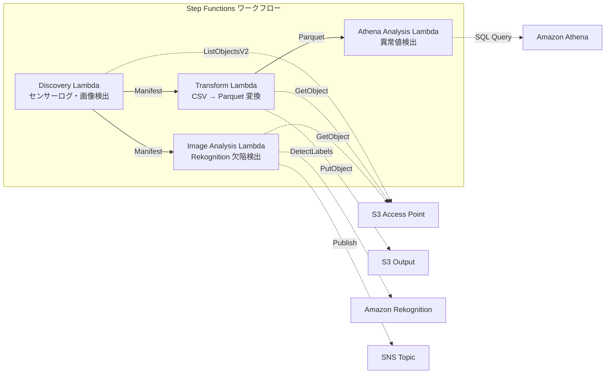

# UC3: Manufacturing Industry — Analysis of IoT Sensor Logs and Quality Inspection Images

🌐 **Language / 言語**: [日本語](README.md) | English | [한국어](README.ko.md) | [简体中文](README.zh-CN.md) | [繁體中文](README.zh-TW.md) | [Français](README.fr.md) | [Deutsch](README.de.md) | [Español](README.es.md)

📚 **Documentation**: [Architecture Diagram](docs/architecture.en.md) | [Demo Guide](docs/demo-guide.en.md)

## Overview
It is a serverless workflow that utilizes S3 Access Points in Amazon FSx for NetApp ONTAP for automatic anomaly detection in IoT sensor logs and defect detection in quality inspection images.
### When this pattern is appropriate
- We want to regularly analyze the CSV sensor logs accumulated on the factory file server
- We want to automate and streamline the visual verification of quality inspection images with AI
- We want to add analysis without changing the existing NAS-based data collection flow (PLC → file server)
- We want to achieve flexible threshold-based anomaly detection with Athena SQL
- We need a phased judgment (automatic pass/manual review/automatic fail) based on Rekognition confidence scores
### Cases where this pattern is not suitable
- Real-time anomaly detection needed with millisecond accuracy (IoT Core + Kinesis recommended)
- Bulk processing of TB-scale sensor logs (EMR Serverless Spark recommended)
- Custom trained model needed for image defect detection (SageMaker endpoint recommended)
- Sensor data already stored in a time-series database (e.g., Timestream)
### Main features
- Automatic detection of CSV sensor logs and JPEG/PNG inspection images via S3 AP
- Efficiency improvement in analysis through CSV to Parquet conversion
- Detection of abnormal sensor values based on thresholds using Amazon Athena SQL
- Defect detection and manual review flag setting using Amazon Rekognition
## Architecture



### Workflow Steps
1. **Discovery**: Discover CSV sensor logs and JPEG/PNG inspection images from S3 AP and generate Manifest
2. **Transform**: Convert CSV files to Parquet format for S3 output (enhancing analysis efficiency)
3. **Athena Analysis**: Detect abnormal sensor values using Athena SQL based on threshold
4. **Image Analysis**: Use Rekognition to detect defects; set a manual review flag if confidence is below the threshold
## Prerequisites
- AWS account and appropriate IAM permissions
- FSx for NetApp ONTAP file system (ONTAP 9.17.1P4D3 or later)
- S3 Access Point enabled volume
- ONTAP REST API credentials registered in Secrets Manager
- VPC, private subnets
- Amazon Rekognition available region
## Deployment Steps

### 1. Preparing Parameters
Before deployment, confirm the following values:

- FSx ONTAP S3 Access Point Alias
- ONTAP Management IP address
- Secrets Manager Secret name
- VPC ID, Private Subnet ID
- Anomaly Detection Threshold, Defect Detection Confidence Threshold
### 2. CloudFormation Deployment

```bash
aws cloudformation deploy \
  --template-file manufacturing-analytics/template.yaml \
  --stack-name fsxn-manufacturing-analytics \
  --parameter-overrides \
    S3AccessPointAlias=<your-volume-ext-s3alias> \
    S3AccessPointName=<your-s3ap-name> \
    S3AccessPointOutputAlias=<your-output-volume-ext-s3alias> \
    OntapSecretName=<your-ontap-secret-name> \
    OntapManagementIp=<your-ontap-management-ip> \
    ScheduleExpression="rate(1 hour)" \
    VpcId=<your-vpc-id> \
    PrivateSubnetIds=<subnet-1>,<subnet-2> \
    NotificationEmail=<your-email@example.com> \
    AnomalyThreshold=3.0 \
    ConfidenceThreshold=80.0 \
    EnableVpcEndpoints=false \
    EnableCloudWatchAlarms=false \
  --capabilities CAPABILITY_IAM CAPABILITY_AUTO_EXPAND \
  --region ap-northeast-1
```
> **Note**: Replace the placeholder `<...>` with the actual environment values.
### 3. Checking SNS Subscription
After deployment, an SNS subscription confirmation email will be sent to the specified email address.

> **Note**: If `S3AccessPointName` is omitted, the IAM policy may become Alias-based only, resulting in an `AccessDenied` error. Specifying it is recommended for production environments. For more details, refer to the [Troubleshooting Guide](../docs/guides/troubleshooting-guide.md#1-accessdenied-error).
## List of Configuration Parameters

| パラメータ | 説明 | デフォルト | 必須 |
|-----------|------|----------|------|
| `S3AccessPointAlias` | FSx ONTAP S3 AP Alias（入力用） | — | ✅ |
| `S3AccessPointName` | S3 AP 名（ARN ベースの IAM 権限付与用。省略時は Alias ベースのみ） | `""` | ⚠️ 推奨 |
| `S3AccessPointOutputAlias` | FSx ONTAP S3 AP Alias（出力用） | — | ✅ |
| `OntapSecretName` | ONTAP 認証情報の Secrets Manager シークレット名 | — | ✅ |
| `OntapManagementIp` | ONTAP クラスタ管理 IP アドレス | — | ✅ |
| `ScheduleExpression` | EventBridge Scheduler のスケジュール式 | `rate(1 hour)` | |
| `VpcId` | VPC ID | — | ✅ |
| `PrivateSubnetIds` | プライベートサブネット ID リスト | — | ✅ |
| `NotificationEmail` | SNS 通知先メールアドレス | — | ✅ |
| `AnomalyThreshold` | 異常検出閾値（標準偏差の倍数） | `3.0` | |
| `ConfidenceThreshold` | Rekognition 欠陥検出の信頼度閾値 | `80.0` | |
| `EnableVpcEndpoints` | Interface VPC Endpoints の有効化 | `false` | |
| `EnableCloudWatchAlarms` | CloudWatch Alarms の有効化 | `false` | |
| `EnableSnapStart` | Enable Lambda SnapStart (cold start reduction) | `false` | |
| `EnableAthenaWorkgroup` | Athena Workgroup / Glue Data Catalog の有効化 | `true` | |

## Cost structure

### Request-based (Pay-as-you-go)

| サービス | 課金単位 | 概算（100 ファイル/月） |
|---------|---------|---------------------|
| Lambda | リクエスト数 + 実行時間 | ~$0.01 |
| Step Functions | ステート遷移数 | 無料枠内 |
| S3 API | リクエスト数 | ~$0.01 |
| Athena | スキャンデータ量 | ~$0.01 |
| Rekognition | 画像数 | ~$0.10 |

### Always On (Optional)

| サービス | パラメータ | 月額 |
|---------|-----------|------|
| Interface VPC Endpoints | `EnableVpcEndpoints=true` | ~$28.80 |
| CloudWatch Alarms | `EnableCloudWatchAlarms=true` | ~$0.30 |
In the demo/PoC environment, it is available starting at just **~$0.13 per month** with variable costs.
## Cleanup

```bash
# CloudFormation スタックの削除
aws cloudformation delete-stack \
  --stack-name fsxn-manufacturing-analytics \
  --region ap-northeast-1

# 削除完了を待機
aws cloudformation wait stack-delete-complete \
  --stack-name fsxn-manufacturing-analytics \
  --region ap-northeast-1
```
> **Note**: If there are remaining objects in the S3 bucket, the stack deletion may fail. Please empty the bucket in advance.
## Supported Regions
UC3 uses the following services:
| サービス | リージョン制約 |
|---------|-------------|
| Amazon Athena | ほぼ全リージョンで利用可能 |
| Amazon Rekognition | ほぼ全リージョンで利用可能 |
| AWS X-Ray | ほぼ全リージョンで利用可能 |
| CloudWatch EMF | ほぼ全リージョンで利用可能 |
> See the [Region Compatibility Matrix](../docs/region-compatibility.md) for details.
## References

### AWS Official Documentation
- [FSx for NetApp ONTAP S3 Access Points Overview](https://docs.aws.amazon.com/fsx/latest/ONTAPGuide/accessing-data-via-s3-access-points.html)
- [SQL Queries with Athena (Official Tutorial)](https://docs.aws.amazon.com/fsx/latest/ONTAPGuide/tutorial-query-data-with-athena.html)
- [ETL Pipelines with Glue (Official Tutorial)](https://docs.aws.amazon.com/fsx/latest/ONTAPGuide/tutorial-transform-data-with-glue.html)
- [Serverless Processing with Lambda (Official Tutorial)](https://docs.aws.amazon.com/fsx/latest/ONTAPGuide/tutorial-process-files-with-lambda.html)
- [Rekognition DetectLabels API](https://docs.aws.amazon.com/rekognition/latest/dg/API_DetectLabels.html)
### AWS Blog Post
- [Amazon FSx for NetApp ONTAP now integrates with Amazon S3 for seamless data access blog announcement](https://aws.amazon.com/blogs/aws/amazon-fsx-for-netapp-ontap-now-integrates-with-amazon-s3-for-seamless-data-access/)
- [Three serverless architecture patterns](https://aws.amazon.com/blogs/storage/bridge-legacy-and-modern-applications-with-amazon-s3-access-points-for-amazon-fsx/)
### GitHub Samples
- [aws-samples/amazon-rekognition-serverless-large-scale-image-and-video-processing](https://github.com/aws-samples/amazon-rekognition-serverless-large-scale-image-and-video-processing) — Large-Scale Image and Video Processing with Amazon Rekognition
- [aws-samples/serverless-patterns](https://github.com/aws-samples/serverless-patterns) — Collection of Serverless Patterns
- [aws-samples/aws-stepfunctions-examples](https://github.com/aws-samples/aws-stepfunctions-examples) — AWS Step Functions Examples
## Validated Environment

| 項目 | 値 |
|------|-----|
| AWS リージョン | ap-northeast-1 (東京) |
| FSx ONTAP バージョン | ONTAP 9.17.1P4D3 |
| FSx 構成 | SINGLE_AZ_1 |
| Python | 3.12 |
| デプロイ方式 | CloudFormation (標準) |

## Lambda VPC Configuration Architecture
Based on the findings from the validation, Lambda functions are deployed either inside or outside the VPC.

**Lambda inside VPC** (only for functions that require ONTAP REST API access):
- Discovery Lambda — S3 AP + ONTAP API

**Lambda outside VPC** (only using AWS managed service APIs):
- All other Lambda functions

> **Reason**: To access AWS managed service APIs (Athena, Bedrock, Textract, etc.) from a Lambda inside the VPC, an Interface VPC Endpoint is required (at $7.20/month each). Lambda functions outside the VPC can directly access AWS APIs over the internet and operate without additional costs.

> **Note**: For UC (UC1 Legal & Compliance) that uses ONTAP REST API, `EnableVpcEndpoints=true` is mandatory. This is because ONTAP credentials are retrieved via the Secrets Manager VPC Endpoint.