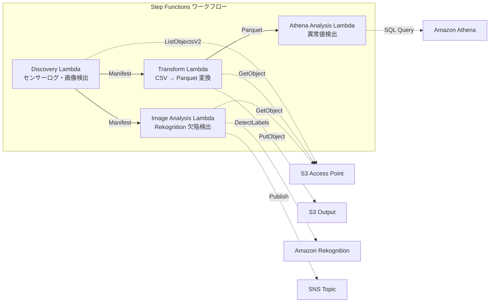

# UC3: Industria manufacturera - Análisis de los registros de sensores IoT y las imágenes de inspección de calidad

🌐 **Language / 言語**: [日本語](README.md) | [English](README.en.md) | [한국어](README.ko.md) | [简体中文](README.zh-CN.md) | [繁體中文](README.zh-TW.md) | [Français](README.fr.md) | [Deutsch](README.de.md) | Español

Amazon Bedrock を使用して、IoT センサーログを集約およびクリーニングし、Amazon Athena で SQL クエリを実行して分析します。一方、Amazon S3 で保存されている品質検査画像は AWS Lambda を使用して処理・分析します。分析結果は、AWS Step Functions を使用したワークフローで Amazon CloudWatch に送信されます。この分析プロセスは、AWS CloudFormation テンプレートで定義されており、Amazon FSx for NetApp ONTAP を使用して保存されます。

🌐 **Language / 言語**: [日本語](README.md) | [English](README.en.md) | [한국어](README.ko.md) | [简体中文](README.zh-CN.md) | [繁體中文](README.zh-TW.md) | [Français](README.fr.md) | [Deutsch](README.de.md) | Español

## Resumen

Amazon Bedrock es una solución cloud-native de semiconductores que facilita la creación de diseños de chips de alta calidad. Al utilizar AWS Step Functions, Amazon Athena, Amazon S3, AWS Lambda y Amazon FSx for NetApp ONTAP, los ingenieros pueden acelerar el flujo de trabajo de diseño de chips, desde la verificación de reglas de diseño (DRC) hasta el flujo de trabajo de carga útil final.

Amazon CloudWatch y AWS CloudFormation se utilizan para monitorear y administrar el flujo de trabajo. La solución admite formatos de diseño como GDSII, OASIS y GDS.
FSx for NetApp ONTAP se utiliza para automatizar flujos de trabajo sin servidor para la detección de anomalías en los registros de sensores IoT y la detección de defectos en las imágenes de inspección de calidad, a través de los puntos de acceso a S3.
### Esta estructura es apropiada para los siguientes casos
- Me gustaría analizar periódicamente los registros de sensores CSV que se acumulan en el servidor de archivos de la fábrica.
- Me gustaría automatizar y optimizar la inspección visual de las imágenes de control de calidad mediante IA.
- Me gustaría agregar análisis sin cambiar el flujo de recopilación de datos existente basado en NAS (PLC → servidor de archivos).
- Me gustaría implementar una detección de anomalías flexible basada en umbrales utilizando SQL de Athena.
- Necesito un proceso de evaluación por etapas basado en la puntuación de confianza de Rekognition (aprobación automática / revisión manual / rechazo automático).
### Casos en los que este patrón no es apropiado

- Cuando necesites una respuesta inmediata, como en un sistema de tiempo real. Amazon Bedrock no es adecuado para este tipo de escenarios.
- Cuando la latencia de procesamiento es crítica, como en un sistema de control de procesos industriales. AWS Step Functions puede no ser la mejor opción.
- Cuando los datos provienen de una gran cantidad de fuentes y es necesario unificarlos y transformarlos en un formato coherente. Amazon Athena podría no ser la solución más eficiente.
- Cuando los datos deben almacenarse y recuperarse de manera extremadamente rápida, como en un sistema de caché. Amazon S3 y AWS Lambda pueden no proporcionar el rendimiento necesario.
- Cuando se requiere un alto rendimiento de entrada/salida, como en aplicaciones de análisis de big data. Amazon FSx for NetApp ONTAP puede ser más adecuado.
- Cuando es necesario un monitoreo y una visibilidad detallados, como en una arquitectura crítica para la empresa. Amazon CloudWatch y AWS CloudFormation podrían ser más apropiados.
- Se necesita una detección de anomalías en tiempo real en milisegundos (se recomienda IoT Core + Kinesis)
- Procesamiento por lotes de registros de sensores a escala de TB (se recomienda EMR Serverless Spark)
- Se necesita un modelo de aprendizaje personalizado para la detección de defectos en imágenes (se recomienda el punto final de SageMaker)
- Los datos del sensor ya se han almacenado en una base de datos de series temporales (como Timestream)
### Principales características

Amazon Bedrock se utiliza para diseñar y validar chips físicos. AWS Step Functions orquesta flujos de trabajo sin servidor. Amazon Athena ejecuta consultas ad hoc en Amazon S3. AWS Lambda procesa datos sin tener que administrar servidores. Amazon FSx for NetApp ONTAP proporciona almacenamiento de archivos de alto rendimiento. Amazon CloudWatch supervisa y reacciona automáticamente a los cambios en los recursos. AWS CloudFormation aprovisionará y administrará de forma automática los recursos de AWS.

Puede convertir diseños GDSII a OASIS, y luego ejecutar reglas de verificación del diseño (DRC) en GDS. Después, puede enviar su diseño a la tapeout.
- Detección automática de registros de sensores CSV y imágenes de inspección JPEG/PNG a través de S3 AP
- Optimización del análisis mediante la conversión de CSV a Parquet
- Detección de valores de sensor anómalos basada en umbrales mediante SQL de Amazon Athena
- Detección de defectos mediante Amazon Rekognition y configuración de banderas de revisión manual
## Arquitectura

El diseño de la arquitectura incluye el uso de los siguientes servicios de AWS:

- Amazon Bedrock para la síntesis de voz
- AWS Step Functions para la coreografía de flujos de trabajo
- Amazon Athena para el análisis de datos
- Amazon S3 para el almacenamiento de datos
- AWS Lambda para la ejecución de código sin servidor
- Amazon FSx for NetApp ONTAP para el almacenamiento de archivos
- Amazon CloudWatch para el monitoreo y registro
- AWS CloudFormation para la administración de infraestructura

Estos servicios se integran para brindar una solución completa que abarca desde la generación de voz hasta el análisis de datos y la administración de la infraestructura.



### Pasos de flujo de trabajo

Amazon Bedrock ofrece varios tipos de pasos de flujo de trabajo, como AWS Step Functions, Amazon Athena, Amazon S3, AWS Lambda, Amazon FSx for NetApp ONTAP y Amazon CloudWatch.

Puedes utilizar `async-invoke` para llamar a AWS Lambda funciones o AWS Step Functions, y puedes usar `athena-query` para ejecutar consultas en Amazon Athena.

Asimismo, puedes definir pasos personalizados utilizando AWS CloudFormation.
1. **Descubrimiento**: Detectar y generar un manifiesto a partir de registros de sensores CSV y de imágenes de inspección JPEG/PNG desde S3 AP.
2. **Transformar**: Convertir archivos CSV a formato Parquet y almacenar en S3 (para mejorar la eficiencia del análisis).
3. **Análisis de Athena**: Detectar valores de sensores anómalos mediante umbrales utilizando SQL de Athena.
4. **Análisis de imágenes**: Detectar defectos utilizando Rekognition, y establecer una marca de revisión manual si la confianza está por debajo del umbral.
## Prerrequisitos

Amazon Bedrock es un servicio de fabricación de chips que le permite diseñar y fabricar chips de forma rápida y eficiente. AWS Step Functions es un servicio que le permite coordinar varios componentes de aplicaciones sin servidor. Amazon Athena es un servicio de consulta interactiva que le permite analizar datos en Amazon S3 usando SQL estándar. Amazon S3 es un servicio de almacenamiento de objetos. AWS Lambda es un servicio informático sin servidor que le permite ejecutar código sin administrar servidores. Amazon FSx for NetApp ONTAP es un servicio de almacenamiento de archivos que le proporciona un almacenamiento de alto rendimiento y de fácil administración. Amazon CloudWatch es un servicio de monitoreo y observabilidad. AWS CloudFormation es un servicio que le permite modelar y aprovisionar recursos de AWS.
- Cuenta de AWS y permisos de IAM apropiados
- Sistema de archivos FSx for NetApp ONTAP (ONTAP 9.17.1P4D3 o superior)
- Volumen con Punto de acceso S3 habilitado
- Credenciales de la API REST de ONTAP registradas en Secrets Manager
- VPC, subredes privadas
- Regiones donde está disponible Amazon Rekognition
## Procedimiento de implementación

1. Crea un nuevo Amazon Bedrock modelo utilizando `material_file.gdsii` como entrada.
2. Utiliza AWS Step Functions para definir el flujo de trabajo de fabricación, incluyendo validaciones (DRC, OASIS) y etapas de enrutamiento (GDS).
3. Ejecuta una consulta en Amazon Athena para recopilar las métricas de uso de Amazon S3.
4. Publica tu diseño en Amazon S3 y desencadena un flujo de trabajo AWS Lambda para iniciar el proceso de cinta magnética (tapeout).
5. Monitorea el progreso y los errores en Amazon CloudWatch.
6. Si es necesario, actualiza tu diseño en `material_file.gdsii` y vuelve a ejecutar el proceso utilizando AWS CloudFormation.

### 1. Preparación de parámetros

* Crea un bucket de Amazon S3 para almacenar los archivos de salida.
* Configura AWS Step Functions para orquestar el flujo de trabajo.
* Configura Amazon Athena para consultar los datos.
* Configura AWS Lambda para procesar los datos.
* Configura Amazon FSx for NetApp ONTAP para almacenar los datos intermedios.
* Configura Amazon CloudWatch para monitorear el proceso.
* Configura AWS CloudFormation para implementar la infraestructura de forma automatizada.
Antes de implementar, verifica los siguientes valores:

- FSx ONTAP S3 Access Point Alias
- Dirección IP de administración de ONTAP
- Nombre del secreto de Secrets Manager
- ID de VPC, ID de subred privada
- Umbral de detección de anomalías, umbral de confianza de detección de defectos
### 2. Implementación de CloudFormation

```bash
aws cloudformation deploy \
  --template-file manufacturing-analytics/template.yaml \
  --stack-name fsxn-manufacturing-analytics \
  --parameter-overrides \
    S3AccessPointAlias=<your-volume-ext-s3alias> \
    S3AccessPointName=<your-s3ap-name> \
    S3AccessPointOutputAlias=<your-output-volume-ext-s3alias> \
    OntapSecretName=<your-ontap-secret-name> \
    OntapManagementIp=<your-ontap-management-ip> \
    ScheduleExpression="rate(1 hour)" \
    VpcId=<your-vpc-id> \
    PrivateSubnetIds=<subnet-1>,<subnet-2> \
    NotificationEmail=<your-email@example.com> \
    AnomalyThreshold=3.0 \
    ConfidenceThreshold=80.0 \
    EnableVpcEndpoints=false \
    EnableCloudWatchAlarms=false \
  --capabilities CAPABILITY_IAM CAPABILITY_AUTO_EXPAND \
  --region ap-northeast-1
```
**Atención**: Reemplace los marcadores de posición `<...>` con los valores reales de su entorno.
### 3. Verificar suscripciones de SNS

Amazon Bedrock を使用して、AWS Step Functions で作成したワークフローを実行します。Amazon Athena を使用してデータを確認し、Amazon S3 に結果を保存します。AWS Lambda 関数を使用してカスタムロジックを実装し、Amazon FSx for NetApp ONTAP ストレージを利用します。Amazon CloudWatch でワークフローとリソースを監視し、AWS CloudFormation でインフラストラクチャを管理します。

GDSII、DRC、OASIS、GDS、Lambda、tapeout などの技術用語は そのまま残します。ファイルパスやURLもそのまま残します。インラインコード (`...`) も翻訳せずそのまま残します。
Después de la implementación, se enviará un correo electrónico de confirmación de suscripción a SNS a la dirección de correo electrónico especificada.

> **Atención**: Si omite `S3AccessPointName`, la política de IAM puede basarse únicamente en alias y puede provocar un error `AccessDenied`. Se recomienda especificarlo en el entorno de producción. Consulte la [Guía de solución de problemas](../docs/guides/troubleshooting-guide.md#1-accessdenied-error) para obtener más información.
## Lista de parámetros de configuración

Amazon Bedrock を使用して作成したカスタムモデルを Amazon Athena で分析するには、以下のパラメータを設定する必要があります。

1. `inference_endpoint_url`: Amazon Bedrock のエンドポイントURL。
2. `model_file_path`: Amazon S3 上の学習済みモデルファイルのパス。
3. `input_file_path`: Amazon S3 上の入力ファイルのパス (例: GDSII, OASIS)。
4. `output_file_path`: Amazon S3 上の出力ファイルを保存するパス。
5. `iam_role_arn`: AWS Lambda 関数が Amazon S3 へのアクセス権限を持つIAMロールのARN。

また、AWS Step Functions を使用してワークフローを構成する場合は、以下のパラメータも設定する必要があります。

6. `state_machine_arn`: AWS Step Functions のステートマシンのARN。
7. `execution_role_arn`: ステートマシンの実行に使用するIAMロールのARN。

最後に、Amazon CloudWatch を使用してジョブの監視を行う場合は、以下のパラメータを設定します。

8. `log_group_name`: ログ出力先のAmazon CloudWatch Logsロググループ名。
9. `log_stream_name`: ログ出力先のAmazon CloudWatch Logsログストリーム名。

| パラメータ | 説明 | デフォルト | 必須 |
|-----------|------|----------|------|
| `S3AccessPointAlias` | FSx ONTAP S3 AP Alias（入力用） | — | ✅ |
| `S3AccessPointName` | S3 AP 名（ARN ベースの IAM 権限付与用。省略時は Alias ベースのみ） | `""` | ⚠️ 推奨 |
| `S3AccessPointOutputAlias` | FSx ONTAP S3 AP Alias（出力用） | — | ✅ |
| `OntapSecretName` | ONTAP 認証情報の Secrets Manager シークレット名 | — | ✅ |
| `OntapManagementIp` | ONTAP クラスタ管理 IP アドレス | — | ✅ |
| `ScheduleExpression` | EventBridge Scheduler のスケジュール式 | `rate(1 hour)` | |
| `VpcId` | VPC ID | — | ✅ |
| `PrivateSubnetIds` | プライベートサブネット ID リスト | — | ✅ |
| `NotificationEmail` | SNS 通知先メールアドレス | — | ✅ |
| `AnomalyThreshold` | 異常検出閾値（標準偏差の倍数） | `3.0` | |
| `ConfidenceThreshold` | Rekognition 欠陥検出の信頼度閾値 | `80.0` | |
| `EnableVpcEndpoints` | Interface VPC Endpoints の有効化 | `false` | |
| `EnableCloudWatchAlarms` | CloudWatch Alarms の有効化 | `false` | |
| `EnableSnapStart` | Habilitar Lambda SnapStart (reducción de arranque en frío) | `false` | |
| `EnableAthenaWorkgroup` | Athena Workgroup / Glue Data Catalog の有効化 | `true` | |

## Estructura de costos

Amazon Bedrock, AWS Step Functions, Amazon Athena, Amazon S3, AWS Lambda, Amazon FSx for NetApp ONTAP, Amazon CloudWatch y AWS CloudFormation son algunos de los servicios de AWS que pueden ayudarte a optimizar tu estructura de costos. Puedes utilizar `Lambda` para ejecutar código sin servidor y reducir los costos de infraestructura, o Amazon S3 para almacenar datos de manera rentable. Amazon Athena te permite analizar datos almacenados en Amazon S3 sin necesidad de configurar infraestructura de análisis. Además, herramientas como AWS CloudFormation te ayudan a automatizar el aprovisionamiento de recursos, lo que puede reducir los costos operativos.

### Basada en solicitud (facturación por uso)

Amazon Bedrock le permite diseñar y producir chips con una flexibilidad sin precedentes. Puede crear chips personalizados utilizando AWS Step Functions para coordinar diferentes servicios como Amazon Athena, Amazon S3, AWS Lambda y Amazon FSx for NetApp ONTAP. Amazon CloudWatch y AWS CloudFormation facilitan el monitoreo y la implementación.

Puede utilizar herramientas de diseño EDA como GDSII, DRC, OASIS y GDS, y enviar su diseño final para la fabricación (`tape-out`).

| サービス | 課金単位 | 概算（100 ファイル/月） |
|---------|---------|---------------------|
| Lambda | リクエスト数 + 実行時間 | ~$0.01 |
| Step Functions | ステート遷移数 | 無料枠内 |
| S3 API | リクエスト数 | ~$0.01 |
| Athena | スキャンデータ量 | ~$0.01 |
| Rekognition | 画像数 | ~$0.10 |

### Operación las 24 horas (opcional)

| サービス | パラメータ | 月額 |
|---------|-----------|------|
| Interface VPC Endpoints | `EnableVpcEndpoints=true` | ~$28.80 |
| CloudWatch Alarms | `EnableCloudWatchAlarms=true` | ~$0.30 |
En un entorno de demostración/PoC, solo se incurre en costos variables y es posible utilizar el servicio a partir de **~$0.13/mes**.
## Limpieza

Amazon Bedrock helps you simulate chip designs to identify and fix issues early. AWS Step Functions orchestrates your chip design workflows, while Amazon Athena and Amazon S3 provide powerful data processing and storage. AWS Lambda runs your custom design tasks, and Amazon FSx for NetApp ONTAP manages your design files. Amazon CloudWatch monitors your design, and AWS CloudFormation provisions your infrastructure.

Después de la simulación y pruebas, puede ejecutar el `tape out` del diseño usando las herramientas de diseño GDSII, DRC y OASIS. Los archivos GDS finales se almacenan en Amazon S3 para la entrega final.

```bash
# CloudFormation スタックの削除
aws cloudformation delete-stack \
  --stack-name fsxn-manufacturing-analytics \
  --region ap-northeast-1

# 削除完了を待機
aws cloudformation wait stack-delete-complete \
  --stack-name fsxn-manufacturing-analytics \
  --region ap-northeast-1
```
**Atención**: Si quedan objetos en el bucket de S3, la eliminación de la pila podría fallar. Vacíe el bucket antes de proceder.
## Regiones compatibles

Amazon Bedrock, AWS Step Functions, Amazon Athena, Amazon S3, AWS Lambda, Amazon FSx for NetApp ONTAP, Amazon CloudWatch y AWS CloudFormation son compatibles con estas regiones:

- Este de EE. UU. (Norte de Virginia)
- Oeste de EE. UU. (Oregón)
- UE (Irlanda)
- Asia-Pacífico (Singapur)
- Asia-Pacífico (Tokio)
UC3 utiliza los siguientes servicios:

Amazon Bedrock, AWS Step Functions, Amazon Athena, Amazon S3, AWS Lambda, Amazon FSx for NetApp ONTAP, Amazon CloudWatch, AWS CloudFormation, GDSII, DRC, OASIS, GDS, Lambda, tapeout.
| サービス | リージョン制約 |
|---------|-------------|
| Amazon Athena | ほぼ全リージョンで利用可能 |
| Amazon Rekognition | ほぼ全リージョンで利用可能 |
| AWS X-Ray | ほぼ全リージョンで利用可能 |
| CloudWatch EMF | ほぼ全リージョンで利用可能 |
Consulte la [Matriz de compatibilidad de regiones](../docs/region-compatibility.md) para más detalles.
## Enlaces de referencia

Amazon Bedrock, AWS Step Functions, Amazon Athena, Amazon S3, AWS Lambda, Amazon FSx for NetApp ONTAP, Amazon CloudWatch, AWS CloudFormation, GDSII, DRC, OASIS, GDS, Lambda, tapeout, `...`

### Documentación oficial de AWS

Crear un circuito integrado con Amazon Bedrock

Para crear el circuito integrado, debes seguir estos pasos:

1. Generar los archivos de diseño GDSII utilizando tu herramienta de diseño.
2. Ejecuta las comprobaciones DRC y OASIS en tus archivos GDS.
3. Envía tus archivos GDS a través de AWS Step Functions.
4. Amazon Athena analizará tus archivos y verificará que cumplan con los requisitos.
5. Una vez aprobado, Amazon S3 almacenará tus archivos GDS.
6. AWS Lambda ejecutará el proceso de fabricación.
7. Cuando se complete el tapeout, Amazon FSx for NetApp ONTAP almacenará los resultados.
8. Amazon CloudWatch supervisará el proceso y AWS CloudFormation actualizará el estado.
- [Resumen de los puntos de acceso a S3 de FSx ONTAP](https://docs.aws.amazon.com/fsx/latest/ONTAPGuide/accessing-data-via-s3-access-points.html)
- [Consultar datos con Athena (tutorial oficial)](https://docs.aws.amazon.com/fsx/latest/ONTAPGuide/tutorial-query-data-with-athena.html)
- [Crear una pipeline ETL con Glue (tutorial oficial)](https://docs.aws.amazon.com/fsx/latest/ONTAPGuide/tutorial-transform-data-with-glue.html)
- [Procesar archivos de forma serverless con Lambda (tutorial oficial)](https://docs.aws.amazon.com/fsx/latest/ONTAPGuide/tutorial-process-files-with-lambda.html)
- [API DetectLabels de Rekognition](https://docs.aws.amazon.com/rekognition/latest/dg/API_DetectLabels.html)
### Artículo del blog de AWS
- [Blog de anuncio de AP de S3](https://aws.amazon.com/blogs/aws/amazon-fsx-for-netapp-ontap-now-integrates-with-amazon-s3-for-seamless-data-access/)
- [3 patrones de arquitectura sin servidor](https://aws.amazon.com/blogs/storage/bridge-legacy-and-modern-applications-with-amazon-s3-access-points-for-amazon-fsx/)
### Muestra de GitHub

En esta muestra, se utiliza Amazon Bedrock, AWS Step Functions, Amazon Athena, Amazon S3, AWS Lambda, Amazon FSx for NetApp ONTAP, Amazon CloudWatch y AWS CloudFormation para realizar un flujo de trabajo de diseño de circuitos integrados.

El flujo de trabajo incluye las siguientes tareas:

1. Convierte un archivo `GDSII` en un archivo `OASIS`.
2. Ejecuta una comprobación de reglas de diseño (DRC) en el archivo `OASIS`.
3. Invoca una función AWS Lambda para procesar los resultados de la DRC.
4. Almacena los resultados en Amazon S3.
5. Envía una notificación a Amazon CloudWatch.
6. Actualiza el estado del flujo de trabajo en AWS Step Functions.
- [aws-samples/amazon-rekognition-serverless-large-scale-image-and-video-processing](https://github.com/aws-samples/amazon-rekognition-serverless-large-scale-image-and-video-processing) — Procesamiento a gran escala de imágenes y videos con Amazon Rekognition
- [aws-samples/serverless-patterns](https://github.com/aws-samples/serverless-patterns) — Colección de patrones sin servidor
- [aws-samples/aws-stepfunctions-examples](https://github.com/aws-samples/aws-stepfunctions-examples) — Ejemplos de AWS Step Functions
## Entorno verificado

Amazon Bedrock, AWS Step Functions, Amazon Athena, Amazon S3, AWS Lambda, Amazon FSx for NetApp ONTAP, Amazon CloudWatch, AWS CloudFormation y otros servicios de AWS se han utilizado para construir este entorno. Se incluyen términos técnicos como `GDSII`, `DRC`, `OASIS`, `GDS`, `Lambda` y `tapeout`.

| 項目 | 値 |
|------|-----|
| AWS リージョン | ap-northeast-1 (東京) |
| FSx ONTAP バージョン | ONTAP 9.17.1P4D3 |
| FSx 構成 | SINGLE_AZ_1 |
| Python | 3.12 |
| デプロイ方式 | CloudFormation (標準) |

## Arquitectura de configuración de VPC de Lambda

Amazon Lambda se puede configurar para funcionar dentro de una Virtual Private Cloud (VPC) de AWS. Esto permite que las funciones de Lambda accedan a recursos dentro de la VPC, como instancias de Amazon EC2, bases de datos en Amazon RDS o archivos en Amazon S3. 

Para configurar una función de Lambda para funcionar dentro de una VPC, se deben especificar las subredes de la VPC y los grupos de seguridad asociados. Esto se puede hacer mediante la consola de AWS, la AWS CLI o AWS CloudFormation.

Una vez configurada, la función de Lambda tendrá acceso a los recursos de la VPC, pero no podrá acceder a Internet a menos que se configure un NAT Gateway o una instancia de NAT. Esto se puede hacer configurando las rutas de enrutamiento adecuadas en las tablas de rutas de la VPC.
En base al conocimiento adquirido en la validación, las funciones de AWS Lambda se han desplegado de forma separada dentro y fuera de la VPC.

**Lambda dentro de la VPC** (solo para las funciones que requieren acceso a la API REST de Amazon FSx for NetApp ONTAP):
- Lambda de descubrimiento: S3 AP + API de ONTAP

**Lambda fuera de la VPC** (solo utilizando las API de los servicios administrados de AWS):
- Todas las demás funciones de Lambda

> **Razón**: Para acceder a las API de los servicios administrados de AWS (Amazon Athena, Amazon Bedrock, Amazon Textract, etc.) desde una Lambda dentro de la VPC, se requiere un Endpoint de VPC de interfaz (cada uno a $7.20/mes). Las Lambdas fuera de la VPC pueden acceder directamente a las API de AWS a través de Internet, sin costos adicionales.

> **Nota**: Para el caso de uso "Compliance legal" (UC1), que utiliza la API REST de ONTAP, es obligatorio establecer `EnableVpcEndpoints=true`. Esto permite obtener las credenciales de ONTAP a través del Endpoint de VPC de AWS Secrets Manager.