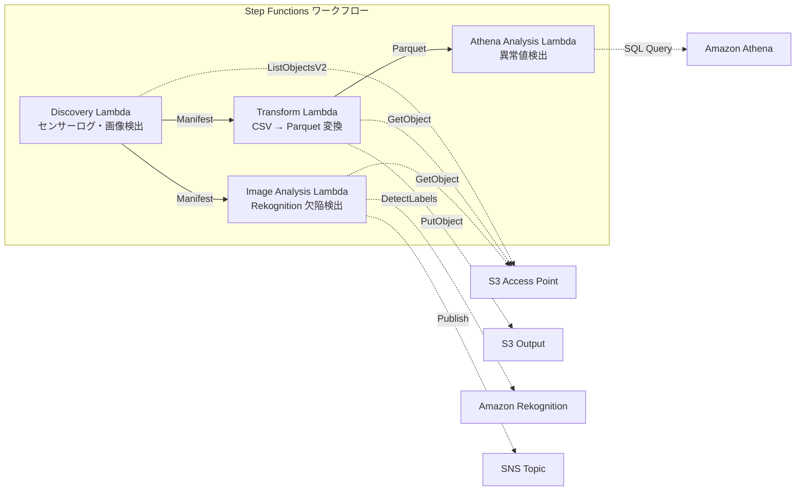

# UC3 : Industrie manufacturière — Analyse des journaux de capteurs IoT et des images d'inspection de qualité

🌐 **Language / 言語**: [日本語](README.md) | [English](README.en.md) | [한국어](README.ko.md) | [简体中文](README.zh-CN.md) | [繁體中文](README.zh-TW.md) | Français | [Deutsch](README.de.md) | [Español](README.es.md)

## Aperçu
Voici un workflow sans serveur qui utilise les points d'accès S3 de FSx for NetApp ONTAP pour automatiser la détection des anomalies dans les journaux de capteurs IoT et la détection des défauts dans les images d'inspection de qualité.
### Cas où ce modèle est approprié
- Je souhaite analyser périodiquement les journaux de capteurs CSV stockés sur le serveur de fichiers de l'usine
- Je souhaite automatiser et rationaliser la vérification visuelle des images d'inspection de la qualité par l'IA
- Je souhaite ajouter une analyse sans modifier le flux de collecte de données NAS existant (PLC → serveur de fichiers)
- Je souhaite mettre en œuvre une détection flexible d'anomalies basée sur des seuils avec Athena SQL
- Un jugement progressif (validation automatique / révision manuelle / rejet automatique) basé sur les scores de confiance de Rekognition est nécessaire
### Cas où ce modèle ne convient pas
- Détection en temps réel des anomalies en millisecondes (recommandation : IoT Core + Kinesis)
- Traitement par lots de logs de capteurs à l'échelle du To (recommandation : EMR Serverless Spark)
- Détection des défauts d'images nécessitant un modèle appris spécifique (recommandation : endpoint SageMaker)
- Données de capteurs déjà stockées dans une base de données temporelle (Timestream, etc.)
### Principales fonctionnalités
- Détection automatique des journaux de capteurs CSV et des images d'inspection JPEG/PNG via S3 AP
- Amélioration de l'efficacité analytique grâce à la conversion CSV → Parquet
- Détection de valeurs de capteurs anormales basées sur des seuils avec Amazon Athena SQL
- Détection des défauts et configuration des drapeaux de révision manuelle avec Amazon Rekognition
## Architecture



### Étapes du flux de travail
1. **Découverte** : Détecter les journaux de capteurs CSV et les images d'inspection JPEG/PNG à partir de S3 AP et générer le Manifeste
2. **Transformation** : Convertir les fichiers CSV au format Parquet dans la sortie S3 (amélioration de l'efficacité analytique)
3. **Analyse Athena** : Détecter les valeurs de capteurs anormales avec des seuils basés sur SQL Athena
4. **Analyse d'image** : Détecter les défauts avec Rekognition, définir un drapeau de révision manuelle si la confiance est inférieure au seuil
## Conditions préalables
- Compte AWS et permissions IAM appropriées
- Système de fichiers FSx for NetApp ONTAP (ONTAP 9.17.1P4D3 ou version ultérieure)
- Volumes avec Point d'accès S3 activé
- Informations d'identification de l'API REST ONTAP enregistrées dans Secrets Manager
- VPC, sous-réseaux privés
- Régions où Amazon Rekognition est disponible
## Étapes de déploiement

### 1. Préparation des paramètres
Voici le texte traduit :

Assurez-vous de vérifier les valeurs suivantes avant le déploiement :

- Alias du point d'accès S3 pour FSx ONTAP
- Adresse IP de gestion ONTAP
- Nom du secret dans Secrets Manager
- ID de VPC, ID de sous-réseau privé
- Valeurs de seuil de détection d'anomalies, valeurs de seuil de fiabilité de détection des défauts
### 2. Déploiement CloudFormation

```bash
aws cloudformation deploy \
  --template-file manufacturing-analytics/template.yaml \
  --stack-name fsxn-manufacturing-analytics \
  --parameter-overrides \
    S3AccessPointAlias=<your-volume-ext-s3alias> \
    S3AccessPointName=<your-s3ap-name> \
    S3AccessPointOutputAlias=<your-output-volume-ext-s3alias> \
    OntapSecretName=<your-ontap-secret-name> \
    OntapManagementIp=<your-ontap-management-ip> \
    ScheduleExpression="rate(1 hour)" \
    VpcId=<your-vpc-id> \
    PrivateSubnetIds=<subnet-1>,<subnet-2> \
    NotificationEmail=<your-email@example.com> \
    AnomalyThreshold=3.0 \
    ConfidenceThreshold=80.0 \
    EnableVpcEndpoints=false \
    EnableCloudWatchAlarms=false \
  --capabilities CAPABILITY_IAM CAPABILITY_AUTO_EXPAND \
  --region ap-northeast-1
```
> **Remarque** : Remplacez les espaces réservés `<...>` par les valeurs d'environnement appropriées.
### 3. Vérification de l'abonnement SNS
Après le déploiement, un e-mail de confirmation d'abonnement SNS sera envoyé à l'adresse e-mail spécifiée.

> **Remarque** : Omettre `S3AccessPointName` peut entraîner une politique IAM basée uniquement sur les alias et des erreurs `AccessDenied`. Il est recommandé de la spécifier en production. Pour plus d'informations, consultez le [guide de dépannage](../docs/guides/troubleshooting-guide.md#1-accessdenied-エラー).
## Liste des paramètres de configuration

| パラメータ | 説明 | デフォルト | 必須 |
|-----------|------|----------|------|
| `S3AccessPointAlias` | FSx ONTAP S3 AP Alias（入力用） | — | ✅ |
| `S3AccessPointName` | S3 AP 名（ARN ベースの IAM 権限付与用。省略時は Alias ベースのみ） | `""` | ⚠️ 推奨 |
| `S3AccessPointOutputAlias` | FSx ONTAP S3 AP Alias（出力用） | — | ✅ |
| `OntapSecretName` | ONTAP 認証情報の Secrets Manager シークレット名 | — | ✅ |
| `OntapManagementIp` | ONTAP クラスタ管理 IP アドレス | — | ✅ |
| `ScheduleExpression` | EventBridge Scheduler のスケジュール式 | `rate(1 hour)` | |
| `VpcId` | VPC ID | — | ✅ |
| `PrivateSubnetIds` | プライベートサブネット ID リスト | — | ✅ |
| `NotificationEmail` | SNS 通知先メールアドレス | — | ✅ |
| `AnomalyThreshold` | 異常検出閾値（標準偏差の倍数） | `3.0` | |
| `ConfidenceThreshold` | Rekognition 欠陥検出の信頼度閾値 | `80.0` | |
| `EnableVpcEndpoints` | Interface VPC Endpoints の有効化 | `false` | |
| `EnableCloudWatchAlarms` | CloudWatch Alarms の有効化 | `false` | |
| `EnableSnapStart` | Activer Lambda SnapStart (réduction du démarrage à froid) | `false` | |
| `EnableAthenaWorkgroup` | Athena Workgroup / Glue Data Catalog の有効化 | `true` | |

## Structure des coûts

### Sur demande (facturation à l'usage)

| サービス | 課金単位 | 概算（100 ファイル/月） |
|---------|---------|---------------------|
| Lambda | リクエスト数 + 実行時間 | ~$0.01 |
| Step Functions | ステート遷移数 | 無料枠内 |
| S3 API | リクエスト数 | ~$0.01 |
| Athena | スキャンデータ量 | ~$0.01 |
| Rekognition | 画像数 | ~$0.10 |

### Fonctionnement en continu (facultatif)

| サービス | パラメータ | 月額 |
|---------|-----------|------|
| Interface VPC Endpoints | `EnableVpcEndpoints=true` | ~$28.80 |
| CloudWatch Alarms | `EnableCloudWatchAlarms=true` | ~$0.30 |
> L'environnement de démonstration/PoC est disponible à partir de seulement **~0,13 $/mois** en frais variables.
## Nettoyage

```bash
# CloudFormation スタックの削除
aws cloudformation delete-stack \
  --stack-name fsxn-manufacturing-analytics \
  --region ap-northeast-1

# 削除完了を待機
aws cloudformation wait stack-delete-complete \
  --stack-name fsxn-manufacturing-analytics \
  --region ap-northeast-1
```
> **Remarque** : La suppression de la pile peut échouer si des objets restent dans le bucket S3. Assurez-vous de vider le bucket au préalable.
## Régions prises en charge
UC3 utilise les services suivants :
| サービス | リージョン制約 |
|---------|-------------|
| Amazon Athena | ほぼ全リージョンで利用可能 |
| Amazon Rekognition | ほぼ全リージョンで利用可能 |
| AWS X-Ray | ほぼ全リージョンで利用可能 |
| CloudWatch EMF | ほぼ全リージョンで利用可能 |
> Pour plus de détails, consultez la [Matrice de compatibilité régionale](../docs/region-compatibility.md).
## Liens de référence

### Documentation officielle AWS
- [Points d'accès S3 FSx ONTAP](https://docs.aws.amazon.com/fsx/latest/ONTAPGuide/accessing-data-via-s3-access-points.html)
- [Requêtes SQL avec Athena (Tutoriel officiel)](https://docs.aws.amazon.com/fsx/latest/ONTAPGuide/tutorial-query-data-with-athena.html)
- [Pipelines ETL avec Glue (Tutoriel officiel)](https://docs.aws.amazon.com/fsx/latest/ONTAPGuide/tutorial-transform-data-with-glue.html)
- [Traitement sans serveur avec Lambda (Tutoriel officiel)](https://docs.aws.amazon.com/fsx/latest/ONTAPGuide/tutorial-process-files-with-lambda.html)
- [API Rekognition DetectLabels](https://docs.aws.amazon.com/rekognition/latest/dg/API_DetectLabels.html)
### Article de blog AWS
- [Blog de l'annonce S3 AP](https://aws.amazon.com/blogs/aws/amazon-fsx-for-netapp-ontap-now-integrates-with-amazon-s3-for-seamless-data-access/)
- [3 modèles d'architecture sans serveur](https://aws.amazon.com/blogs/storage/bridge-legacy-and-modern-applications-with-amazon-s3-access-points-for-amazon-fsx/)
### Exemple GitHub
- [aws-samples/amazon-rekognition-serverless-large-scale-image-and-video-processing](https://github.com/aws-samples/amazon-rekognition-serverless-large-scale-image-and-video-processing) — Traitement d'images et de vidéos à grande échelle avec Rekognition
- [aws-samples/serverless-patterns](https://github.com/aws-samples/serverless-patterns) — Recueil de modèles sans serveur
- [aws-samples/aws-stepfunctions-examples](https://github.com/aws-samples/aws-stepfunctions-examples) — Exemples de Step Functions
## Environnements validés

| 項目 | 値 |
|------|-----|
| AWS リージョン | ap-northeast-1 (東京) |
| FSx ONTAP バージョン | ONTAP 9.17.1P4D3 |
| FSx 構成 | SINGLE_AZ_1 |
| Python | 3.12 |
| デプロイ方式 | CloudFormation (標準) |

## Architecture de configuration VPC Lambda
D'après les résultats de la vérification, les fonctions Lambda sont déployées à l'intérieur et à l'extérieur du VPC.

**Lambda à l'intérieur du VPC** (uniquement les fonctions nécessitant un accès à l'API REST ONTAP) :
- Discovery Lambda — S3 AP + API ONTAP

**Lambda à l'extérieur du VPC** (utilisant uniquement les API des services gérés par AWS) :
- Toutes les autres fonctions Lambda

> **Raison** : Un Interface VPC Endpoint est nécessaire pour accéder aux API des services gérés par AWS (Athena, Bedrock, Textract, etc.) depuis une fonction Lambda à l'intérieur du VPC (coût de 7,20 $ par mois). Les fonctions Lambda à l'extérieur du VPC peuvent accéder directement aux API AWS via Internet sans frais supplémentaires.

> **Remarque** : Un `EnableVpcEndpoints=true` est requis pour les UC (UC1 Juridique et Conformité) utilisant l'API REST ONTAP. Ceci est nécessaire pour obtenir les informations d'identification ONTAP via l'endpoint VPC Secrets Manager.