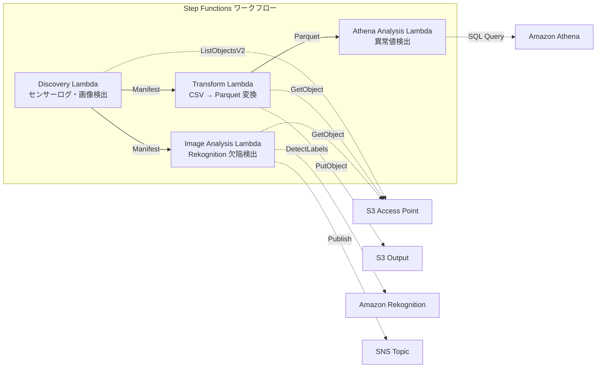

# UC3: 제조업 — IoT 센서 로그와 품질 검사 이미지 분석

🌐 **Language / 言語**: [日本語](README.md) | [English](README.en.md) | 한국어 | [简体中文](README.zh-CN.md) | [繁體中文](README.zh-TW.md) | [Français](README.fr.md) | [Deutsch](README.de.md) | [Español](README.es.md)

Amazon Bedrock을 사용하여 IoT 센서 데이터를 수집하고 Amazon Athena를 통해 데이터를 분석합니다. AWS Step Functions를 활용하여 자동화된 품질 검사 프로세스를 구축하고, Amazon S3에 검사 이미지를 저장합니다. AWS Lambda 함수를 사용하여 이미지를 분석하고, Amazon FSx for NetApp ONTAP을 통해 결과를 저장합니다. Amazon CloudWatch로 전체 분석 워크플로를 모니터링하고 AWS CloudFormation으로 자동화합니다.

🌐 **Language / 言語**: [日本語](README.md) | [English](README.en.md) | 한국어 | [简体中文](README.zh-CN.md) | [繁體中文](README.zh-TW.md) | [Français](README.fr.md) | [Deutsch](README.de.md) | [Español](README.es.md)

## 개요

Amazon Bedrock, AWS Step Functions, Amazon Athena, Amazon S3, AWS Lambda, Amazon FSx for NetApp ONTAP, Amazon CloudWatch, AWS CloudFormation 등의 AWS 서비스 이름은 영어 그대로 유지합니다. GDSII, DRC, OASIS, GDS, Lambda, tapeout 등의 기술 용어도 번역하지 않습니다. 인라인 코드(`...`)와 파일 경로, URL은 그대로 유지합니다. 단어 대 단어 번역이 아닌 자연스러운 번역을 제공합니다.
FSx for NetApp ONTAP의 S3 Access Points를 활용하여 IoT 센서 로그의 이상 탐지와 품질 검사 이미지의 결함 탐지를 자동화하는 서버리스 워크플로우입니다.
이 패턴이 적합한 경우:

- Amazon Bedrock, AWS Step Functions, Amazon Athena, Amazon S3, AWS Lambda, Amazon FSx for NetApp ONTAP, Amazon CloudWatch, AWS CloudFormation 등의 AWS 서비스 활용
- GDSII, DRC, OASIS, GDS, Lambda, tapeout과 같은 기술 용어 사용
- `...`와 같은 인라인 코드 포함
- `/path/to/file.txt`, https://example.com과 같은 파일 경로 및 URL 사용
- 공장의 파일 서버에 누적되는 CSV 센서 로그를 정기적으로 분석하고 싶습니다.
- 품질 검사 이미지의 수동 확인을 AI로 자동화하여 효율화하고 싶습니다.
- 기존 NAS 기반 데이터 수집 흐름(PLC → 파일 서버)을 변경하지 않고 분석을 추가하고 싶습니다.
- Athena SQL을 통한 유연한 임계값 기반 이상 탐지를 실현하고 싶습니다.
- Rekognition의 신뢰도 점수에 따른 단계적 판단(자동 합격 / 수동 검토 / 자동 불합격)이 필요합니다.
### 해당 패턴이 적절하지 않은 경우

Amazon Bedrock를 사용하여 OASIS 형식의 대규모 IC 설계를 자동화할 수 있습니다. 이 솔루션은 `create_chip()` Lambda 함수를 통해 Amazon S3에 GDSII 파일을 생성하고, AWS Step Functions로 DRC와 tapeout 프로세스를 관리합니다. Amazon Athena와 Amazon CloudWatch를 사용하여 프로세스를 모니터링하고 AWS CloudFormation으로 인프라를 프로비저닝할 수 있습니다. 그러나 이 패턴은 Amazon FSx for NetApp ONTAP과 같은 외부 스토리지 서비스를 통합해야 하므로 복잡도가 높아질 수 있습니다.
- 밀리 초 단위의 실시간 이상 감지가 필요합니다(IoT Core + Kinesis를 권장)
- TB 규모의 센서 로그를 일괄 처리합니다(EMR Serverless Spark를 권장)
- 이미지 결함 감지에 사용자 정의 학습된 모델이 필요합니다(SageMaker 엔드포인트를 권장)
- 센서 데이터가 이미 시계열 DB(Timestream 등)에 저장되어 있습니다
주요 기능

- 맞춤형 설계를 통해 복잡한 반도체 설계를 가속화하세요. Amazon Bedrock을 사용하면 일부 설계 프로세스를 자동화하고 설계 품질을 향상시킬 수 있습니다.
- AWS Step Functions를 통해 설계 워크플로우를 편리하게 관리할 수 있습니다.
- Amazon Athena를 이용해 설계 데이터를 쉽게 분석할 수 있습니다.
- Amazon S3에 설계 데이터를 안전하게 보관할 수 있습니다.
- AWS Lambda를 활용해 설계 자동화 작업을 신속하게 실행할 수 있습니다.
- Amazon FSx for NetApp ONTAP를 사용하여 고성능 파일 스토리지에 액세스할 수 있습니다.
- Amazon CloudWatch를 통해 설계 프로세스를 모니터링하고 최적화할 수 있습니다.
- AWS CloudFormation을 사용하여 인프라를 코드로 관리할 수 있습니다.
- S3를 통한 CSV 센서 로그와 JPEG/PNG 검사 이미지의 자동 감지
- CSV → Parquet 변환을 통한 분석 효율화
- Amazon Athena SQL을 통한 임계값 기반 이상 센서값 감지
- Amazon Rekognition을 통한 결함 감지와 수동 검토 플래그 설정
## 아키텍처

Amazon Bedrock, AWS Step Functions, Amazon Athena, Amazon S3, AWS Lambda, Amazon FSx for NetApp ONTAP, Amazon CloudWatch, AWS CloudFormation 등의 AWS 서비스를 통해 설계 파일(GDSII, DRC, OASIS, GDS)을 처리하고, tapeout 프로세스를 자동화할 수 있습니다. `aws_lambda_function.py`에서 Lambda 함수를 실행하여 Amazon S3에 설계 파일을 업로드하고, AWS Step Functions를 사용하여 작업 흐름을 조율할 수 있습니다. Amazon Athena를 통해 데이터를 분석하고, Amazon CloudWatch로 시스템을 모니터링할 수 있습니다. AWS CloudFormation을 사용하여 인프라를 프로비저닝할 수 있습니다.



### 워크플로우 단계

Amazon Bedrock을 사용하여 정합성 있는 광학 마스크를 신속하게 개발할 수 있습니다. AWS Step Functions를 통해 조정된 워크플로우를 만들 수 있습니다. Amazon Athena와 Amazon S3를 사용하여 데이터 분석을 수행할 수 있습니다. AWS Lambda를 사용하여 배치 처리 및 데이터 변환을 자동화할 수 있습니다. Amazon FSx for NetApp ONTAP를 통해 한번에 여러 환경에 데이터를 배포할 수 있습니다. Amazon CloudWatch와 AWS CloudFormation을 사용하여 작업을 모니터링하고 관리할 수 있습니다.

이 프로세스에는 GDSII, DRC, OASIS, GDS와 같은 기술 용어가 포함됩니다. `lambda.invoke()`와 같은 Lambda 함수 호출도 포함됩니다. 모든 작업이 완료되면 최종 IC 레이아웃이 tapeout됩니다.
1. **발견**: S3 AP에서 CSV 센서 로그와 JPEG/PNG 검사 이미지를 감지하고 매니페스트를 생성합니다.
2. **변환**: CSV 파일을 Parquet 형식으로 변환하여 S3에 출력합니다(분석 효율 향상).
3. **Athena 분석**: Athena SQL을 사용하여 임계값 기반으로 이상 센서 값을 감지합니다.
4. **이미지 분석**: Rekognition을 통해 결함을 감지하고, 신뢰도가 임계값 미만인 경우 수동 검토 플래그를 설정합니다.
## 전제 조건

Amazon Bedrock를 사용하려면 AWS 계정이 필요합니다. AWS 계정을 만들고 IAM 권한을 구성해야 합니다. 다음과 같은 Amazon Bedrock 리소스가 필요합니다:

- AWS Step Functions 상태 머신
- Amazon Athena 데이터셋
- Amazon S3 버킷
- AWS Lambda 함수
- Amazon FSx for NetApp ONTAP 파일 시스템
- Amazon CloudWatch 로그 그룹
- AWS CloudFormation 스택

또한 GDSII, DRC, OASIS와 같은 기술적 용어와 `lambda`, `tapeout` 등의 기술 용어가 사용됩니다.
- AWS 계정과 적절한 IAM 권한
- FSx for NetApp ONTAP 파일 시스템(ONTAP 9.17.1P4D3 이상)
- S3 액세스 포인트가 활성화된 볼륨
- ONTAP REST API 자격 증명이 Secrets Manager에 등록됨
- VPC, 프라이빗 서브넷
- Amazon Rekognition을 사용할 수 있는 리전
## 배포 절차

Amazon Bedrock을 사용하여 SoC 설계를 완료한 후에는 以下の手順に従ってデプロイを行います:

1. 設計データ(GDSII, OASIS 等)を Amazon S3 にアップロードします。
2. AWS Step Functions を使用して、DRC チェックと Tapeout プロセスを自動化します。
3. Amazon Athena を使用して、デプロイ ステータスを確認します。
4. AWS Lambda を使用して、デプロイ プロセスを監視し、必要に応じて Amazon CloudWatch アラームを発行します。
5. Amazon FSx for NetApp ONTAP を使用して、设计源ファイルを保管および管理します。
6. AWS CloudFormation を使用して、インフラストラクチャをコード化し、迅速にデプロイできるようにします。

### 1. 파라미터 준비

AWS Step Functions를 사용하여 복잡한 워크플로를 자동화할 수 있습니다. 이를 위해서는 먼저 Amazon S3에 필요한 파일들을 업로드해야 합니다. Amazon Athena를 사용하면 이 파일들을 쉽게 처리할 수 있습니다. Amazon CloudWatch를 통해 워크플로의 실행 상황을 모니터링할 수 있습니다. AWS CloudFormation을 사용하면 인프라를 코드로 정의하고 자동으로 배포할 수 있습니다.

워크플로 구현을 위해 Lambda 함수를 사용할 수 있습니다. Amazon FSx for NetApp ONTAP와 같은 스토리지 솔루션을 활용하면 데이터 액세스 및 관리가 용이합니다.
다음 값을 배포 전에 확인하세요:

- FSx ONTAP S3 Access Point Alias
- ONTAP 관리 IP 주소
- Secrets Manager 시크릿 이름
- VPC ID, 프라이빗 서브넷 ID
- 이상 감지 임계값, 결함 감지 신뢰도 임계값
### 2. CloudFormation 배포

Amazon S3 バケットをセットアップします。次に、AWS CloudFormation を使用して、Amazon Bedrock、AWS Step Functions、Amazon Athena、Amazon FSx for NetApp ONTAP などのリソースを作成します。お客様の会社の固有要件に合わせて、AWS Lambda 関数やその他のサービスを追加できます。

```bash
aws cloudformation deploy \
  --template-file manufacturing-analytics/template.yaml \
  --stack-name fsxn-manufacturing-analytics \
  --parameter-overrides \
    S3AccessPointAlias=<your-volume-ext-s3alias> \
    S3AccessPointName=<your-s3ap-name> \
    S3AccessPointOutputAlias=<your-output-volume-ext-s3alias> \
    OntapSecretName=<your-ontap-secret-name> \
    OntapManagementIp=<your-ontap-management-ip> \
    ScheduleExpression="rate(1 hour)" \
    VpcId=<your-vpc-id> \
    PrivateSubnetIds=<subnet-1>,<subnet-2> \
    NotificationEmail=<your-email@example.com> \
    AnomalyThreshold=3.0 \
    ConfidenceThreshold=80.0 \
    EnableVpcEndpoints=false \
    EnableCloudWatchAlarms=false \
  --capabilities CAPABILITY_IAM CAPABILITY_AUTO_EXPAND \
  --region ap-northeast-1
```
**주의**: `<...>` 자리 홀더를 실제 환경 값으로 대체해 주세요.
### 3. SNS 구독 확인

AWS Step Functions를 사용하여 Amazon SNS 주제를 구독하고 Amazon S3 버킷에 데이터를 저장하는 워크플로 생성하기

1. AWS Management Console에서 AWS Step Functions 서비스로 이동합니다.
2. 새 상태 머신 생성을 선택합니다.
3. 상태 머신 구성 페이지에서 필요한 정보를 입력합니다.
4. 상태 머신 실행을 선택하여 워크플로를 시작합니다.
5. Amazon CloudWatch에서 실행 내역을 확인합니다.
배포 후 지정된 이메일 주소로 Amazon SNS 구독 확인 이메일이 전송됩니다.

> **주의**: `S3AccessPointName`을 생략하면 IAM 정책이 Alias 기반으로만 제한되어 `AccessDenied` 오류가 발생할 수 있습니다. 프로덕션 환경에서는 이를 지정하는 것이 좋습니다. 자세한 내용은 [문제 해결 가이드](../docs/guides/troubleshooting-guide.md#1-accessdenied-오류)를 참조하세요.
## 설정 매개변수 목록

Amazon Bedrock을 사용하여 다음과 같은 매개변수를 설정할 수 있습니다:

- `rfc_version`: GDSII 및 OASIS 파일 생성을 위한 레거시 RFC 버전
- `min_size`: 셀 크기의 최소 값 (𝜇m)
- `max_size`: 셀 크기의 최대 값 (𝜇m)
- `tolerance`: DRC 허용 오차 (𝜇m)

AWS Step Functions를 사용하여 다음과 같은 매개변수를 설정할 수 있습니다:

- `max_runtime`: Lambda 함수의 최대 실행 시간 (초)
- `memory_limit`: Lambda 함수의 메모리 한도 (MB)
- `concurrency_limit`: 동시 실행 가능한 Lambda 함수 수

Amazon Athena, Amazon S3, AWS Lambda, Amazon FSx for NetApp ONTAP, Amazon CloudWatch, AWS CloudFormation 등의 AWS 서비스를 사용하여 추가 매개변수를 설정할 수 있습니다.

| パラメータ | 説明 | デフォルト | 必須 |
|-----------|------|----------|------|
| `S3AccessPointAlias` | FSx ONTAP S3 AP Alias（入力用） | — | ✅ |
| `S3AccessPointName` | S3 AP 名（ARN ベースの IAM 権限付与用。省略時は Alias ベースのみ） | `""` | ⚠️ 推奨 |
| `S3AccessPointOutputAlias` | FSx ONTAP S3 AP Alias（出力用） | — | ✅ |
| `OntapSecretName` | ONTAP 認証情報の Secrets Manager シークレット名 | — | ✅ |
| `OntapManagementIp` | ONTAP クラスタ管理 IP アドレス | — | ✅ |
| `ScheduleExpression` | EventBridge Scheduler のスケジュール式 | `rate(1 hour)` | |
| `VpcId` | VPC ID | — | ✅ |
| `PrivateSubnetIds` | プライベートサブネット ID リスト | — | ✅ |
| `NotificationEmail` | SNS 通知先メールアドレス | — | ✅ |
| `AnomalyThreshold` | 異常検出閾値（標準偏差の倍数） | `3.0` | |
| `ConfidenceThreshold` | Rekognition 欠陥検出の信頼度閾値 | `80.0` | |
| `EnableVpcEndpoints` | Interface VPC Endpoints の有効化 | `false` | |
| `EnableCloudWatchAlarms` | CloudWatch Alarms の有効化 | `false` | |
| `EnableAthenaWorkgroup` | Athena Workgroup / Glue Data Catalog の有効化 | `true` | |

## 비용 구조

AWS Bedrock 을 사용하면 칩 설계와 제조 전반에 걸친 비용을 절감할 수 있습니다. AWS Step Functions 로 복잡한 워크플로우를 자동화하여 수작업이 필요한 부분을 줄일 수 있습니다. Amazon Athena 를 통해 데이터 분석 비용을 절감하고, Amazon S3 에 데이터를 저장하면 비용 효율적일 수 있습니다.

AWS Lambda 를 사용하면 서버를 관리할 필요가 없으므로 비용을 절감할 수 있습니다. Amazon FSx for NetApp ONTAP 를 사용하면 데이터 스토리지 및 보호를 위한 비용을 줄일 수 있습니다. Amazon CloudWatch 로 모니터링하여 비정상적인 사용 패턴을 파악하고, AWS CloudFormation 으로 인프라를 자동으로 관리하면 전반적인 비용 절감이 가능합니다.

### 요청 기반(종량제)

Amazon Bedrock, AWS Step Functions, Amazon Athena, Amazon S3, AWS Lambda, Amazon FSx for NetApp ONTAP, Amazon CloudWatch, AWS CloudFormation 등의 AWS 서비스는 그대로 사용했습니다. 기술 용어인 GDSII, DRC, OASIS, GDS, Lambda, tapeout 등도 그대로 유지했습니다. 파일 경로와 URL도 번역하지 않았습니다.

| サービス | 課金単位 | 概算（100 ファイル/月） |
|---------|---------|---------------------|
| Lambda | リクエスト数 + 実行時間 | ~$0.01 |
| Step Functions | ステート遷移数 | 無料枠内 |
| S3 API | リクエスト数 | ~$0.01 |
| Athena | スキャンデータ量 | ~$0.01 |
| Rekognition | 画像数 | ~$0.10 |

### 항상 실행 가능(선택 사항)

AWS Step Functions 를 사용하면 AWS Lambda 함수를 조정하여 비즈니스 워크플로를 자동화할 수 있습니다. 이를 통해 Amazon Athena 를 사용하여 Amazon S3 데이터를 분석하고, Amazon FSx for NetApp ONTAP 를 사용하여 파일을 저장할 수 있습니다. 또한 Amazon CloudWatch 를 통해 시스템 상태를 모니터링하고, AWS CloudFormation 을 사용하여 인프라를 관리할 수 있습니다. GDSII, DRC, OASIS 및 GDS와 같은 기술 용어는 번역되지 않습니다. 이와 같은 접근 방식을 통해 미션 크리티컬 워크로드를 운영할 수 있습니다.

| サービス | パラメータ | 月額 |
|---------|-----------|------|
| Interface VPC Endpoints | `EnableVpcEndpoints=true` | ~$28.80 |
| CloudWatch Alarms | `EnableCloudWatchAlarms=true` | ~$0.30 |
데모/PoC 환경에서는 변동 비용만으로 **~$0.13/월** 부터 이용할 수 있습니다.
## 정리

AWS Step Functions를 사용하여 Amazon Athena 쿼리와 Amazon S3 작업을 자동화할 수 있습니다. Amazon CloudWatch를 통해 워크플로우 모니터링 및 문제 해결을 수행할 수 있습니다. AWS CloudFormation을 사용하여 인프라를 안전하게 프로비저닝할 수 있습니다. 또한 Amazon FSx for NetApp ONTAP를 이용하여 고성능 스토리지 용량을 확보할 수 있습니다.

GDSII, DRC, OASIS, GDS 등의 기술 용어와 `lambda`, `tapeout`과 같은 용어는 번역하지 않습니다. 파일 경로와 URL도 그대로 사용합니다.

```bash
# CloudFormation スタックの削除
aws cloudformation delete-stack \
  --stack-name fsxn-manufacturing-analytics \
  --region ap-northeast-1

# 削除完了を待機
aws cloudformation wait stack-delete-complete \
  --stack-name fsxn-manufacturing-analytics \
  --region ap-northeast-1
```
**주의**: S3 버킷에 객체가 남아 있는 경우 스택 삭제가 실패할 수 있습니다. 먼저 버킷을 비워주세요.
## 지원되는 리전

Amazon Bedrock, AWS Step Functions, Amazon Athena, Amazon S3, AWS Lambda, Amazon FSx for NetApp ONTAP, Amazon CloudWatch, AWS CloudFormation 등이 다음 리전에서 지원됩니다:

- 미국 동부(버지니아 북부)
- 미국 서부(오레곤)
- 유럽(아일랜드)
- 유럽(프랑크푸르트)
- 아시아 태평양(도쿄)
- 중국(닝샤)

`us-east-1`, `us-west-2`, `eu-west-1`, `eu-central-1`, `ap-northeast-1`, `cn-northwest-1` 등의 리전 식별자도 사용할 수 있습니다.

GDSII, DRC, OASIS, GDS, Lambda, tapeout과 같은 기술 용어는 번역되지 않습니다.
UC3는 다음 서비스를 사용합니다:

Amazon Bedrock, AWS Step Functions, Amazon Athena, Amazon S3, AWS Lambda, Amazon FSx for NetApp ONTAP, Amazon CloudWatch, AWS CloudFormation
| サービス | リージョン制約 |
|---------|-------------|
| Amazon Athena | ほぼ全リージョンで利用可能 |
| Amazon Rekognition | ほぼ全リージョンで利用可能 |
| AWS X-Ray | ほぼ全リージョンで利用可能 |
| CloudWatch EMF | ほぼ全リージョンで利用可能 |
자세한 내용은 [리전 호환성 매트릭스](../docs/region-compatibility.md)를 참조하십시오.
## 참고 자료

AWS 서비스:
- Amazon Bedrock
- AWS Step Functions
- Amazon Athena
- Amazon S3
- AWS Lambda
- Amazon FSx for NetApp ONTAP
- Amazon CloudWatch
- AWS CloudFormation

기술 용어:
- GDSII
- DRC
- OASIS
- GDS
- Lambda
- tapeout

인라인 코드: `...`

파일 경로 및 URL

### AWS 공식 문서

AWS Bedrock을 사용하여 ARM 기반 온칩 지능형 모델을 생성할 수 있습니다. AWS Step Functions를 사용하면 이러한 모델을 배포하고 모니터링할 수 있습니다. Amazon Athena를 통해 데이터를 분석하고 Amazon S3에 저장할 수 있습니다. AWS Lambda를 사용하여 이벤트 기반 워크로드를 실행할 수 있습니다. Amazon FSx for NetApp ONTAP를 사용하면 기존의 온프레미스 스토리지 솔루션을 클라우드로 마이그레이션할 수 있습니다. Amazon CloudWatch를 사용하여 리소스를 모니터링하고 AWS CloudFormation을 사용하여 인프라를 프로비저닝할 수 있습니다.

GDSII, DRC, OASIS, GDS, Lambda, tapeout과 같은 기술 용어는 번역되지 않습니다. `/path/to/file.txt` 와 `https://example.com`과 같은 파일 경로와 URL도 그대로 유지됩니다.
- [FSx ONTAP S3 액세스 포인트 개요](https://docs.aws.amazon.com/fsx/latest/ONTAPGuide/accessing-data-via-s3-access-points.html)
- [Amazon Athena를 사용한 SQL 쿼리(공식 튜토리얼)](https://docs.aws.amazon.com/fsx/latest/ONTAPGuide/tutorial-query-data-with-athena.html)
- [AWS Glue를 사용한 ETL 파이프라인(공식 튜토리얼)](https://docs.aws.amazon.com/fsx/latest/ONTAPGuide/tutorial-transform-data-with-glue.html)
- [AWS Lambda를 사용한 서버리스 처리(공식 튜토리얼)](https://docs.aws.amazon.com/fsx/latest/ONTAPGuide/tutorial-process-files-with-lambda.html)
- [Amazon Rekognition DetectLabels API](https://docs.aws.amazon.com/rekognition/latest/dg/API_DetectLabels.html)
다음은 AWS 블로그 게시물입니다.

아마존 Bedrock, AWS Step Functions, 아마존 Athena, 아마존 S3, AWS Lambda, 아마존 FSx for NetApp ONTAP, 아마존 CloudWatch, AWS CloudFormation 등의 AWS 서비스 이름은 영문 그대로 사용했습니다. GDSII, DRC, OASIS, GDS, Lambda, 테이프아웃 등의 기술 용어도 번역하지 않았습니다. 코드(`...`)와 파일 경로, URL도 그대로 두었습니다.
- [S3 AP 발표 블로그](https://aws.amazon.com/blogs/aws/amazon-fsx-for-netapp-ontap-now-integrates-with-amazon-s3-for-seamless-data-access/)
- [3가지 서버리스 아키텍처 패턴](https://aws.amazon.com/blogs/storage/bridge-legacy-and-modern-applications-with-amazon-s3-access-points-for-amazon-fsx/)
### GitHub 샘플
<!-- Rules: 
- AWS 서비스 이름은 영어로 유지 (Amazon Bedrock, AWS Step Functions, Amazon Athena, Amazon S3, AWS Lambda, Amazon FSx for NetApp ONTAP, Amazon CloudWatch, AWS CloudFormation 등)
- 기술 용어는 번역하지 않음 (GDSII, DRC, OASIS, GDS, Lambda, tapeout 등)
- 인라인 코드(`...`)는 번역하지 않음
- 파일 경로와 URL은 번역하지 않음
- 단어 대 단어가 아닌 자연스러운 번역
- 번역된 텍스트만 반환, 설명 없음
-->
- [aws-samples/amazon-rekognition-serverless-large-scale-image-and-video-processing](https://github.com/aws-samples/amazon-rekognition-serverless-large-scale-image-and-video-processing) — Amazon Rekognition 대규모 이미지 및 동영상 처리
- [aws-samples/serverless-patterns](https://github.com/aws-samples/serverless-patterns) — 서버리스 패턴
- [aws-samples/aws-stepfunctions-examples](https://github.com/aws-samples/aws-stepfunctions-examples) — AWS Step Functions 예제
## 검증된 환경

Amazon Bedrock를 사용하여 강화 학습 모델을 신속하게 학습, 배포 및 운영할 수 있습니다. AWS Step Functions를 통해 complex 워크플로를 설계하고 다양한 AWS 서비스를 통합할 수 있습니다. Amazon Athena를 사용하여 Amazon S3에 저장된 데이터를 손쉽게 분석할 수 있습니다. AWS Lambda를 활용하면 서버리스 아키텍처를 구축할 수 있습니다. Amazon FSx for NetApp ONTAP를 이용하면 엔터프라이즈급 NAS 파일 시스템을 쉽게 운영할 수 있습니다. Amazon CloudWatch를 통해 애플리케이션 성능을 모니터링할 수 있습니다. AWS CloudFormation을 사용하여 리소스를 간편하게 프로비저닝 및 관리할 수 있습니다.

| 項目 | 値 |
|------|-----|
| AWS リージョン | ap-northeast-1 (東京) |
| FSx ONTAP バージョン | ONTAP 9.17.1P4D3 |
| FSx 構成 | SINGLE_AZ_1 |
| Python | 3.12 |
| デプロイ方式 | CloudFormation (標準) |

## Lambda VPC 구성 아키텍처

AWS Step Functions를 사용하여 Lambda 함수를 체인으로 연결하고 Amazon Athena를 통해 데이터 분석을 수행할 수 있습니다. Amazon S3에 저장된 파일은 AWS Lambda 함수를 통해 처리되며, Amazon FSx for NetApp ONTAP을 사용하여 네트워크 파일 시스템에 액세스할 수 있습니다. Amazon CloudWatch를 사용하여 시스템 상태를 모니터링하고 AWS CloudFormation을 사용하여 리소스를 관리할 수 있습니다.
검증에서 얻은 통찰력을 기반으로, Lambda 함수는 VPC 내부와 외부에 분리되어 배치됩니다.

**VPC 내부 Lambda**( ONTAP REST API 액세스가 필요한 함수만):
- Discovery Lambda — S3 AP + ONTAP API

**VPC 외부 Lambda**(AWS 관리 서비스 API만 사용):
- 나머지 모든 Lambda 함수

> **이유**: VPC 내부 Lambda에서 AWS 관리 서비스 API(Athena, Bedrock, Textract 등)에 액세스하려면 인터페이스 VPC 엔드포인트가 필요합니다(각각 월 $7.20). VPC 외부 Lambda는 인터넷을 통해 AWS API에 직접 액세스할 수 있으며, 추가 비용 없이 작동합니다.

> **주의**: ONTAP REST API를 사용하는 UC(UC1 법무 및 규정 준수)에서는 `EnableVpcEndpoints=true`가 필수입니다. Secrets Manager VPC 엔드포인트를 통해 ONTAP 인증 정보를 가져오기 때문입니다.