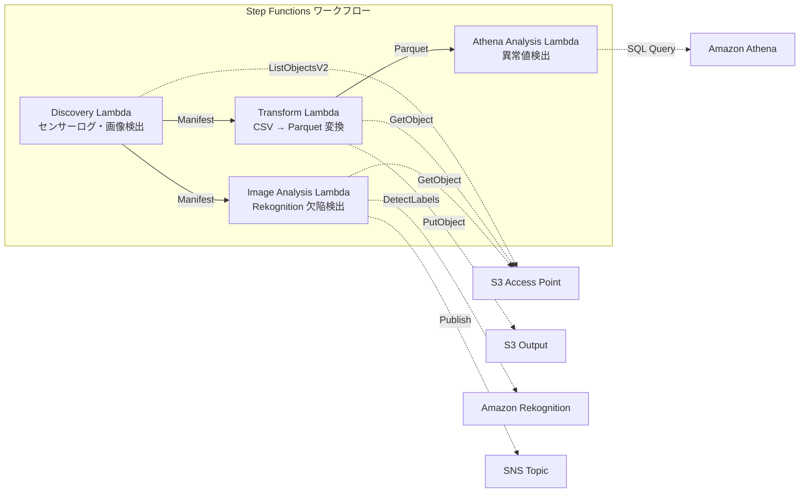

# UC3: 製造業 — IoT センサーログ・品質検査画像の分析

## 概要

FSx for NetApp ONTAP の S3 Access Points を活用し、IoT センサーログの異常検出と品質検査画像の欠陥検出を自動化するサーバーレスワークフローです。

### 主な機能

- S3 AP 経由で CSV センサーログと JPEG/PNG 検査画像を自動検出
- CSV → Parquet 変換による分析効率化
- Amazon Athena SQL による閾値ベースの異常センサー値検出
- Amazon Rekognition による欠陥検出と手動レビューフラグ設定

## アーキテクチャ



### ワークフローステップ

1. **Discovery**: S3 AP から CSV センサーログと JPEG/PNG 検査画像を検出し、Manifest を生成
2. **Transform**: CSV ファイルを Parquet 形式に変換して S3 出力（分析効率化）
3. **Athena Analysis**: Athena SQL で異常センサー値を閾値ベースで検出
4. **Image Analysis**: Rekognition で欠陥検出、信頼度が閾値未満の場合は手動レビューフラグを設定

## 前提条件

- AWS アカウントと適切な IAM 権限
- FSx for NetApp ONTAP ファイルシステム（ONTAP 9.17.1P4D3 以上）
- S3 Access Point が有効化されたボリューム
- ONTAP REST API 認証情報が Secrets Manager に登録済み
- VPC、プライベートサブネット
- Amazon Rekognition が利用可能なリージョン

## デプロイ手順

### 1. パラメータの準備

デプロイ前に以下の値を確認してください:

- FSx ONTAP S3 Access Point Alias
- ONTAP 管理 IP アドレス
- Secrets Manager シークレット名
- VPC ID、プライベートサブネット ID
- 異常検出閾値、欠陥検出信頼度閾値

### 2. CloudFormation デプロイ

```bash
aws cloudformation deploy \
  --template-file manufacturing-analytics/template.yaml \
  --stack-name fsxn-manufacturing-analytics \
  --parameter-overrides \
    S3AccessPointAlias=<your-volume-ext-s3alias> \
    S3AccessPointOutputAlias=<your-output-volume-ext-s3alias> \
    OntapSecretName=<your-ontap-secret-name> \
    OntapManagementIp=<your-ontap-management-ip> \
    ScheduleExpression="rate(1 hour)" \
    VpcId=<your-vpc-id> \
    PrivateSubnetIds=<subnet-1>,<subnet-2> \
    NotificationEmail=<your-email@example.com> \
    AnomalyThreshold=3.0 \
    ConfidenceThreshold=80.0 \
    EnableVpcEndpoints=false \
    EnableCloudWatchAlarms=false \
  --capabilities CAPABILITY_IAM CAPABILITY_AUTO_EXPAND \
  --region ap-northeast-1
```

> **注意**: `<...>` のプレースホルダーを実際の環境値に置き換えてください。

### 3. SNS サブスクリプションの確認

デプロイ後、指定したメールアドレスに SNS サブスクリプション確認メールが届きます。

## 設定パラメータ一覧

| パラメータ | 説明 | デフォルト | 必須 |
|-----------|------|----------|------|
| `S3AccessPointAlias` | FSx ONTAP S3 AP Alias（入力用） | — | ✅ |
| `S3AccessPointOutputAlias` | FSx ONTAP S3 AP Alias（出力用） | — | ✅ |
| `OntapSecretName` | ONTAP 認証情報の Secrets Manager シークレット名 | — | ✅ |
| `OntapManagementIp` | ONTAP クラスタ管理 IP アドレス | — | ✅ |
| `ScheduleExpression` | EventBridge Scheduler のスケジュール式 | `rate(1 hour)` | |
| `VpcId` | VPC ID | — | ✅ |
| `PrivateSubnetIds` | プライベートサブネット ID リスト | — | ✅ |
| `NotificationEmail` | SNS 通知先メールアドレス | — | ✅ |
| `AnomalyThreshold` | 異常検出閾値（標準偏差の倍数） | `3.0` | |
| `ConfidenceThreshold` | Rekognition 欠陥検出の信頼度閾値 | `80.0` | |
| `EnableVpcEndpoints` | Interface VPC Endpoints の有効化 | `false` | |
| `EnableCloudWatchAlarms` | CloudWatch Alarms の有効化 | `false` | |
| `EnableAthenaWorkgroup` | Athena Workgroup / Glue Data Catalog の有効化 | `true` | |

## コスト構造

### リクエストベース（従量課金）

| サービス | 課金単位 | 概算（100 ファイル/月） |
|---------|---------|---------------------|
| Lambda | リクエスト数 + 実行時間 | ~$0.01 |
| Step Functions | ステート遷移数 | 無料枠内 |
| S3 API | リクエスト数 | ~$0.01 |
| Athena | スキャンデータ量 | ~$0.01 |
| Rekognition | 画像数 | ~$0.10 |

### 常時稼働（オプショナル）

| サービス | パラメータ | 月額 |
|---------|-----------|------|
| Interface VPC Endpoints | `EnableVpcEndpoints=true` | ~$28.80 |
| CloudWatch Alarms | `EnableCloudWatchAlarms=true` | ~$0.30 |

> デモ/PoC 環境では変動費のみで **~$0.13/月** から利用可能です。

## クリーンアップ

```bash
# CloudFormation スタックの削除
aws cloudformation delete-stack \
  --stack-name fsxn-manufacturing-analytics \
  --region ap-northeast-1

# 削除完了を待機
aws cloudformation wait stack-delete-complete \
  --stack-name fsxn-manufacturing-analytics \
  --region ap-northeast-1
```

> **注意**: S3 バケットにオブジェクトが残っている場合、スタック削除が失敗することがあります。事前にバケットを空にしてください。

## 参考リンク

### AWS 公式ドキュメント

- [FSx ONTAP S3 Access Points 概要](https://docs.aws.amazon.com/fsx/latest/ONTAPGuide/accessing-data-via-s3-access-points.html)
- [Athena で SQL クエリ（公式チュートリアル）](https://docs.aws.amazon.com/fsx/latest/ONTAPGuide/tutorial-query-data-with-athena.html)
- [Glue で ETL パイプライン（公式チュートリアル）](https://docs.aws.amazon.com/fsx/latest/ONTAPGuide/tutorial-transform-data-with-glue.html)
- [Lambda でサーバーレス処理（公式チュートリアル）](https://docs.aws.amazon.com/fsx/latest/ONTAPGuide/tutorial-process-files-with-lambda.html)
- [Rekognition DetectLabels API](https://docs.aws.amazon.com/rekognition/latest/dg/API_DetectLabels.html)

### AWS ブログ記事

- [S3 AP 発表ブログ](https://aws.amazon.com/blogs/aws/amazon-fsx-for-netapp-ontap-now-integrates-with-amazon-s3-for-seamless-data-access/)
- [3 つのサーバーレスアーキテクチャパターン](https://aws.amazon.com/blogs/storage/bridge-legacy-and-modern-applications-with-amazon-s3-access-points-for-amazon-fsx/)

### GitHub サンプル

- [aws-samples/amazon-rekognition-serverless-large-scale-image-and-video-processing](https://github.com/aws-samples/amazon-rekognition-serverless-large-scale-image-and-video-processing) — Rekognition 大規模処理
- [aws-samples/serverless-patterns](https://github.com/aws-samples/serverless-patterns) — サーバーレスパターン集
- [aws-samples/aws-stepfunctions-examples](https://github.com/aws-samples/aws-stepfunctions-examples) — Step Functions サンプル


## 検証済み環境

| 項目 | 値 |
|------|-----|
| AWS リージョン | ap-northeast-1 (東京) |
| FSx ONTAP バージョン | ONTAP 9.17.1P4D3 |
| FSx 構成 | SINGLE_AZ_1 |
| Python | 3.12 |
| デプロイ方式 | CloudFormation (標準) |

## Lambda VPC 配置アーキテクチャ

検証で得た知見に基づき、Lambda 関数は VPC 内/外に分離配置されています。

**VPC 内 Lambda**（ONTAP REST API アクセスが必要な関数のみ）:
- Discovery Lambda — S3 AP + ONTAP API

**VPC 外 Lambda**（AWS マネージドサービス API のみ使用）:
- その他の全 Lambda 関数

> **理由**: VPC 内 Lambda から AWS マネージドサービス API（Athena, Bedrock, Textract 等）にアクセスするには Interface VPC Endpoint が必要（各 $7.20/月）。VPC 外 Lambda はインターネット経由で直接 AWS API にアクセスでき、追加コストなしで動作します。

> **注意**: ONTAP REST API を使用する UC（UC1 法務・コンプライアンス）では `EnableVpcEndpoints=true` が必須です。Secrets Manager VPC Endpoint 経由で ONTAP 認証情報を取得するためです。
