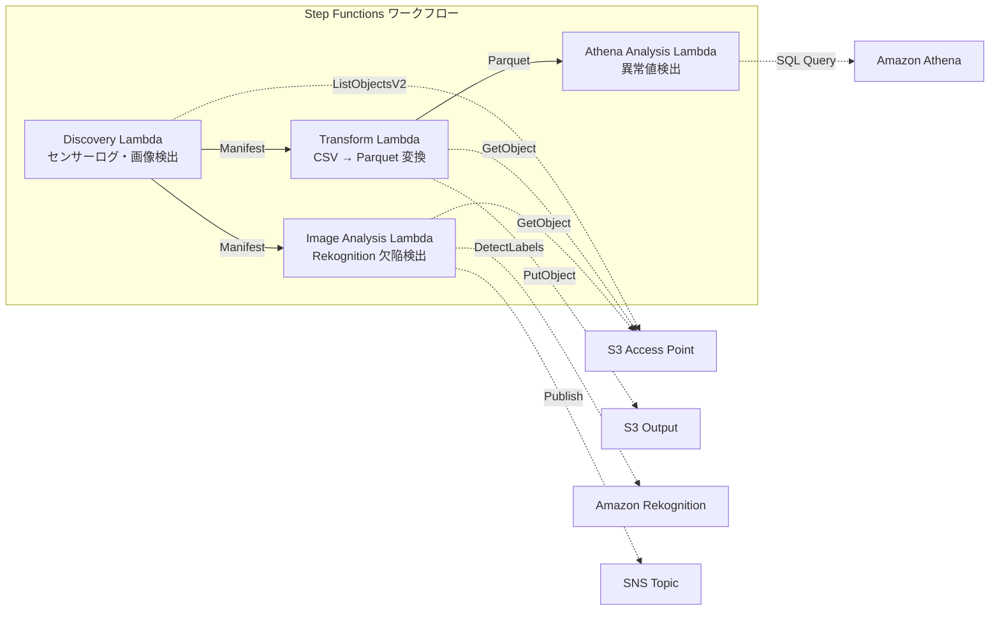

# UC3: 制造业 — 物联网传感器日志和质量检查图像分析

🌐 **Language / 言語**: [日本語](README.md) | [English](README.en.md) | [한국어](README.ko.md) | 简体中文 | [繁體中文](README.zh-TW.md) | [Français](README.fr.md) | [Deutsch](README.de.md) | [Español](README.es.md)

## 概述
利用 FSx for NetApp ONTAP 的 S3 访问点，实现 IoT 传感器日志异常检测和质量检测图像缺陷检测的自动化无服务器工作流。
### 适用场景
- 希望定期分析工厂文件服务器上存储的CSV传感器日志
- 希望用AI自动化和高效化质量检测图像的目视确认
- 希望在不更改现有基于NAS的数据收集流程（PLC → 文件服务器）的情况下添加分析
- 希望实现通过Athena SQL进行灵活的阈值基异常检测
- 希望基于Rekognition的信心分数进行分级判定（自动通过/手动审核/自动不通过）
### 不适合此模式的情况

规则：
- 保持AWS服务名称为英文（Amazon Bedrock、AWS Step Functions、Amazon Athena、Amazon S3、AWS Lambda、Amazon FSx for NetApp ONTAP、Amazon CloudWatch、AWS CloudFormation等）
- 保持技术术语不翻译（GDSII、DRC、OASIS、GDS、Lambda、tapeout等）
- 保持内联代码（`...`）不翻译
- 保持文件路径和URL不翻译
- 自然翻译，不逐字翻译
- 仅返回翻译文本，不附带解释
- 需要实时异常检测，精确到毫秒（推荐使用 IoT Core + Kinesis）
- 批量处理 TB 级别的传感器日志（推荐使用 EMR Serverless Spark）
- 图像缺陷检测需要自定义训练模型（推荐使用 SageMaker 端点）
- 传感器数据已经存储在时间序列数据库（如 Timestream）中
### 主要功能
- 通过 S3 AP 自动检测 CSV 传感器日志和 JPEG/PNG 检测图像
- 通过 CSV → Parquet 转换提高分析效率
- 使用 Amazon Athena SQL 检测基于阈值的异常传感器值
- 使用 Amazon Rekognition 检测缺陷并设置手动审查标记
## 架构



### 工作流程步骤
1. **发现**: 从 S3 AP 中检索 CSV 传感器日志和 JPEG/PNG 检测图像，生成 Manifest
2. **转换**: 将 CSV 文件转换为 Parquet 格式并输出到 S3（提高分析效率）
3. **Athena 分析**: 使用 Athena SQL 以阈值为基础检测异常传感器值
4. **图像分析**: 使用 Rekognition 进行缺陷检测，如果信任度低于阈值则设置手动审查标记
## 前提条件
- AWS 账户和适当的 IAM 权限
- FSx for NetApp ONTAP 文件系统（ONTAP 9.17.1P4D3 及以上版本）
- 已启用 S3 Access Point 的卷
- ONTAP REST API 凭证已在 Secrets Manager 中注册
- VPC、私有子网
- 可用的 Amazon Rekognition 区域
## 部署步骤

### 1. 准备参数
部署之前，请确认以下值：

- FSx ONTAP S3 访问点别名
- ONTAP 管理 IP 地址
- Secrets Manager 密钥名称
- VPC ID、私有子网 ID
- 异常检测阈值、缺陷检测可信度阈值
### 2. CloudFormation 部署

```bash
aws cloudformation deploy \
  --template-file manufacturing-analytics/template.yaml \
  --stack-name fsxn-manufacturing-analytics \
  --parameter-overrides \
    S3AccessPointAlias=<your-volume-ext-s3alias> \
    S3AccessPointName=<your-s3ap-name> \
    S3AccessPointOutputAlias=<your-output-volume-ext-s3alias> \
    OntapSecretName=<your-ontap-secret-name> \
    OntapManagementIp=<your-ontap-management-ip> \
    ScheduleExpression="rate(1 hour)" \
    VpcId=<your-vpc-id> \
    PrivateSubnetIds=<subnet-1>,<subnet-2> \
    NotificationEmail=<your-email@example.com> \
    AnomalyThreshold=3.0 \
    ConfidenceThreshold=80.0 \
    EnableVpcEndpoints=false \
    EnableCloudWatchAlarms=false \
  --capabilities CAPABILITY_IAM CAPABILITY_AUTO_EXPAND \
  --region ap-northeast-1
```
> **注意**: 请用实际的环境值替换 `<...>` 占位符。
### 3. 确认 SNS 订阅
部署之后，您指定的电子邮件地址会收到 SNS 订阅确认邮件。

> **注意**: 如果省略 `S3AccessPointName`，IAM 策略可能只基于别名，这可能会导致 `AccessDenied` 错误。建议在生产环境中进行指定。有关详细信息，请参阅 [故障排除指南](../docs/guides/troubleshooting-guide.md#1-accessdenied-错误)。
## 配置参数列表

| パラメータ | 説明 | デフォルト | 必須 |
|-----------|------|----------|------|
| `S3AccessPointAlias` | FSx ONTAP S3 AP Alias（入力用） | — | ✅ |
| `S3AccessPointName` | S3 AP 名（ARN ベースの IAM 権限付与用。省略時は Alias ベースのみ） | `""` | ⚠️ 推奨 |
| `S3AccessPointOutputAlias` | FSx ONTAP S3 AP Alias（出力用） | — | ✅ |
| `OntapSecretName` | ONTAP 認証情報の Secrets Manager シークレット名 | — | ✅ |
| `OntapManagementIp` | ONTAP クラスタ管理 IP アドレス | — | ✅ |
| `ScheduleExpression` | EventBridge Scheduler のスケジュール式 | `rate(1 hour)` | |
| `VpcId` | VPC ID | — | ✅ |
| `PrivateSubnetIds` | プライベートサブネット ID リスト | — | ✅ |
| `NotificationEmail` | SNS 通知先メールアドレス | — | ✅ |
| `AnomalyThreshold` | 異常検出閾値（標準偏差の倍数） | `3.0` | |
| `ConfidenceThreshold` | Rekognition 欠陥検出の信頼度閾値 | `80.0` | |
| `EnableVpcEndpoints` | Interface VPC Endpoints の有効化 | `false` | |
| `EnableCloudWatchAlarms` | CloudWatch Alarms の有効化 | `false` | |
| `EnableSnapStart` | 启用 Lambda SnapStart（冷启动缩短） | `false` | |
| `EnableAthenaWorkgroup` | Athena Workgroup / Glue Data Catalog の有効化 | `true` | |

## 成本结构

### 按需计费（基于请求）

| サービス | 課金単位 | 概算（100 ファイル/月） |
|---------|---------|---------------------|
| Lambda | リクエスト数 + 実行時間 | ~$0.01 |
| Step Functions | ステート遷移数 | 無料枠内 |
| S3 API | リクエスト数 | ~$0.01 |
| Athena | スキャンデータ量 | ~$0.01 |
| Rekognition | 画像数 | ~$0.10 |

### 常时运行（可选）

| サービス | パラメータ | 月額 |
|---------|-----------|------|
| Interface VPC Endpoints | `EnableVpcEndpoints=true` | ~$28.80 |
| CloudWatch Alarms | `EnableCloudWatchAlarms=true` | ~$0.30 |
> 演示/概念验证环境仅以变动费用计费，每月起价 **~$0.13**。
## 清理

```bash
# CloudFormation スタックの削除
aws cloudformation delete-stack \
  --stack-name fsxn-manufacturing-analytics \
  --region ap-northeast-1

# 削除完了を待機
aws cloudformation wait stack-delete-complete \
  --stack-name fsxn-manufacturing-analytics \
  --region ap-northeast-1
```
> **注意**: 如果 S3 存储桶中仍有对象，删除堆栈可能会失败。请提前清空存储桶。
## 支持的区域
UC3 使用以下服务：
| サービス | リージョン制約 |
|---------|-------------|
| Amazon Athena | ほぼ全リージョンで利用可能 |
| Amazon Rekognition | ほぼ全リージョンで利用可能 |
| AWS X-Ray | ほぼ全リージョンで利用可能 |
| CloudWatch EMF | ほぼ全リージョンで利用可能 |
> 详情请参阅 [区域兼容性矩阵](../docs/region-compatibility.md)。
## 参考链接

### AWS 官方文档
- [FSx ONTAP S3 访问点概述](https://docs.aws.amazon.com/fsx/latest/ONTAPGuide/accessing-data-via-s3-access-points.html)
- [使用 Athena 的 SQL 查询（官方教程）](https://docs.aws.amazon.com/fsx/latest/ONTAPGuide/tutorial-query-data-with-athena.html)
- [使用 Glue 的 ETL 管道（官方教程）](https://docs.aws.amazon.com/fsx/latest/ONTAPGuide/tutorial-transform-data-with-glue.html)
- [使用 Lambda 的无服务器处理（官方教程）](https://docs.aws.amazon.com/fsx/latest/ONTAPGuide/tutorial-process-files-with-lambda.html)
- [Rekognition DetectLabels API](https://docs.aws.amazon.com/rekognition/latest/dg/API_DetectLabels.html)
### AWS 博客文章
- [S3 AP 发布博客](https://aws.amazon.com/blogs/aws/amazon-fsx-for-netapp-ontap-now-integrates-with-amazon-s3-for-seamless-data-access/)
- [3 种无服务器架构模式](https://aws.amazon.com/blogs/storage/bridge-legacy-and-modern-applications-with-amazon-s3-access-points-for-amazon-fsx/)
### GitHub 示例
- [aws-samples/amazon-rekognition-serverless-large-scale-image-and-video-processing](https://github.com/aws-samples/amazon-rekognition-serverless-large-scale-image-and-video-processing) — Rekognition 大规模处理
- [aws-samples/serverless-patterns](https://github.com/aws-samples/serverless-patterns) — 无服务器模式集
- [aws-samples/aws-stepfunctions-examples](https://github.com/aws-samples/aws-stepfunctions-examples) — Step Functions 示例
## 验证环境

| 項目 | 値 |
|------|-----|
| AWS リージョン | ap-northeast-1 (東京) |
| FSx ONTAP バージョン | ONTAP 9.17.1P4D3 |
| FSx 構成 | SINGLE_AZ_1 |
| Python | 3.12 |
| デプロイ方式 | CloudFormation (標準) |

## Lambda VPC 配置架构
根据验证中获得的见解，Lambda 函数被分离部署在 VPC 内/外。

**VPC 内 Lambda**（仅需要访问 ONTAP REST API 的函数）：
- Discovery Lambda — S3 AP + ONTAP API

**VPC 外 Lambda**（仅使用 AWS 托管服务 API）：
- 其他所有 Lambda 函数

> **原因**: 从 VPC 内 Lambda 访问 AWS 托管服务 API（Athena、Bedrock、Textract 等）需要 Interface VPC Endpoint（每个 $7.20/月）。VPC 外 Lambda 可以直接通过互联网访问 AWS API，无需额外成本即可运行。

> **注意**: 使用 ONTAP REST API 的 UC（UC1 法律和合规）必须设置 `EnableVpcEndpoints=true`，因为需要通过 Secrets Manager VPC Endpoint 获取 ONTAP 认证信息。