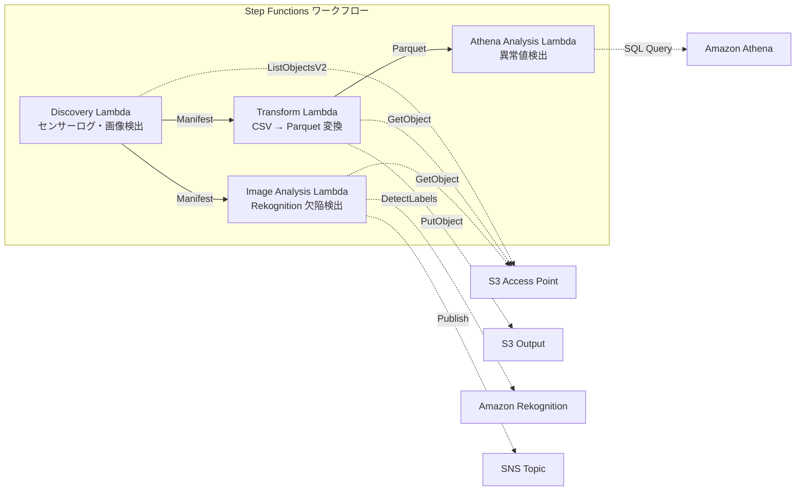

# UC3: 製造業 — 物聯網感測器日誌及品質檢測影像分析

🌐 **Language / 言語**: [日本語](README.md) | [English](README.en.md) | [한국어](README.ko.md) | [简体中文](README.zh-CN.md) | 繁體中文 | [Français](README.fr.md) | [Deutsch](README.de.md) | [Español](README.es.md)

## 概述
利用 FSx for NetApp ONTAP 的 S3 Access Points，自動化物聯網感測器日誌的異常檢測和品質檢查影像缺陷檢測的無伺服器工作流程。
### 此模式適用於以下情況
- 希望定期分析工廠文件伺服器上累積的 CSV 感測器日誌
- 希望透過 AI 自動化並提高品質檢測影像的目視確認效率
- 希望在不更改現有的 NAS 基礎資料收集流程（PLC → 文件伺服器）的情況下，新增分析
- 希望實現透過 Athena SQL 進行靈活的閾值基礎異常檢測
- 需要基於 Rekognition 的信任分數進行分階段判定（自動合格 / 手動審核 / 自動不合格）
### 不適合的情況

當以下情況不適合此模式：
- 需要實時異常檢測的毫秒級精度（建議使用 IoT Core + Kinesis）
- 批量處理 TB 級的感測器日誌（建議使用 EMR Serverless Spark）
- 需要自訂訓練模型來檢測影像缺陷（建議使用 SageMaker 端點）
- 感測器資料已經儲存在時間序列資料庫（如 Timestream）中
### 主要功能
- 透過 S3 AP 自動檢測 CSV 感測器日誌和 JPEG/PNG 檢測影像
- CSV → Parquet 轉換以提高分析效率
- 使用 Amazon Athena SQL 進行基於閾值的異常感測器值檢測
- 使用 Amazon Rekognition 進行缺陷檢測和手動審查標記設置
## 架構



### 工作流程步驟
1. **探尋**：從 S3 AP 探尋 CSV 感測器日誌和 JPEG/PNG 檢查影像，生成 Manifest
2. **轉換**：將 CSV 文件轉換為 Parquet 格式並輸出到 S3（提高分析效率）
3. **Athena 分析**：使用 Athena SQL 以閾值為基礎檢測異常感測器值
4. **影像分析**：使用 Rekognition 進行缺陷檢測，若信賴度低於閾值則設置手動審查標誌
## 前提條件
- AWS 帳號和適當的 IAM 權限
- FSx for NetApp ONTAP 檔案系統（ONTAP 9.17.1P4D3 或以上）
- 已啟用 S3 Access Point 的卷
- ONTAP REST API 認證信息已在 Secrets Manager 中註冊
- VPC、私有子網
- 可用的 Amazon Rekognition 區域
## 部署步驟

### 1. 參數準備
部署前請確認以下值：

- FSx ONTAP S3 Access Point 別名
- ONTAP 管理 IP 地址
- Secrets Manager 機密名稱
- VPC ID、私有子網 ID
- 異常偵測閾值、缺陷偵測信賴度閾值
### 2. CloudFormation 部署

```bash
aws cloudformation deploy \
  --template-file manufacturing-analytics/template.yaml \
  --stack-name fsxn-manufacturing-analytics \
  --parameter-overrides \
    S3AccessPointAlias=<your-volume-ext-s3alias> \
    S3AccessPointName=<your-s3ap-name> \
    S3AccessPointOutputAlias=<your-output-volume-ext-s3alias> \
    OntapSecretName=<your-ontap-secret-name> \
    OntapManagementIp=<your-ontap-management-ip> \
    ScheduleExpression="rate(1 hour)" \
    VpcId=<your-vpc-id> \
    PrivateSubnetIds=<subnet-1>,<subnet-2> \
    NotificationEmail=<your-email@example.com> \
    AnomalyThreshold=3.0 \
    ConfidenceThreshold=80.0 \
    EnableVpcEndpoints=false \
    EnableCloudWatchAlarms=false \
  --capabilities CAPABILITY_IAM CAPABILITY_AUTO_EXPAND \
  --region ap-northeast-1
```
> **注意**: 請將 `<...>` 的預留位置替換為實際的環境值。
### 3. 確認 SNS 訂閱
部署後，指定的電子郵件地址會收到 SNS 訂閱確認郵件。

> **注意**：如果省略 `S3AccessPointName`，IAM 政策可能只基於別名，而導致 `AccessDenied` 錯誤。建議在生產環境中指定。詳細信息請參閱 [疑難排解指南](../docs/guides/troubleshooting-guide.md#1-accessdenied-錯誤)。
## 設定參數列表

| パラメータ | 説明 | デフォルト | 必須 |
|-----------|------|----------|------|
| `S3AccessPointAlias` | FSx ONTAP S3 AP Alias（入力用） | — | ✅ |
| `S3AccessPointName` | S3 AP 名（ARN ベースの IAM 権限付与用。省略時は Alias ベースのみ） | `""` | ⚠️ 推奨 |
| `S3AccessPointOutputAlias` | FSx ONTAP S3 AP Alias（出力用） | — | ✅ |
| `OntapSecretName` | ONTAP 認証情報の Secrets Manager シークレット名 | — | ✅ |
| `OntapManagementIp` | ONTAP クラスタ管理 IP アドレス | — | ✅ |
| `ScheduleExpression` | EventBridge Scheduler のスケジュール式 | `rate(1 hour)` | |
| `VpcId` | VPC ID | — | ✅ |
| `PrivateSubnetIds` | プライベートサブネット ID リスト | — | ✅ |
| `NotificationEmail` | SNS 通知先メールアドレス | — | ✅ |
| `AnomalyThreshold` | 異常検出閾値（標準偏差の倍数） | `3.0` | |
| `ConfidenceThreshold` | Rekognition 欠陥検出の信頼度閾値 | `80.0` | |
| `EnableVpcEndpoints` | Interface VPC Endpoints の有効化 | `false` | |
| `EnableCloudWatchAlarms` | CloudWatch Alarms の有効化 | `false` | |
| `EnableAthenaWorkgroup` | Athena Workgroup / Glue Data Catalog の有効化 | `true` | |

## 成本結構

### 按需求計費（點式計費）

| サービス | 課金単位 | 概算（100 ファイル/月） |
|---------|---------|---------------------|
| Lambda | リクエスト数 + 実行時間 | ~$0.01 |
| Step Functions | ステート遷移数 | 無料枠内 |
| S3 API | リクエスト数 | ~$0.01 |
| Athena | スキャンデータ量 | ~$0.01 |
| Rekognition | 画像数 | ~$0.10 |

### 常時稼働（可選）

| サービス | パラメータ | 月額 |
|---------|-----------|------|
| Interface VPC Endpoints | `EnableVpcEndpoints=true` | ~$28.80 |
| CloudWatch Alarms | `EnableCloudWatchAlarms=true` | ~$0.30 |
> 在演示/概念證明環境中，僅需變動費用，每月起價 **約 0.13 美元**。
## 清理

```bash
# CloudFormation スタックの削除
aws cloudformation delete-stack \
  --stack-name fsxn-manufacturing-analytics \
  --region ap-northeast-1

# 削除完了を待機
aws cloudformation wait stack-delete-complete \
  --stack-name fsxn-manufacturing-analytics \
  --region ap-northeast-1
```
> **注意**: 如果 S3 儲存箱中仍有物件，刪除堆疊可能會失敗。請先將儲存箱清空。
## 支援的地區
UC3 使用以下服務：
| サービス | リージョン制約 |
|---------|-------------|
| Amazon Athena | ほぼ全リージョンで利用可能 |
| Amazon Rekognition | ほぼ全リージョンで利用可能 |
| AWS X-Ray | ほぼ全リージョンで利用可能 |
| CloudWatch EMF | ほぼ全リージョンで利用可能 |
> 詳細請參閱 [區域相容性矩陣](../docs/region-compatibility.md)。
## 參考連結

### AWS 官方文件
- [FSx ONTAP S3 存取點概覽](https://docs.aws.amazon.com/fsx/latest/ONTAPGuide/accessing-data-via-s3-access-points.html)
- [使用 Athena 進行 SQL 查詢（官方教程）](https://docs.aws.amazon.com/fsx/latest/ONTAPGuide/tutorial-query-data-with-athena.html)
- [使用 Glue 進行 ETL 管線（官方教程）](https://docs.aws.amazon.com/fsx/latest/ONTAPGuide/tutorial-transform-data-with-glue.html)
- [使用 Lambda 進行無伺服器處理（官方教程）](https://docs.aws.amazon.com/fsx/latest/ONTAPGuide/tutorial-process-files-with-lambda.html)
- [Rekognition DetectLabels API](https://docs.aws.amazon.com/rekognition/latest/dg/API_DetectLabels.html)
### AWS 部落格文章
- [S3 AP 發表部落格](https://aws.amazon.com/blogs/aws/amazon-fsx-for-netapp-ontap-now-integrates-with-amazon-s3-for-seamless-data-access/)
- [三種無伺服器架構模式](https://aws.amazon.com/blogs/storage/bridge-legacy-and-modern-applications-with-amazon-s3-access-points-for-amazon-fsx/)
### GitHub 範例
- [aws-samples/amazon-rekognition-serverless-large-scale-image-and-video-processing](https://github.com/aws-samples/amazon-rekognition-serverless-large-scale-image-and-video-processing) — Rekognition 大規模處理
- [aws-samples/serverless-patterns](https://github.com/aws-samples/serverless-patterns) — 無伺服器模式集
- [aws-samples/aws-stepfunctions-examples](https://github.com/aws-samples/aws-stepfunctions-examples) — Step Functions 範例
## 已驗證環境

| 項目 | 値 |
|------|-----|
| AWS リージョン | ap-northeast-1 (東京) |
| FSx ONTAP バージョン | ONTAP 9.17.1P4D3 |
| FSx 構成 | SINGLE_AZ_1 |
| Python | 3.12 |
| デプロイ方式 | CloudFormation (標準) |

## Lambda VPC 配置架構
根據驗證中獲得的見解，Lambda 函數被分為在 VPC 內/外的配置。

**VPC 內 Lambda**（僅需要 ONTAP REST API 訪問的函數）:
- Discovery Lambda — S3 AP + ONTAP API

**VPC 外 Lambda**（僅使用 AWS 管理服務 API）:
- 其他所有 Lambda 函數

> **原因**: 從 VPC 內的 Lambda 訪問 AWS 管理服務 API（Athena、Bedrock、Textract 等）需要 Interface VPC Endpoint（每月 $7.20）。VPC 外的 Lambda 可以直接通過互聯網訪問 AWS API，不需額外費用即可運行。

> **注意**: 使用 ONTAP REST API 的 UC（UC1 法務・コンプライアンス）必須 `EnableVpcEndpoints=true`。因為需要通過 Secrets Manager VPC Endpoint 獲取 ONTAP 認證信息。