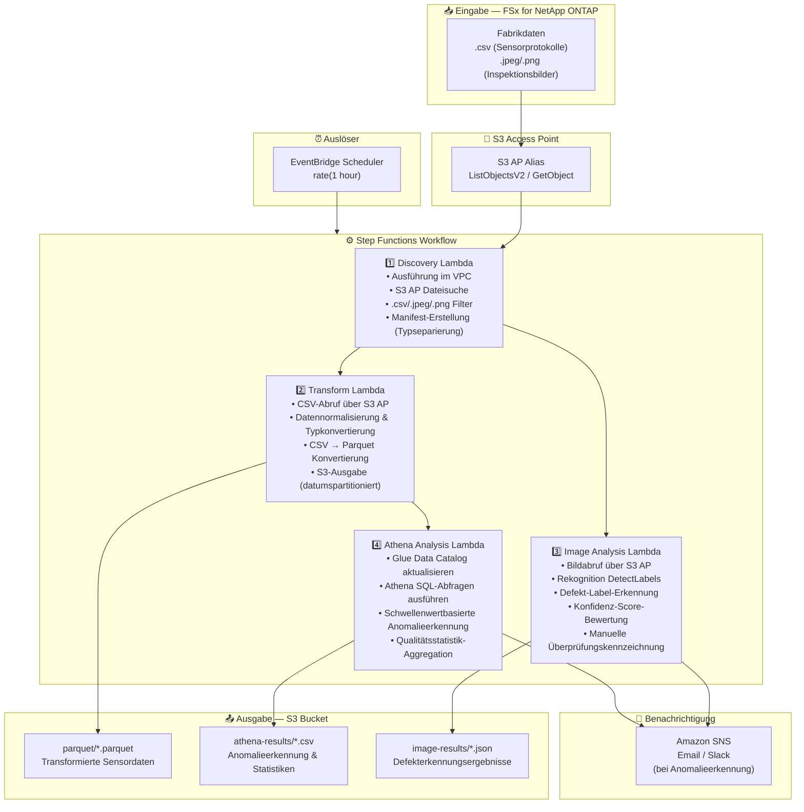

# UC3: Fertigung — IoT-Sensorprotokoll- und Qualitätsinspektionsbild-Analyse

🌐 **Language / 言語**: [日本語](architecture.md) | [English](architecture.en.md) | [한국어](architecture.ko.md) | [简体中文](architecture.zh-CN.md) | [繁體中文](architecture.zh-TW.md) | [Français](architecture.fr.md) | Deutsch | [Español](architecture.es.md)

## End-to-End-Architektur (Eingabe → Ausgabe)

---

## Architekturdiagramm

---

## Datenfluss-Details

### Eingabe
| Element | Beschreibung |
|---------|--------------|
| **Quelle** | FSx for NetApp ONTAP Volume |
| **Dateitypen** | .csv (Sensorprotokolle), .jpeg/.jpg/.png (Qualitätsinspektionsbilder) |
| **Zugriffsmethode** | S3 Access Point (ListObjectsV2 + GetObject) |
| **Lesestrategie** | Vollständiger Dateiabruf (für Transformation und Analyse erforderlich) |

### Verarbeitung
| Schritt | Service | Funktion |
|---------|---------|----------|
| Discovery | Lambda (VPC) | Sensorprotokolle und Bilddateien über S3 AP entdecken, Manifest nach Typ erstellen |
| Transform | Lambda | CSV → Parquet Konvertierung, Datennormalisierung (Zeitstempel-Vereinheitlichung, Einheitenkonvertierung) |
| Image Analysis | Lambda + Rekognition | DetectLabels für Defekterkennung, stufenweise Bewertung basierend auf Konfidenz-Scores |
| Athena Analysis | Lambda + Glue + Athena | SQL-basierte schwellenwertbasierte Anomalieerkennung, Qualitätsstatistik-Aggregation |

### Ausgabe
| Artefakt | Format | Beschreibung |
|----------|--------|--------------|
| Parquet-Daten | `parquet/YYYY/MM/DD/{stem}.parquet` | Transformierte Sensordaten |
| Athena-Ergebnisse | `athena-results/{id}.csv` | Anomalieerkennungsergebnisse & Qualitätsstatistiken |
| Bildergebnisse | `image-results/YYYY/MM/DD/{stem}_analysis.json` | Rekognition-Defekterkennungsergebnisse |
| SNS-Benachrichtigung | Email | Anomalieerkennungsalarm (Schwellenwertüberschreitung & Defekterkennung) |

---

## Wichtige Designentscheidungen

1. **S3 AP statt NFS** — Kein NFS-Mount von Lambda erforderlich; Analysen werden hinzugefügt, ohne den bestehenden PLC → Dateiserver-Fluss zu ändern
2. **CSV → Parquet Konvertierung** — Spaltenformat verbessert die Athena-Abfrageleistung erheblich (bessere Kompression & reduziertes Scanvolumen)
3. **Typseparierung bei Discovery** — Sensorprotokolle und Inspektionsbilder werden in parallelen Pfaden verarbeitet für verbesserten Durchsatz
4. **Rekognition stufenweise Bewertung** — 3-stufige konfidenzbasierte Bewertung (automatisches Bestehen ≥90% / manuelle Überprüfung 50-90% / automatisches Durchfallen <50%)
5. **Schwellenwertbasierte Anomalieerkennung** — Flexible Schwellenwertkonfiguration über Athena SQL (Temperatur >80°C, Vibration >5mm/s usw.)
6. **Polling (nicht ereignisgesteuert)** — S3 AP unterstützt keine Ereignisbenachrichtigungen, daher wird eine periodische geplante Ausführung verwendet

---

## Verwendete AWS-Services

| Service | Rolle |
|---------|-------|
| FSx for NetApp ONTAP | Fabrik-Dateispeicher (Sensorprotokolle & Inspektionsbilder) |
| S3 Access Points | Serverloser Zugriff auf ONTAP-Volumes |
| EventBridge Scheduler | Periodischer Auslöser |
| Step Functions | Workflow-Orchestrierung (Unterstützung paralleler Pfade) |
| Lambda | Compute (Discovery, Transform, Image Analysis, Athena Analysis) |
| Amazon Rekognition | Qualitätsinspektionsbild-Defekterkennung (DetectLabels) |
| Glue Data Catalog | Schema-Verwaltung für Parquet-Daten |
| Amazon Athena | SQL-basierte Anomalieerkennung & Qualitätsstatistiken |
| SNS | Anomalieerkennungs-Alarmbenachrichtigung |
| Secrets Manager | ONTAP REST API-Anmeldeinformationsverwaltung |
| CloudWatch + X-Ray | Observability |
