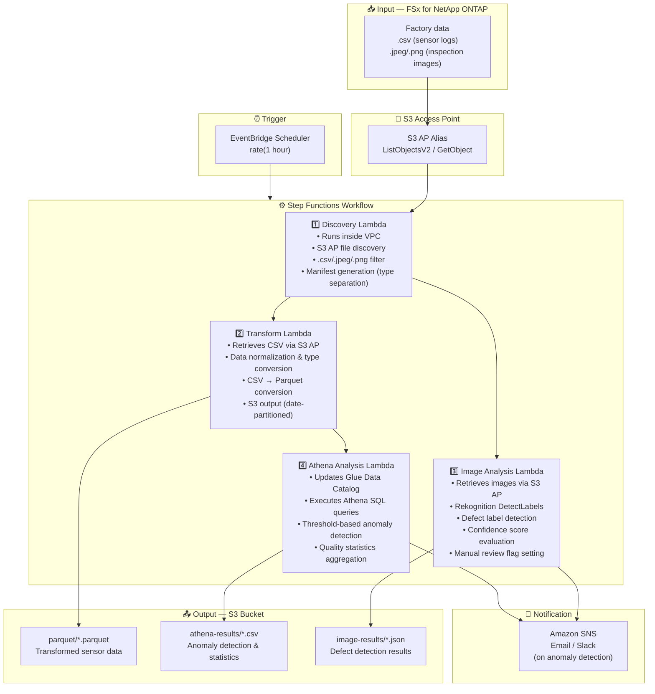

# UC3: Manufacturing — IoT Sensor Log & Quality Inspection Image Analysis

🌐 **Language / 言語**: [日本語](architecture.md) | English | [한국어](architecture.ko.md) | [简体中文](architecture.zh-CN.md) | [繁體中文](architecture.zh-TW.md) | [Français](architecture.fr.md) | [Deutsch](architecture.de.md) | [Español](architecture.es.md)

## End-to-End Architecture (Input → Output)

---

## High-Level Flow

```
┌─────────────────────────────────────────────────────────────────────────────┐
│                         FSx for NetApp ONTAP                                 │
│                                                                              │
│  /vol/factory_data/                                                          │
│  ├── sensors/line_A/2024-03-15_temp.csv   (Temperature sensor log)           │
│  ├── sensors/line_B/2024-03-15_vibr.csv   (Vibration sensor log)             │
│  ├── inspection/lot_001/img_001.jpeg      (Quality inspection image)         │
│  └── inspection/lot_001/img_002.png       (Quality inspection image)         │
│                                                                              │
└──────────────────────────────────┬───────────────────────────────────────────┘
                                   │
                                   ▼
┌──────────────────────────────────────────────────────────────────────────────┐
│                      S3 Access Point (Data Path)                              │
│                                                                              │
│  Alias: fsxn-mfg-vol-ext-s3alias                                             │
│  • ListObjectsV2 (sensor log & image discovery)                              │
│  • GetObject (CSV / JPEG / PNG retrieval)                                    │
│  • No NFS/SMB mount required from Lambda                                     │
│                                                                              │
└──────────────────────────────────┬───────────────────────────────────────────┘
                                   │
                                   ▼
┌──────────────────────────────────────────────────────────────────────────────┐
│                    EventBridge Scheduler (Trigger)                            │
│                                                                              │
│  Schedule: rate(1 hour) — configurable                                       │
│  Target: Step Functions State Machine                                        │
│                                                                              │
└──────────────────────────────────┬───────────────────────────────────────────┘
                                   │
                                   ▼
┌──────────────────────────────────────────────────────────────────────────────┐
│                    AWS Step Functions (Orchestration)                         │
│                                                                              │
│  ┌─────────────┐    ┌──────────────────────┐    ┌────────────────┐          │
│  │  Discovery   │───▶│  Transform           │───▶│Athena Analysis │          │
│  │  Lambda      │    │  Lambda              │    │ Lambda         │          │
│  │             │    │                      │    │               │          │
│  │  • VPC内     │    │  • CSV → Parquet     │    │  • Athena SQL  │          │
│  │  • S3 AP List│    │  • Data normalization│    │  • Glue Catalog│          │
│  │  • CSV/Image │    │  • S3 output         │    │  • Threshold   │          │
│  └─────────────┘    └──────────────────────┘    └────────────────┘          │
│         │                                                                    │
│         │            ┌──────────────────────┐                                │
│         └───────────▶│  Image Analysis      │                                │
│                      │  Lambda              │                                │
│                      │                      │                                │
│                      │  • Rekognition       │                                │
│                      │  • Defect detection  │                                │
│                      │  • Manual review flag│                                │
│                      └──────────────────────┘                                │
│                                                                              │
└──────────────────────────────────────────────────────────────────────────────┘
                                   │
                                   ▼
┌──────────────────────────────────────────────────────────────────────────────┐
│                         Output (S3 Bucket)                                    │
│                                                                              │
│  s3://{stack}-output-{account}/                                              │
│  ├── parquet/YYYY/MM/DD/                                                     │
│  │   ├── line_A_temp.parquet         ← Transformed sensor data              │
│  │   └── line_B_vibr.parquet                                                 │
│  ├── athena-results/                                                         │
│  │   └── {query-execution-id}.csv    ← Anomaly detection results            │
│  └── image-results/YYYY/MM/DD/                                               │
│      ├── img_001_analysis.json       ← Rekognition analysis results         │
│      └── img_002_analysis.json                                               │
│                                                                              │
└──────────────────────────────────────────────────────────────────────────────┘
```

---

## Mermaid Diagram



---

## Data Flow Detail

### Input
| Item | Description |
|------|-------------|
| **Source** | FSx for NetApp ONTAP volume |
| **File Types** | .csv (sensor logs), .jpeg/.jpg/.png (quality inspection images) |
| **Access Method** | S3 Access Point (ListObjectsV2 + GetObject) |
| **Read Strategy** | Full file retrieval (required for transformation & analysis) |

### Processing
| Step | Service | Function |
|------|---------|----------|
| Discovery | Lambda (VPC) | Discover sensor logs & image files via S3 AP, generate manifest by type |
| Transform | Lambda | CSV → Parquet conversion, data normalization (timestamp unification, unit conversion) |
| Image Analysis | Lambda + Rekognition | DetectLabels for defect detection, tiered evaluation based on confidence scores |
| Athena Analysis | Lambda + Glue + Athena | SQL-based threshold anomaly detection, quality statistics aggregation |

### Output
| Artifact | Format | Description |
|----------|--------|-------------|
| Parquet Data | `parquet/YYYY/MM/DD/{stem}.parquet` | Transformed sensor data |
| Athena Results | `athena-results/{id}.csv` | Anomaly detection results & quality statistics |
| Image Results | `image-results/YYYY/MM/DD/{stem}_analysis.json` | Rekognition defect detection results |
| SNS Notification | Email | Anomaly detection alert (threshold exceeded & defect detected) |

---

## Key Design Decisions

1. **S3 AP over NFS** — No NFS mount needed from Lambda; analytics added without changing existing PLC → file server flow
2. **CSV → Parquet conversion** — Columnar format dramatically improves Athena query performance (better compression & reduced scan volume)
3. **Type separation at Discovery** — Sensor logs and inspection images processed in parallel paths for improved throughput
4. **Rekognition tiered evaluation** — 3-tier confidence-based evaluation (auto-pass ≥90% / manual review 50-90% / auto-fail <50%)
5. **Threshold-based anomaly detection** — Flexible threshold configuration via Athena SQL (temperature >80°C, vibration >5mm/s, etc.)
6. **Polling (not event-driven)** — S3 AP does not support event notifications, so periodic scheduled execution is used

---

## AWS Services Used

| Service | Role |
|---------|------|
| FSx for NetApp ONTAP | Factory file storage (sensor logs & inspection images) |
| S3 Access Points | Serverless access to ONTAP volumes |
| EventBridge Scheduler | Periodic trigger |
| Step Functions | Workflow orchestration (parallel path support) |
| Lambda | Compute (Discovery, Transform, Image Analysis, Athena Analysis) |
| Amazon Rekognition | Quality inspection image defect detection (DetectLabels) |
| Glue Data Catalog | Schema management for Parquet data |
| Amazon Athena | SQL-based anomaly detection & quality statistics |
| SNS | Anomaly detection alert notification |
| Secrets Manager | ONTAP REST API credential management |
| CloudWatch + X-Ray | Observability |
