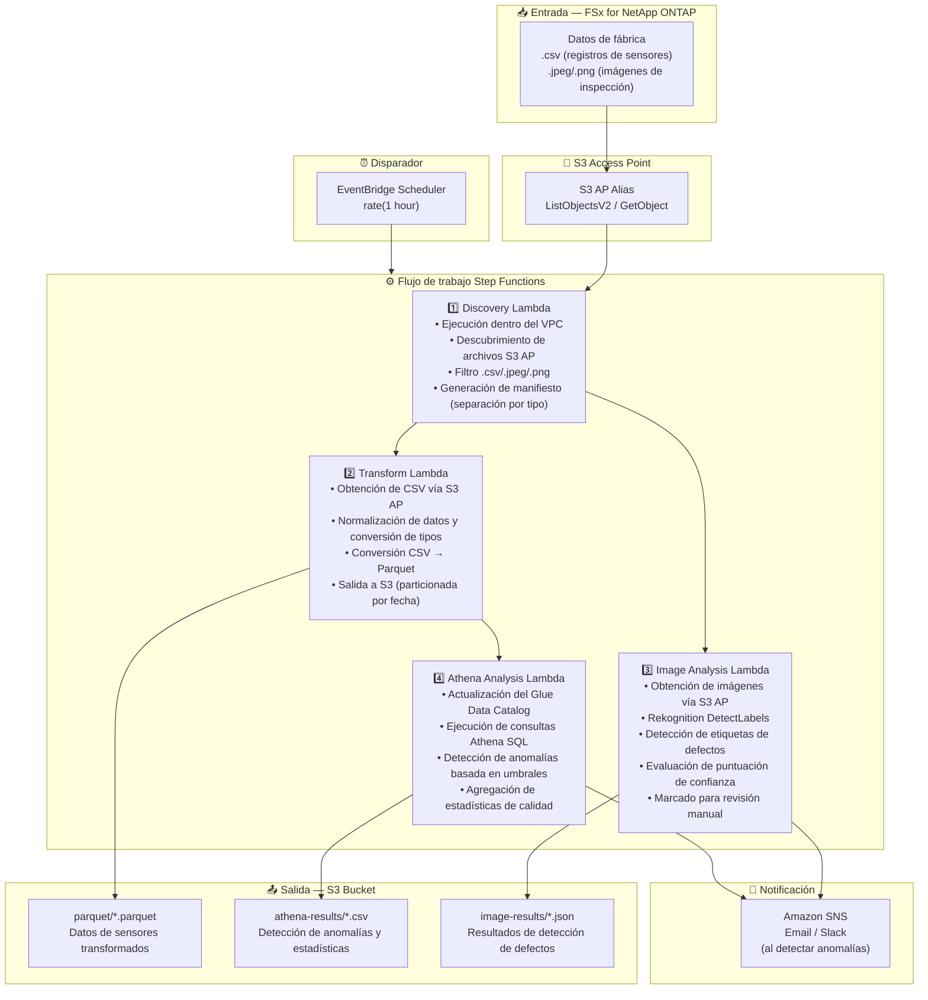

# UC3: Manufactura — Análisis de registros de sensores IoT e imágenes de inspección de calidad

🌐 **Language / 言語**: [日本語](architecture.md) | [English](architecture.en.md) | [한국어](architecture.ko.md) | [简体中文](architecture.zh-CN.md) | [繁體中文](architecture.zh-TW.md) | [Français](architecture.fr.md) | [Deutsch](architecture.de.md) | Español

## Arquitectura de extremo a extremo (Entrada → Salida)

---

## Flujo de alto nivel

```
┌─────────────────────────────────────────────────────────────────────────────┐
│                         FSx for NetApp ONTAP                                 │
│                                                                              │
│  /vol/factory_data/                                                          │
│  ├── sensors/line_A/2024-03-15_temp.csv   (Temperature sensor log)           │
│  ├── sensors/line_B/2024-03-15_vibr.csv   (Vibration sensor log)             │
│  ├── inspection/lot_001/img_001.jpeg      (Quality inspection image)         │
│  └── inspection/lot_001/img_002.png       (Quality inspection image)         │
│                                                                              │
└──────────────────────────────────┬───────────────────────────────────────────┘
                                   │
                                   ▼
┌──────────────────────────────────────────────────────────────────────────────┐
│                      S3 Access Point (Data Path)                              │
│                                                                              │
│  Alias: fsxn-mfg-vol-ext-s3alias                                             │
│  • ListObjectsV2 (sensor log & image discovery)                              │
│  • GetObject (CSV / JPEG / PNG retrieval)                                    │
│  • No NFS/SMB mount required from Lambda                                     │
│                                                                              │
└──────────────────────────────────┬───────────────────────────────────────────┘
                                   │
                                   ▼
┌──────────────────────────────────────────────────────────────────────────────┐
│                    EventBridge Scheduler (Trigger)                            │
│                                                                              │
│  Schedule: rate(1 hour) — configurable                                       │
│  Target: Step Functions State Machine                                        │
│                                                                              │
└──────────────────────────────────┬───────────────────────────────────────────┘
                                   │
                                   ▼
┌──────────────────────────────────────────────────────────────────────────────┐
│                    AWS Step Functions (Orchestration)                         │
│                                                                              │
│  ┌─────────────┐    ┌──────────────────────┐    ┌────────────────┐          │
│  │  Discovery   │───▶│  Transform           │───▶│Athena Analysis │          │
│  │  Lambda      │    │  Lambda              │    │ Lambda         │          │
│  │             │    │                      │    │               │          │
│  │  • VPC内     │    │  • CSV → Parquet     │    │  • Athena SQL  │          │
│  │  • S3 AP List│    │  • Data normalization│    │  • Glue Catalog│          │
│  │  • CSV/Image │    │  • S3 output         │    │  • Threshold   │          │
│  └─────────────┘    └──────────────────────┘    └────────────────┘          │
│         │                                                                    │
│         │            ┌──────────────────────┐                                │
│         └───────────▶│  Image Analysis      │                                │
│                      │  Lambda              │                                │
│                      │                      │                                │
│                      │  • Rekognition       │                                │
│                      │  • Defect detection  │                                │
│                      │  • Manual review flag│                                │
│                      └──────────────────────┘                                │
│                                                                              │
└──────────────────────────────────────────────────────────────────────────────┘
                                   │
                                   ▼
┌──────────────────────────────────────────────────────────────────────────────┐
│                         Output (S3 Bucket)                                    │
│                                                                              │
│  s3://{stack}-output-{account}/                                              │
│  ├── parquet/YYYY/MM/DD/                                                     │
│  │   ├── line_A_temp.parquet         ← Transformed sensor data              │
│  │   └── line_B_vibr.parquet                                                 │
│  ├── athena-results/                                                         │
│  │   └── {query-execution-id}.csv    ← Anomaly detection results            │
│  └── image-results/YYYY/MM/DD/                                               │
│      ├── img_001_analysis.json       ← Rekognition analysis results         │
│      └── img_002_analysis.json                                               │
│                                                                              │
└──────────────────────────────────────────────────────────────────────────────┘
```

---

## Diagrama Mermaid



---

## Detalle del flujo de datos

### Entrada
| Elemento | Descripción |
|----------|-------------|
| **Origen** | Volumen FSx for NetApp ONTAP |
| **Tipos de archivo** | .csv (registros de sensores), .jpeg/.jpg/.png (imágenes de inspección de calidad) |
| **Método de acceso** | S3 Access Point (ListObjectsV2 + GetObject) |
| **Estrategia de lectura** | Obtención completa del archivo (necesaria para transformación y análisis) |

### Procesamiento
| Paso | Servicio | Función |
|------|----------|---------|
| Discovery | Lambda (VPC) | Descubrir registros de sensores y archivos de imagen vía S3 AP, generar manifiesto por tipo |
| Transform | Lambda | Conversión CSV → Parquet, normalización de datos (unificación de marcas de tiempo, conversión de unidades) |
| Image Analysis | Lambda + Rekognition | DetectLabels para detección de defectos, evaluación por niveles basada en puntuaciones de confianza |
| Athena Analysis | Lambda + Glue + Athena | Detección de anomalías basada en umbrales SQL, agregación de estadísticas de calidad |

### Salida
| Artefacto | Formato | Descripción |
|-----------|---------|-------------|
| Datos Parquet | `parquet/YYYY/MM/DD/{stem}.parquet` | Datos de sensores transformados |
| Resultados Athena | `athena-results/{id}.csv` | Resultados de detección de anomalías y estadísticas de calidad |
| Resultados de imagen | `image-results/YYYY/MM/DD/{stem}_analysis.json` | Resultados de detección de defectos Rekognition |
| Notificación SNS | Email | Alerta de detección de anomalías (superación de umbral y detección de defectos) |

---

## Decisiones de diseño clave

1. **S3 AP en lugar de NFS** — No se necesita montaje NFS desde Lambda; se añaden análisis sin cambiar el flujo PLC → servidor de archivos existente
2. **Conversión CSV → Parquet** — El formato columnar mejora drásticamente el rendimiento de consultas Athena (mejor compresión y volumen de escaneo reducido)
3. **Separación por tipo en Discovery** — Registros de sensores e imágenes de inspección procesados en rutas paralelas para mejor rendimiento
4. **Evaluación por niveles Rekognition** — Evaluación de 3 niveles basada en confianza (aprobación automática ≥90% / revisión manual 50-90% / rechazo automático <50%)
5. **Detección de anomalías basada en umbrales** — Configuración flexible de umbrales vía Athena SQL (temperatura >80°C, vibración >5mm/s, etc.)
6. **Sondeo periódico (no basado en eventos)** — S3 AP no admite notificaciones de eventos, por lo que se utiliza ejecución programada periódica

---

## Servicios AWS utilizados

| Servicio | Rol |
|----------|-----|
| FSx for NetApp ONTAP | Almacenamiento de archivos de fábrica (registros de sensores e imágenes de inspección) |
| S3 Access Points | Acceso serverless a volúmenes ONTAP |
| EventBridge Scheduler | Disparador periódico |
| Step Functions | Orquestación de flujo de trabajo (soporte de rutas paralelas) |
| Lambda | Cómputo (Discovery, Transform, Image Analysis, Athena Analysis) |
| Amazon Rekognition | Detección de defectos en imágenes de inspección de calidad (DetectLabels) |
| Glue Data Catalog | Gestión de esquemas para datos Parquet |
| Amazon Athena | Detección de anomalías y estadísticas de calidad basadas en SQL |
| SNS | Notificación de alerta de detección de anomalías |
| Secrets Manager | Gestión de credenciales ONTAP REST API |
| CloudWatch + X-Ray | Observabilidad |
