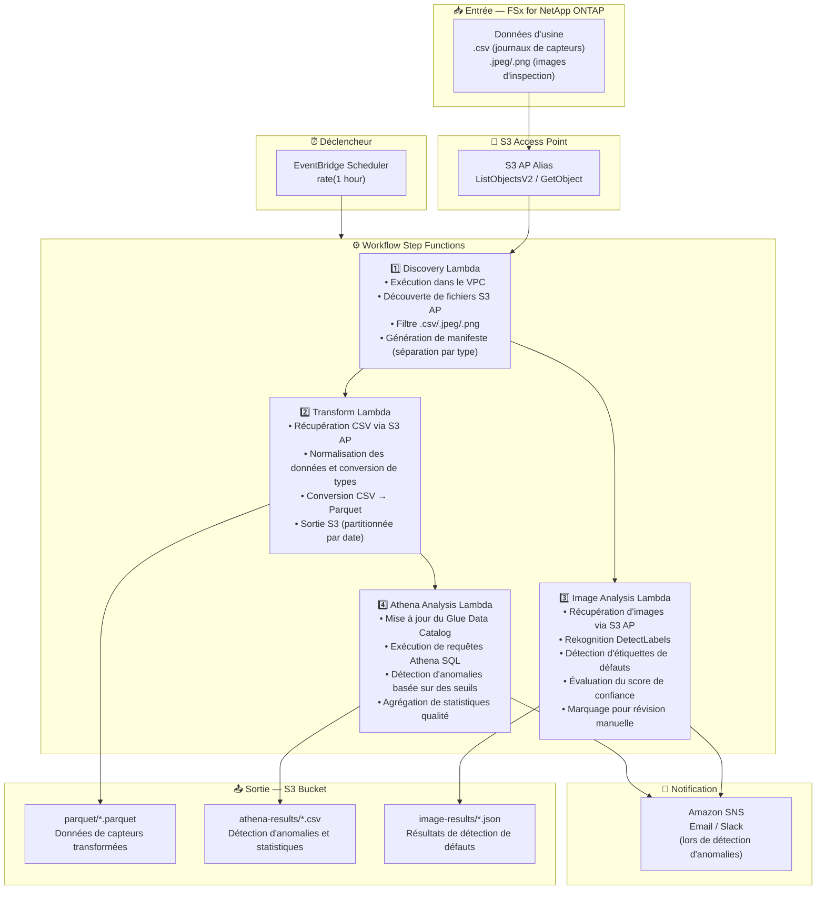

# UC3: Industrie — Analyse des journaux de capteurs IoT et images d'inspection qualité

🌐 **Language / 言語**: [日本語](architecture.md) | [English](architecture.en.md) | [한국어](architecture.ko.md) | [简体中文](architecture.zh-CN.md) | [繁體中文](architecture.zh-TW.md) | Français | [Deutsch](architecture.de.md) | [Español](architecture.es.md)

## Architecture de bout en bout (Entrée → Sortie)

---

## Diagramme d'architecture

---

## Détail du flux de données

### Entrée
| Élément | Description |
|---------|-------------|
| **Source** | Volume FSx for NetApp ONTAP |
| **Types de fichiers** | .csv (journaux de capteurs), .jpeg/.jpg/.png (images d'inspection qualité) |
| **Méthode d'accès** | S3 Access Point (ListObjectsV2 + GetObject) |
| **Stratégie de lecture** | Récupération complète du fichier (nécessaire pour la transformation et l'analyse) |

### Traitement
| Étape | Service | Fonction |
|-------|---------|----------|
| Discovery | Lambda (VPC) | Découvrir les journaux de capteurs et fichiers images via S3 AP, générer le manifeste par type |
| Transform | Lambda | Conversion CSV → Parquet, normalisation des données (unification des horodatages, conversion d'unités) |
| Image Analysis | Lambda + Rekognition | DetectLabels pour la détection de défauts, évaluation par niveaux basée sur les scores de confiance |
| Athena Analysis | Lambda + Glue + Athena | Détection d'anomalies basée sur des seuils SQL, agrégation de statistiques qualité |

### Sortie
| Artefact | Format | Description |
|----------|--------|-------------|
| Données Parquet | `parquet/YYYY/MM/DD/{stem}.parquet` | Données de capteurs transformées |
| Résultats Athena | `athena-results/{id}.csv` | Résultats de détection d'anomalies et statistiques qualité |
| Résultats images | `image-results/YYYY/MM/DD/{stem}_analysis.json` | Résultats de détection de défauts Rekognition |
| Notification SNS | Email | Alerte de détection d'anomalies (dépassement de seuil et détection de défauts) |

---

## Décisions de conception clés

1. **S3 AP plutôt que NFS** — Pas de montage NFS nécessaire depuis Lambda ; ajout d'analyses sans modifier le flux PLC → serveur de fichiers existant
2. **Conversion CSV → Parquet** — Le format colonnaire améliore considérablement les performances des requêtes Athena (meilleure compression et volume de scan réduit)
3. **Séparation par type lors de la découverte** — Journaux de capteurs et images d'inspection traités en chemins parallèles pour un meilleur débit
4. **Évaluation par niveaux Rekognition** — Évaluation à 3 niveaux basée sur la confiance (passage automatique ≥90% / révision manuelle 50-90% / rejet automatique <50%)
5. **Détection d'anomalies basée sur des seuils** — Configuration flexible des seuils via Athena SQL (température >80°C, vibration >5mm/s, etc.)
6. **Interrogation périodique (non événementielle)** — S3 AP ne prend pas en charge les notifications d'événements, donc une exécution planifiée périodique est utilisée

---

## Services AWS utilisés

| Service | Rôle |
|---------|------|
| FSx for NetApp ONTAP | Stockage de fichiers d'usine (journaux de capteurs et images d'inspection) |
| S3 Access Points | Accès serverless aux volumes ONTAP |
| EventBridge Scheduler | Déclencheur périodique |
| Step Functions | Orchestration de workflow (support de chemins parallèles) |
| Lambda | Calcul (Discovery, Transform, Image Analysis, Athena Analysis) |
| Amazon Rekognition | Détection de défauts sur images d'inspection qualité (DetectLabels) |
| Glue Data Catalog | Gestion de schéma pour les données Parquet |
| Amazon Athena | Détection d'anomalies et statistiques qualité basées sur SQL |
| SNS | Notification d'alerte de détection d'anomalies |
| Secrets Manager | Gestion des identifiants ONTAP REST API |
| CloudWatch + X-Ray | Observabilité |
