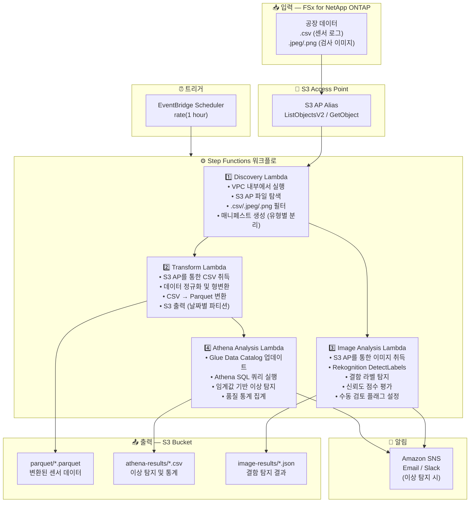

# UC3: 제조업 — IoT 센서 로그 및 품질 검사 이미지 분석

🌐 **Language / 言語**: [日本語](architecture.md) | [English](architecture.en.md) | 한국어 | [简体中文](architecture.zh-CN.md) | [繁體中文](architecture.zh-TW.md) | [Français](architecture.fr.md) | [Deutsch](architecture.de.md) | [Español](architecture.es.md)

## 엔드투엔드 아키텍처 (입력 → 출력)

---

## 상위 레벨 흐름

```
┌─────────────────────────────────────────────────────────────────────────────┐
│                         FSx for NetApp ONTAP                                 │
│                                                                              │
│  /vol/factory_data/                                                          │
│  ├── sensors/line_A/2024-03-15_temp.csv   (Temperature sensor log)           │
│  ├── sensors/line_B/2024-03-15_vibr.csv   (Vibration sensor log)             │
│  ├── inspection/lot_001/img_001.jpeg      (Quality inspection image)         │
│  └── inspection/lot_001/img_002.png       (Quality inspection image)         │
│                                                                              │
└──────────────────────────────────┬───────────────────────────────────────────┘
                                   │
                                   ▼
┌──────────────────────────────────────────────────────────────────────────────┐
│                      S3 Access Point (Data Path)                              │
│                                                                              │
│  Alias: fsxn-mfg-vol-ext-s3alias                                             │
│  • ListObjectsV2 (sensor log & image discovery)                              │
│  • GetObject (CSV / JPEG / PNG retrieval)                                    │
│  • No NFS/SMB mount required from Lambda                                     │
│                                                                              │
└──────────────────────────────────┬───────────────────────────────────────────┘
                                   │
                                   ▼
┌──────────────────────────────────────────────────────────────────────────────┐
│                    EventBridge Scheduler (Trigger)                            │
│                                                                              │
│  Schedule: rate(1 hour) — configurable                                       │
│  Target: Step Functions State Machine                                        │
│                                                                              │
└──────────────────────────────────┬───────────────────────────────────────────┘
                                   │
                                   ▼
┌──────────────────────────────────────────────────────────────────────────────┐
│                    AWS Step Functions (Orchestration)                         │
│                                                                              │
│  ┌─────────────┐    ┌──────────────────────┐    ┌────────────────┐          │
│  │  Discovery   │───▶│  Transform           │───▶│Athena Analysis │          │
│  │  Lambda      │    │  Lambda              │    │ Lambda         │          │
│  │             │    │                      │    │               │          │
│  │  • VPC内     │    │  • CSV → Parquet     │    │  • Athena SQL  │          │
│  │  • S3 AP List│    │  • Data normalization│    │  • Glue Catalog│          │
│  │  • CSV/Image │    │  • S3 output         │    │  • Threshold   │          │
│  └─────────────┘    └──────────────────────┘    └────────────────┘          │
│         │                                                                    │
│         │            ┌──────────────────────┐                                │
│         └───────────▶│  Image Analysis      │                                │
│                      │  Lambda              │                                │
│                      │                      │                                │
│                      │  • Rekognition       │                                │
│                      │  • Defect detection  │                                │
│                      │  • Manual review flag│                                │
│                      └──────────────────────┘                                │
│                                                                              │
└──────────────────────────────────────────────────────────────────────────────┘
                                   │
                                   ▼
┌──────────────────────────────────────────────────────────────────────────────┐
│                         Output (S3 Bucket)                                    │
│                                                                              │
│  s3://{stack}-output-{account}/                                              │
│  ├── parquet/YYYY/MM/DD/                                                     │
│  │   ├── line_A_temp.parquet         ← Transformed sensor data              │
│  │   └── line_B_vibr.parquet                                                 │
│  ├── athena-results/                                                         │
│  │   └── {query-execution-id}.csv    ← Anomaly detection results            │
│  └── image-results/YYYY/MM/DD/                                               │
│      ├── img_001_analysis.json       ← Rekognition analysis results         │
│      └── img_002_analysis.json                                               │
│                                                                              │
└──────────────────────────────────────────────────────────────────────────────┘
```

---

## Mermaid 다이어그램



---

## 데이터 흐름 상세

### 입력
| 항목 | 설명 |
|------|------|
| **소스** | FSx for NetApp ONTAP 볼륨 |
| **파일 유형** | .csv (센서 로그), .jpeg/.jpg/.png (품질 검사 이미지) |
| **접근 방식** | S3 Access Point (ListObjectsV2 + GetObject) |
| **읽기 전략** | 전체 파일 취득 (변환 및 분석에 필요) |

### 처리
| 단계 | 서비스 | 기능 |
|------|--------|------|
| Discovery | Lambda (VPC) | S3 AP를 통한 센서 로그 및 이미지 파일 탐색, 유형별 매니페스트 생성 |
| Transform | Lambda | CSV → Parquet 변환, 데이터 정규화 (타임스탬프 통일, 단위 변환) |
| Image Analysis | Lambda + Rekognition | DetectLabels로 결함 탐지, 신뢰도 점수 기반 단계별 평가 |
| Athena Analysis | Lambda + Glue + Athena | SQL 기반 임계값 이상 탐지, 품질 통계 집계 |

### 출력
| 산출물 | 형식 | 설명 |
|--------|------|------|
| Parquet 데이터 | `parquet/YYYY/MM/DD/{stem}.parquet` | 변환된 센서 데이터 |
| Athena 결과 | `athena-results/{id}.csv` | 이상 탐지 결과 및 품질 통계 |
| 이미지 결과 | `image-results/YYYY/MM/DD/{stem}_analysis.json` | Rekognition 결함 탐지 결과 |
| SNS 알림 | Email | 이상 탐지 경보 (임계값 초과 및 결함 탐지) |

---

## 주요 설계 결정

1. **NFS 대신 S3 AP** — Lambda에서 NFS 마운트 불필요; 기존 PLC → 파일 서버 흐름을 변경하지 않고 분석 추가
2. **CSV → Parquet 변환** — 컬럼형 포맷으로 Athena 쿼리 성능 대폭 향상 (압축률 개선 및 스캔량 감소)
3. **Discovery 시 유형 분리** — 센서 로그와 검사 이미지를 병렬 경로로 처리하여 처리량 향상
4. **Rekognition 단계별 평가** — 신뢰도 기반 3단계 평가 (자동 합격 ≥90% / 수동 검토 50-90% / 자동 불합격 <50%)
5. **임계값 기반 이상 탐지** — Athena SQL을 통한 유연한 임계값 설정 (온도 >80°C, 진동 >5mm/s 등)
6. **폴링 (이벤트 드리븐 아님)** — S3 AP는 이벤트 알림을 지원하지 않으므로 정기 스케줄 실행 사용

---

## 사용 AWS 서비스

| 서비스 | 역할 |
|--------|------|
| FSx for NetApp ONTAP | 공장 파일 스토리지 (센서 로그 및 검사 이미지) |
| S3 Access Points | ONTAP 볼륨에 대한 서버리스 접근 |
| EventBridge Scheduler | 정기 트리거 |
| Step Functions | 워크플로 오케스트레이션 (병렬 경로 지원) |
| Lambda | 컴퓨팅 (Discovery, Transform, Image Analysis, Athena Analysis) |
| Amazon Rekognition | 품질 검사 이미지 결함 탐지 (DetectLabels) |
| Glue Data Catalog | Parquet 데이터의 스키마 관리 |
| Amazon Athena | SQL 기반 이상 탐지 및 품질 통계 |
| SNS | 이상 탐지 경보 알림 |
| Secrets Manager | ONTAP REST API 자격 증명 관리 |
| CloudWatch + X-Ray | 관측성 |
