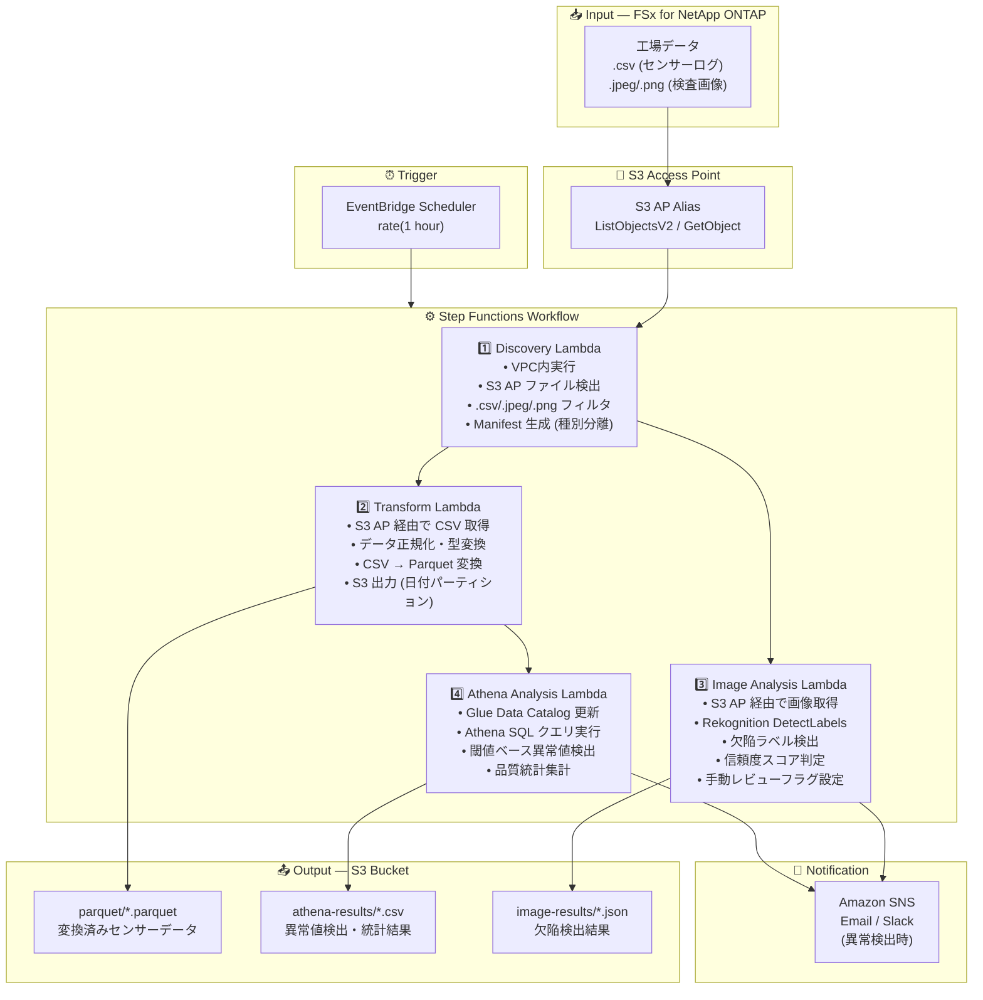

# UC3: 製造業 — IoT センサーログ・品質検査画像の分析

🌐 **Language / 言語**: 日本語 | [English](architecture.en.md) | [한국어](architecture.ko.md) | [简体中文](architecture.zh-CN.md) | [繁體中文](architecture.zh-TW.md) | [Français](architecture.fr.md) | [Deutsch](architecture.de.md) | [Español](architecture.es.md)

## End-to-End Architecture (Input → Output)

---

## High-Level Flow

```
┌─────────────────────────────────────────────────────────────────────────────┐
│                         FSx for NetApp ONTAP                                 │
│                                                                              │
│  /vol/factory_data/                                                          │
│  ├── sensors/line_A/2024-03-15_temp.csv   (温度センサーログ)                 │
│  ├── sensors/line_B/2024-03-15_vibr.csv   (振動センサーログ)                 │
│  ├── inspection/lot_001/img_001.jpeg      (品質検査画像)                     │
│  └── inspection/lot_001/img_002.png       (品質検査画像)                     │
│                                                                              │
└──────────────────────────────────┬───────────────────────────────────────────┘
                                   │
                                   ▼
┌──────────────────────────────────────────────────────────────────────────────┐
│                      S3 Access Point (Data Path)                              │
│                                                                              │
│  Alias: fsxn-mfg-vol-ext-s3alias                                             │
│  • ListObjectsV2 (センサーログ・画像検出)                                    │
│  • GetObject (CSV / JPEG / PNG 取得)                                         │
│  • No NFS/SMB mount required from Lambda                                     │
│                                                                              │
└──────────────────────────────────┬───────────────────────────────────────────┘
                                   │
                                   ▼
┌──────────────────────────────────────────────────────────────────────────────┐
│                    EventBridge Scheduler (Trigger)                            │
│                                                                              │
│  Schedule: rate(1 hour) — configurable                                       │
│  Target: Step Functions State Machine                                        │
│                                                                              │
└──────────────────────────────────┬───────────────────────────────────────────┘
                                   │
                                   ▼
┌──────────────────────────────────────────────────────────────────────────────┐
│                    AWS Step Functions (Orchestration)                         │
│                                                                              │
│  ┌─────────────┐    ┌──────────────────────┐    ┌────────────────┐          │
│  │  Discovery   │───▶│  Transform           │───▶│Athena Analysis │          │
│  │  Lambda      │    │  Lambda              │    │ Lambda         │          │
│  │             │    │                      │    │               │          │
│  │  • VPC内     │    │  • CSV → Parquet     │    │  • Athena SQL  │          │
│  │  • S3 AP List│    │  • データ正規化      │    │  • Glue Catalog│          │
│  │  • CSV/画像  │    │  • S3 出力           │    │  • 閾値ベース  │          │
│  └─────────────┘    └──────────────────────┘    └────────────────┘          │
│         │                                                                    │
│         │            ┌──────────────────────┐                                │
│         └───────────▶│  Image Analysis      │                                │
│                      │  Lambda              │                                │
│                      │                      │                                │
│                      │  • Rekognition       │                                │
│                      │  • 欠陥検出          │                                │
│                      │  • 手動レビューフラグ │                                │
│                      └──────────────────────┘                                │
│                                                                              │
└──────────────────────────────────────────────────────────────────────────────┘
                                   │
                                   ▼
┌──────────────────────────────────────────────────────────────────────────────┐
│                         Output (S3 Bucket)                                    │
│                                                                              │
│  s3://{stack}-output-{account}/                                              │
│  ├── parquet/YYYY/MM/DD/                                                     │
│  │   ├── line_A_temp.parquet         ← 変換済みセンサーデータ               │
│  │   └── line_B_vibr.parquet                                                 │
│  ├── athena-results/                                                         │
│  │   └── {query-execution-id}.csv    ← 異常値検出結果                       │
│  └── image-results/YYYY/MM/DD/                                               │
│      ├── img_001_analysis.json       ← Rekognition 分析結果                 │
│      └── img_002_analysis.json                                               │
│                                                                              │
└──────────────────────────────────────────────────────────────────────────────┘
```

---

## Mermaid Diagram



---

## Data Flow Detail

### Input
| Item | Description |
|------|-------------|
| **Source** | FSx for NetApp ONTAP volume |
| **File Types** | .csv (センサーログ), .jpeg/.jpg/.png (品質検査画像) |
| **Access Method** | S3 Access Point (ListObjectsV2 + GetObject) |
| **Read Strategy** | ファイル全体を取得（変換・分析に必要） |

### Processing
| Step | Service | Function |
|------|---------|----------|
| Discovery | Lambda (VPC) | S3 AP でセンサーログ・画像ファイル検出、種別ごとに Manifest 生成 |
| Transform | Lambda | CSV → Parquet 変換、データ正規化（タイムスタンプ統一、単位変換） |
| Image Analysis | Lambda + Rekognition | DetectLabels で欠陥検出、信頼度スコアに基づく段階的判定 |
| Athena Analysis | Lambda + Glue + Athena | SQL で閾値ベース異常値検出、品質統計集計 |

### Output
| Artifact | Format | Description |
|----------|--------|-------------|
| Parquet Data | `parquet/YYYY/MM/DD/{stem}.parquet` | 変換済みセンサーデータ |
| Athena Results | `athena-results/{id}.csv` | 異常値検出結果・品質統計 |
| Image Results | `image-results/YYYY/MM/DD/{stem}_analysis.json` | Rekognition 欠陥検出結果 |
| SNS Notification | Email | 異常検出アラート（閾値超過・欠陥検出時） |

---

## Key Design Decisions

1. **S3 AP over NFS** — Lambda から NFS マウント不要、既存の PLC → ファイルサーバーフローを変更せずに分析追加
2. **CSV → Parquet 変換** — 列指向フォーマットにより Athena クエリ性能を大幅改善（圧縮率・スキャン量削減）
3. **Discovery での種別分離** — センサーログと検査画像を別パスで並列処理し、スループット向上
4. **Rekognition の段階的判定** — 信頼度スコアに基づく 3 段階判定（自動合格 ≥90% / 手動レビュー 50-90% / 自動不合格 <50%）
5. **閾値ベース異常検出** — Athena SQL で柔軟に閾値設定可能（温度 >80°C、振動 >5mm/s 等）
6. **ポーリングベース** — S3 AP はイベント通知非対応のため、定期スケジュール実行

---

## AWS Services Used

| Service | Role |
|---------|------|
| FSx for NetApp ONTAP | 工場ファイルストレージ（センサーログ・検査画像保管） |
| S3 Access Points | ONTAP ボリュームへのサーバーレスアクセス |
| EventBridge Scheduler | 定期トリガー |
| Step Functions | ワークフローオーケストレーション（並列パス対応） |
| Lambda | コンピュート（Discovery, Transform, Image Analysis, Athena Analysis） |
| Amazon Rekognition | 品質検査画像の欠陥検出 (DetectLabels) |
| Glue Data Catalog | Parquet データのスキーマ管理 |
| Amazon Athena | SQL ベースの異常値検出・品質統計集計 |
| SNS | 異常検出アラート通知 |
| Secrets Manager | ONTAP REST API 認証情報管理 |
| CloudWatch + X-Ray | オブザーバビリティ |
