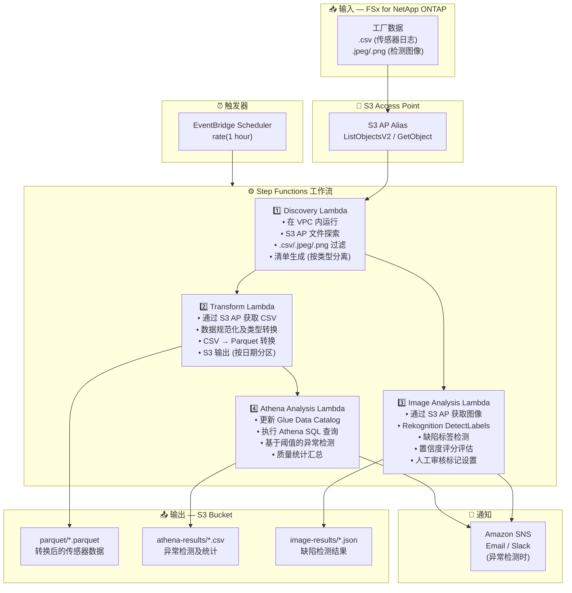

# UC3: 制造业 — IoT 传感器日志与质量检测图像分析

🌐 **Language / 言語**: [日本語](architecture.md) | [English](architecture.en.md) | [한국어](architecture.ko.md) | 简体中文 | [繁體中文](architecture.zh-TW.md) | [Français](architecture.fr.md) | [Deutsch](architecture.de.md) | [Español](architecture.es.md)

## 端到端架构 (输入 → 输出)

---

## 高层级流程

```
┌─────────────────────────────────────────────────────────────────────────────┐
│                         FSx for NetApp ONTAP                                 │
│                                                                              │
│  /vol/factory_data/                                                          │
│  ├── sensors/line_A/2024-03-15_temp.csv   (Temperature sensor log)           │
│  ├── sensors/line_B/2024-03-15_vibr.csv   (Vibration sensor log)             │
│  ├── inspection/lot_001/img_001.jpeg      (Quality inspection image)         │
│  └── inspection/lot_001/img_002.png       (Quality inspection image)         │
│                                                                              │
└──────────────────────────────────┬───────────────────────────────────────────┘
                                   │
                                   ▼
┌──────────────────────────────────────────────────────────────────────────────┐
│                      S3 Access Point (Data Path)                              │
│                                                                              │
│  Alias: fsxn-mfg-vol-ext-s3alias                                             │
│  • ListObjectsV2 (sensor log & image discovery)                              │
│  • GetObject (CSV / JPEG / PNG retrieval)                                    │
│  • No NFS/SMB mount required from Lambda                                     │
│                                                                              │
└──────────────────────────────────┬───────────────────────────────────────────┘
                                   │
                                   ▼
┌──────────────────────────────────────────────────────────────────────────────┐
│                    EventBridge Scheduler (Trigger)                            │
│                                                                              │
│  Schedule: rate(1 hour) — configurable                                       │
│  Target: Step Functions State Machine                                        │
│                                                                              │
└──────────────────────────────────┬───────────────────────────────────────────┘
                                   │
                                   ▼
┌──────────────────────────────────────────────────────────────────────────────┐
│                    AWS Step Functions (Orchestration)                         │
│                                                                              │
│  ┌─────────────┐    ┌──────────────────────┐    ┌────────────────┐          │
│  │  Discovery   │───▶│  Transform           │───▶│Athena Analysis │          │
│  │  Lambda      │    │  Lambda              │    │ Lambda         │          │
│  │             │    │                      │    │               │          │
│  │  • VPC内     │    │  • CSV → Parquet     │    │  • Athena SQL  │          │
│  │  • S3 AP List│    │  • Data normalization│    │  • Glue Catalog│          │
│  │  • CSV/Image │    │  • S3 output         │    │  • Threshold   │          │
│  └─────────────┘    └──────────────────────┘    └────────────────┘          │
│         │                                                                    │
│         │            ┌──────────────────────┐                                │
│         └───────────▶│  Image Analysis      │                                │
│                      │  Lambda              │                                │
│                      │                      │                                │
│                      │  • Rekognition       │                                │
│                      │  • Defect detection  │                                │
│                      │  • Manual review flag│                                │
│                      └──────────────────────┘                                │
│                                                                              │
└──────────────────────────────────────────────────────────────────────────────┘
                                   │
                                   ▼
┌──────────────────────────────────────────────────────────────────────────────┐
│                         Output (S3 Bucket)                                    │
│                                                                              │
│  s3://{stack}-output-{account}/                                              │
│  ├── parquet/YYYY/MM/DD/                                                     │
│  │   ├── line_A_temp.parquet         ← Transformed sensor data              │
│  │   └── line_B_vibr.parquet                                                 │
│  ├── athena-results/                                                         │
│  │   └── {query-execution-id}.csv    ← Anomaly detection results            │
│  └── image-results/YYYY/MM/DD/                                               │
│      ├── img_001_analysis.json       ← Rekognition analysis results         │
│      └── img_002_analysis.json                                               │
│                                                                              │
└──────────────────────────────────────────────────────────────────────────────┘
```

---

## Mermaid 图表



---

## 数据流详情

### 输入
| 项目 | 说明 |
|------|------|
| **来源** | FSx for NetApp ONTAP 卷 |
| **文件类型** | .csv (传感器日志), .jpeg/.jpg/.png (质量检测图像) |
| **访问方式** | S3 Access Point (ListObjectsV2 + GetObject) |
| **读取策略** | 全文件获取 (转换及分析所需) |

### 处理
| 步骤 | 服务 | 功能 |
|------|------|------|
| Discovery | Lambda (VPC) | 通过 S3 AP 探索传感器日志及图像文件，按类型生成清单 |
| Transform | Lambda | CSV → Parquet 转换，数据规范化 (时间戳统一、单位转换) |
| Image Analysis | Lambda + Rekognition | DetectLabels 缺陷检测，基于置信度的分级评估 |
| Athena Analysis | Lambda + Glue + Athena | SQL 基于阈值的异常检测，质量统计汇总 |

### 输出
| 产出物 | 格式 | 说明 |
|--------|------|------|
| Parquet 数据 | `parquet/YYYY/MM/DD/{stem}.parquet` | 转换后的传感器数据 |
| Athena 结果 | `athena-results/{id}.csv` | 异常检测结果及质量统计 |
| 图像结果 | `image-results/YYYY/MM/DD/{stem}_analysis.json` | Rekognition 缺陷检测结果 |
| SNS 通知 | Email | 异常检测警报 (阈值超出及缺陷检测) |

---

## 关键设计决策

1. **S3 AP 替代 NFS** — Lambda 无需 NFS 挂载；无需更改现有 PLC → 文件服务器流程即可添加分析
2. **CSV → Parquet 转换** — 列式格式大幅提升 Athena 查询性能 (压缩率提升及扫描量减少)
3. **Discovery 时类型分离** — 传感器日志和检测图像通过并行路径处理，提升吞吐量
4. **Rekognition 分级评估** — 基于置信度的3级评估 (自动通过 ≥90% / 人工审核 50-90% / 自动不合格 <50%)
5. **基于阈值的异常检测** — 通过 Athena SQL 灵活配置阈值 (温度 >80°C、振动 >5mm/s 等)
6. **轮询 (非事件驱动)** — S3 AP 不支持事件通知，因此使用定期调度执行

---

## 使用的 AWS 服务

| 服务 | 角色 |
|------|------|
| FSx for NetApp ONTAP | 工厂文件存储 (传感器日志及检测图像) |
| S3 Access Points | 对 ONTAP 卷的无服务器访问 |
| EventBridge Scheduler | 定期触发 |
| Step Functions | 工作流编排 (支持并行路径) |
| Lambda | 计算 (Discovery, Transform, Image Analysis, Athena Analysis) |
| Amazon Rekognition | 质量检测图像缺陷检测 (DetectLabels) |
| Glue Data Catalog | Parquet 数据的 Schema 管理 |
| Amazon Athena | SQL 基于异常检测及质量统计 |
| SNS | 异常检测警报通知 |
| Secrets Manager | ONTAP REST API 凭证管理 |
| CloudWatch + X-Ray | 可观测性 |
