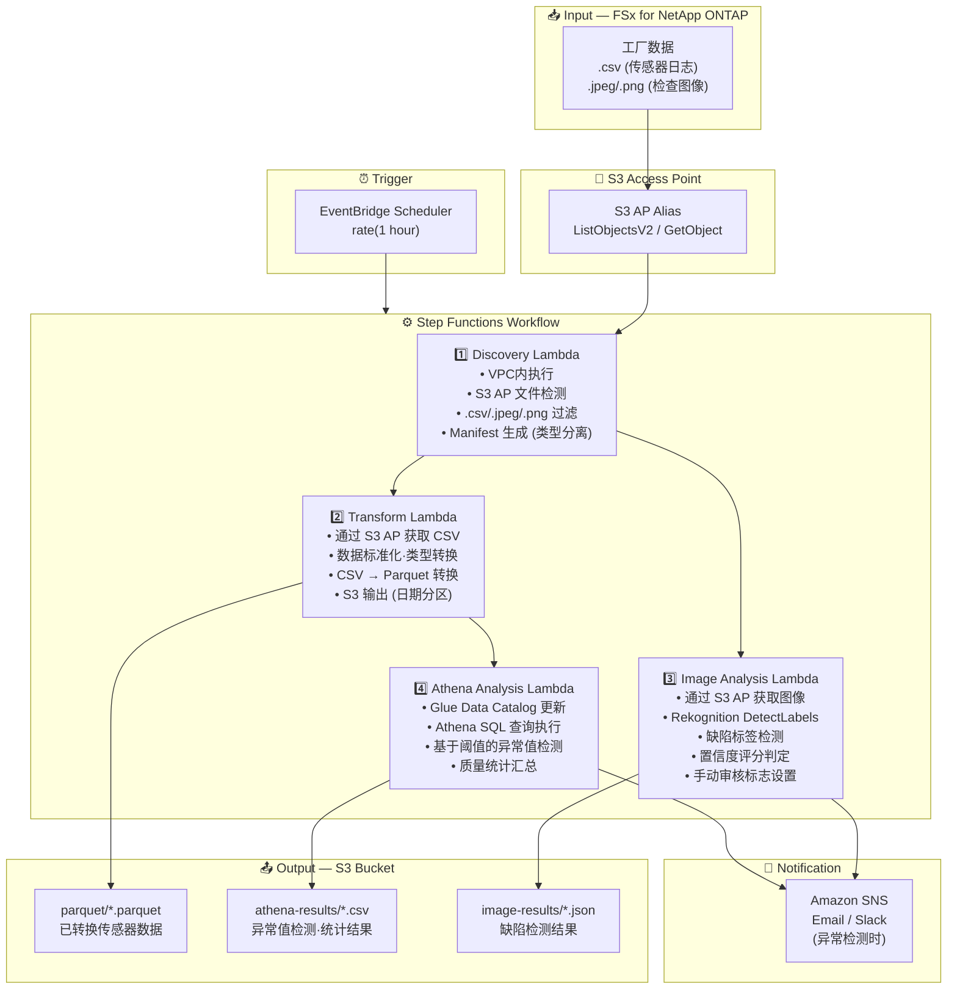

# UC3: 制造业 — IoT 传感器日志·质量检查图像的分析

🌐 **Language / 언어 / 语言 / 語言 / Langue / Sprache / Idioma**: [日本語](architecture.md) | [English](architecture.en.md) | [한국어](architecture.ko.md) | 简体中文 | [繁體中文](architecture.zh-TW.md) | [Français](architecture.fr.md) | [Deutsch](architecture.de.md) | [Español](architecture.es.md)

> 注意：此翻译由 Amazon Bedrock Claude 生成。欢迎对翻译质量提出改进建议。

## End-to-End Architecture (Input → Output)

---

## Architecture Diagram

---

## Data Flow Detail

### Input
| 项目 | 说明 |
|------|-------------|
| **Source** | FSx for NetApp ONTAP volume |
| **File Types** | .csv (传感器日志), .jpeg/.jpg/.png (质量检查图像) |
| **Access Method** | S3 Access Point (ListObjectsV2 + GetObject) |
| **Read Strategy** | 获取完整文件（转换·分析所需） |

### Processing
| 步骤 | 服务 | 功能 |
|------|---------|----------|
| Discovery | Lambda (VPC) | 通过 S3 AP 检测传感器日志·图像文件，按类型生成 Manifest |
| Transform | Lambda | CSV → Parquet 转换，数据标准化（时间戳统一、单位转换） |
| Image Analysis | Lambda + Rekognition | 使用 DetectLabels 进行缺陷检测，基于置信度评分的分级判定 |
| Athena Analysis | Lambda + Glue + Athena | 使用 SQL 进行基于阈值的异常值检测，质量统计汇总 |

### Output
| 产物 | 格式 | 说明 |
|----------|--------|-------------|
| Parquet Data | `parquet/YYYY/MM/DD/{stem}.parquet` | 已转换传感器数据 |
| Athena Results | `athena-results/{id}.csv` | 异常值检测结果·质量统计 |
| Image Results | `image-results/YYYY/MM/DD/{stem}_analysis.json` | Rekognition 缺陷检测结果 |
| SNS Notification | Email | 异常检测警报（阈值超标·缺陷检测时） |

---

## Key Design Decisions

1. **S3 AP over NFS** — Lambda 无需 NFS 挂载，在不改变现有 PLC → 文件服务器流程的情况下添加分析功能
2. **CSV → Parquet 转换** — 通过列式存储格式大幅提升 Athena 查询性能（压缩率·扫描量减少）
3. **Discovery 中的类型分离** — 传感器日志和检查图像通过不同路径并行处理，提升吞吐量
4. **Rekognition 的分级判定** — 基于置信度评分的 3 级判定（自动合格 ≥90% / 手动审核 50-90% / 自动不合格 <50%）
5. **基于阈值的异常检测** — 通过 Athena SQL 灵活设置阈值（温度 >80°C、振动 >5mm/s 等）
6. **基于轮询** — 由于 S3 AP 不支持事件通知，采用定期调度执行

---

## AWS Services Used

| 服务 | 角色 |
|---------|------|
| FSx for NetApp ONTAP | 工厂文件存储（传感器日志·检查图像保存） |
| S3 Access Points | 对 ONTAP 卷的无服务器访问 |
| EventBridge Scheduler | 定期触发器 |
| Step Functions | 工作流编排（支持并行路径） |
| Lambda | 计算（Discovery, Transform, Image Analysis, Athena Analysis） |
| Amazon Rekognition | 质量检查图像的缺陷检测 (DetectLabels) |
| Glue Data Catalog | Parquet 数据的架构管理 |
| Amazon Athena | 基于 SQL 的异常值检测·质量统计汇总 |
| SNS | 异常检测警报通知 |
| Secrets Manager | ONTAP REST API 凭证管理 |
| CloudWatch + X-Ray | 可观测性 |
