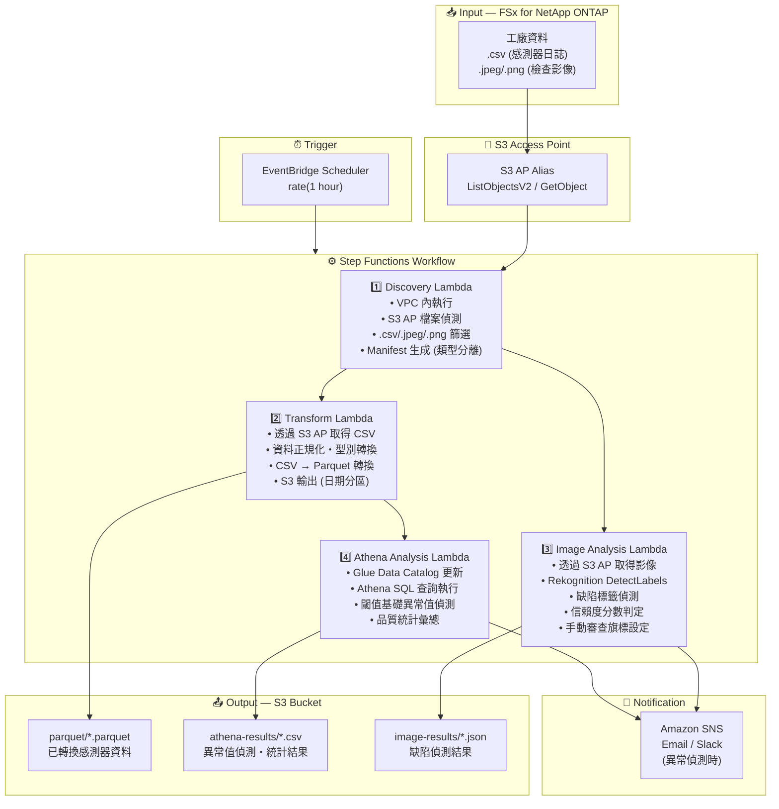

# UC3: 製造業 — IoT 感測器日誌・品質檢查影像的分析

🌐 **Language / 언어 / 语言 / 語言 / Langue / Sprache / Idioma**: [日本語](architecture.md) | [English](architecture.en.md) | [한국어](architecture.ko.md) | [简体中文](architecture.zh-CN.md) | 繁體中文 | [Français](architecture.fr.md) | [Deutsch](architecture.de.md) | [Español](architecture.es.md)

> 注意：此翻譯由 Amazon Bedrock Claude 產生。歡迎對翻譯品質提出改進建議。

## End-to-End Architecture (Input → Output)

---

## Architecture Diagram

---

## Data Flow Detail

### Input
| Item | Description |
|------|-------------|
| **Source** | FSx for NetApp ONTAP volume |
| **File Types** | .csv (感測器日誌), .jpeg/.jpg/.png (品質檢查影像) |
| **Access Method** | S3 Access Point (ListObjectsV2 + GetObject) |
| **Read Strategy** | 取得完整檔案（轉換・分析所需） |

### Processing
| Step | Service | Function |
|------|---------|----------|
| Discovery | Lambda (VPC) | 透過 S3 AP 偵測感測器日誌・影像檔案，依類型生成 Manifest |
| Transform | Lambda | CSV → Parquet 轉換，資料正規化（時間戳記統一、單位轉換） |
| Image Analysis | Lambda + Rekognition | 透過 DetectLabels 偵測缺陷，基於信賴度分數進行階段性判定 |
| Athena Analysis | Lambda + Glue + Athena | 透過 SQL 進行閾值基礎異常值偵測，品質統計彙總 |

### Output
| Artifact | Format | Description |
|----------|--------|-------------|
| Parquet Data | `parquet/YYYY/MM/DD/{stem}.parquet` | 已轉換感測器資料 |
| Athena Results | `athena-results/{id}.csv` | 異常值偵測結果・品質統計 |
| Image Results | `image-results/YYYY/MM/DD/{stem}_analysis.json` | Rekognition 缺陷偵測結果 |
| SNS Notification | Email | 異常偵測警報（閾值超過・缺陷偵測時） |

---

## Key Design Decisions

1. **S3 AP over NFS** — Lambda 無需掛載 NFS，無需變更既有 PLC → 檔案伺服器流程即可新增分析
2. **CSV → Parquet 轉換** — 透過列導向格式大幅改善 Athena 查詢效能（壓縮率・掃描量減少）
3. **Discovery 的類型分離** — 感測器日誌與檢查影像透過不同路徑並行處理，提升吞吐量
4. **Rekognition 的階段性判定** — 基於信賴度分數的 3 階段判定（自動合格 ≥90% / 手動審查 50-90% / 自動不合格 <50%）
5. **閾值基礎異常偵測** — 透過 Athena SQL 可彈性設定閾值（溫度 >80°C、振動 >5mm/s 等）
6. **輪詢基礎** — S3 AP 不支援事件通知，因此採用定期排程執行

---

## AWS Services Used

| Service | Role |
|---------|------|
| FSx for NetApp ONTAP | 工廠檔案儲存（感測器日誌・檢查影像保管） |
| S3 Access Points | 對 ONTAP 磁碟區的無伺服器存取 |
| EventBridge Scheduler | 定期觸發器 |
| Step Functions | 工作流程編排（支援並行路徑） |
| Lambda | 運算（Discovery, Transform, Image Analysis, Athena Analysis） |
| Amazon Rekognition | 品質檢查影像的缺陷偵測 (DetectLabels) |
| Glue Data Catalog | Parquet 資料的結構描述管理 |
| Amazon Athena | 基於 SQL 的異常值偵測・品質統計彙總 |
| SNS | 異常偵測警報通知 |
| Secrets Manager | ONTAP REST API 認證資訊管理 |
| CloudWatch + X-Ray | 可觀測性 |
