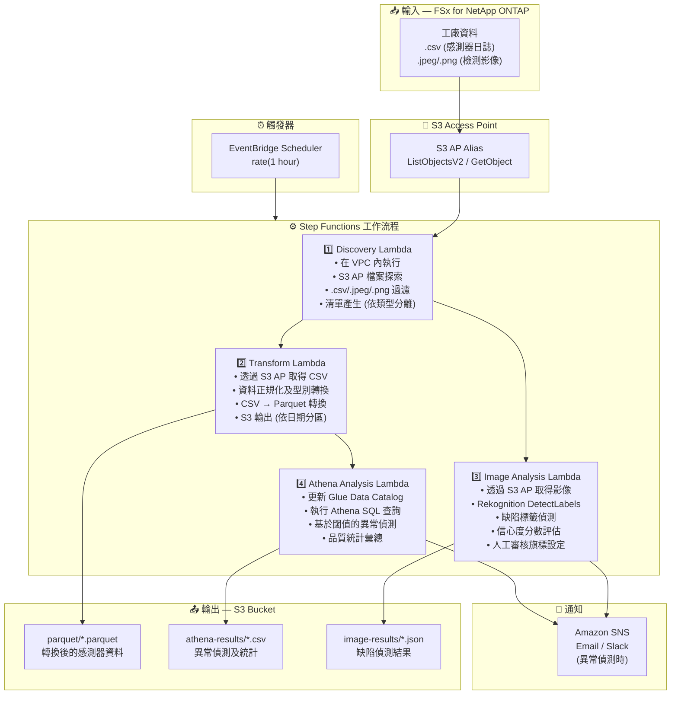

# UC3: 製造業 — IoT 感測器日誌與品質檢測影像分析

🌐 **Language / 言語**: [日本語](architecture.md) | [English](architecture.en.md) | [한국어](architecture.ko.md) | [简体中文](architecture.zh-CN.md) | 繁體中文 | [Français](architecture.fr.md) | [Deutsch](architecture.de.md) | [Español](architecture.es.md)

## 端對端架構 (輸入 → 輸出)

---

## 架構圖

---

## 資料流詳情

### 輸入
| 項目 | 說明 |
|------|------|
| **來源** | FSx for NetApp ONTAP 磁碟區 |
| **檔案類型** | .csv (感測器日誌), .jpeg/.jpg/.png (品質檢測影像) |
| **存取方式** | S3 Access Point (ListObjectsV2 + GetObject) |
| **讀取策略** | 全檔案取得 (轉換及分析所需) |

### 處理
| 步驟 | 服務 | 功能 |
|------|------|------|
| Discovery | Lambda (VPC) | 透過 S3 AP 探索感測器日誌及影像檔案，依類型產生清單 |
| Transform | Lambda | CSV → Parquet 轉換，資料正規化 (時間戳統一、單位轉換) |
| Image Analysis | Lambda + Rekognition | DetectLabels 缺陷偵測，基於信心度的分級評估 |
| Athena Analysis | Lambda + Glue + Athena | SQL 基於閾值的異常偵測，品質統計彙總 |

### 輸出
| 產出物 | 格式 | 說明 |
|--------|------|------|
| Parquet 資料 | `parquet/YYYY/MM/DD/{stem}.parquet` | 轉換後的感測器資料 |
| Athena 結果 | `athena-results/{id}.csv` | 異常偵測結果及品質統計 |
| 影像結果 | `image-results/YYYY/MM/DD/{stem}_analysis.json` | Rekognition 缺陷偵測結果 |
| SNS 通知 | Email | 異常偵測警報 (閾值超出及缺陷偵測) |

---

## 關鍵設計決策

1. **S3 AP 取代 NFS** — Lambda 無需 NFS 掛載；無需更改現有 PLC → 檔案伺服器流程即可新增分析
2. **CSV → Parquet 轉換** — 欄式格式大幅提升 Athena 查詢效能 (壓縮率提升及掃描量減少)
3. **Discovery 時類型分離** — 感測器日誌和檢測影像透過並行路徑處理，提升吞吐量
4. **Rekognition 分級評估** — 基於信心度的3級評估 (自動通過 ≥90% / 人工審核 50-90% / 自動不合格 <50%)
5. **基於閾值的異常偵測** — 透過 Athena SQL 彈性設定閾值 (溫度 >80°C、振動 >5mm/s 等)
6. **輪詢 (非事件驅動)** — S3 AP 不支援事件通知，因此使用定期排程執行

---

## 使用的 AWS 服務

| 服務 | 角色 |
|------|------|
| FSx for NetApp ONTAP | 工廠檔案儲存 (感測器日誌及檢測影像) |
| S3 Access Points | 對 ONTAP 磁碟區的無伺服器存取 |
| EventBridge Scheduler | 定期觸發 |
| Step Functions | 工作流程編排 (支援並行路徑) |
| Lambda | 運算 (Discovery, Transform, Image Analysis, Athena Analysis) |
| Amazon Rekognition | 品質檢測影像缺陷偵測 (DetectLabels) |
| Glue Data Catalog | Parquet 資料的 Schema 管理 |
| Amazon Athena | SQL 基於異常偵測及品質統計 |
| SNS | 異常偵測警報通知 |
| Secrets Manager | ONTAP REST API 憑證管理 |
| CloudWatch + X-Ray | 可觀測性 |
