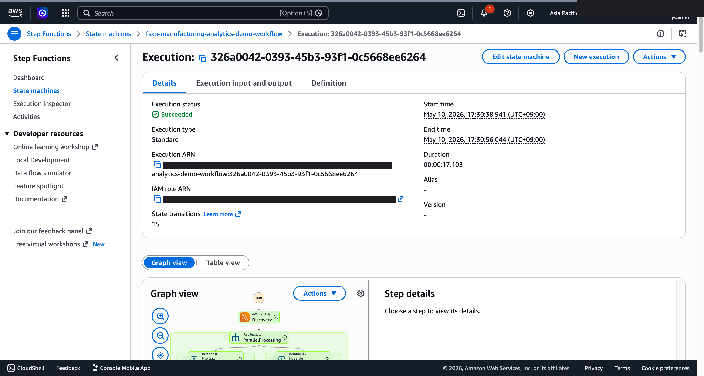
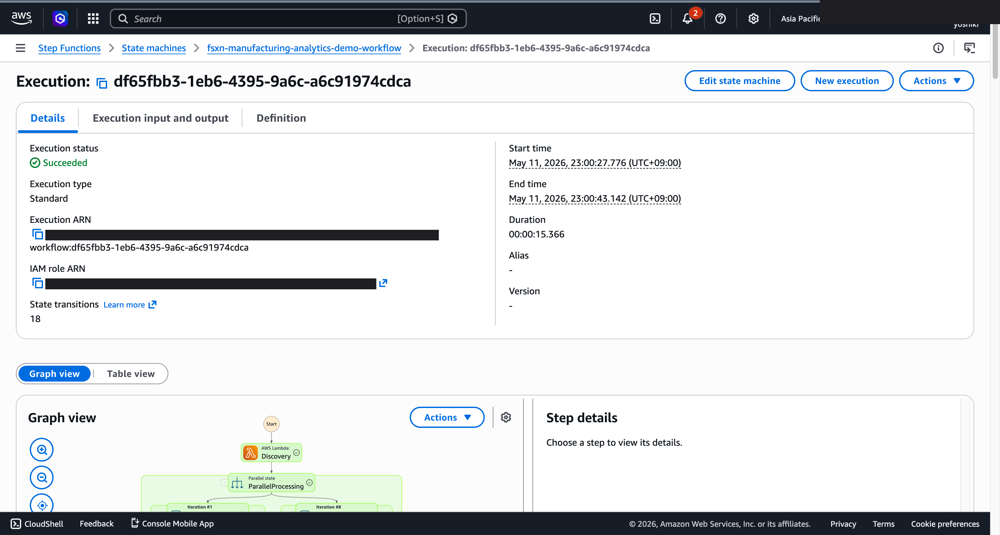
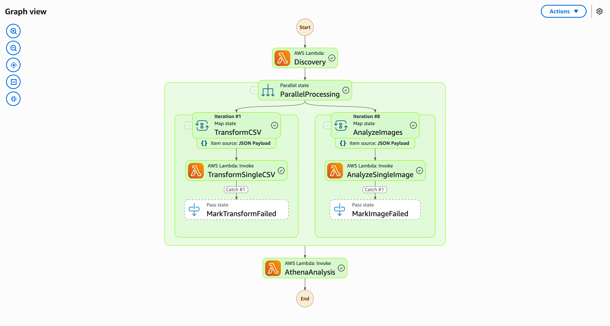
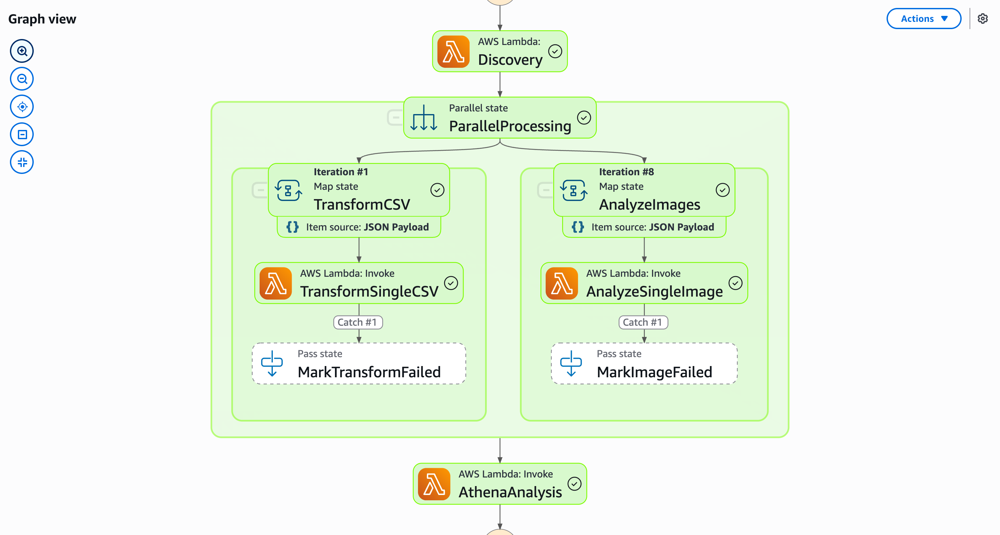

# IoT 센서 이상 감지·품질 검사 — Demo Guide

🌐 **Language / 언어 / 语言 / 語言 / Langue / Sprache / Idioma**: [日本語](demo-guide.md) | [English](demo-guide.en.md) | 한국어 | [简体中文](demo-guide.zh-CN.md) | [繁體中文](demo-guide.zh-TW.md) | [Français](demo-guide.fr.md) | [Deutsch](demo-guide.de.md) | [Español](demo-guide.es.md)

> 참고: 이 번역은 Amazon Bedrock Claude로 생성되었습니다. 번역 품질 향상에 대한 기여를 환영합니다.

## Executive Summary

본 데모에서는 제조 라인의 IoT 센서 데이터에서 이상을 자동 감지하고 품질 검사 보고서를 생성하는 워크플로를 실연합니다.

**데모의 핵심 메시지**: 센서 데이터의 이상 패턴을 자동 감지하여 품질 문제의 조기 발견과 예방 보전을 실현합니다.

**예상 시간**: 3~5분

---

## Target Audience & Persona

| 항목 | 세부사항 |
|------|------|
| **직책** | 제조 부문 매니저 / 품질 관리 엔지니어 |
| **일상 업무** | 생산 라인 모니터링, 품질 검사, 설비 보전 계획 |
| **과제** | 센서 데이터의 이상을 놓쳐 불량품이 후공정으로 유출 |
| **기대하는 성과** | 이상의 조기 감지와 품질 트렌드의 가시화 |

### Persona: 스즈키 씨(품질 관리 엔지니어)

- 5개의 제조 라인에서 100+ 센서를 모니터링
- 임계값 기반 알림에서는 오보가 많아 진짜 이상을 놓치기 쉬움
- "통계적으로 유의미한 이상만 감지하고 싶다"

---

## Demo Scenario: 센서 이상 감지 배치 분석

### 워크플로 전체 구조

```
센서 데이터      데이터 수집       이상 감지          품질 보고서
(CSV/Parquet)  →   전처리     →   통계 분석    →    AI 생성
                   정규화          (이상치 감지)
```

---

## Storyboard(5 섹션 / 3~5분)

### Section 1: Problem Statement(0:00–0:45)

**내레이션 요지**:
> 제조 라인의 100+ 센서에서 매일 대량의 데이터가 생성됩니다. 단순한 임계값 알림에서는 오보가 많아 진짜 이상을 놓칠 위험이 있습니다.

**Key Visual**: 센서 데이터의 시계열 그래프, 알림 과다 상황

### Section 2: Data Ingestion(0:45–1:30)

**내레이션 요지**:
> 센서 데이터가 파일 서버에 축적되면 자동으로 분석 파이프라인이 시작됩니다.

**Key Visual**: 데이터 파일 배치 → 워크플로 시작

### Section 3: Anomaly Detection(1:30–2:30)

**내레이션 요지**:
> 통계적 기법(이동 평균, 표준 편차, IQR)으로 센서별 이상 점수를 산출합니다. 여러 센서의 상관 분석도 실행합니다.

**Key Visual**: 이상 감지 알고리즘 실행 중, 이상 점수의 히트맵

### Section 4: Quality Inspection(2:30–3:45)

**내레이션 요지**:
> 감지된 이상을 품질 검사 관점에서 분석합니다. 어느 라인의 어느 공정에서 문제가 발생하고 있는지 특정합니다.

**Key Visual**: Athena 쿼리 결과 — 라인별·공정별 이상 분포

### Section 5: Report & Action(3:45–5:00)

**내레이션 요지**:
> AI가 품질 검사 보고서를 생성합니다. 이상의 근본 원인 후보와 권장 대응을 제시합니다.

**Key Visual**: AI 생성 품질 보고서(이상 요약 + 권장 조치)

---

## Screen Capture Plan

| # | 화면 | 섹션 |
|---|------|-----------|
| 1 | 센서 데이터 파일 목록 | Section 1 |
| 2 | 워크플로 시작 화면 | Section 2 |
| 3 | 이상 감지 처리 진행 상황 | Section 3 |
| 4 | 이상 분포 쿼리 결과 | Section 4 |
| 5 | AI 품질 검사 보고서 | Section 5 |

---

## Narration Outline

| 섹션 | 시간 | 핵심 메시지 |
|-----------|------|--------------|
| Problem | 0:00–0:45 | "임계값 알림에서는 진짜 이상을 놓친다" |
| Ingestion | 0:45–1:30 | "데이터 축적으로 자동으로 분석 시작" |
| Detection | 1:30–2:30 | "통계적 기법으로 유의미한 이상만 감지" |
| Inspection | 2:30–3:45 | "라인·공정 레벨에서 문제 지점 특정" |
| Report | 3:45–5:00 | "근본 원인 후보와 대응책을 AI가 제시" |

---

## Sample Data Requirements

| # | 데이터 | 용도 |
|---|--------|------|
| 1 | 정상 센서 데이터(5 라인 × 7일분) | 베이스라인 |
| 2 | 온도 이상 데이터(2건) | 이상 감지 데모 |
| 3 | 진동 이상 데이터(3건) | 상관 분석 데모 |
| 4 | 품질 저하 패턴(1건) | 보고서 생성 데모 |

---

## Timeline

### 1주일 이내에 달성 가능

| 작업 | 소요 시간 |
|--------|---------|
| 샘플 센서 데이터 생성 | 3시간 |
| 파이프라인 실행 확인 | 2시간 |
| 화면 캡처 취득 | 2시간 |
| 내레이션 원고 작성 | 2시간 |
| 동영상 편집 | 4시간 |

### Future Enhancements

- 실시간 스트리밍 분석
- 예방 보전 스케줄 자동 생성
- 디지털 트윈 연계

---

## Technical Notes

| 컴포넌트 | 역할 |
|--------------|------|
| Step Functions | 워크플로 오케스트레이션 |
| Lambda (Data Preprocessor) | 센서 데이터 정규화·전처리 |
| Lambda (Anomaly Detector) | 통계적 이상 감지 |
| Lambda (Report Generator) | Bedrock에 의한 품질 보고서 생성 |
| Amazon Athena | 이상 데이터의 집계·분석 |

### 폴백

| 시나리오 | 대응 |
|---------|------|
| 데이터량 부족 | 사전 생성 데이터 사용 |
| 감지 정확도 부족 | 파라미터 조정 완료 결과 표시 |

---

*본 문서는 기술 프레젠테이션용 데모 동영상의 제작 가이드입니다.*

---

## 출력 대상에 대해: FSxN S3 Access Point (Pattern A)

UC3 manufacturing-analytics는 **Pattern A: Native S3AP Output**으로 분류됩니다
(`docs/output-destination-patterns.md` 참조).

**설계**: 센서 데이터 분석 결과, 이상 감지 보고서, 이미지 검사 결과는 모두 FSxN S3 Access Point 경유로
원본 센서 CSV 및 검사 이미지와 **동일한 FSx ONTAP 볼륨**에 기록됩니다. 표준 S3 버킷은
생성되지 않습니다("no data movement" 패턴).

**CloudFormation 파라미터**:
- `S3AccessPointAlias`: 입력 데이터 읽기용 S3 AP Alias
- `S3AccessPointOutputAlias`: 출력 쓰기용 S3 AP Alias(입력과 동일해도 가능)

**배포 예시**:
```bash
aws cloudformation deploy \
  --template-file manufacturing-analytics/template-deploy.yaml \
  --stack-name fsxn-manufacturing-analytics-demo \
  --parameter-overrides \
    S3AccessPointAlias=eda-demo-s3ap-XYZ-ext-s3alias \
    S3AccessPointOutputAlias=eda-demo-s3ap-XYZ-ext-s3alias \
    ... (기타 필수 파라미터)
```

**SMB/NFS 사용자 관점**:
```
/vol/sensors/
  ├── 2026/05/line_A/sensor_001.csv    # 원본 센서 데이터
  └── analysis/2026/05/                 # AI 이상 감지 결과(동일 볼륨 내)
      └── line_A_report.json
```

AWS 사양상의 제약에 대해서는
[프로젝트 README의 "AWS 사양상의 제약과 회피책" 섹션](../../README.md#aws-仕様上の制約と回避策)
및 [`docs/output-destination-patterns.md`](../../docs/output-destination-patterns.md)를 참조하십시오.

---

## 검증 완료된 UI/UX 스크린샷

Phase 7 UC15/16/17과 UC6/11/14의 데모와 동일한 방침으로, **최종 사용자가 일상 업무에서 실제로
보는 UI/UX 화면**을 대상으로 합니다. 기술자용 뷰(Step Functions 그래프, CloudFormation
스택 이벤트 등)는 `docs/verification-results-*.md`에 집약됩니다.

### 이 유스케이스의 검증 상태

- ✅ **E2E 실행**: Phase 1-6에서 확인 완료(루트 README 참조)
- 📸 **UI/UX 재촬영**: ✅ 2026-05-10 재배포 검증에서 촬영 완료 (UC3 Step Functions 그래프, Lambda 실행 성공 확인)
- 🔄 **재현 방법**: 본 문서 말미의 "촬영 가이드" 참조

### 2026-05-10 재배포 검증에서 촬영(UI/UX 중심)

#### UC3 Step Functions Graph view(SUCCEEDED)



Step Functions Graph view는 각 Lambda / Parallel / Map 상태의 실행 상황을
색으로 가시화하는 최종 사용자 최중요 화면입니다.

### 기존 스크린샷(Phase 1-6에서 해당분)







### 재검증 시 UI/UX 대상 화면(권장 촬영 목록)

- S3 출력 버킷(metrics/, anomalies/, reports/)
- Athena 쿼리 결과(IoT 센서 이상 감지)
- Rekognition 품질 검사 이미지 레이블
- 제조 품질 요약 보고서

### 촬영 가이드

1. **사전 준비**:
   - `bash scripts/verify_phase7_prerequisites.sh`로 전제 확인(공통 VPC/S3 AP 유무)
   - `UC=manufacturing-analytics bash scripts/package_generic_uc.sh`로 Lambda 패키지
   - `bash scripts/deploy_generic_ucs.sh UC3`로 배포

2. **샘플 데이터 배치**:
   - S3 AP Alias 경유로 `sensors/` 접두사에 샘플 파일 업로드
   - Step Functions `fsxn-manufacturing-analytics-demo-workflow` 시작(입력 `{}`)

3. **촬영**(CloudShell·터미널은 닫기, 브라우저 우측 상단의 사용자 이름은 검은색 처리):
   - S3 출력 버킷 `fsxn-manufacturing-analytics-demo-output-<account>`의 전체 보기
   - AI/ML 출력 JSON의 미리보기(`build/preview_*.html` 형식 참고)
   - SNS 이메일 알림(해당하는 경우)

4. **마스크 처리**:
   - `python3 scripts/mask_uc_demos.py manufacturing-analytics-demo`로 자동 마스크
   - `docs/screenshots/MASK_GUIDE.md`에 따라 추가 마스크(필요시)

5. **정리**:
   - `bash scripts/cleanup_generic_ucs.sh UC3`로 삭제
   - VPC Lambda ENI 해제에 15-30분(AWS 사양)
