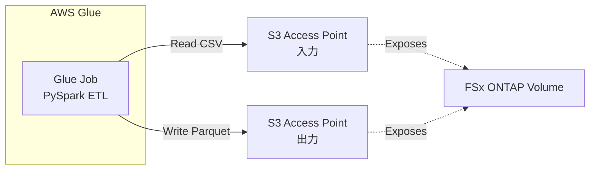

# Glue ETL パターン — CSV → Parquet 変換

## 概要

AWS Glue を使用して FSx for NetApp ONTAP S3 Access Points 経由で CSV センサーログを Parquet 形式に変換する ETL パターンです。Lambda ベースの変換（`functions/transform/`）の代替として、大規模データセットに適した Glue ETL ジョブを提供します。

本パターンは AWS 公式チュートリアル「[Build ETL pipelines using AWS Glue](https://docs.aws.amazon.com/fsx/latest/ONTAPGuide/tutorial-transform-data-with-glue.html)」に準拠しています。

### Lambda 版との比較

| 項目 | Lambda 版 (`functions/transform/`) | Glue ETL 版（本パターン） |
|------|-----------------------------------|--------------------------|
| 処理規模 | 小〜中規模（数百 MB まで） | 大規模（数 GB〜TB） |
| 実行時間制限 | 15 分 | 制限なし（時間課金） |
| メモリ制限 | 10 GB | Glue Worker に依存 |
| コスト | リクエスト + 実行時間 | DPU 時間課金 |
| 起動時間 | ミリ秒〜秒 | 数分（コールドスタート） |
| 推奨ユースケース | リアルタイム・少量データ | バッチ・大量データ |

## アーキテクチャ



### 処理フロー

1. **CSV 読み取り**: S3 AP 経由で FSx ONTAP 上の CSV センサーログを読み取り
2. **データ変換**: タイムスタンプ変換、NULL フィルタリング、パーティションカラム追加
3. **Parquet 書き出し**: Snappy 圧縮 + year/month/day パーティションで S3 AP に書き戻し

## 前提条件

- AWS アカウントと適切な IAM 権限
- FSx for NetApp ONTAP ファイルシステム（ONTAP 9.17.1P4D3 以上）
- S3 Access Point が有効化されたボリューム（**internet** network origin 必須）
- VPC、プライベートサブネット

> **重要**: Glue は AWS マネージドインフラからアクセスするため、S3 AP は **internet** network origin で作成する必要があります。VPC origin の S3 AP にはアクセスできません。

## デプロイ手順

### 1. Glue ETL の有効化

CloudFormation デプロイ時に `EnableGlueETL=true` パラメータを指定します:

```bash
aws cloudformation deploy \
  --template-file manufacturing-analytics/template.yaml \
  --stack-name fsxn-manufacturing-analytics \
  --parameter-overrides \
    S3AccessPointAlias=<your-volume-ext-s3alias> \
    S3AccessPointOutputAlias=<your-output-volume-ext-s3alias> \
    OntapSecretName=<your-ontap-secret-name> \
    OntapManagementIp=<your-ontap-management-ip> \
    VpcId=<your-vpc-id> \
    PrivateSubnetIds=<subnet-1>,<subnet-2> \
    NotificationEmail=<your-email@example.com> \
    EnableGlueETL=true \
  --capabilities CAPABILITY_IAM CAPABILITY_AUTO_EXPAND \
  --region ap-northeast-1
```

### 2. Glue ジョブの手動実行

```bash
aws glue start-job-run \
  --job-name <stack-name>-glue-etl \
  --arguments '{
    "--S3_ACCESS_POINT_INPUT": "<your-input-volume-ext-s3alias>",
    "--S3_ACCESS_POINT_OUTPUT": "<your-output-volume-ext-s3alias>",
    "--INPUT_PREFIX": "sensor-logs/",
    "--OUTPUT_PREFIX": "parquet/"
  }' \
  --region ap-northeast-1
```

### 3. ジョブ実行状況の確認

```bash
aws glue get-job-run \
  --job-name <stack-name>-glue-etl \
  --run-id <run-id> \
  --region ap-northeast-1
```

## 設定パラメータ

| パラメータ | 説明 | デフォルト |
|-----------|------|----------|
| `EnableGlueETL` | Glue ETL ジョブの有効化 | `false` |
| `--S3_ACCESS_POINT_INPUT` | 入力用 S3 AP Alias | — |
| `--S3_ACCESS_POINT_OUTPUT` | 出力用 S3 AP Alias | — |
| `--INPUT_PREFIX` | 入力 CSV のプレフィックス | `sensor-logs/` |
| `--OUTPUT_PREFIX` | 出力 Parquet のプレフィックス | `parquet/` |

## コスト

| サービス | 課金単位 | 概算 |
|---------|---------|------|
| Glue Job | DPU 時間 ($0.44/DPU-hour) | ジョブ実行時間に依存 |
| S3 API | リクエスト数 | ~$0.01 |

> Glue ジョブは実行時間のみ課金されます。デフォルト設定（G.1X Worker × 2）で 10 分のジョブは約 $0.15 です。

## 参考リンク

- [AWS 公式: Build ETL pipelines using AWS Glue](https://docs.aws.amazon.com/fsx/latest/ONTAPGuide/tutorial-transform-data-with-glue.html)
- [AWS Glue 開発者ガイド](https://docs.aws.amazon.com/glue/latest/dg/what-is-glue.html)
- [PySpark リファレンス](https://spark.apache.org/docs/latest/api/python/)
